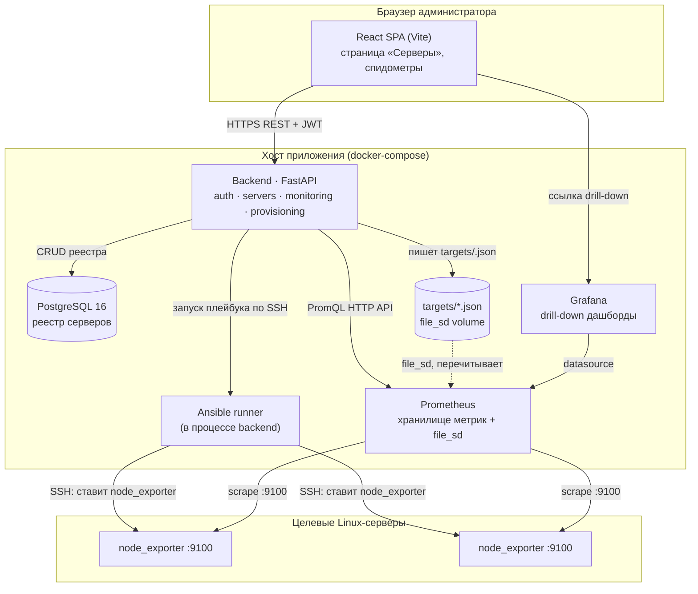
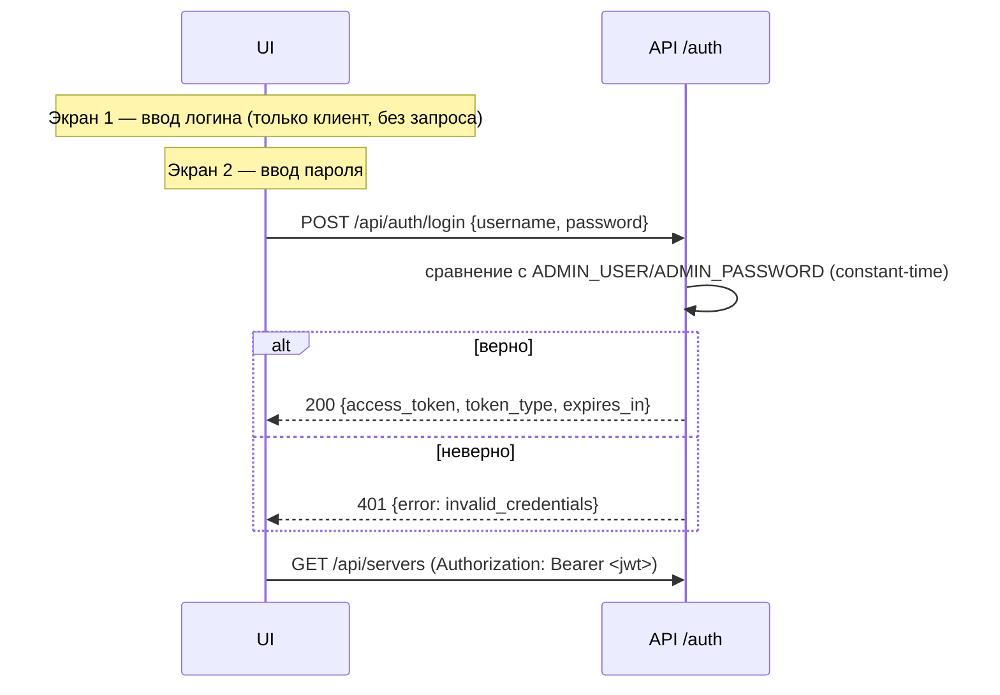
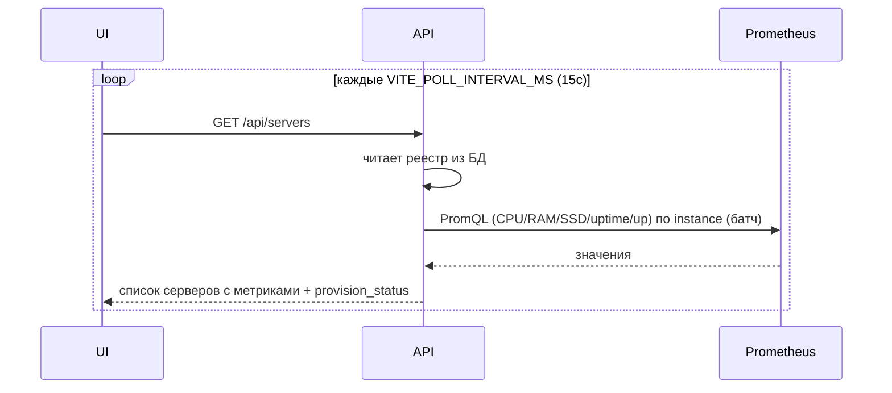
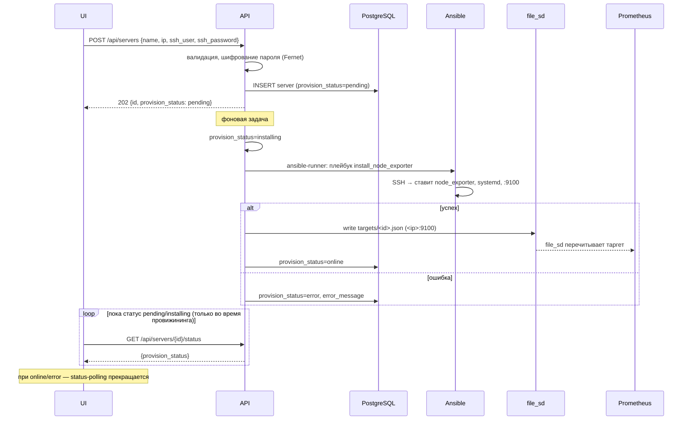
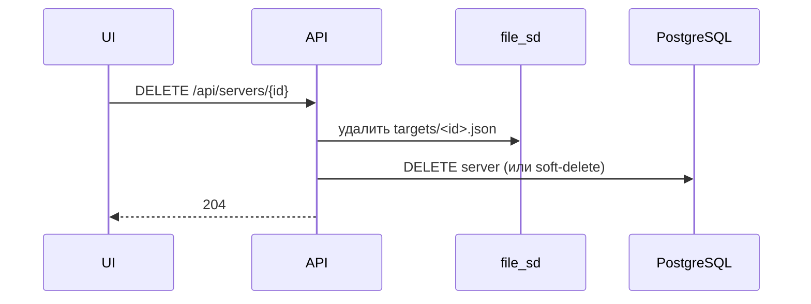
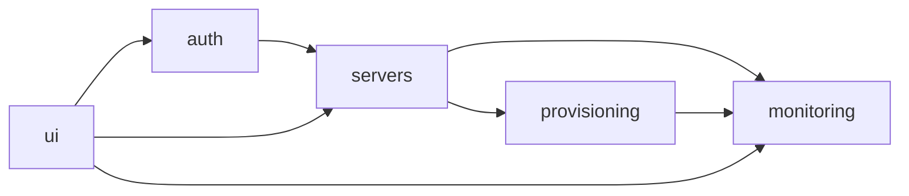

# 01 · Архитектура

## Обзор

Система — монолитный backend (FastAPI) + SPA-frontend (React/Vite) + инфраструктура мониторинга (Prometheus + node_exporter + Grafana). Провижининг целевых серверов выполняется backend'ом через Ansible. Источник истины для метрик — Prometheus; PostgreSQL хранит только реестр серверов и статус провижининга.

Решение о монолите, а не о микросервисах, зафиксировано в [ADR-001](adr/ADR-001-stack-i-monolit.md) (критерий NFR-1: простота, команда 1–2 человека).

## Компонентная диаграмма

## Компоненты

### Frontend — React SPA
- Двухэкранный логин, страница «Серверы», модалка добавления.
- Кастомные SVG-спидометры (см. [08-design-system.md](08-design-system.md)).
- Опрашивает backend (`GET /api/servers`, `/metrics`, `/status`) с интервалом `VITE_POLL_INTERVAL_MS` (по умолчанию 15000).
- Хранит JWT в памяти + (опционально) refresh через повторный логин. Детали в [05-security.md](05-security.md).

### Backend — FastAPI (монолит, слоистая архитектура)
Слои: `api` (роутеры) → `services` (бизнес-логика) → `repositories` (доступ к БД) → `infra` (Prometheus-клиент, Ansible-runner, crypto).

Подсистемы (модули):
- **auth** — двухшаговый вход, выдача/валидация JWT.
- **servers** — CRUD реестра серверов.
- **monitoring** — клиент Prometheus HTTP API, маппинг PromQL → метрики карточки. **Устойчивость read-path:** короткий TTL-кэш + single-flight для `GET /api/servers`, ограничение конкурентности исходящих PromQL (семафор) и ретраи на транзиентные ошибки — чтобы periodic polling и несколько вкладок не усиливали нагрузку на Prometheus и не вызывали массовую деградацию (см. [modules/monitoring](modules/monitoring/README.md#устойчивость-read-path-нормативно)).
- **provisioning** — оркестрация Ansible, запись file_sd, управление `provision_status`.

### PostgreSQL
Реестр серверов и статус провижининга. Метрики НЕ хранятся ([ADR-003](adr/ADR-003-prometheus-istochnik-metrik.md)).

### Prometheus
Хранилище time-series. Динамическая регистрация таргетов через file_sd ([ADR-004](adr/ADR-004-file-sd-registraciya-targetov.md)). Scrape-интервал по умолчанию 15 с.

### node_exporter
Агент на целевых серверах, порт 9100. Ставится Ansible как systemd-сервис.

### Grafana
Детальные дашборды (drill-down). На главной странице CRM НЕ встраивается — там кастомные SVG-гейджи ([ADR-005](adr/ADR-005-custom-gauge-vs-grafana-embed.md)). На Этапе 1 Grafana настраивается **datasource-only** (преднастроенный дашборд вне scope — [TD-010](100-known-tech-debt.md)); drill-down ведёт в Grafana Explore.

### Ansible runner
Запускается в процессе backend через библиотеку `ansible-runner` (см. [09-provisioning.md](09-provisioning.md)). На Этапе 1 — асинхронная фоновая задача без внешнего брокера ([ADR-006](adr/ADR-006-async-provisioning-bez-brokera.md)).

## Потоки данных

### Поток 1 — Аутентификация (двухшаговый вход)

Двухшаговость — это UX страницы входа. Бэкенд проверяет креды единым запросом на шаге 2; почему так — [ADR-002](adr/ADR-002-dvuhshagovyy-auth.md).

### Поток 2 — Просмотр карточек (метрики)

> Routine-обновление метрик карточек — это периодический `GET /api/servers` (список уже содержит метрики всех серверов). Per-card `GET /api/servers/{id}/metrics` в routine-цикле НЕ используется (зарезервирован на будущее). Стратегия polling — [modules/ui/README.md](modules/ui/README.md).

### Поток 3 — Добавление сервера (провижининг)

> `GET /api/servers/{id}/status` опрашивается UI **только во время провижининга** (статусы `pending`/`installing`), не на постоянном интервале. Подробности — [modules/ui/README.md](modules/ui/README.md).

### Поток 4 — Удаление сервера

> Удаление снимает таргет из мониторинга. Node_exporter на целевом сервере НЕ удаляется автоматически на Этапе 1 (см. [TD-002](100-known-tech-debt.md)).

## Deployment topology

Один хост / одна docker-compose сеть. Сервисы: `backend`, `frontend` (nginx со статикой SPA), `postgres`, `prometheus`, `grafana`. Backend и Prometheus делят volume `file_sd` (targets). Reverse-proxy (nginx) терминирует TLS и проксирует `/api` → backend, `/` → SPA. Prometheus и Grafana наружу не публикуются (NFR-9). Подробнее — [07-deployment.md](07-deployment.md).

## Границы и связи модулей

- `auth` не зависит ни от чего, кроме конфигурации.
- `servers` использует `provisioning` (при создании) и `monitoring` (для метрик).
- `provisioning` пишет file_sd, который читает `monitoring`/Prometheus.
- `ui` потребляет все API.
