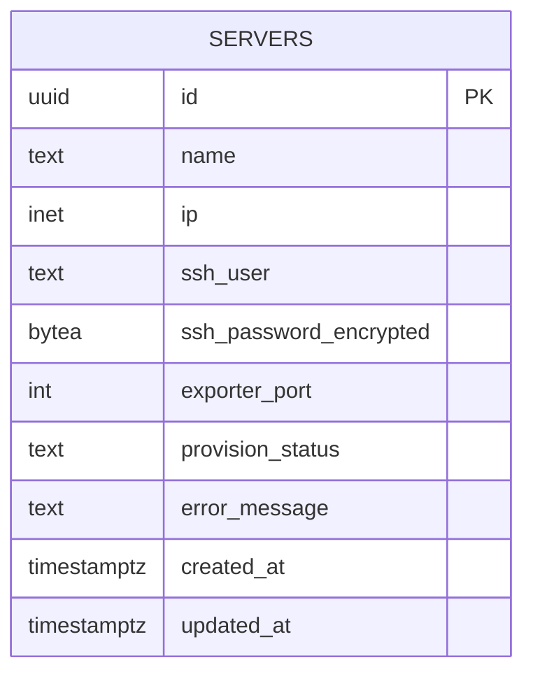
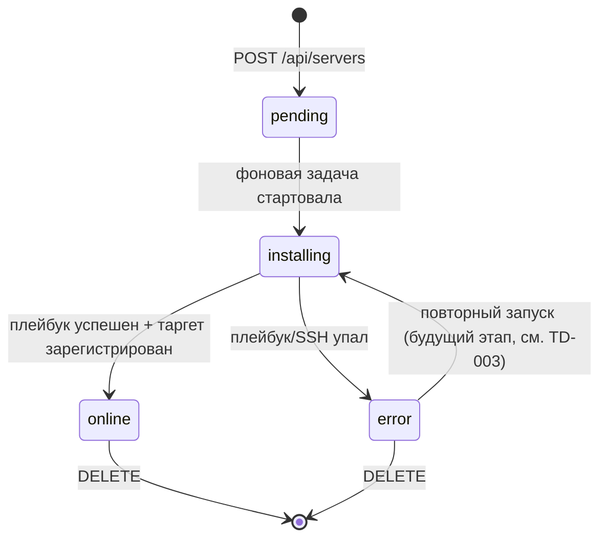

# 03 · Модель данных

## Принцип

В PostgreSQL хранится **только реестр серверов и статус провижининга**. Метрики (CPU/RAM/SSD/uptime/up) НЕ дублируются в БД — источник истины Prometheus ([ADR-003](adr/ADR-003-prometheus-istochnik-metrik.md)). Учётная запись администратора в БД НЕ хранится — только в `.env` ([ADR-008](adr/ADR-008-admin-iz-env.md)).

## ER-диаграмма



На Этапе 1 одна таблица — `servers`. Связей нет (один админ, метрики во внешней системе).

## Таблица `servers`

| Поле | Тип | Ограничения | Описание |
|------|-----|-------------|----------|
| `id` | `uuid` | PK, `DEFAULT gen_random_uuid()` | Идентификатор сервера. Используется в `targets/<id>.json` и как Prometheus label. |
| `name` | `text` | `NOT NULL`, 1–64 симв. | Отображаемое имя (например, «Server 01»). |
| `ip` | `inet` | `NOT NULL`, `UNIQUE` | IP-адрес целевого сервера. |
| `ssh_user` | `text` | `NOT NULL`, 1–64 симв. | SSH-логин для Ansible. |
| `ssh_password_encrypted` | `bytea` | `NOT NULL` | Fernet-ciphertext SSH-пароля. Plaintext никогда не хранится и не логируется. |
| `exporter_port` | `integer` | `NOT NULL`, `DEFAULT 9100`, 1–65535 | Порт node_exporter. |
| `provision_status` | `text` | `NOT NULL`, `DEFAULT 'pending'`, CHECK | Статус провижининга (см. ниже). |
| `error_message` | `text` | `NULL` | Текст ошибки провижининга (без секретов). |
| `created_at` | `timestamptz` | `NOT NULL`, `DEFAULT now()` | Дата создания. |
| `updated_at` | `timestamptz` | `NOT NULL`, `DEFAULT now()` | Дата последнего изменения (обновляется триггером/приложением). |

### Перечисление `provision_status`

Конечный автомат статуса:



| Значение | Смысл | UI |
|----------|-------|-----|
| `pending` | Запись создана, задача в очереди | Карточка-скелет «В очереди» |
| `installing` | Ansible выполняется | Прогресс «Установка агента…» |
| `online` | Агент работает, таргет зарегистрирован | Полноценная карточка с метриками |
| `error` | Сбой провижининга | Карточка с ошибкой + кнопка «Удалить» |

> `online` означает «провижининг завершён». Текущая доступность (up/down) определяется отдельно метрикой `up` из Prometheus и отображается статус-точкой (см. [04-api.md](04-api.md) поле `online`).

## DDL (концепт миграции)

> Реализуется через Alembic. Точная миграция — задача backend, ниже целевой результат.
>
> **Требование (нормативно):** каждая Alembic-миграция ОБЯЗАНА иметь рабочую функцию `downgrade()`, протестированную на откат на одну ревизию. Это основа процедуры отката релиза — см. [07-deployment.md «Откат миграций БД»](07-deployment.md#откат-миграций-бд).

```sql
CREATE EXTENSION IF NOT EXISTS pgcrypto;  -- для gen_random_uuid()

CREATE TABLE servers (
    id                      uuid PRIMARY KEY DEFAULT gen_random_uuid(),
    name                    text NOT NULL CHECK (char_length(name) BETWEEN 1 AND 64),
    ip                      inet NOT NULL UNIQUE,
    ssh_user                text NOT NULL CHECK (char_length(ssh_user) BETWEEN 1 AND 64),
    ssh_password_encrypted  bytea NOT NULL,
    exporter_port           integer NOT NULL DEFAULT 9100
                                CHECK (exporter_port BETWEEN 1 AND 65535),
    provision_status        text NOT NULL DEFAULT 'pending'
                                CHECK (provision_status IN ('pending','installing','online','error')),
    error_message           text,
    created_at              timestamptz NOT NULL DEFAULT now(),
    updated_at              timestamptz NOT NULL DEFAULT now()
);

CREATE INDEX ix_servers_provision_status ON servers (provision_status);
CREATE INDEX ix_servers_created_at ON servers (created_at DESC);
```

### Индексы и обоснование
- `UNIQUE(ip)` — нельзя добавить один и тот же сервер дважды; даёт детерминированную ошибку конфликта (409).
- `ix_servers_provision_status` — выборка серверов в работе/ошибке.
- `ix_servers_created_at` — стабильная сортировка списка `GET /api/servers` по `created_at DESC` (новые сверху), вторичный ключ `id` (см. [04-api.md](04-api.md#get-apiservers)).

## Маппинг на Prometheus

Связь записи БД с метриками — по label `instance`/`id`:
- Backend пишет `targets/<id>.json` с `targets: ["<ip>:<exporter_port>"]` и label `server_id="<id>"`, `name="<name>"`.
- PromQL-запросы фильтруются по `instance="<ip>:<exporter_port>"` (или по `server_id`). Точные запросы — [modules/monitoring/02-promql.md](modules/monitoring/02-promql.md).

## Шифрование `ssh_password_encrypted`

- Алгоритм: **Fernet** (`cryptography`), симметричный AES-128-CBC + HMAC.
- Ключ: `FERNET_KEY` из `.env` (base64, 32 байта). Никогда не в коде/БД/логах.
- Шифрование при `POST /api/servers`, расшифровка только в памяти провижининг-сервиса непосредственно перед запуском Ansible.
- В ответах API пароль (ни в каком виде) НЕ возвращается. Детали — [05-security.md](05-security.md).

## Политика удаления

Этап 1 — **hard delete** (`DELETE FROM servers WHERE id = ...`) + удаление `targets/<id>.json`. Soft-delete и аудит-лог — будущий этап ([TD-001](100-known-tech-debt.md)).

## Конкурентность

- Фоновая задача провижининга обновляет `provision_status` атомарными `UPDATE`.
- Один воркер на Этапе 1 (NFR-1); гонок по одной записи не ожидается. Масштабирование на несколько воркеров — [TD-004](100-known-tech-debt.md).
