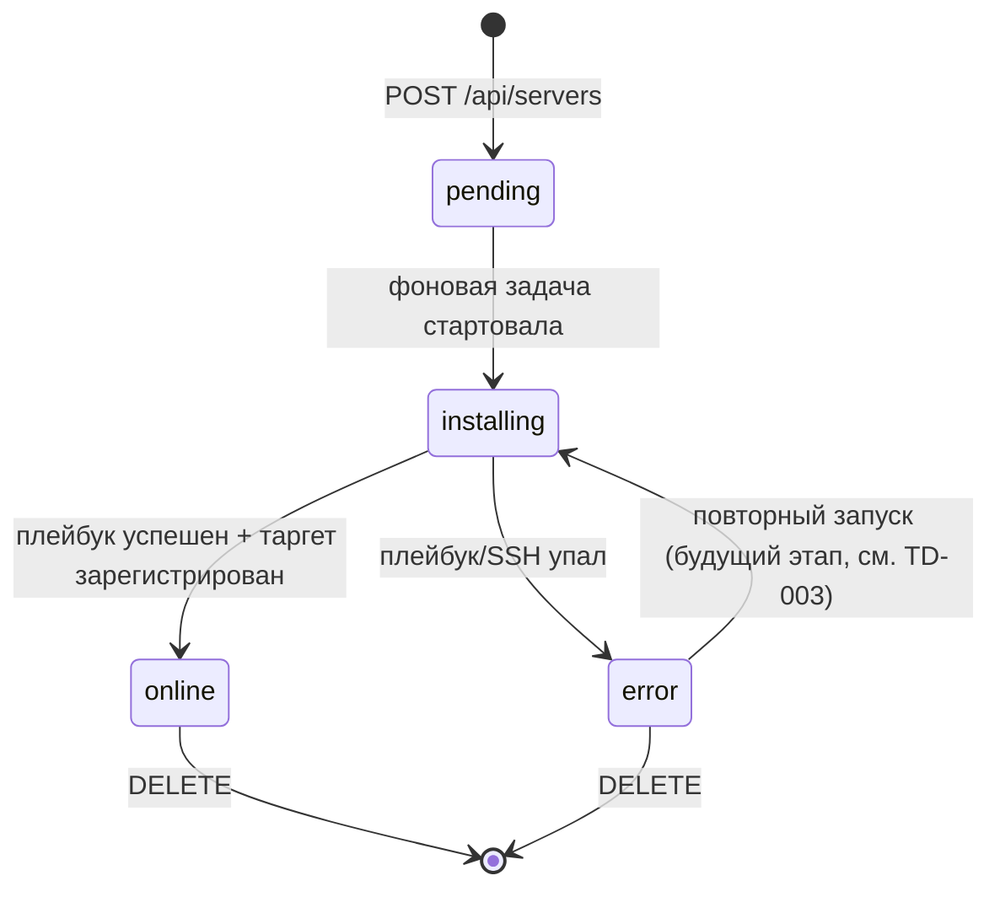
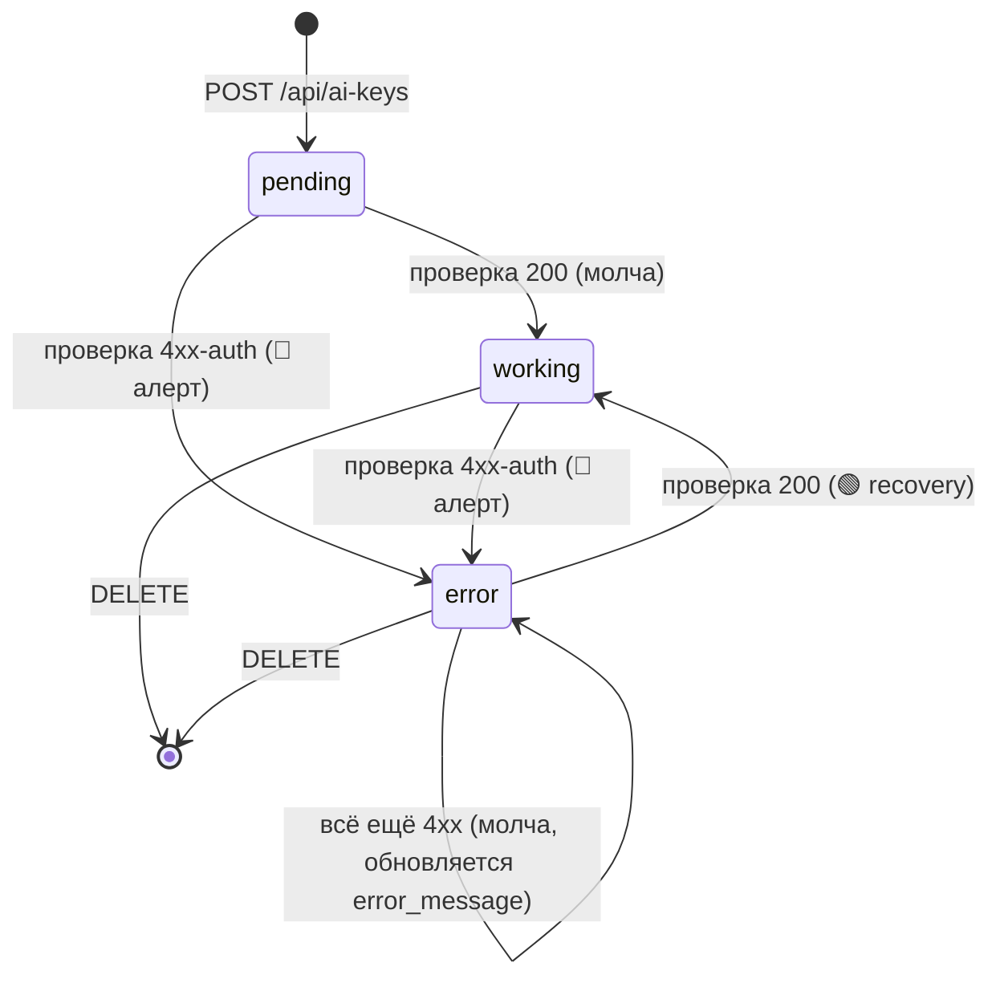
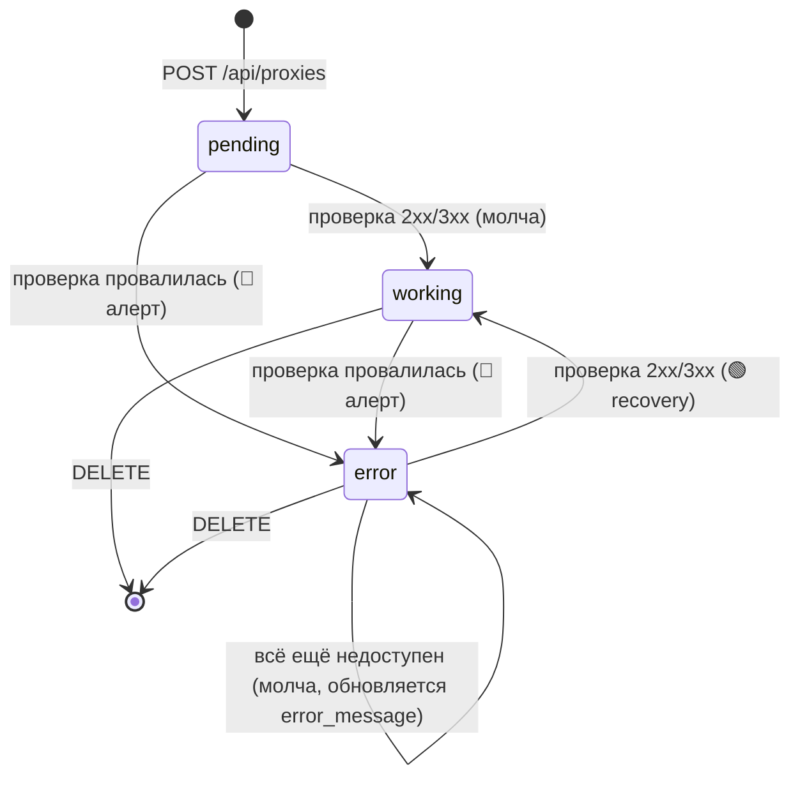
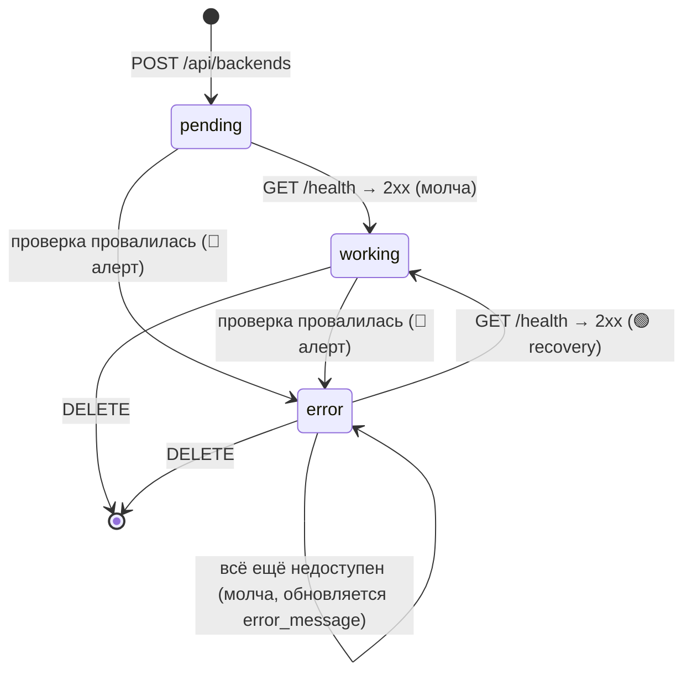

# 03 · Модель данных

## Принцип

В PostgreSQL хранится **реестр серверов + статус провижининга**, **реестр AI-ключей + статус проверки**, **реестр прокси + статус доступности** ([ADR-019](adr/ADR-019-proxies-availability-monitor.md)), **персистентное состояние Telegram-нотификатора per-server** ([ADR-014](adr/ADR-014-persist-notifier-state-alert-on-first-elevated.md)) и **append-only durable-лог отправленных серверных алертов** ([ADR-018](adr/ADR-018-notifier-windowed-offline-recovery-alert-log.md)). Метрики (CPU/RAM/SSD/uptime/up) НЕ дублируются в БД как временной ряд — источник истины Prometheus ([ADR-003](adr/ADR-003-prometheus-istochnik-metrik.md)); нотификатор хранит лишь **последнюю наблюдённую зону** (green/yellow/red) и флаг доступности для дедупа алертов между итерациями/рестартами, а не сами значения метрик. Учётная запись администратора в БД НЕ хранится — только в `.env` ([ADR-008](adr/ADR-008-admin-iz-env.md)).

## ER-диаграмма

```mermaid
erDiagram
    SERVERS {
        uuid id PK
        text name
        inet ip
        text ssh_user
        bytea ssh_password_encrypted
        int exporter_port
        text provision_status
        text error_message
        int position
        timestamptz created_at
        timestamptz updated_at
    }
    AI_KEYS {
        uuid id PK
        text name
        text provider
        bytea key_encrypted
        text key_prefix
        text key_last4
        text check_status
        text error_message
        int position
        timestamptz last_checked_at
        timestamptz created_at
        timestamptz updated_at
    }
    PROXIES {
        uuid id PK
        text name
        text proxy_type
        text host
        int port
        text username
        bytea password_encrypted
        text check_status
        text error_message
        int position
        timestamptz last_checked_at
        timestamptz created_at
        timestamptz updated_at
    }
    BACKENDS {
        uuid id PK
        text code
        text name
        text domain
        text check_status
        text error_message
        int position
        timestamptz last_checked_at
        timestamptz created_at
        timestamptz updated_at
    }
    NOTIFIER_SERVER_STATE {
        uuid server_id PK_FK
        boolean online
        text zone_cpu
        text zone_ram
        text zone_ssd
        timestamptz updated_at
    }
    NOTIFIER_ALERT_LOG {
        bigint id PK
        uuid server_id FK "NULL, ON DELETE SET NULL"
        text kind
        text message
        boolean delivered
        timestamptz created_at
    }
    SERVERS ||--o| NOTIFIER_SERVER_STATE : "1:1 (ON DELETE CASCADE)"
    SERVERS ||--o{ NOTIFIER_ALERT_LOG : "1:N (ON DELETE SET NULL)"
```

`servers`, `ai_keys`, `proxies` и `backends` — независимые таблицы (связей между ними нет: один админ; метрики серверов во внешней системе; AI-ключи проверяются у внешних провайдеров; прокси проверяются прямым запросом через прокси; бэки проверяются `GET https://{домен}/health`). `backends` с нотификатором не связан (его состояние — в `backends.check_status`, отдельный монитор — [ADR-020](adr/ADR-020-backends-healthcheck-monitor.md)). `proxies` с нотификатором не связан (его состояние — в `proxies.check_status`, отдельный монитор — [ADR-019](adr/ADR-019-proxies-availability-monitor.md)). `notifier_server_state` — **1:1-расширение** `servers` (per-server состояние нотификатора), связано FK `server_id → servers.id` с `ON DELETE CASCADE`; `ai_keys` с нотификатором не связан (его состояние — в `ai_keys.check_status`). `notifier_alert_log` — **1:N append-only-лог** отправленных серверных алертов ([ADR-018](adr/ADR-018-notifier-windowed-offline-recovery-alert-log.md)), связан FK `server_id → servers.id` с **`ON DELETE SET NULL`** (лог переживает удаление сервера — в отличие от `notifier_server_state`).

## Таблица `servers`

| Поле | Тип | Ограничения | Описание |
|------|-----|-------------|----------|
| `id` | `uuid` | PK, `DEFAULT gen_random_uuid()` | Идентификатор сервера. Используется в `targets/<id>.json` и как Prometheus label. |
| `name` | `text` | `NOT NULL`, 1–64 симв. | Отображаемое имя (например, «Server 01»). |
| `ip` | `inet` | `NOT NULL`, `UNIQUE` | IP-адрес целевого сервера. |
| `ssh_user` | `text` | `NOT NULL`, 1–64 симв. | SSH-логин для Ansible. |
| `ssh_password_encrypted` | `bytea` | `NOT NULL` | Fernet-ciphertext SSH-пароля. Plaintext никогда не хранится и не логируется. |
| `exporter_port` | `integer` | `NOT NULL`, `DEFAULT 9100`, 1–65535 | Порт node_exporter. |
| `provision_status` | `text` | `NOT NULL`, `DEFAULT 'pending'`, CHECK | Статус провижининга (см. ниже). |
| `error_message` | `text` | `NULL` | Текст ошибки провижининга (без секретов). |
| `position` | `integer` | `NOT NULL`, `DEFAULT 0` | Порядок карточки в списке (drag-and-drop). См. [«Колонка `position`»](#колонка-position-порядок-карточек). |
| `created_at` | `timestamptz` | `NOT NULL`, `DEFAULT now()` | Дата создания. |
| `updated_at` | `timestamptz` | `NOT NULL`, `DEFAULT now()` | Дата последнего изменения (обновляется триггером/приложением). |

### Перечисление `provision_status`

Конечный автомат статуса:



| Значение | Смысл | UI |
|----------|-------|-----|
| `pending` | Запись создана, задача в очереди | Карточка-скелет «В очереди» |
| `installing` | Ansible выполняется | Прогресс «Установка агента…» |
| `online` | Агент работает, таргет зарегистрирован | Полноценная карточка с метриками |
| `error` | Сбой провижининга | Карточка с ошибкой + кнопка «Удалить» |

> `online` означает «провижининг завершён». Текущая доступность (up/down) определяется отдельно метрикой `up` из Prometheus и отображается статус-точкой (см. [04-api.md](04-api.md) поле `online`).

## DDL (концепт миграции)

> Реализуется через Alembic. Точная миграция — задача backend, ниже целевой результат.
>
> **Требование (нормативно):** каждая Alembic-миграция ОБЯЗАНА иметь рабочую функцию `downgrade()`, протестированную на откат на одну ревизию. Это основа процедуры отката релиза — см. [07-deployment.md «Откат миграций БД»](07-deployment.md#откат-миграций-бд).

```sql
CREATE EXTENSION IF NOT EXISTS pgcrypto;  -- для gen_random_uuid()

CREATE TABLE servers (
    id                      uuid PRIMARY KEY DEFAULT gen_random_uuid(),
    name                    text NOT NULL CHECK (char_length(name) BETWEEN 1 AND 64),
    ip                      inet NOT NULL UNIQUE,
    ssh_user                text NOT NULL CHECK (char_length(ssh_user) BETWEEN 1 AND 64),
    ssh_password_encrypted  bytea NOT NULL,
    exporter_port           integer NOT NULL DEFAULT 9100
                                CHECK (exporter_port BETWEEN 1 AND 65535),
    provision_status        text NOT NULL DEFAULT 'pending'
                                CHECK (provision_status IN ('pending','installing','online','error')),
    error_message           text,
    position                integer NOT NULL DEFAULT 0,
    created_at              timestamptz NOT NULL DEFAULT now(),
    updated_at              timestamptz NOT NULL DEFAULT now()
);

CREATE INDEX ix_servers_provision_status ON servers (provision_status);
CREATE INDEX ix_servers_position ON servers (position);
```

### Индексы и обоснование
- `UNIQUE(ip)` — нельзя добавить один и тот же сервер дважды; даёт детерминированную ошибку конфликта (409).
- `ix_servers_provision_status` — выборка серверов в работе/ошибке.
- `ix_servers_position` — стабильная сортировка списка `GET /api/servers` по `position ASC` (порядок drag-and-drop), тай-брейк `created_at DESC`, `id` (см. [04-api.md](04-api.md#get-apiservers), [«Колонка `position`»](#колонка-position-порядок-карточек)). Индекс `ix_servers_created_at` больше не нужен как основной ключ сортировки (тай-брейк по `created_at` на ≤50 строках не требует отдельного индекса).

## Маппинг на Prometheus

Связь записи БД с метриками — по label `instance`/`id`:
- Backend пишет `targets/<id>.json` с `targets: ["<ip>:<exporter_port>"]` и label `server_id="<id>"`, `name="<name>"`.
- PromQL-запросы фильтруются по `instance="<ip>:<exporter_port>"` (или по `server_id`). Точные запросы — [modules/monitoring/02-promql.md](modules/monitoring/02-promql.md).

## Шифрование `ssh_password_encrypted`

- Алгоритм: **Fernet** (`cryptography`), симметричный AES-128-CBC + HMAC.
- Ключ: `FERNET_KEY` из `.env` (base64, 32 байта). Никогда не в коде/БД/логах.
- Шифрование при `POST /api/servers`, расшифровка только в памяти провижининг-сервиса непосредственно перед запуском Ansible.
- В ответах API пароль (ни в каком виде) НЕ возвращается. Детали — [05-security.md](05-security.md).

## Политика удаления

Этап 1 — **hard delete** (`DELETE FROM servers WHERE id = ...`) + удаление `targets/<id>.json`. Soft-delete и аудит-лог — будущий этап ([TD-001](100-known-tech-debt.md)).

## Конкурентность

- Фоновая задача провижининга обновляет `provision_status` атомарными `UPDATE`.
- Один воркер на Этапе 1 (NFR-1); гонок по одной записи не ожидается. Масштабирование на несколько воркеров — [TD-004](100-known-tech-debt.md).

---

## Таблица `ai_keys`

Реестр API-ключей AI-провайдеров (OpenAI/Anthropic) с автоматической проверкой валидности. Модуль — [modules/ai-keys](modules/ai-keys/README.md), API — [04-api.md](04-api.md#ai-keys), решение — [ADR-010](adr/ADR-010-ai-key-monitor-vnutri-backend.md).

| Поле | Тип | Ограничения | Описание |
|------|-----|-------------|----------|
| `id` | `uuid` | PK, `DEFAULT gen_random_uuid()` | Идентификатор ключа. |
| `name` | `text` | `NOT NULL`, 1–64 симв. | Отображаемое имя ключа. |
| `provider` | `text` | `NOT NULL`, CHECK | Провайдер: `openai` \| `anthropic`. |
| `key_encrypted` | `bytea` | `NOT NULL` | Fernet-ciphertext полного ключа. Plaintext никогда не хранится и не логируется. |
| `key_prefix` | `text` | `NULL` | Первые 4 символа ключа (plaintext, для маски). `NULL` для ключа короче 8 символов. |
| `key_last4` | `text` | `NULL` | Последние 4 символа ключа (plaintext, для маски и Telegram). `NULL` для ключа короче 8 символов. |
| `check_status` | `text` | `NOT NULL`, `DEFAULT 'pending'`, CHECK | Статус проверки: `pending` \| `working` \| `error`. Источник состояния переходов (переживает рестарт). |
| `error_message` | `text` | `NULL` | Причина при `error` (рус.): «Ключ недействителен»/«Доступ запрещён»/«Недостаточно средств»/«Ошибка провайдера». |
| `position` | `integer` | `NOT NULL`, `DEFAULT 0` | Порядок карточки **внутри провайдер-группы** (drag-and-drop). См. [«Колонка `position`»](#колонка-position-порядок-карточек). |
| `last_checked_at` | `timestamptz` | `NULL` | Время последней **конклюзивной** проверки (`working`/`error`), обновляется монитором. Транзиентный `unknown` (сеть/таймаут/`5xx`) строку не трогает, поэтому конклюзивной проверкой не считается. |
| `created_at` | `timestamptz` | `NOT NULL`, `DEFAULT now()` | Дата создания. |
| `updated_at` | `timestamptz` | `NOT NULL`, `DEFAULT now()` | Дата последнего изменения. |

> `key_prefix`/`key_last4` — осознанное раскрытие 8 plaintext-символов ради маски в UI (`key_masked`); сам секрет из них не восстанавливается. Полный ключ — только в `key_encrypted` (Fernet). Правило маски и кейс `<8` символов — [modules/ai-keys](modules/ai-keys/README.md#правило-маски-key_masked).

### Перечисление `check_status`

Конечный автомат статуса (состояние в БД, переживает рестарт — [ADR-010](adr/ADR-010-ai-key-monitor-vnutri-backend.md)):



> Транзиентная недоступность провайдера (сеть/таймаут/5xx) → исход `unknown`: `check_status` **НЕ меняется**, алерт не шлётся (см. [modules/ai-keys](modules/ai-keys/README.md#проверка-ключа-у-провайдера-нормативно)).

### DDL (концепт миграции)

> Реализуется через Alembic. **Требование (нормативно):** миграция ОБЯЗАНА иметь рабочий `downgrade()` (`DROP TABLE ai_keys` + сопутствующие индексы), протестированный на откат — см. [07-deployment.md](07-deployment.md#откат-миграций-бд).

```sql
CREATE TABLE ai_keys (
    id               uuid PRIMARY KEY DEFAULT gen_random_uuid(),
    name             text NOT NULL CHECK (char_length(name) BETWEEN 1 AND 64),
    provider         text NOT NULL CHECK (provider IN ('openai','anthropic')),
    key_encrypted    bytea NOT NULL,
    key_prefix       text,
    key_last4        text,
    check_status     text NOT NULL DEFAULT 'pending'
                         CHECK (check_status IN ('pending','working','error')),
    error_message    text,
    position         integer NOT NULL DEFAULT 0,
    last_checked_at  timestamptz,
    created_at       timestamptz NOT NULL DEFAULT now(),
    updated_at       timestamptz NOT NULL DEFAULT now()
);

CREATE INDEX ix_ai_keys_provider_position ON ai_keys (provider, position);
```

> Индекс `(provider, position)` — списки AI-ключей отдаются `ORDER BY position ASC, created_at DESC, id`, а перестановка идёт **внутри провайдер-группы** (`WHERE provider = :p`). Прежний `ix_ai_keys_created_at` заменён: `created_at` остаётся лишь тай-брейком.

### Шифрование `key_encrypted`

- Алгоритм: **Fernet** (`cryptography`), тот же примитив и тот же ключ `FERNET_KEY`, что и для SSH-паролей ([ADR-007](adr/ADR-007-shifrovanie-fernet.md), [ADR-010](adr/ADR-010-ai-key-monitor-vnutri-backend.md)). Переиспользуются `encrypt_password`/`decrypt_password` (`app/infra/crypto.py`).
- Шифрование при `POST /api/ai-keys`; расшифровка только в памяти монитора/проверки перед HTTP-запросом к провайдеру.
- Полный ключ (ни в каком виде) НЕ возвращается в API и не логируется. Детали — [05-security.md](05-security.md#защита-ai-ключей).

### Политика удаления

Этап 1 — **hard delete** (`DELETE FROM ai_keys WHERE id = ...`). Soft-delete/аудит — будущий этап ([TD-001](100-known-tech-debt.md)).

---

## Таблица `proxies`

Реестр прокси (HTTP/HTTPS/SOCKS5) с автоматической проверкой доступности. Модуль — [modules/proxies](modules/proxies/README.md), API — [04-api.md](04-api.md#proxies), решение — [ADR-019](adr/ADR-019-proxies-availability-monitor.md). Устроена по образцу `ai_keys` (модель со статусом + фоновый монитор), но: секрет (`password`) **опционален**; список **единый** (без группировки); в API вместо фрагментов — флаг `has_password`.

| Поле | Тип | Ограничения | Описание |
|------|-----|-------------|----------|
| `id` | `uuid` | PK, `DEFAULT gen_random_uuid()` | Идентификатор прокси. |
| `name` | `text` | `NOT NULL`, 1–64 симв. | Отображаемое имя прокси. |
| `proxy_type` | `text` | `NOT NULL`, CHECK | Тип/схема: `http` \| `https` \| `socks5`. |
| `host` | `text` | `NOT NULL`, 1–255 симв. | Хост прокси (IP или FQDN). |
| `port` | `integer` | `NOT NULL`, CHECK 1–65535 | Порт прокси. |
| `username` | `text` | `NULL` | Логин прокси (опц.). **Не секрет** — возвращается в API как есть. `NULL` — без авторизации. |
| `password_encrypted` | `bytea` | `NULL` | Fernet-ciphertext пароля прокси (опц.). `NULL` — пароль не задан. Plaintext никогда не хранится и не логируется. |
| `check_status` | `text` | `NOT NULL`, `DEFAULT 'pending'`, CHECK | Статус проверки: `pending` \| `working` \| `error`. Источник состояния переходов (переживает рестарт). |
| `error_message` | `text` | `NULL` | Причина при `error` (рус.): «Таймаут подключения»/«Прокси недоступен»/«Ошибка прокси». |
| `position` | `integer` | `NOT NULL`, `DEFAULT 0` | Порядок карточки в **едином списке** (drag-and-drop, как серверы). См. [«Колонка `position`»](#колонка-position-порядок-карточек). |
| `last_checked_at` | `timestamptz` | `NULL` | Время последней конклюзивной проверки (`working`/`error`), обновляется монитором. |
| `created_at` | `timestamptz` | `NOT NULL`, `DEFAULT now()` | Дата создания. |
| `updated_at` | `timestamptz` | `NOT NULL`, `DEFAULT now()` | Дата последнего изменения. |

> Пароль хранится **только** в `password_encrypted` (Fernet). В API он не раскрывается ни фрагментами, ни маской — только производный флаг `has_password` (`= password_encrypted IS NOT NULL`). `username` — plaintext (не секрет). Детали — [05-security.md](05-security.md#защита-паролей-прокси), [modules/proxies](modules/proxies/README.md#безопасность-пароля-нормативно).

### Перечисление `check_status`

Конечный автомат статуса (состояние в БД, переживает рестарт — [ADR-019](adr/ADR-019-proxies-availability-monitor.md)):



> В отличие от `ai_keys`, у прокси **нет** исхода `unknown`: недоступность прокси и есть отслеживаемое событие. Транзиентность гасится ретраями внутри одной проверки (см. [modules/proxies](modules/proxies/README.md#проверка-доступности-прокси-нормативно)).

### DDL (концепт миграции)

> Реализуется через Alembic. **Требование (нормативно):** миграция ОБЯЗАНА иметь рабочий `downgrade()` (`DROP TABLE proxies` + индекс), протестированный на откат — см. [07-deployment.md](07-deployment.md#откат-миграций-бд).

```sql
CREATE TABLE proxies (
    id                  uuid PRIMARY KEY DEFAULT gen_random_uuid(),
    name                text NOT NULL CHECK (char_length(name) BETWEEN 1 AND 64),
    proxy_type          text NOT NULL CHECK (proxy_type IN ('http','https','socks5')),
    host                text NOT NULL CHECK (char_length(host) BETWEEN 1 AND 255),
    port                integer NOT NULL CHECK (port BETWEEN 1 AND 65535),
    username            text,
    password_encrypted  bytea,
    check_status        text NOT NULL DEFAULT 'pending'
                            CHECK (check_status IN ('pending','working','error')),
    error_message       text,
    position            integer NOT NULL DEFAULT 0,
    last_checked_at     timestamptz,
    created_at          timestamptz NOT NULL DEFAULT now(),
    updated_at          timestamptz NOT NULL DEFAULT now()
);

CREATE INDEX ix_proxies_position ON proxies (position);
```

> Индекс `ix_proxies_position` — список прокси отдаётся `ORDER BY position ASC, created_at DESC, id` (единый список, как серверы). Отдельный индекс по `created_at` не нужен (тай-брейк на ≤ десятков строк).

### Шифрование `password_encrypted`

- Алгоритм: **Fernet** (`cryptography`), тот же примитив и ключ `FERNET_KEY`, что для SSH-паролей/AI-ключей ([ADR-007](adr/ADR-007-shifrovanie-fernet.md), [ADR-019](adr/ADR-019-proxies-availability-monitor.md)). Переиспользуются `encrypt_secret`/`decrypt_secret` (`app/infra/crypto.py`).
- Шифрование при `POST /api/proxies` (только если пароль задан); расшифровка только в памяти монитора перед сборкой URL и запросом через прокси.
- Пароль (в любом виде) НЕ возвращается в API и не логируется. `username` — не секрет. Детали — [05-security.md](05-security.md#защита-паролей-прокси).

### Политика удаления

Этап 1 — **hard delete** (`DELETE FROM proxies WHERE id = ...`). Soft-delete/аудит — будущий этап ([TD-001](100-known-tech-debt.md)).

## Миграция `0006_create_proxies` (концепт)

> Реализуется через Alembic. `down_revision = "0005_create_notifier_alert_log"` (текущая голова цепочки). **Требование (нормативно):** рабочий `downgrade()`, протестированный на откат на одну ревизию — см. [07-deployment.md](07-deployment.md#откат-миграций-бд).

**`upgrade()`** — создать таблицу `proxies` (DDL выше) + индекс `ix_proxies_position`. Backfill не выполняется (таблица стартует пустой).

**`downgrade()`** — `DROP TABLE proxies` (индекс снимается вместе с таблицей).

---

## Таблица `backends`

Реестр бэков (backend-сервисов) с автоматической проверкой доступности по HTTP-эндпоинту здоровья. Модуль — [modules/backends](modules/backends/README.md), API — [04-api.md](04-api.md#backends), решение — [ADR-020](adr/ADR-020-backends-healthcheck-monitor.md). Устроена по образцу `proxies` (модель со статусом + фоновый монитор), но **проще**: секрета нет (нет Fernet); идентификатор `code` **уникален**; проверка — прямой `GET https://{domain}/health` (без прокси-туннеля); список **единый** (без группировки).

| Поле | Тип | Ограничения | Описание |
|------|-----|-------------|----------|
| `id` | `uuid` | PK, `DEFAULT gen_random_uuid()` | Идентификатор бэка. |
| `code` | `text` | `NOT NULL`, `UNIQUE`, 1–64 симв. | Бизнес-код сервиса (уникален). Дубликат → `409 backend_code_taken`. Не секрет — возвращается в API. |
| `name` | `text` | `NOT NULL`, 1–64 симв. | Отображаемое имя бэка. |
| `domain` | `text` | `NOT NULL`, 1–255 симв., без схемы/пробелов/`/` | Домен бэка (нормализованный `host[:port]`, без схемы и пути). URL проверки = `https://{domain}/health`. Не секрет. |
| `check_status` | `text` | `NOT NULL`, `DEFAULT 'pending'`, CHECK | Статус проверки: `pending` \| `working` \| `error`. Источник состояния переходов (переживает рестарт). |
| `error_message` | `text` | `NULL` | Причина при `error` (рус.): «Таймаут подключения»/«Бэк недоступен»/«Ошибка бэка (HTTP N)». |
| `position` | `integer` | `NOT NULL`, `DEFAULT 0` | Порядок карточки в **едином списке** (drag-and-drop, как серверы/прокси). См. [«Колонка `position`»](#колонка-position-порядок-карточек). |
| `last_checked_at` | `timestamptz` | `NULL` | Время последней конклюзивной проверки (`working`/`error`), обновляется монитором. |
| `created_at` | `timestamptz` | `NOT NULL`, `DEFAULT now()` | Дата создания. |
| `updated_at` | `timestamptz` | `NOT NULL`, `DEFAULT now()` | Дата последнего изменения. |

> Секрета у бэка нет — все поля публичны, возвращаются в API как есть. `code` уникален (`UNIQUE`), даёт детерминированный `409` при дубле. `domain` хранится **нормализованным** (без схемы `http(s)://`, без завершающего `/` и пути) — нормализация на входе (`POST`/`PATCH`), детали — [modules/backends](modules/backends/README.md#нормализация-домена-и-проверка-нормативно).

### Перечисление `check_status`

Конечный автомат статуса (состояние в БД, переживает рестарт — [ADR-020](adr/ADR-020-backends-healthcheck-monitor.md)):



> Как у `proxies`, у бэков **нет** исхода `unknown`: недоступность бэка и есть отслеживаемое событие. Транзиентность гасится ретраями внутри одной проверки (см. [modules/backends](modules/backends/README.md#нормализация-домена-и-проверка-нормативно)).

### DDL (концепт миграции)

> Реализуется через Alembic. **Требование (нормативно):** миграция ОБЯЗАНА иметь рабочий `downgrade()` (`DROP TABLE backends` + индексы), протестированный на откат — см. [07-deployment.md](07-deployment.md#откат-миграций-бд).

```sql
CREATE TABLE backends (
    id                  uuid PRIMARY KEY DEFAULT gen_random_uuid(),
    code                text NOT NULL CHECK (char_length(code) BETWEEN 1 AND 64),
    name                text NOT NULL CHECK (char_length(name) BETWEEN 1 AND 64),
    domain              text NOT NULL
                            CHECK (char_length(domain) BETWEEN 1 AND 255 AND domain ~ '^[^\s/]+$'),
    check_status        text NOT NULL DEFAULT 'pending'
                            CHECK (check_status IN ('pending','working','error')),
    error_message       text,
    position            integer NOT NULL DEFAULT 0,
    last_checked_at     timestamptz,
    created_at          timestamptz NOT NULL DEFAULT now(),
    updated_at          timestamptz NOT NULL DEFAULT now()
);

CREATE UNIQUE INDEX uq_backends_code ON backends (code);
CREATE INDEX ix_backends_position ON backends (position);
```

### Индексы и обоснование
- `uq_backends_code` (UNIQUE) — нельзя добавить бэк с уже занятым `code`; даёт детерминированную ошибку конфликта (`409 backend_code_taken`).
- `ix_backends_position` — стабильная сортировка списка `GET /api/backends` по `position ASC` (порядок drag-and-drop), тай-брейк `created_at DESC`, `id`. Отдельный индекс по `created_at` не нужен (тай-брейк на ≤ десятков строк).
- CHECK домена `domain ~ '^[^\s/]+$'` — инвариант нормализации: в БД хранится «голый» домен (без схемы `//`, без пробелов и слэшей); полная валидация формата хоста — на уровне приложения (Pydantic, `422`).

### Политика удаления

Этап 1 — **hard delete** (`DELETE FROM backends WHERE id = ...`). Soft-delete/аудит — будущий этап ([TD-001](100-known-tech-debt.md)).

## Миграция `0007_create_backends` (концепт)

> Реализуется через Alembic. `down_revision = "0006_create_proxies"` (текущая голова цепочки). **Требование (нормативно):** рабочий `downgrade()`, протестированный на откат на одну ревизию — см. [07-deployment.md](07-deployment.md#откат-миграций-бд).

**`upgrade()`** — создать таблицу `backends` (DDL выше) + уникальный индекс `uq_backends_code` + индекс `ix_backends_position`. Backfill не выполняется (таблица стартует пустой).

**`downgrade()`** — `DROP TABLE backends` (индексы снимаются вместе с таблицей).

---

## Таблица `notifier_server_state`

Персистентное состояние Telegram-нотификатора **per-server**: последняя наблюдённая зона каждой метрики и флаг доступности. Переживает рестарт/деплой backend → закрывает [TD-019](100-known-tech-debt.md). Решение — [ADR-014](adr/ADR-014-persist-notifier-state-alert-on-first-elevated.md); state-машина, дедуп и правило alert-on-first-elevated — [modules/notifier](modules/notifier/README.md#state-машина-персистентная). Не путать с состоянием AI-ключей (`ai_keys.check_status`) — это отдельный сервис ([ADR-010](adr/ADR-010-ai-key-monitor-vnutri-backend.md)).

| Поле | Тип | Ограничения | Описание |
|------|-----|-------------|----------|
| `server_id` | `uuid` | PK, FK → `servers(id)` `ON DELETE CASCADE` | Идентификатор сервера. Первичный ключ = 1:1-связь: ровно одна строка состояния на сервер. |
| `online` | `boolean` | `NOT NULL` | Последняя наблюдённая доступность (Prometheus `up == 1`). База для дедупа перехода `online→offline`. |
| `zone_cpu` | `text` | `NULL`, CHECK `IN ('green','yellow','red')` | Последняя наблюдённая зона CPU (`usage_to_zone()`). `NULL` — зона не оценивалась (сервер offline, либо online без метрик). |
| `zone_ram` | `text` | `NULL`, CHECK `IN ('green','yellow','red')` | Последняя наблюдённая зона RAM. `NULL` — как выше. |
| `zone_ssd` | `text` | `NULL`, CHECK `IN ('green','yellow','red')` | Последняя наблюдённая зона SSD. `NULL` — как выше. |
| `updated_at` | `timestamptz` | `NOT NULL`, `DEFAULT now()` | Время последней записи состояния (после каждой итерации опроса). |

> **Зеркалирование зон, а не «last-alerted-zone» (осознанный выбор).** Хранятся **фактические** последние наблюдённые зоны всех трёх метрик — прямое зеркало in-memory `ServerState{online, zones}`. Дедуп получается сам собой из существующей логики эскалации `rank(cur) > rank(base)`: после алерта повышенная зона персистится → на следующей итерации `base == cur` → повтор не шлётся; деэскалация тоже персистится → повторный рост снова алертит. Отдельное поле «последняя алертнутая зона» не вводится — оно избыточно и разошлось бы с семантикой чистой функции `evaluate()` ([ADR-014](adr/ADR-014-persist-notifier-state-alert-on-first-elevated.md#обоснование)).
>
> **`NULL`-зона ≡ `green` при сравнении эскалации.** Отсутствие персистнутой строки (новый сервер / первый прогон после выката фичи) трактуется как здоровая база `online=True` + все зоны `green` (rank 0), поэтому сервер, впервые увиденный уже в yellow/red, получает **ровно один** catch-up-алерт, после чего зона персистится. Полная семантика — [modules/notifier](modules/notifier/README.md#state-машина-персистентная).

Отдельные индексы не нужны: доступ только по `server_id` (PK), таблица ограничена числом серверов (NFR-1, ≤ десятков строк). `ON DELETE CASCADE` снимает строку при hard-delete сервера — отдельная очистка состояния в коде не требуется.

### DDL (концепт миграции)

> Реализуется через Alembic. **Требование (нормативно):** миграция ОБЯЗАНА иметь рабочий `downgrade()` (`DROP TABLE notifier_server_state`), протестированный на откат на одну ревизию — см. [07-deployment.md](07-deployment.md#откат-миграций-бд).

```sql
CREATE TABLE notifier_server_state (
    server_id   uuid PRIMARY KEY REFERENCES servers(id) ON DELETE CASCADE,
    online      boolean NOT NULL,
    zone_cpu    text CHECK (zone_cpu IN ('green','yellow','red')),
    zone_ram    text CHECK (zone_ram IN ('green','yellow','red')),
    zone_ssd    text CHECK (zone_ssd IN ('green','yellow','red')),
    updated_at  timestamptz NOT NULL DEFAULT now()
);
```

### Политика удаления

Строка удаляется автоматически по `ON DELETE CASCADE` при hard-delete сервера (`DELETE FROM servers ...`). При временном выходе сервера из `list_online()` (смена `provision_status`, но не удаление) строка **сохраняется** — это осознанно: сброс базы при провижининг-флапе привёл бы к ложному ре-алерту при возврате (см. [modules/notifier](modules/notifier/README.md#очистка-и-удаление-серверов-нормативно)).

## Миграция `0004_create_notifier_state` (концепт)

> Реализуется через Alembic. `down_revision = "0003_add_position"`. **Требование (нормативно):** рабочий `downgrade()`, протестированный на откат на одну ревизию — см. [07-deployment.md](07-deployment.md#откат-миграций-бд).

**`upgrade()`** — создать таблицу `notifier_server_state` (DDL выше). **Backfill НЕ выполняется намеренно:** таблица стартует пустой, поэтому первый после-деплойный опрос трактует каждый сервер против здоровой базы (`green`/`online`) и шлёт **ровно один** catch-up-алерт для серверов, находящихся сейчас в повышенной зоне/offline (реальный кейс — «Фотобудка», SSD ~81 % yellow). Это и есть целевое поведение выката ([ADR-014](adr/ADR-014-persist-notifier-state-alert-on-first-elevated.md)).

**`downgrade()`** — `DROP TABLE notifier_server_state`.

---

## Таблица `notifier_alert_log`

**Append-only durable-лог отправленных серверных алертов** Telegram-нотификатора ([ADR-018](adr/ADR-018-notifier-windowed-offline-recovery-alert-log.md)). Одна строка на **каждый отправленный алерт** (один вызов `TelegramClient.send_message`) с фактом доставки — чтобы факт отправки и результат доставки были проверяемы независимо от ротации stdout-логов. Не путать с `notifier_server_state` (эфемерное состояние дедупа): лог — **история**, переживает удаление сервера. Алерты AI-ключей сюда **не** пишутся (отдельный сервис, [ADR-010](adr/ADR-010-ai-key-monitor-vnutri-backend.md); возможный follow-up — [TD-027](100-known-tech-debt.md)).

| Поле | Тип | Ограничения | Описание |
|------|-----|-------------|----------|
| `id` | `bigint` | PK, `GENERATED BY DEFAULT AS IDENTITY` | Монотонный суррогат = порядок вставки. `bigint identity`, а не `uuid` — append-only ops-лог, компактный индекс, внешних FK на строки лога нет ([ADR-018](adr/ADR-018-notifier-windowed-offline-recovery-alert-log.md#4-durable-лог-отправленных-алертов-notifier_alert_log)). |
| `server_id` | `uuid` | `NULL`, FK → `servers(id)` `ON DELETE SET NULL` | Сервер алерта. **Nullable + SET NULL**: лог сохраняется после hard-delete сервера, `server_id` обнуляется, идентичность остаётся в `message`. |
| `kind` | `text` | `NOT NULL`, CHECK `IN ('offline','recovered','warning','critical')` | Тип алерта (= `AlertKind` нотификатора). |
| `message` | `text` | `NOT NULL` | Отправленный plain-текст алерта (содержит имя/IP сервера). **Секретов нет** — токен/`chat_id`/URL в текст не входят ([05-security.md](05-security.md)). |
| `delivered` | `boolean` | `NOT NULL` | Результат `send_message` (`True` — доставлено в Telegram; `False` — исчерпаны ретраи). |
| `created_at` | `timestamptz` | `NOT NULL`, `DEFAULT now()` | Время попытки отправки. |

> **Гранулярность — один алерт = одна строка.** `send_message` инкапсулирует до 3 HTTP-ретраев и возвращает один `bool`; логируется **логическая** попытка отправки одного `Alert` (не каждый HTTP-ретрай). `delivered` = возвращённый флаг.
>
> **Ретенция отложена** ([TD-027](100-known-tech-debt.md)): автоочистки старых строк на Этапе 1 нет (объём ограничен числом серверов × частота алертов). **API-эндпоинта просмотра лога нет** ([04-api.md](04-api.md) не затрагивается) — возможный follow-up.

### DDL (концепт миграции)

> Реализуется через Alembic. **Требование (нормативно):** рабочий `downgrade()` (`DROP TABLE notifier_alert_log`), протестированный на откат на одну ревизию — см. [07-deployment.md](07-deployment.md#откат-миграций-бд).

```sql
CREATE TABLE notifier_alert_log (
    id          bigint GENERATED BY DEFAULT AS IDENTITY PRIMARY KEY,
    server_id   uuid REFERENCES servers(id) ON DELETE SET NULL,
    kind        text NOT NULL CHECK (kind IN ('offline','recovered','warning','critical')),
    message     text NOT NULL,
    delivered   boolean NOT NULL,
    created_at  timestamptz NOT NULL DEFAULT now()
);

CREATE INDEX ix_notifier_alert_log_created_at ON notifier_alert_log (created_at DESC);
```

- `ix_notifier_alert_log_created_at` — под ретенцию-очистку (`DELETE ... WHERE created_at < :cutoff`, [TD-027](100-known-tech-debt.md)) и потенциальный будущий просмотр «последние алерты».
- Индекс по `server_id` намеренно не создаётся на Этапе 1 (нет запросов «алерты по серверу»; добавится с эндпоинтом просмотра, если появится).

### Политика удаления

- **Hard-delete сервера** → строки лога **сохраняются**, `server_id` → `NULL` (`ON DELETE SET NULL`). Осознанно: durable-лог должен переживать удаление сервера (иначе теряется история алертов — ровно то, ради чего он заведён).
- **Ретенция** (удаление старых строк) — [TD-027](100-known-tech-debt.md), не реализуется на Этапе 1.

## Миграция `0005_create_notifier_alert_log` (концепт)

> Реализуется через Alembic. `down_revision = "0004_create_notifier_state"` (текущая голова). **Требование (нормативно):** рабочий `downgrade()`, протестированный на откат на одну ревизию — см. [07-deployment.md](07-deployment.md#откат-миграций-бд).

**`upgrade()`** — создать таблицу `notifier_alert_log` (DDL выше) + индекс `ix_notifier_alert_log_created_at`. Backfill не выполняется (лог стартует пустым).

**`downgrade()`** — `DROP TABLE notifier_alert_log` (индекс снимается вместе с таблицей).

## Колонка `position` (порядок карточек)

Общая для `servers`, `ai_keys`, `proxies` и `backends`. Хранит пользовательский порядок карточек (drag-and-drop), решение — [ADR-011](adr/ADR-011-poryadok-blokov-server-side-dnd-kit.md). API — [04-api.md](04-api.md#перестановка-порядок-карточек). `proxies` и `backends` — **единый список** (как `servers`, `position` уникален по всей таблице после перестановки); группировки, как у `ai_keys`, нет.

**Правило сортировки (нормативно, одинаково для обеих таблиц):**

```sql
ORDER BY position ASC, created_at DESC, id
```

- `position ASC` — меньшее значение = выше в списке (`0` — первая карточка).
- `created_at DESC` — тай-брейк при равных `position` (новые выше). Гарантирует детерминизм даже до первой перестановки и для только что созданных карточек (`DEFAULT 0`).
- `id` — финальный тай-брейк для полной детерминированности.

**Присвоение `position` при перестановке:** endpoint reorder ([04-api.md](04-api.md#перестановка-порядок-карточек)) получает полный упорядоченный список `id` и в **одной транзакции** присваивает `position = 0..N-1` по индексу в массиве. Значения `position` после перестановки уникальны и непрерывны в пределах переставляемого набора.

**Область `position` для `ai_keys` — провайдер-группа.** Перестановка AI-ключей идёт **внутри одного провайдера** (`WHERE provider = :provider`), `position` присваивается `0..M-1` внутри группы. Глобальная уникальность `position` между провайдерами НЕ требуется: frontend сначала группирует по `provider`, затем внутри секции сортирует по `position` (см. [04-api.md](04-api.md#patch-apiai-keysorder)). Для `servers` — единый список, `position` уникален по всей таблице после перестановки.

**Новые строки (`INSERT`):** `position` берёт `DEFAULT 0`; за счёт тай-брейка `created_at DESC` новая карточка появляется вверху своего списка/группы (совместимо с прежним поведением «новые сверху»). Явного пересчёта `position` при создании не требуется.

## Миграция `0003_add_position` (концепт)

> Реализуется через Alembic. `down_revision = "0002_create_ai_keys"`. **Требование (нормативно):** рабочий `downgrade()`, протестированный на откат на одну ревизию — см. [07-deployment.md](07-deployment.md#откат-миграций-бд).

**`upgrade()`** — добавить колонку в обе таблицы, backfill существующих строк по текущему порядку (новые сверху → меньший `position`), создать индексы, заменить старый индекс сортировки:

```sql
-- servers
ALTER TABLE servers ADD COLUMN position integer NOT NULL DEFAULT 0;
WITH ordered AS (
    SELECT id, row_number() OVER (ORDER BY created_at DESC, id) - 1 AS pos
    FROM servers
)
UPDATE servers s SET position = ordered.pos FROM ordered WHERE s.id = ordered.id;
DROP INDEX IF EXISTS ix_servers_created_at;
CREATE INDEX ix_servers_position ON servers (position);

-- ai_keys (backfill порядка ВНУТРИ провайдер-группы)
ALTER TABLE ai_keys ADD COLUMN position integer NOT NULL DEFAULT 0;
WITH ordered AS (
    SELECT id, row_number() OVER (PARTITION BY provider ORDER BY created_at DESC, id) - 1 AS pos
    FROM ai_keys
)
UPDATE ai_keys k SET position = ordered.pos FROM ordered WHERE k.id = ordered.id;
DROP INDEX IF EXISTS ix_ai_keys_created_at;
CREATE INDEX ix_ai_keys_provider_position ON ai_keys (provider, position);
```

**`downgrade()`** — симметричный откат (вернуть прежние индексы сортировки, снять колонки и новые индексы):

```sql
DROP INDEX IF EXISTS ix_ai_keys_provider_position;
CREATE INDEX ix_ai_keys_created_at ON ai_keys (created_at DESC);
ALTER TABLE ai_keys DROP COLUMN position;

DROP INDEX IF EXISTS ix_servers_position;
CREATE INDEX ix_servers_created_at ON servers (created_at DESC);
ALTER TABLE servers DROP COLUMN position;
```

> Backfill использует `created_at DESC` — тот же порядок, что показывался до появления drag-and-drop (новые сверху), поэтому визуальный порядок карточек после миграции не меняется.
