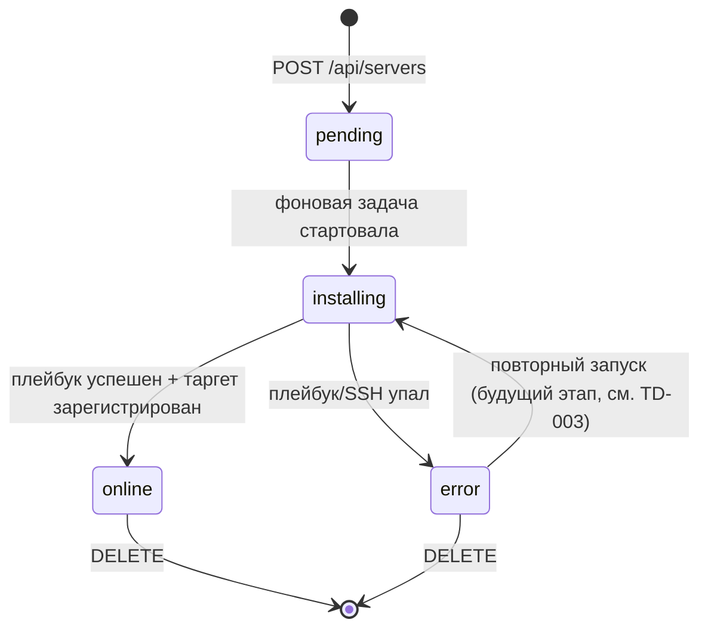
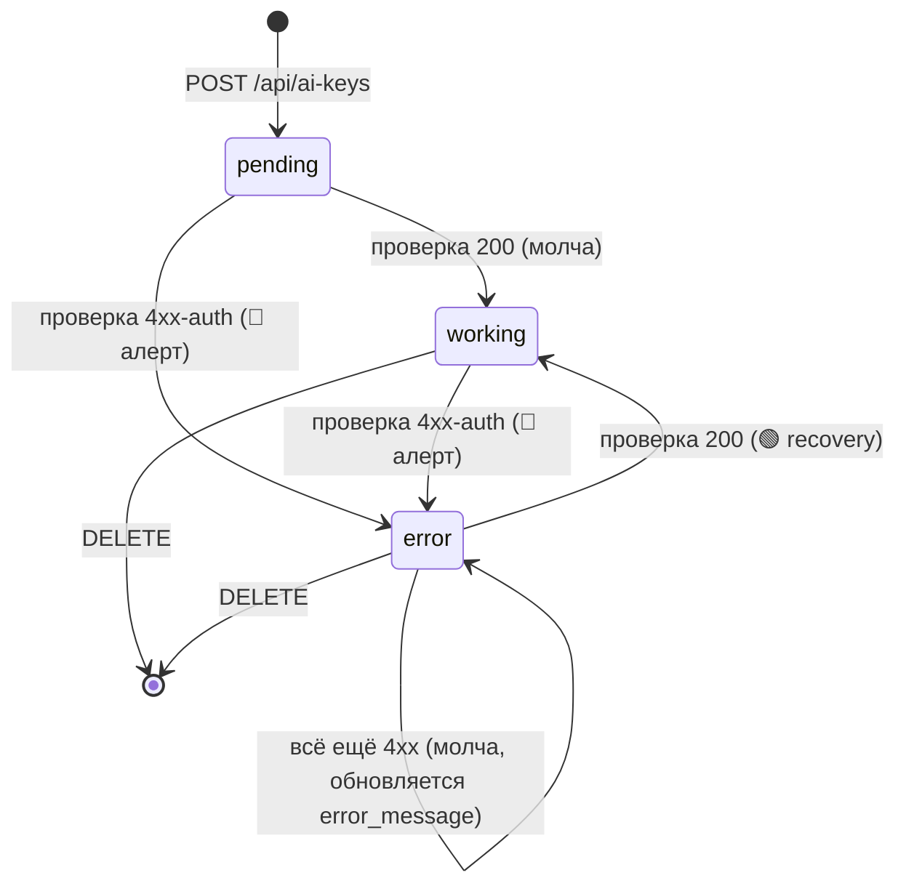
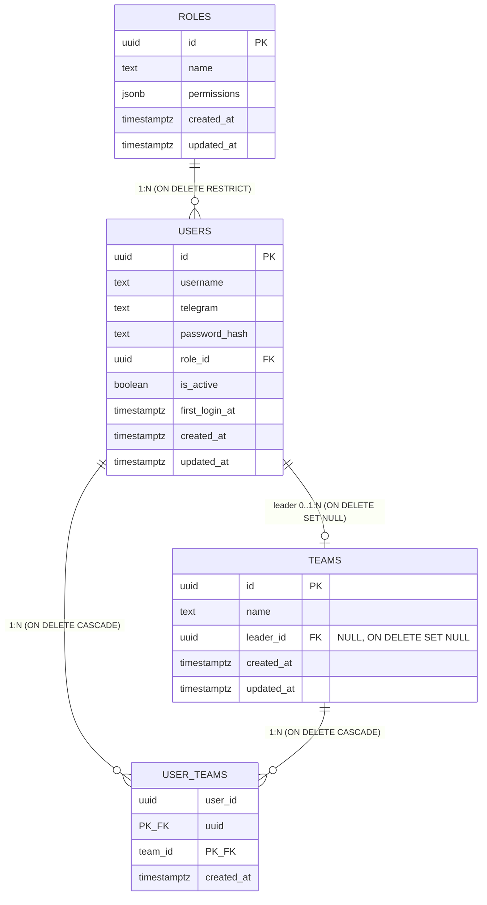

# 03 · Модель данных

## Принцип

В PostgreSQL хранится **реестр серверов + статус провижининга**, **реестр AI-ключей + статус проверки**, **реестр прокси + статус доступности** ([ADR-019](adr/ADR-019-proxies-availability-monitor.md)), **персистентное состояние Telegram-нотификатора per-server** ([ADR-014](adr/ADR-014-persist-notifier-state-alert-on-first-elevated.md)) и **append-only durable-лог отправленных серверных алертов** ([ADR-018](adr/ADR-018-notifier-windowed-offline-recovery-alert-log.md)). Метрики (CPU/RAM/SSD/uptime/up) НЕ дублируются в БД как временной ряд — источник истины Prometheus ([ADR-003](adr/ADR-003-prometheus-istochnik-metrik.md)); нотификатор хранит лишь **последнюю наблюдённую зону** (green/yellow/red) и флаг доступности для дедупа алертов между итерациями/рестартами, а не сами значения метрик. С Спринта 3 в БД хранится **реестр пользователей и ролей** для RBAC (`users`/`roles`, [ADR-021](adr/ADR-021-rbac-users-roles.md)). **Супер-админ (`.env`-учётка) в БД НЕ хранится** — он bootstrap вне БД ([ADR-008](adr/ADR-008-admin-iz-env.md) с амендментом [ADR-021](adr/ADR-021-rbac-users-roles.md)); в таблице `users` только дополнительные пользователи. Со Спринта A ([ADR-022](adr/ADR-022-teams-nav-categories.md)) добавлены **CRM-команды** (`teams` + M2M `user_teams`) и опциональный `users.email`.

## Требования к миграциям (ОБЩИЕ, нормативно — для ВСЕХ модулей)

Правила ниже действуют для **любой** новой Alembic-миграции (servers / ai-keys / proxies / backends / users / teams / sms / mail / …), а не только для той, при которой были сформулированы. Проверять при создании **каждой** миграции.

### 1. `revision` id — не длиннее 32 символов

Служебная таблица Alembic хранит идентификатор в колонке **`alembic_version.version_num` типа `VARCHAR(32)`**. Идентификатор длиннее 32 символов **физически неприменим**.

- **Цена промаха — НЕ косметическая:** `alembic upgrade head` выполняется в **entrypoint backend-контейнера** ([07-deployment.md](07-deployment.md#откат-миграций-бд)), поэтому слишком длинный id **роняет контейнер на деплое** с `StringDataRightTruncationError` — не в тестах, а в проде.
- **Имя ФАЙЛА миграции длиной не ограничено** и остаётся описательным. Расхождение «файл длиннее, чем `revision` id» — **допустимо и предпочтительно** укорачиванию читаемого имени файла.
- При укорочении — **причина фиксируется в docstring самой миграции**, чтобы следующий разработчик не «исправил» id обратно на имя файла.
- **Пример (реальный):** файл `0024_mail_accounts_number_app_name.py` (34 символа — id из такого имени НЕ проходит), `revision = "0024_mail_accounts_num_app_name"` (31 символ), `down_revision = "0023_mail_tags_drop_is_builtin"` (30 символов) — [подробности](#миграция-0024_mail_accounts_number_app_name-концепт-adr-047-3).

### 2. Рабочий `downgrade()` — обязателен

Каждая миграция обязана иметь **работающий** `downgrade()` (не `pass`) — нормативное требование политики отката, [07-deployment.md §Откат миграций БД](07-deployment.md#откат-миграций-бд).

### 3. Миграции НЕ импортируют код приложения

Данные (seed-наборы, правила разбора и т.п.) **вшиваются в тело миграции**. Импорт `app.*` из миграции запрещён: удаление/переименование модуля приложения сломало бы миграцию **задним числом** (прецедент — [ADR-047](adr/ADR-047-mail-fix-pack.md) §1). Как следствие, дублирование одного правила в миграции и в `app/domain/*` **допустимо и осознанно**; источник истины правила — docs/ADR, обе реализации обязаны ему соответствовать.

---

## ER-диаграмма

```mermaid
erDiagram
    SERVERS {
        uuid id PK
        text name
        inet ip
        text ssh_user
        bytea ssh_password_encrypted
        int exporter_port
        text provision_status
        text error_message
        int position
        timestamptz created_at
        timestamptz updated_at
    }
    AI_KEYS {
        uuid id PK
        text name
        text provider
        bytea key_encrypted
        text key_prefix
        text key_last4
        text check_status
        text error_message
        int position
        timestamptz last_checked_at
        timestamptz created_at
        timestamptz updated_at
    }
    PROXIES {
        uuid id PK
        text name
        text proxy_type
        text host
        int port
        text username
        bytea password_encrypted
        text check_status
        text error_message
        int position
        timestamptz last_checked_at
        timestamptz error_since
        boolean alert_sent
        timestamptz created_at
        timestamptz updated_at
    }
    BACKENDS {
        uuid id PK
        text code
        text name
        text domain
        uuid server_id FK "NULL, ON DELETE SET NULL"
        uuid ai_key_id FK "NULL, ON DELETE SET NULL"
        bytea api_key_encrypted "NULL (секрет, Fernet)"
        bytea admin_api_key_encrypted "NULL (секрет, Fernet)"
        text git "NULL (не секрет)"
        text note "NULL (не секрет)"
        text check_status
        text error_message
        int position
        timestamptz last_checked_at
        timestamptz error_since
        boolean alert_sent
        timestamptz created_at
        timestamptz updated_at
    }
    NOTIFIER_SERVER_STATE {
        uuid server_id PK_FK
        boolean online
        text zone_cpu
        text zone_ram
        text zone_ssd
        timestamptz updated_at
    }
    NOTIFIER_ALERT_LOG {
        bigint id PK
        uuid server_id FK "NULL, ON DELETE SET NULL"
        text kind
        text message
        boolean delivered
        timestamptz created_at
    }
    SERVERS ||--o| NOTIFIER_SERVER_STATE : "1:1 (ON DELETE CASCADE)"
    SERVERS ||--o{ NOTIFIER_ALERT_LOG : "1:N (ON DELETE SET NULL)"
    SERVERS ||--o{ BACKENDS : "0..1:N (server_id, ON DELETE SET NULL)"
    AI_KEYS ||--o{ BACKENDS : "0..1:N (ai_key_id, ON DELETE SET NULL)"
```

`servers`, `ai_keys`, `proxies` — независимые таблицы (метрики серверов во внешней системе; AI-ключи проверяются у внешних провайдеров; прокси проверяются прямым запросом через прокси). **`backends` со Спринта 4 ([ADR-040](adr/ADR-040-backend-relations-secrets-reverse-lookup.md)) имеет две ОПЦИОНАЛЬНЫЕ связи** — `server_id → servers.id` и `ai_key_id → ai_keys.id` (обе `NULL`, `ON DELETE SET NULL`: удаление сервера/ключа лишь обнуляет связь, бэк не удаляется). Обратный резолв «бэки сервера»/«бэки ключа» — по индексам `ix_backends_server_id`/`ix_backends_ai_key_id` ([04-api.md](04-api.md#backends): `GET /api/servers/{id}/backends`, `GET /api/ai-keys/{id}/backends`). Проверка доступности бэка по-прежнему — `GET {domain}health` (домен = канон `https://{host}/`, [ADR-042](adr/ADR-042-backend-domain-canonical-https.md)). `backends` с нотификатором не связан (его состояние — в `backends.check_status`, отдельный монитор — [ADR-020](adr/ADR-020-backends-healthcheck-monitor.md)). `proxies` с нотификатором не связан (его состояние — в `proxies.check_status`, отдельный монитор — [ADR-019](adr/ADR-019-proxies-availability-monitor.md)). `notifier_server_state` — **1:1-расширение** `servers` (per-server состояние нотификатора), связано FK `server_id → servers.id` с `ON DELETE CASCADE`; `ai_keys` с нотификатором не связан (его состояние — в `ai_keys.check_status`). `notifier_alert_log` — **1:N append-only-лог** отправленных серверных алертов ([ADR-018](adr/ADR-018-notifier-windowed-offline-recovery-alert-log.md)), связан FK `server_id → servers.id` с **`ON DELETE SET NULL`** (лог переживает удаление сервера — в отличие от `notifier_server_state`).

## Таблица `servers`

| Поле | Тип | Ограничения | Описание |
|------|-----|-------------|----------|
| `id` | `uuid` | PK, `DEFAULT gen_random_uuid()` | Идентификатор сервера. Используется в `targets/<id>.json` и как Prometheus label. |
| `name` | `text` | `NOT NULL`, 1–64 симв. | Отображаемое имя (например, «Server 01»). |
| `ip` | `inet` | `NOT NULL`, `UNIQUE` | IP-адрес целевого сервера. |
| `ssh_user` | `text` | `NOT NULL`, 1–64 симв. | SSH-логин для Ansible. |
| `ssh_password_encrypted` | `bytea` | `NOT NULL` | Fernet-ciphertext SSH-пароля. Plaintext никогда не хранится и не логируется. |
| `exporter_port` | `integer` | `NOT NULL`, `DEFAULT 9100`, 1–65535 | Порт node_exporter. |
| `provision_status` | `text` | `NOT NULL`, `DEFAULT 'pending'`, CHECK | Статус провижининга (см. ниже). |
| `error_message` | `text` | `NULL` | Текст ошибки провижининга (без секретов). |
| `position` | `integer` | `NOT NULL`, `DEFAULT 0` | Порядок карточки в списке (drag-and-drop). См. [«Колонка `position`»](#колонка-position-порядок-карточек). |
| `created_at` | `timestamptz` | `NOT NULL`, `DEFAULT now()` | Дата создания. |
| `updated_at` | `timestamptz` | `NOT NULL`, `DEFAULT now()` | Дата последнего изменения (обновляется триггером/приложением). |

### Перечисление `provision_status`

Конечный автомат статуса:



| Значение | Смысл | UI |
|----------|-------|-----|
| `pending` | Запись создана, задача в очереди | Карточка-скелет «В очереди» |
| `installing` | Ansible выполняется | Прогресс «Установка агента…» |
| `online` | Агент работает, таргет зарегистрирован | Полноценная карточка с метриками |
| `error` | Сбой провижининга | Карточка с ошибкой + кнопка «Удалить» |

> `online` означает «провижининг завершён». Текущая доступность (up/down) определяется отдельно метрикой `up` из Prometheus и отображается статус-точкой (см. [04-api.md](04-api.md) поле `online`).

## DDL (концепт миграции)

> Реализуется через Alembic. Точная миграция — задача backend, ниже целевой результат.
>
> **Требование (нормативно):** каждая Alembic-миграция ОБЯЗАНА иметь рабочую функцию `downgrade()`, протестированную на откат на одну ревизию. Это основа процедуры отката релиза — см. [07-deployment.md «Откат миграций БД»](07-deployment.md#откат-миграций-бд).

```sql
CREATE EXTENSION IF NOT EXISTS pgcrypto;  -- для gen_random_uuid()

CREATE TABLE servers (
    id                      uuid PRIMARY KEY DEFAULT gen_random_uuid(),
    name                    text NOT NULL CHECK (char_length(name) BETWEEN 1 AND 64),
    ip                      inet NOT NULL UNIQUE,
    ssh_user                text NOT NULL CHECK (char_length(ssh_user) BETWEEN 1 AND 64),
    ssh_password_encrypted  bytea NOT NULL,
    exporter_port           integer NOT NULL DEFAULT 9100
                                CHECK (exporter_port BETWEEN 1 AND 65535),
    provision_status        text NOT NULL DEFAULT 'pending'
                                CHECK (provision_status IN ('pending','installing','online','error')),
    error_message           text,
    position                integer NOT NULL DEFAULT 0,
    created_at              timestamptz NOT NULL DEFAULT now(),
    updated_at              timestamptz NOT NULL DEFAULT now()
);

CREATE INDEX ix_servers_provision_status ON servers (provision_status);
CREATE INDEX ix_servers_position ON servers (position);
```

### Индексы и обоснование
- `UNIQUE(ip)` — нельзя добавить один и тот же сервер дважды; даёт детерминированную ошибку конфликта (409).
- `ix_servers_provision_status` — выборка серверов в работе/ошибке.
- `ix_servers_position` — стабильная сортировка списка `GET /api/servers` по `position ASC` (порядок drag-and-drop), тай-брейк `created_at DESC`, `id` (см. [04-api.md](04-api.md#get-apiservers), [«Колонка `position`»](#колонка-position-порядок-карточек)). Индекс `ix_servers_created_at` больше не нужен как основной ключ сортировки (тай-брейк по `created_at` на ≤50 строках не требует отдельного индекса).

## Маппинг на Prometheus

Связь записи БД с метриками — по label `instance`/`id`:
- Backend пишет `targets/<id>.json` с `targets: ["<ip>:<exporter_port>"]` и label `server_id="<id>"`, `name="<name>"`.
- PromQL-запросы фильтруются по `instance="<ip>:<exporter_port>"` (или по `server_id`). Точные запросы — [modules/monitoring/02-promql.md](modules/monitoring/02-promql.md).

## Шифрование `ssh_password_encrypted`

- Алгоритм: **Fernet** (`cryptography`), симметричный AES-128-CBC + HMAC.
- Ключ: `FERNET_KEY` из `.env` (base64, 32 байта). Никогда не в коде/БД/логах.
- Шифрование при `POST /api/servers`, расшифровка только в памяти провижининг-сервиса непосредственно перед запуском Ansible.
- В ответах API пароль (ни в каком виде) НЕ возвращается. Детали — [05-security.md](05-security.md).

## Политика удаления

Этап 1 — **hard delete** (`DELETE FROM servers WHERE id = ...`) + удаление `targets/<id>.json`. Soft-delete и аудит-лог — будущий этап ([TD-001](100-known-tech-debt.md)).

## Конкурентность

- Фоновая задача провижининга обновляет `provision_status` атомарными `UPDATE`.
- Один воркер на Этапе 1 (NFR-1); гонок по одной записи не ожидается. Масштабирование на несколько воркеров — [TD-004](100-known-tech-debt.md).

---

## Таблица `ai_keys`

Реестр API-ключей AI-провайдеров (OpenAI/Anthropic) с автоматической проверкой валидности. Модуль — [modules/ai-keys](modules/ai-keys/README.md), API — [04-api.md](04-api.md#ai-keys), решение — [ADR-010](adr/ADR-010-ai-key-monitor-vnutri-backend.md).

| Поле | Тип | Ограничения | Описание |
|------|-----|-------------|----------|
| `id` | `uuid` | PK, `DEFAULT gen_random_uuid()` | Идентификатор ключа. |
| `name` | `text` | `NOT NULL`, 1–64 симв. | Отображаемое имя ключа. |
| `provider` | `text` | `NOT NULL`, CHECK | Провайдер: `openai` \| `anthropic`. |
| `key_encrypted` | `bytea` | `NOT NULL` | Fernet-ciphertext полного ключа. Plaintext никогда не хранится и не логируется. |
| `key_prefix` | `text` | `NULL` | Первые 4 символа ключа (plaintext, для маски). `NULL` для ключа короче 8 символов. |
| `key_last4` | `text` | `NULL` | Последние 4 символа ключа (plaintext, для маски и Telegram). `NULL` для ключа короче 8 символов. |
| `check_status` | `text` | `NOT NULL`, `DEFAULT 'pending'`, CHECK | Статус проверки: `pending` \| `working` \| `error`. Источник состояния переходов (переживает рестарт). |
| `error_message` | `text` | `NULL` | Причина при `error` (рус.): «Ключ недействителен»/«Доступ запрещён»/«Недостаточно средств»/«Ошибка провайдера». |
| `position` | `integer` | `NOT NULL`, `DEFAULT 0` | Порядок карточки **внутри провайдер-группы** (drag-and-drop). См. [«Колонка `position`»](#колонка-position-порядок-карточек). |
| `last_checked_at` | `timestamptz` | `NULL` | Время последней **конклюзивной** проверки (`working`/`error`), обновляется монитором. Транзиентный `unknown` (сеть/таймаут/`5xx`) строку не трогает, поэтому конклюзивной проверкой не считается. |
| `created_at` | `timestamptz` | `NOT NULL`, `DEFAULT now()` | Дата создания. |
| `updated_at` | `timestamptz` | `NOT NULL`, `DEFAULT now()` | Дата последнего изменения. |

> `key_prefix`/`key_last4` — осознанное раскрытие 8 plaintext-символов ради маски в UI (`key_masked`); сам секрет из них не восстанавливается. Полный ключ — только в `key_encrypted` (Fernet). Правило маски и кейс `<8` символов — [modules/ai-keys](modules/ai-keys/README.md#правило-маски-key_masked).

### Перечисление `check_status`

Конечный автомат статуса (состояние в БД, переживает рестарт — [ADR-010](adr/ADR-010-ai-key-monitor-vnutri-backend.md)):



> Транзиентная недоступность провайдера (сеть/таймаут/5xx) → исход `unknown`: `check_status` **НЕ меняется**, алерт не шлётся (см. [modules/ai-keys](modules/ai-keys/README.md#проверка-ключа-у-провайдера-нормативно)).

### DDL (концепт миграции)

> Реализуется через Alembic. **Требование (нормативно):** миграция ОБЯЗАНА иметь рабочий `downgrade()` (`DROP TABLE ai_keys` + сопутствующие индексы), протестированный на откат — см. [07-deployment.md](07-deployment.md#откат-миграций-бд).

```sql
CREATE TABLE ai_keys (
    id               uuid PRIMARY KEY DEFAULT gen_random_uuid(),
    name             text NOT NULL CHECK (char_length(name) BETWEEN 1 AND 64),
    provider         text NOT NULL CHECK (provider IN ('openai','anthropic')),
    key_encrypted    bytea NOT NULL,
    key_prefix       text,
    key_last4        text,
    check_status     text NOT NULL DEFAULT 'pending'
                         CHECK (check_status IN ('pending','working','error')),
    error_message    text,
    position         integer NOT NULL DEFAULT 0,
    last_checked_at  timestamptz,
    created_at       timestamptz NOT NULL DEFAULT now(),
    updated_at       timestamptz NOT NULL DEFAULT now()
);

CREATE INDEX ix_ai_keys_provider_position ON ai_keys (provider, position);
```

> Индекс `(provider, position)` — списки AI-ключей отдаются `ORDER BY position ASC, created_at DESC, id`, а перестановка идёт **внутри провайдер-группы** (`WHERE provider = :p`). Прежний `ix_ai_keys_created_at` заменён: `created_at` остаётся лишь тай-брейком.

### Шифрование `key_encrypted`

- Алгоритм: **Fernet** (`cryptography`), тот же примитив и тот же ключ `FERNET_KEY`, что и для SSH-паролей ([ADR-007](adr/ADR-007-shifrovanie-fernet.md), [ADR-010](adr/ADR-010-ai-key-monitor-vnutri-backend.md)). Переиспользуются `encrypt_password`/`decrypt_password` (`app/infra/crypto.py`).
- Шифрование при `POST /api/ai-keys`; расшифровка только в памяти монитора/проверки перед HTTP-запросом к провайдеру.
- Полный ключ (ни в каком виде) НЕ возвращается в API и не логируется. Детали — [05-security.md](05-security.md#защита-ai-ключей).

### Политика удаления

Этап 1 — **hard delete** (`DELETE FROM ai_keys WHERE id = ...`). Soft-delete/аудит — будущий этап ([TD-001](100-known-tech-debt.md)).

---

## Таблица `proxies`

Реестр прокси (HTTP/HTTPS/SOCKS5) с автоматической проверкой доступности. Модуль — [modules/proxies](modules/proxies/README.md), API — [04-api.md](04-api.md#proxies), решение — [ADR-019](adr/ADR-019-proxies-availability-monitor.md). Устроена по образцу `ai_keys` (модель со статусом + фоновый монитор), но: секрет (`password`) **опционален**; список **единый** (без группировки); в API вместо фрагментов — флаг `has_password`.

| Поле | Тип | Ограничения | Описание |
|------|-----|-------------|----------|
| `id` | `uuid` | PK, `DEFAULT gen_random_uuid()` | Идентификатор прокси. |
| `name` | `text` | `NOT NULL`, 1–64 симв. | Отображаемое имя прокси. |
| `proxy_type` | `text` | `NOT NULL`, CHECK | Тип/схема: `http` \| `https` \| `socks5`. |
| `host` | `text` | `NOT NULL`, 1–255 симв. | Хост прокси (IP или FQDN). |
| `port` | `integer` | `NOT NULL`, CHECK 1–65535 | Порт прокси. |
| `username` | `text` | `NULL` | Логин прокси (опц.). **Не секрет** — возвращается в API как есть. `NULL` — без авторизации. |
| `password_encrypted` | `bytea` | `NULL` | Fernet-ciphertext пароля прокси (опц.). `NULL` — пароль не задан. Plaintext никогда не хранится и не логируется. |
| `check_status` | `text` | `NOT NULL`, `DEFAULT 'pending'`, CHECK | Статус проверки: `pending` \| `working` \| `error`. Источник состояния переходов (переживает рестарт). **Переходит в `error` немедленно** при первом провале (UI показывает реальность сразу); отправка 🔴-алерта — отложенно (grace-порог, см. `error_since`/`alert_sent`). |
| `error_message` | `text` | `NULL` | Причина при `error` (рус.): «Таймаут подключения»/«Прокси недоступен»/«Ошибка прокси». |
| `position` | `integer` | `NOT NULL`, `DEFAULT 0` | Порядок карточки в **едином списке** (drag-and-drop, как серверы). См. [«Колонка `position`»](#колонка-position-порядок-карточек). |
| `last_checked_at` | `timestamptz` | `NULL` | Время последней конклюзивной проверки (`working`/`error`), обновляется монитором. |
| `error_since` | `timestamptz` | `NULL` | **Начало текущего непрерывного эпизода недоступности** ([ADR-027](adr/ADR-027-proxies-alert-grace.md); миграция `0014`). Ставится при переходе `pending\|working → error`; сбрасывается в `NULL` при `working`. База grace-порога `PROXY_ALERT_AFTER_SEC` (30 мин) перед 🔴. |
| `alert_sent` | `boolean` | `NOT NULL`, `DEFAULT false` | **Отправлен ли 🔴 для текущего эпизода** недоступности ([ADR-027](adr/ADR-027-proxies-alert-grace.md); миграция `0014`). `true` после отправки; сбрасывается в `false` при `working`. Гейтит recovery-🟢 (шлётся только если `alert_sent` был `true`) и защищает от повторного 🔴. |
| `created_at` | `timestamptz` | `NOT NULL`, `DEFAULT now()` | Дата создания. |
| `updated_at` | `timestamptz` | `NOT NULL`, `DEFAULT now()` | Дата последнего изменения. |

> **Grace-порог алерта (нормативно, [ADR-027](adr/ADR-027-proxies-alert-grace.md)).** По образцу бэков ([ADR-024](adr/ADR-024-monitor-hard-deadline-backend-alert-grace.md)): `check_status='error'` выставляется немедленно (реальность в UI), но Telegram-🔴 шлётся только если прокси недоступен непрерывно **≥ `PROXY_ALERT_AFTER_SEC` (30 мин)**; монитор ведёт `error_since` (начало эпизода) и `alert_sent` (был ли 🔴). Устраняет ложные алерты прокси при кратковременных флапах. Переживает рестарт backend (персистентно). Immediate-модель прокси из [ADR-024](adr/ADR-024-monitor-hard-deadline-backend-alert-grace.md) снята — прокси и бэки унифицированы. Чистая функция перехода — [modules/proxies](modules/proxies/README.md#переходы-статуса-и-алерты-нормативно).
>
> Пароль хранится **только** в `password_encrypted` (Fernet). В API он не раскрывается ни фрагментами, ни маской — только производный флаг `has_password` (`= password_encrypted IS NOT NULL`). `username` — plaintext (не секрет). Детали — [05-security.md](05-security.md#защита-паролей-прокси), [modules/proxies](modules/proxies/README.md#безопасность-пароля-нормативно).

### Перечисление `check_status`

Конечный автомат статуса (состояние в БД, переживает рестарт — [ADR-019](adr/ADR-019-proxies-availability-monitor.md)):

```mermaid
stateDiagram-v2
    [*] --> pending: POST /api/proxies
    pending --> working: проверка 2xx/3xx (молча)
    pending --> error: проверка провалилась (старт grace; 🔴 позже)
    working --> error: проверка провалилась (старт grace; 🔴 позже)
    error --> working: проверка 2xx/3xx (🟢 recovery, если 🔴 был)
    error --> error: недоступен; 🔴 при непрерывных ≥30 мин (grace)
    working --> [*]: DELETE
    error --> [*]: DELETE
```



> В отличие от `ai_keys`, у прокси **нет** исхода `unknown`: недоступность прокси и есть отслеживаемое событие. Транзиентность гасится ретраями внутри одной проверки (см. [modules/proxies](modules/proxies/README.md#проверка-доступности-прокси-нормативно)).
>
> **Grace-порог алерта ([ADR-027](adr/ADR-027-proxies-alert-grace.md)).** `check_status→error` — немедленно (реальность в UI), но 🔴 откладывается на непрерывные ≥ `PROXY_ALERT_AFTER_SEC` (30 мин), recovery-🟢 — только если 🔴 был отправлен; состояние эпизода — `error_since`/`alert_sent` (как у бэков). Матрица идентична бэковой — [modules/backends](modules/backends/README.md#переходы-статуса-и-алерты-нормативно).

### DDL (концепт миграции)

> Реализуется через Alembic. **Требование (нормативно):** миграция ОБЯЗАНА иметь рабочий `downgrade()` (`DROP TABLE proxies` + индекс), протестированный на откат — см. [07-deployment.md](07-deployment.md#откат-миграций-бд).

```sql
CREATE TABLE proxies (
    id                  uuid PRIMARY KEY DEFAULT gen_random_uuid(),
    name                text NOT NULL CHECK (char_length(name) BETWEEN 1 AND 64),
    proxy_type          text NOT NULL CHECK (proxy_type IN ('http','https','socks5')),
    host                text NOT NULL CHECK (char_length(host) BETWEEN 1 AND 255),
    port                integer NOT NULL CHECK (port BETWEEN 1 AND 65535),
    username            text,
    password_encrypted  bytea,
    check_status        text NOT NULL DEFAULT 'pending'
                            CHECK (check_status IN ('pending','working','error')),
    error_message       text,
    position            integer NOT NULL DEFAULT 0,
    last_checked_at     timestamptz,
    created_at          timestamptz NOT NULL DEFAULT now(),
    updated_at          timestamptz NOT NULL DEFAULT now()
);

CREATE INDEX ix_proxies_position ON proxies (position);
```

> Индекс `ix_proxies_position` — список прокси отдаётся `ORDER BY position ASC, created_at DESC, id` (единый список, как серверы). Отдельный индекс по `created_at` не нужен (тай-брейк на ≤ десятков строк).
>
> **Амендмент [ADR-027](adr/ADR-027-proxies-alert-grace.md).** DDL выше — базовая миграция `0006_create_proxies` (историческая). Поля grace-порога алерта **`error_since timestamptz NULL`** и **`alert_sent boolean NOT NULL DEFAULT false`** добавляются миграцией **`0014_proxies_alert_grace`** (см. [«Миграция `0014_proxies_alert_grace`»](#миграция-0014_proxies_alert_grace-концепт)). Таблица полей отражает состояние **после** `0014`.

### Шифрование `password_encrypted`

- Алгоритм: **Fernet** (`cryptography`), тот же примитив и ключ `FERNET_KEY`, что для SSH-паролей/AI-ключей ([ADR-007](adr/ADR-007-shifrovanie-fernet.md), [ADR-019](adr/ADR-019-proxies-availability-monitor.md)). Переиспользуются `encrypt_secret`/`decrypt_secret` (`app/infra/crypto.py`).
- Шифрование при `POST /api/proxies` (только если пароль задан); расшифровка только в памяти монитора перед сборкой URL и запросом через прокси.
- Пароль (в любом виде) НЕ возвращается в API и не логируется. `username` — не секрет. Детали — [05-security.md](05-security.md#защита-паролей-прокси).

### Политика удаления

Этап 1 — **hard delete** (`DELETE FROM proxies WHERE id = ...`). Soft-delete/аудит — будущий этап ([TD-001](100-known-tech-debt.md)).

## Миграция `0006_create_proxies` (концепт)

> Реализуется через Alembic. `down_revision = "0005_create_notifier_alert_log"` (текущая голова цепочки). **Требование (нормативно):** рабочий `downgrade()`, протестированный на откат на одну ревизию — см. [07-deployment.md](07-deployment.md#откат-миграций-бд).

**`upgrade()`** — создать таблицу `proxies` (DDL выше) + индекс `ix_proxies_position`. Backfill не выполняется (таблица стартует пустой).

**`downgrade()`** — `DROP TABLE proxies` (индекс снимается вместе с таблицей).

---

## Таблица `backends`

Реестр бэков (backend-сервисов) с автоматической проверкой доступности по HTTP-эндпоинту здоровья. Модуль — [modules/backends](modules/backends/README.md), API — [04-api.md](04-api.md#backends), решение — [ADR-020](adr/ADR-020-backends-healthcheck-monitor.md). Устроена по образцу `proxies` (модель со статусом + фоновый монитор), но **проще**: секрета нет (нет Fernet); идентификатор `code` **уникален**; проверка — прямой `GET https://{domain}/health` (без прокси-туннеля); список **единый** (без группировки).

| Поле | Тип | Ограничения | Описание |
|------|-----|-------------|----------|
| `id` | `uuid` | PK, `DEFAULT gen_random_uuid()` | Идентификатор бэка. |
| `code` | `text` | `NOT NULL`, `UNIQUE`, 1–64 симв. | Бизнес-код сервиса (уникален). Дубликат → `409 backend_code_taken`. Не секрет — возвращается в API. |
| `name` | `text` | `NOT NULL`, 1–64 симв. | Отображаемое имя бэка. |
| `domain` | `text` | `NOT NULL`, 1–255 симв., **канон `https://<host>/`** | Домен бэка в **каноничной форме `https://<host>/`** (схема `https://` + host[:port] + завершающий `/`; путь/query не хранятся), [ADR-042](adr/ADR-042-backend-domain-canonical-https.md). URL проверки = `{domain}health` (= `https://<host>/health`; **дописывание `health`**, а не склейка `https://{domain}/health`). Не секрет. |
| `server_id` | `uuid` | `NULL`, FK → `servers(id)` `ON DELETE SET NULL` | **Сервер CRM, на котором лежит бэк** ([ADR-040](adr/ADR-040-backend-relations-secrets-reverse-lookup.md); миграция `0019`). `NULL` — не задан. Удаление сервера обнуляет связь (бэк не удаляется). |
| `ai_key_id` | `uuid` | `NULL`, FK → `ai_keys(id)` `ON DELETE SET NULL` | **ИИ-ключ CRM, используемый бэком** ([ADR-040](adr/ADR-040-backend-relations-secrets-reverse-lookup.md); миграция `0019`). `NULL` — не задан. Удаление ключа обнуляет связь. |
| `api_key_encrypted` | `bytea` | `NULL` | **API KEY бэка — секрет** ([ADR-040](adr/ADR-040-backend-relations-secrets-reverse-lookup.md); миграция `0019`). Fernet-ciphertext (`FERNET_KEY`); `NULL` — не задан. В API — только флаг `has_api_key`; plaintext не хранится/не логируется/не в обычных ответах (только on-demand reveal под `backends:edit`, [ADR-035](adr/ADR-035-detail-view-secret-reveal.md)). |
| `admin_api_key_encrypted` | `bytea` | `NULL` | **ADMIN API KEY бэка — секрет** ([ADR-040](adr/ADR-040-backend-relations-secrets-reverse-lookup.md); миграция `0019`). Fernet-ciphertext; `NULL` — не задан. В API — только флаг `has_admin_api_key`; reveal под `backends:edit`. |
| `git` | `text` | `NULL` | **Ссылка на репозиторий (URL)** ([ADR-040](adr/ADR-040-backend-relations-secrets-reverse-lookup.md); миграция `0019`). **НЕ секрет** — plaintext, отдаётся в обычных ответах. `NULL` — не задан. |
| `note` | `text` | `NULL` | **Свободные примечания к бэку** ([ADR-040](adr/ADR-040-backend-relations-secrets-reverse-lookup.md); миграция `0019`). **НЕ секрет** — plaintext, отдаётся в обычных ответах. `NULL` — не задан. |
| `check_status` | `text` | `NOT NULL`, `DEFAULT 'pending'`, CHECK | Статус проверки: `pending` \| `working` \| `error`. Источник состояния переходов (переживает рестарт). **Переходит в `error` немедленно** при первом провале (UI показывает реальность сразу); отправка 🔴-алерта — отложенно (grace-порог, см. `error_since`/`alert_sent`). |
| `error_message` | `text` | `NULL` | Причина при `error` (рус.): «Таймаут подключения»/«Бэк недоступен»/«Ошибка бэка (HTTP N)»/«Ошибка бэка». |
| `position` | `integer` | `NOT NULL`, `DEFAULT 0` | Порядок карточки в **едином списке** (drag-and-drop, как серверы/прокси). См. [«Колонка `position`»](#колонка-position-порядок-карточек). |
| `last_checked_at` | `timestamptz` | `NULL` | Время последней конклюзивной проверки (`working`/`error`), обновляется монитором. |
| `error_since` | `timestamptz` | `NULL` | **Начало текущего непрерывного эпизода недоступности** ([ADR-024](adr/ADR-024-monitor-hard-deadline-backend-alert-grace.md); миграция `0013`). Ставится при переходе `pending\|working → error`; сбрасывается в `NULL` при `working`. База grace-порога `BACKEND_ALERT_AFTER_SEC` (30 мин) перед 🔴. |
| `alert_sent` | `boolean` | `NOT NULL`, `DEFAULT false` | **Отправлен ли 🔴 для текущего эпизода** недоступности ([ADR-024](adr/ADR-024-monitor-hard-deadline-backend-alert-grace.md); миграция `0013`). `true` после отправки; сбрасывается в `false` при `working`. Гейтит recovery-🟢 (шлётся только если `alert_sent` был `true`) и защищает от повторного 🔴. |
| `created_at` | `timestamptz` | `NOT NULL`, `DEFAULT now()` | Дата создания. |
| `updated_at` | `timestamptz` | `NOT NULL`, `DEFAULT now()` | Дата последнего изменения. |

> **Grace-порог алерта (нормативно, [ADR-024](adr/ADR-024-monitor-hard-deadline-backend-alert-grace.md)).** `check_status='error'` выставляется немедленно (реальность в UI), но Telegram-🔴 шлётся только если бэк недоступен непрерывно **≥ `BACKEND_ALERT_AFTER_SEC` (30 мин)**: монитор ведёт `error_since` (начало эпизода) и `alert_sent` (был ли 🔴). Устраняет ложные алерты при рестартах бэка (1–2 мин). Переживает рестарт backend (персистентно). Чистая функция перехода — [modules/backends](modules/backends/README.md#переходы-статуса-и-алерты-нормативно).
>
> Секрета у бэка нет — все поля публичны, возвращаются в API как есть. `code` уникален (`UNIQUE`), даёт детерминированный `409` при дубле. `domain` хранится **нормализованным** (без схемы `http(s)://`, без завершающего `/` и пути) — нормализация на входе (`POST`/`PATCH`), детали — [modules/backends](modules/backends/README.md#нормализация-домена-и-проверка-нормативно).

### Перечисление `check_status`

Конечный автомат статуса (состояние в БД, переживает рестарт — [ADR-020](adr/ADR-020-backends-healthcheck-monitor.md)):

```mermaid
stateDiagram-v2
    [*] --> pending: POST /api/backends
    pending --> working: GET /health → 2xx (молча)
    pending --> error: проверка провалилась (старт grace; 🔴 позже)
    working --> error: проверка провалилась (старт grace; 🔴 позже)
    error --> working: GET /health → 2xx (🟢 recovery, если 🔴 был)
    error --> error: недоступен; 🔴 при непрерывных ≥30 мин (grace)
    pending --> [*]: DELETE
    working --> [*]: DELETE
    error --> [*]: DELETE
```



> Как у `proxies`, у бэков **нет** исхода `unknown`: недоступность бэка и есть отслеживаемое событие. Транзиентность гасится ретраями внутри одной проверки (см. [modules/backends](modules/backends/README.md#нормализация-домена-и-проверка-нормативно)).

### DDL (концепт миграции)

> Реализуется через Alembic. **Требование (нормативно):** миграция ОБЯЗАНА иметь рабочий `downgrade()` (`DROP TABLE backends` + индексы), протестированный на откат — см. [07-deployment.md](07-deployment.md#откат-миграций-бд).

```sql
CREATE TABLE backends (
    id                  uuid PRIMARY KEY DEFAULT gen_random_uuid(),
    code                text NOT NULL CHECK (char_length(code) BETWEEN 1 AND 64),
    name                text NOT NULL CHECK (char_length(name) BETWEEN 1 AND 64),
    domain              text NOT NULL
                            CHECK (char_length(domain) BETWEEN 1 AND 255 AND domain ~ '^[^\s/]+$'),
    check_status        text NOT NULL DEFAULT 'pending'
                            CHECK (check_status IN ('pending','working','error')),
    error_message       text,
    position            integer NOT NULL DEFAULT 0,
    last_checked_at     timestamptz,
    created_at          timestamptz NOT NULL DEFAULT now(),
    updated_at          timestamptz NOT NULL DEFAULT now()
);

CREATE UNIQUE INDEX uq_backends_code ON backends (code);
CREATE INDEX ix_backends_position ON backends (position);
```

> **Амендменты (нормативно).** DDL выше — базовая миграция `0007` (историческая). Последующие миграции:
> - **`0013_backends_alert_grace` ([ADR-024](adr/ADR-024-monitor-hard-deadline-backend-alert-grace.md))** — поля grace-порога `error_since timestamptz NULL` и `alert_sent boolean NOT NULL DEFAULT false`.
> - **`0019_backends_relations_secrets` ([ADR-040](adr/ADR-040-backend-relations-secrets-reverse-lookup.md))** — `server_id uuid NULL REFERENCES servers(id) ON DELETE SET NULL`, `ai_key_id uuid NULL REFERENCES ai_keys(id) ON DELETE SET NULL`, `api_key_encrypted bytea NULL`, `admin_api_key_encrypted bytea NULL`, `git text NULL` (не секрет), `note text NULL` (не секрет) + индексы `ix_backends_server_id`, `ix_backends_ai_key_id`.
> - **`0020_backends_domain_canon` ([ADR-042](adr/ADR-042-backend-domain-canonical-https.md))** — CHECK `ck_backends_domain` перезаписан с `'^[^\s/]+$'` (голый host) на **`'^https://[^\s/]+/$'`** (канон `https://<host>/`); backfill существующих голых доменов `UPDATE ... SET domain = 'https://' || lower(domain) || '/'` (в проде 0 бэков → no-op).
>
> Таблица полей выше отражает состояние **после `0020`**.

### Индексы и обоснование
- `uq_backends_code` (UNIQUE) — нельзя добавить бэк с уже занятым `code`; даёт детерминированную ошибку конфликта (`409 backend_code_taken`).
- `ix_backends_position` — стабильная сортировка списка `GET /api/backends` по `position ASC` (порядок drag-and-drop), тай-брейк `created_at DESC`, `id`. Отдельный индекс по `created_at` не нужен (тай-брейк на ≤ десятков строк).
- `ix_backends_server_id` / `ix_backends_ai_key_id` ([ADR-040](adr/ADR-040-backend-relations-secrets-reverse-lookup.md), миграция `0019`) — reverse-lookup «бэки сервера»/«бэки ключа» (`GET /api/servers/{id}/backends`, `GET /api/ai-keys/{id}/backends`) и обслуживание `ON DELETE SET NULL`.
- CHECK домена **`domain ~ '^https://[^\s/]+/$'`** (после `0020`, [ADR-042](adr/ADR-042-backend-domain-canonical-https.md)) — «свободный» инвариант каноничной формы: схема `https://` + host без пробелов/`/` + завершающий `/`. Полная валидация формата хоста — на уровне приложения (Pydantic, `422`). (База `0007` имела `'^[^\s/]+$'` — голый host.)

### Шифрование `api_key_encrypted` / `admin_api_key_encrypted` ([ADR-040](adr/ADR-040-backend-relations-secrets-reverse-lookup.md))

- Алгоритм — **Fernet** (`cryptography`), тот же примитив и ключ `FERNET_KEY`, что для SSH-паролей/паролей прокси/AI-ключей ([ADR-007](adr/ADR-007-shifrovanie-fernet.md)). Переиспользуются `encrypt_secret`/`decrypt_secret` (`app/infra/crypto.py`).
- Шифрование при `POST`/`PATCH /api/backends` (только если ключ задан); в БД — только `*_encrypted bytea` (`NULL`, если ключ не задан).
- Секреты (в любом виде) **НЕ возвращаются** в обычных ответах API — вместо них производные флаги `has_api_key`/`has_admin_api_key`. Расшифровка — только в памяти обработчика reveal-эндпоинта (`GET /api/backends/{id}/api-key` · `/admin-api-key`) под `backends:edit` ([ADR-035](adr/ADR-035-detail-view-secret-reveal.md)). Детали — [05-security.md](05-security.md#защита-api-ключей-бэка-adr-040).

### Политика удаления

Этап 1 — **hard delete** (`DELETE FROM backends WHERE id = ...`). Soft-delete/аудит — будущий этап ([TD-001](100-known-tech-debt.md)).

## Миграция `0007_create_backends` (концепт)

> Реализуется через Alembic. `down_revision = "0006_create_proxies"` (текущая голова цепочки). **Требование (нормативно):** рабочий `downgrade()`, протестированный на откат на одну ревизию — см. [07-deployment.md](07-deployment.md#откат-миграций-бд).

**`upgrade()`** — создать таблицу `backends` (DDL выше) + уникальный индекс `uq_backends_code` + индекс `ix_backends_position`. Backfill не выполняется (таблица стартует пустой).

**`downgrade()`** — `DROP TABLE backends` (индексы снимаются вместе с таблицей).

## Миграция `0019_backends_relations_secrets` (концепт, [ADR-040](adr/ADR-040-backend-relations-secrets-reverse-lookup.md))

> Реализуется через Alembic. `down_revision = "0018_teams_mail_group_id"` (текущая голова цепочки). Рабочий `downgrade()`.

**`upgrade()`** — `ALTER TABLE backends ADD COLUMN`:
```sql
ALTER TABLE backends ADD COLUMN server_id uuid REFERENCES servers(id) ON DELETE SET NULL;
ALTER TABLE backends ADD COLUMN ai_key_id uuid REFERENCES ai_keys(id) ON DELETE SET NULL;
ALTER TABLE backends ADD COLUMN api_key_encrypted bytea;
ALTER TABLE backends ADD COLUMN admin_api_key_encrypted bytea;
ALTER TABLE backends ADD COLUMN git text;      -- не секрет
ALTER TABLE backends ADD COLUMN note text;     -- не секрет
CREATE INDEX ix_backends_server_id ON backends (server_id);
CREATE INDEX ix_backends_ai_key_id ON backends (ai_key_id);
```
Backfill не выполняется (новые колонки — `NULL`). Все существующие бэки остаются без связей/секретов/`git`/`note`.

**`downgrade()`** — `DROP INDEX ix_backends_ai_key_id, ix_backends_server_id;` затем `ALTER TABLE backends DROP COLUMN note, git, admin_api_key_encrypted, api_key_encrypted, ai_key_id, server_id` (FK снимаются с колонками).

## Миграция `0020_backends_domain_canon` (концепт, [ADR-042](adr/ADR-042-backend-domain-canonical-https.md))

> Реализуется через Alembic. `down_revision = "0019_backends_relations_secrets"`. Рабочий `downgrade()`.

**`upgrade()`** — переканонизация `backends.domain` к `https://<host>/`:
```sql
ALTER TABLE backends DROP CONSTRAINT ck_backends_domain;
UPDATE backends SET domain = 'https://' || lower(domain) || '/'
    WHERE domain !~ '^https://';                              -- голые домены → канон (в проде 0 строк)
ALTER TABLE backends ADD CONSTRAINT ck_backends_domain
    CHECK (char_length(domain) BETWEEN 1 AND 255 AND domain ~ '^https://[^\s/]+/$');
```

**`downgrade()`** — обратно к голому host:
```sql
ALTER TABLE backends DROP CONSTRAINT ck_backends_domain;
UPDATE backends SET domain = regexp_replace(regexp_replace(domain, '^https://', ''), '/$', '');
ALTER TABLE backends ADD CONSTRAINT ck_backends_domain
    CHECK (char_length(domain) BETWEEN 1 AND 255 AND domain ~ '^[^\s/]+$');
```

> **Влияние на данные:** в проде **0 бэков** → backfill фактически no-op; миграция всё равно переставляет CHECK (новый канон `https://<host>/` не прошёл бы старый инвариант). Правило применяется ко всем новым/редактируемым бэкам ([modules/backends](modules/backends/README.md#нормализация-домена-и-проверка-нормативно)).

---

## Таблицы `roles` и `users` (RBAC)

Реестр ролей и пользователей для многопользовательского режима с правами на все страницы. Модуль — [modules/auth](modules/auth/README.md), API — [04-api.md](04-api.md#users), [04-api.md](04-api.md#roles), решение — [ADR-021](adr/ADR-021-rbac-users-roles.md). **Супер-админ (`.env`) сюда НЕ пишется** — он bootstrap вне БД ([ADR-008](adr/ADR-008-admin-iz-env.md) + амендмент). В таблице `users` — только дополнительные пользователи.



`users.role_id → roles.id` с **`ON DELETE RESTRICT`**: роль, назначенную хотя бы одному пользователю, удалить нельзя (→ `409 role_in_use`, [04-api.md](04-api.md#delete-apirolesid)). `teams.leader_id → users.id` — **nullable, `ON DELETE SET NULL`** ([ADR-026](adr/ADR-026-teams-optional-leader-auto-transfer.md)): команда может быть **без лидера**; удаление пользователя-лидера не блокируется (лидерство авто-передаётся сервисом, остаток — `SET NULL`; код `409 user_is_team_leader` **упразднён**). `user_teams` — M2M между `users` и `teams`, обе стороны **`ON DELETE CASCADE`**, с колонкой `created_at` (дата добавления участника — для авто-передачи лидерства; см. [«Таблицы `teams` и `user_teams`»](#таблицы-teams-и-user_teams-crm-команды)).

### Таблица `roles`

| Поле | Тип | Ограничения | Описание |
|------|-----|-------------|----------|
| `id` | `uuid` | PK, `DEFAULT gen_random_uuid()` | Идентификатор роли. |
| `name` | `text` | `NOT NULL`, `UNIQUE`, 1–64 симв. | Имя роли (напр. «Оператор»). Уникально — дубликат → `409 role_name_taken`. `admin` — зарезервированное имя (гейт страницы «Пользователи», см. ниже). |
| `permissions` | `jsonb` | `NOT NULL`, `DEFAULT '{}'` | Права: `{ "<page>": ["<action>", ...], ... }`. Валидируются против каталога прав на уровне приложения ([ADR-021](adr/ADR-021-rbac-users-roles.md#1-каталог-прав-канон-на-сервере)). |
| `created_at` | `timestamptz` | `NOT NULL`, `DEFAULT now()` | Дата создания. |
| `updated_at` | `timestamptz` | `NOT NULL`, `DEFAULT now()` | Дата последнего изменения. |

> **`permissions` (jsonb) — формат и валидация.** Объект «страница → массив действий». Допустимые страницы/действия — только из каталога ([ADR-021](adr/ADR-021-rbac-users-roles.md#1-каталог-прав-канон-на-сервере)): `dashboard:[view]`; `servers`/`ai-keys`/`proxies`/`backends:[view,create,edit,delete]`; `mail:[view]`. Ключ `users` **запрещён** (страница вне матрицы). Валидация — на уровне схемы/сервиса (`app/domain/permissions.py::CATALOG`), не в БД: неизвестная страница/действие, дубликат → `422 unprocessable`. DB хранит любой валидный jsonb; каноничность обеспечивает приложение (по образцу «свободного» инварианта `backends.domain`).
>
> **Роль `admin` — зарезервированное имя.** Наличие у пользователя роли с `name == 'admin'` даёт доступ к странице «Пользователи»/Roles API (`require_admin`, [ADR-021](adr/ADR-021-rbac-users-roles.md#5-enforcement-сервер--единственная-граница-безопасности)). Роль `admin` сидится миграцией с полными правами по каталогу. Ресурсные страницы для admin-пользователей гейтятся её `permissions` как обычно; страница «Пользователи» — по имени роли.

### Таблица `users`

| Поле | Тип | Ограничения | Описание |
|------|-----|-------------|----------|
| `id` | `uuid` | PK, `DEFAULT gen_random_uuid()` | Идентификатор пользователя. Кладётся в JWT как `uid` ([ADR-021](adr/ADR-021-rbac-users-roles.md#4-auth-поток-см-modulesauth-05-securitymd)). |
| `username` | `text` | `NOT NULL`, `UNIQUE`, CHECK (см. ниже) | Логин. **Допускает кириллицу/юникод-буквы** («Админ», «Никита»). Уникален — дубликат → `409 username_taken`. **Идентификатор входа** (логин **или** `telegram`, [ADR-025](adr/ADR-025-passwordless-users-login-identifier-open-first-login.md)). |
| `telegram` | `text` | `NULL`, UNIQUE-when-present | **Опциональный** телеграм-ник пользователя ([ADR-025](adr/ADR-025-passwordless-users-login-identifier-open-first-login.md); заменяет прежний `email` из [ADR-022](adr/ADR-022-teams-nav-categories.md)). `NULL` — телеграм не задан. Уникален **только среди заданных** (частичный уникальный индекс `uq_users_telegram WHERE telegram IS NOT NULL`) — дубликат → `409 telegram_taken`. Формат валидируется на Pydantic (`422`, см. [«Правило `telegram`»](#правило-telegram-телеграм-ник-нормативно)); хранится нормализованным (без ведущего `@`, lower-case). **Второй допустимый идентификатор входа**. Не секрет. |
| `password_hash` | `text` | `NULL` | bcrypt-хэш пароля ([05-security.md](05-security.md#хэширование-паролей-bcrypt)). **`NULL` = беспарольный пользователь** (пароль ещё не задан — модель «открытого первого входа», [ADR-025](adr/ADR-025-passwordless-users-login-identifier-open-first-login.md)). Непустой — bcrypt-хэш. Plaintext никогда не хранится/не логируется/не возвращается. |
| `role_id` | `uuid` | `NOT NULL`, FK → `roles(id)` `ON DELETE RESTRICT` | Роль пользователя. Удаление назначенной роли запрещено (`409 role_in_use`). |
| `is_active` | `boolean` | `NOT NULL`, `DEFAULT true` | Активен ли пользователь. `false` → вход запрещён, а действующий JWT аннулируется на следующем запросе (`401`, свежая загрузка из БД). Приоритетен для статуса: `false` → `status="inactive"` независимо от `first_login_at`. |
| `first_login_at` | `timestamptz` | `NULL` | **Момент первого успешного входа** ([ADR-028](adr/ADR-028-user-status-first-login.md); миграция `0015`). `NULL` = ещё ни разу не входил. Проставляется приложением при **первом** успешном входе — идемпотентно (`if first_login_at is None`): в парольной ветке `POST /api/auth/login` (после bcrypt-проверки) и в `POST /api/auth/set-password` (беспарольный после установки сразу залогинен). Наружу **не отдаётся** — источник производного `UserListItem.status` ([04-api.md](04-api.md#схема-userlistitem)). |
| `created_at` | `timestamptz` | `NOT NULL`, `DEFAULT now()` | Дата создания. |
| `updated_at` | `timestamptz` | `NOT NULL`, `DEFAULT now()` | Дата последнего изменения. |

> **Тристатус пользователя (нормативно, [ADR-028](adr/ADR-028-user-status-first-login.md)).** UI-статус — производное поле `UserListItem.status ∈ {"pending","active","inactive"}` (не колонка БД): `is_active=false` → `"inactive"` («Неактивен»); `is_active=true` И `first_login_at IS NULL` → `"pending"` («Ожидает входа»); `is_active=true` И `first_login_at IS NOT NULL` → `"active"` («Активен»). «Активен» — только после первого входа. Вычисляется на сервере в схеме ответа.

#### Правило `username` (кириллица-допускающее, нормативно)

Полное правило набора символов — на уровне **Pydantic** (авторитетно), DB-CHECK — «свободный» инвариант (по образцу `backends.domain`), чтобы не зависеть от locale/collation Postgres:

- **Pydantic-валидатор (авторитетный):** после `strip()` — длина 1–64; регэксп (Python `re`, юникод по умолчанию) — `^(?=.*[^\W\d_])[\w.\- ]{1,64}$`. То есть допускаются **юникод-буквы (любой алфавит, вкл. кириллицу), цифры, `_`, пробел, `.`, `-`**, и обязательна хотя бы одна буква. `\w` в Python-`re` для `str` юникодный → `Админ`, `Никита`, `user.01`, `Иван-Петров` валидны; `123`, `...`, `  ` — нет.
- **DB-CHECK (свободный инвариант):** `char_length(username) BETWEEN 1 AND 64 AND username = btrim(username) AND username !~ '[[:cntrl:]]'` — длина, без ведущих/хвостовых пробелов, без control-символов. Кириллица проходит тривиально.

#### Правило `telegram` (телеграм-ник, нормативно)

Формат телеграм-ника ([ADR-025](adr/ADR-025-passwordless-users-login-identifier-open-first-login.md)), авторитетно — на уровне **Pydantic**; DB — свободный инвариант:

- **Pydantic-валидатор (авторитетный):** принимается опциональный ведущий `@`, затем **5–32 символа** из `[A-Za-z0-9_]`. Регэксп: `^@?[A-Za-z0-9_]{5,32}$`. **Нормализация при сохранении:** снять ведущий `@`, привести к нижнему регистру (Telegram-ники регистронезависимы) → канон `[a-z0-9_]{5,32}`. Невалидный → `422 unprocessable` (`details[].field="telegram"`).
- **DB (свободный инвариант):** колонка `telegram text NULL`; уникальность заданных — частичный индекс `uq_users_telegram (telegram) WHERE telegram IS NOT NULL` (канон уже нормализован приложением). Каноничность формата обеспечивает приложение (по образцу свободного инварианта `username`/`backends.domain`).

#### DDL (концепт миграции)

> Реализуется через Alembic. **Требование (нормативно):** миграция ОБЯЗАНА иметь рабочий `downgrade()` (`DROP TABLE users; DROP TABLE roles`), протестированный на откат — см. [07-deployment.md](07-deployment.md#откат-миграций-бд).

```sql
CREATE TABLE roles (
    id           uuid PRIMARY KEY DEFAULT gen_random_uuid(),
    name         text NOT NULL UNIQUE CHECK (char_length(name) BETWEEN 1 AND 64),
    permissions  jsonb NOT NULL DEFAULT '{}'::jsonb,
    created_at   timestamptz NOT NULL DEFAULT now(),
    updated_at   timestamptz NOT NULL DEFAULT now()
);

CREATE TABLE users (
    id             uuid PRIMARY KEY DEFAULT gen_random_uuid(),
    username       text NOT NULL UNIQUE
                       CHECK (char_length(username) BETWEEN 1 AND 64
                              AND username = btrim(username)
                              AND username !~ '[[:cntrl:]]'),
    password_hash  text NOT NULL,
    role_id        uuid NOT NULL REFERENCES roles(id) ON DELETE RESTRICT,
    is_active      boolean NOT NULL DEFAULT true,
    created_at     timestamptz NOT NULL DEFAULT now(),
    updated_at     timestamptz NOT NULL DEFAULT now()
);

CREATE INDEX ix_users_role_id ON users (role_id);
```

> **Эволюция колонок `users` (нормативно).** Базовая миграция `0008` создаёт `users` **с `password_hash NOT NULL` и без контактной колонки**. Затем: `0010_add_user_email` добавляет `email text NULL` + `uq_users_email` ([ADR-022](adr/ADR-022-teams-nav-categories.md); историческая запись). **`0011_user_passwordless_telegram` ([ADR-025](adr/ADR-025-passwordless-users-login-identifier-open-first-login.md)) заменяет `email` → `telegram`** (rename колонки + swap частичного уникального индекса на `uq_users_telegram`) **и снимает `NOT NULL` с `password_hash`** (беспарольные пользователи). Затем **`0015_user_first_login` ([ADR-028](adr/ADR-028-user-status-first-login.md)) добавляет `first_login_at timestamptz NULL`** (метка первого входа — для тристатуса). Целевое состояние (таблица полей выше) отражает результат после `0015` — см. [«Миграция `0011_user_passwordless_telegram`»](#миграция-0011_user_passwordless_telegram-концепт), [«Миграция `0015_user_first_login`»](#миграция-0015_user_first_login-концепт).

### Индексы и обоснование
- `UNIQUE(roles.name)` — детерминированный `409 role_name_taken`.
- `UNIQUE(users.username)` — детерминированный `409 username_taken`.
- `ix_users_role_id` — под проверку «роль назначена пользователям?» при `DELETE /api/roles/{id}` (`ON DELETE RESTRICT` даёт `409 role_in_use`) и загрузку прав. Отдельные индексы по `permissions`/`is_active` не нужны (объём — единицы строк, NFR-1).
- `uq_users_telegram` (частичный UNIQUE `WHERE telegram IS NOT NULL`, миграция `0011` — заменяет `uq_users_email` из `0010`) — детерминированный `409 telegram_taken` среди заданных телеграм-ников; множество пользователей без телеграма допускается.

### Политика удаления

- **Пользователь** — **hard delete** (`DELETE FROM users WHERE id = ...`). Soft-delete/аудит — будущий этап ([TD-001](100-known-tech-debt.md)).
- **Роль** — hard delete, **только если не назначена ни одному пользователю** (`ON DELETE RESTRICT` → приложение возвращает `409 role_in_use`).

## Миграция `0008_create_users_roles` (концепт)

> Реализуется через Alembic. `down_revision = "0007_create_backends"` (текущая голова цепочки). **Требование (нормативно):** рабочий `downgrade()`, протестированный на откат на одну ревизию — см. [07-deployment.md](07-deployment.md#откат-миграций-бд).

**`upgrade()`** — создать таблицы `roles`, затем `users` (DDL выше) + индекс `ix_users_role_id`. **Сид:** вставить одну роль `admin` с полными правами по каталогу (`{"dashboard":["view"],"servers":["view","create","edit","delete"],"ai-keys":["view","create","edit","delete"],"proxies":["view","create","edit","delete"],"backends":["view","create","edit","delete"],"mail":["view"]}`), чтобы роль `admin` существовала и была назначаема из UI. Пользователи не сидятся (супер-админ — из `.env`).

**`downgrade()`** — `DROP TABLE users;` затем `DROP TABLE roles;` (порядок из-за FK; индекс снимается вместе с `users`).

---

## Таблицы `teams` и `user_teams` (CRM-команды)

**CRM-команды** — группировка пользователей вокруг лидера ([ADR-022](adr/ADR-022-teams-nav-categories.md)). Модуль — [modules/teams](modules/teams/README.md), API — [04-api.md](04-api.md#teams). **Команда в системе ОДНА — CRM-команда** ([ADR-044](adr/ADR-044-mail-full-merge-into-crm.md)): прежних mail-«команд» (`groups` агрегатора, схема `MailTeam`, эндпоинт `GET /api/mail/teams`) **не существует**, дизамбигуация снята. Почтовый ящик привязан к CRM-команде **напрямую** — `mail_accounts.team_id` ([Таблицы модуля «Почты»](#таблицы-модуля-почты-mail_accounts-mail_messages-mail_tags-)). Колонка `teams.mail_group_id` — **мёртвый легаси-остаток** ([TD-051](100-known-tech-debt.md)), на почту не влияет. `user_teams` — **первая M2M-таблица в проекте** (прежде все связи — FK-колонки).

### Таблица `teams`

| Поле | Тип | Ограничения | Описание |
|------|-----|-------------|----------|
| `id` | `uuid` | PK, `DEFAULT gen_random_uuid()` | Идентификатор команды. |
| `name` | `text` | `NOT NULL`, `UNIQUE`, CHECK (см. ниже) | Название команды. Уникально — дубликат → `409 team_name_taken`. Правило набора символов — как у `username` («свободный» DB-CHECK + Pydantic). |
| `mail_group_id` | `integer` | **`NULL`**, `UNIQUE` | **⚠️ МЁРТВЫЙ ЛЕГАСИ-ОСТАТОК — на почту не влияет** ([ADR-047](adr/ADR-047-mail-fix-pack.md) §0, [TD-051](100-known-tech-debt.md)). Колонка добавлена миграцией `0018` под отменённую групповую модель ([ADR-038](adr/ADR-038-mail-headless-integration.md)/[ADR-043](adr/ADR-043-lazy-mail-group-provisioning.md), обе `superseded`). После [ADR-044](adr/ADR-044-mail-full-merge-into-crm.md) **групп в агрегаторе нет**, владение ящиком определяется **`mail_accounts.team_id`**, и **ни один путь модуля «Почты» эту колонку не читает** (проверено по коду). Предписанный [ADR-044](adr/ADR-044-mail-full-merge-into-crm.md) §2 post-ETL-drop **ещё не выполнен** — колонка и поля `mail_group_id` в контракте `/api/teams` живы. **Не задавать, не читать, новую логику не вешать.** Удаление — [TD-051](100-known-tech-debt.md). |
| `leader_id` | `uuid` | **`NULL`**, FK → `users(id)` **`ON DELETE SET NULL`** | Лидер команды ([ADR-026](adr/ADR-026-teams-optional-leader-auto-transfer.md)). **`NULL` — команда без лидера.** Удаление пользователя-лидера **не блокируется** (лидерство авто-передаётся сервисом, остаток — `SET NULL`; `409 user_is_team_leader` **упразднён**). **Инвариант: если `leader_id` задан — он ∈ участники** (в `user_teams` есть строка `(leader_id, id)`) — обеспечивает сервис. |
| `created_at` | `timestamptz` | `NOT NULL`, `DEFAULT now()` | Дата создания. |
| `updated_at` | `timestamptz` | `NOT NULL`, `DEFAULT now()` | Дата последнего изменения. |

> **Правило `name`** — по образцу [`username`](#правило-username-кириллица-допускающее-нормативно): Pydantic-валидатор авторитетен (после `strip()` длина 1–64, допускаются юникод-буквы/цифры/`_`/пробел/`.`/`-`, обязательна хотя бы одна буква); DB-CHECK «свободный» — `char_length(name) BETWEEN 1 AND 64 AND name = btrim(name) AND name !~ '[[:cntrl:]]'`.
>
> **Лидер — опциональная одиночная ссылка** (`leader_id NULL`, [ADR-026](adr/ADR-026-teams-optional-leader-auto-transfer.md)), участники — M2M (`user_teams`). `ON DELETE SET NULL` на `leader_id` гарантирует, что удаление пользователя никогда не блокируется командой; осмысленного нового лидера проставляет **авто-передача** в сервисе (правило порядка — по `user_teams.created_at`, см. ниже), а `SET NULL` — предохранитель, когда заменить некем. **Авто-назначение:** первый добавленный участник становится лидером, если лидера нет ([04-api.md](04-api.md#teams)).

### Таблица `user_teams` (M2M)

| Поле | Тип | Ограничения | Описание |
|------|-----|-------------|----------|
| `user_id` | `uuid` | PK-часть, FK → `users(id)` `ON DELETE CASCADE` | Пользователь-участник. Удаление пользователя снимает его членства автоматически. |
| `team_id` | `uuid` | PK-часть, FK → `teams(id)` `ON DELETE CASCADE` | Команда. Удаление команды снимает все членства автоматически. |
| `created_at` | `timestamptz` | `NOT NULL`, `DEFAULT now()` | **Дата добавления участника** ([ADR-026](adr/ADR-026-teams-optional-leader-auto-transfer.md)). Определяет порядок авто-назначения/авто-передачи лидерства: «первый/следующий по дате» = минимальный `(created_at, user_id)`. Для участников, добавленных одной операцией (`member_ids`), порядок соответствует их позиции в массиве. |

Составной первичный ключ `PRIMARY KEY (user_id, team_id)` — участник входит в команду не более одного раза; пользователь может состоять в 0..N командах.

### DDL (концепт миграции)

> Реализуется через Alembic. **Требование (нормативно):** рабочий `downgrade()` (`DROP TABLE user_teams; DROP TABLE teams;` — порядок из-за FK), протестированный на откат — см. [07-deployment.md](07-deployment.md#откат-миграций-бд).

```sql
CREATE TABLE teams (
    id          uuid PRIMARY KEY DEFAULT gen_random_uuid(),
    name        text NOT NULL UNIQUE
                    CHECK (char_length(name) BETWEEN 1 AND 64
                           AND name = btrim(name)
                           AND name !~ '[[:cntrl:]]'),
    leader_id   uuid NOT NULL REFERENCES users(id) ON DELETE RESTRICT,
    created_at  timestamptz NOT NULL DEFAULT now(),
    updated_at  timestamptz NOT NULL DEFAULT now()
);

CREATE INDEX ix_teams_leader_id ON teams (leader_id);

CREATE TABLE user_teams (
    user_id  uuid NOT NULL REFERENCES users(id) ON DELETE CASCADE,
    team_id  uuid NOT NULL REFERENCES teams(id) ON DELETE CASCADE,
    PRIMARY KEY (user_id, team_id)
);

CREATE INDEX ix_user_teams_team_id ON user_teams (team_id);
```

> **Амендмент [ADR-026](adr/ADR-026-teams-optional-leader-auto-transfer.md).** DDL выше — базовая миграция `0009` (историческая: `leader_id NOT NULL`, FK `ON DELETE RESTRICT`, `user_teams` без `created_at`). Миграция **`0012_teams_optional_leader`** (ниже) приводит схему к целевому состоянию: `leader_id` → nullable, FK → `ON DELETE SET NULL`, `user_teams += created_at`. Таблицы полей выше отражают состояние **после** `0012`.
>
> **Амендмент [ADR-038](adr/ADR-038-mail-headless-integration.md).** Миграция **`0018_teams_mail_group_id`** добавляет колонку `mail_group_id`:
> ```sql
> ALTER TABLE teams ADD COLUMN mail_group_id integer NULL;
> ALTER TABLE teams ADD CONSTRAINT uq_teams_mail_group_id UNIQUE (mail_group_id);
> ```
> `downgrade()`: `ALTER TABLE teams DROP CONSTRAINT uq_teams_mail_group_id; ALTER TABLE teams DROP COLUMN mail_group_id;`.
>
> **⚠️ Колонка МЁРТВАЯ ([ADR-047](adr/ADR-047-mail-fix-pack.md) §0, [TD-051](100-known-tech-debt.md)).** [ADR-038](adr/ADR-038-mail-headless-integration.md) и [ADR-043](adr/ADR-043-lazy-mail-group-provisioning.md), под которые она вводилась, **отменены** [ADR-044](adr/ADR-044-mail-full-merge-into-crm.md): групп в агрегаторе нет, ящик привязан к команде через **`mail_accounts.team_id`**, ленивого провижининга группы не существует. Колонка сохраняется только потому, что предписанный ADR-044 §2 drop **не выполнен**. Никакой mail-логики на неё вешать нельзя.

### Индексы и обоснование
- `UNIQUE(teams.name)` — детерминированный `409 team_name_taken`.
- `ix_teams_leader_id` — выборка «команды под лидерством пользователя» (для авто-передачи лидерства при `DELETE`/`PATCH` пользователя, [ADR-026](adr/ADR-026-teams-optional-leader-auto-transfer.md)).
- Составной `PK(user_id, team_id)` покрывает выборку «команды пользователя» (по префиксу `user_id`); `ix_user_teams_team_id` — обратную выборку «участники команды», подсчёт `member_count` и упорядочивание по `created_at` для авто-передачи.

### Политика удаления
- **Команда** — **hard delete** (`DELETE FROM teams WHERE id = ...`); строки `user_teams` снимаются `ON DELETE CASCADE`.
- **Пользователь** — hard delete; членства снимаются `ON DELETE CASCADE`. Если пользователь — лидер хотя бы одной команды, удаление **не блокируется** ([ADR-026](adr/ADR-026-teams-optional-leader-auto-transfer.md)): сервис **авто-передаёт лидерство** следующему участнику по `user_teams.created_at` (или `leader_id → NULL`, если участников не осталось; `ON DELETE SET NULL` — предохранитель), затем удаляет пользователя. Код `409 user_is_team_leader` **упразднён**.

## Миграция `0009_create_teams` (концепт)

> Реализуется через Alembic. `down_revision = "0008_create_users_roles"` (текущая голова цепочки). **Требование (нормативно):** рабочий `downgrade()`, протестированный на откат на одну ревизию — см. [07-deployment.md](07-deployment.md#откат-миграций-бд).

**`upgrade()`** — создать таблицу `teams` (+ `ix_teams_leader_id`), затем `user_teams` (+ `ix_user_teams_team_id`). Backfill не выполняется (таблицы стартуют пустыми).

**`downgrade()`** — `DROP TABLE user_teams;` затем `DROP TABLE teams;` (порядок из-за FK; индексы снимаются вместе с таблицами).

## Миграция `0010_add_user_email` (концепт)

> **Историческая запись (амендмент [ADR-025](adr/ADR-025-passwordless-users-login-identifier-open-first-login.md)).** Колонка `email`, добавленная этой миграцией, **впоследствии заменяется на `telegram`** миграцией `0011_user_passwordless_telegram` (ниже). Текст `0010` сохраняется как есть (историческая цепочка миграций); актуальная контактная колонка — `telegram`.

> Реализуется через Alembic. `down_revision = "0009_create_teams"`. **Требование (нормативно):** рабочий `downgrade()`, протестированный на откат на одну ревизию — см. [07-deployment.md](07-deployment.md#откат-миграций-бд).

**`upgrade()`** — два действия:

1. Добавить колонку `email` и частичный уникальный индекс:

```sql
ALTER TABLE users ADD COLUMN email text;
CREATE UNIQUE INDEX uq_users_email ON users (email) WHERE email IS NOT NULL;
```

2. **Обновить seed-роль `admin`** до полного нового каталога ([ADR-022](adr/ADR-022-teams-nav-categories.md) §2), добавив права `roles`/`teams` (иначе БД-администратор не получит доступ к новым страницам; супер-админ бэкапится `full_catalog_permissions()` в рантайме):

```sql
UPDATE roles
SET permissions = '{"dashboard":["view"],
                    "servers":["view","create","edit","delete"],
                    "ai-keys":["view","create","edit","delete"],
                    "proxies":["view","create","edit","delete"],
                    "backends":["view","create","edit","delete"],
                    "mail":["view"],
                    "roles":["view","create","edit","delete"],
                    "teams":["view","create","edit","delete"]}'::jsonb,
    updated_at = now()
WHERE name = 'admin';
```

**`downgrade()`** — вернуть seed-роль `admin` к прежнему каталогу (без `roles`/`teams`), затем снять индекс и колонку:

```sql
UPDATE roles
SET permissions = '{"dashboard":["view"],
                    "servers":["view","create","edit","delete"],
                    "ai-keys":["view","create","edit","delete"],
                    "proxies":["view","create","edit","delete"],
                    "backends":["view","create","edit","delete"],
                    "mail":["view"]}'::jsonb,
    updated_at = now()
WHERE name = 'admin';
DROP INDEX IF EXISTS uq_users_email;
ALTER TABLE users DROP COLUMN email;
```

## Миграция `0011_user_passwordless_telegram` (концепт)

> Реализуется через Alembic. `down_revision = "0010_add_user_email"`. Решение — [ADR-025](adr/ADR-025-passwordless-users-login-identifier-open-first-login.md). **Требование (нормативно):** рабочий `downgrade()`, протестированный на откат на одну ревизию. На проде пользователей 0 → замена колонки `email`→`telegram` безопасна (данных нет).

**`upgrade()`** — два независимых действия над `users`:

1. **Заменить контакт `email` → `telegram`** (rename колонки + swap частичного уникального индекса):

```sql
DROP INDEX IF EXISTS uq_users_email;
ALTER TABLE users RENAME COLUMN email TO telegram;
CREATE UNIQUE INDEX uq_users_telegram ON users (telegram) WHERE telegram IS NOT NULL;
```

2. **Снять `NOT NULL` с `password_hash`** (беспарольные пользователи, `NULL` = пароль не задан):

```sql
ALTER TABLE users ALTER COLUMN password_hash DROP NOT NULL;
```

**`downgrade()`** — обратно (телеграм → email, вернуть `NOT NULL`). Так как беспарольные строки нарушили бы `NOT NULL`, перед восстановлением ограничения `NULL`-хэши заполняются невалидным сентинелом (вход по нему невозможен):

```sql
UPDATE users SET password_hash = '!' WHERE password_hash IS NULL;
ALTER TABLE users ALTER COLUMN password_hash SET NOT NULL;
DROP INDEX IF EXISTS uq_users_telegram;
ALTER TABLE users RENAME COLUMN telegram TO email;
CREATE UNIQUE INDEX uq_users_email ON users (email) WHERE email IS NOT NULL;
```

## Миграция `0012_teams_optional_leader` (концепт)

> Реализуется через Alembic. `down_revision = "0011_user_passwordless_telegram"`. Решение — [ADR-026](adr/ADR-026-teams-optional-leader-auto-transfer.md). **Требование (нормативно):** рабочий `downgrade()`, протестированный на откат.

**`upgrade()`** — привести `teams`/`user_teams` к модели «команда без лидера»:

```sql
-- 1. leader_id → nullable + FK ON DELETE SET NULL (пересоздать констрейнт)
ALTER TABLE teams ALTER COLUMN leader_id DROP NOT NULL;
ALTER TABLE teams DROP CONSTRAINT teams_leader_id_fkey;
ALTER TABLE teams ADD CONSTRAINT teams_leader_id_fkey
    FOREIGN KEY (leader_id) REFERENCES users(id) ON DELETE SET NULL;

-- 2. дата добавления участника (для авто-передачи лидерства)
ALTER TABLE user_teams ADD COLUMN created_at timestamptz NOT NULL DEFAULT now();
```

> Имя констрейнта (`teams_leader_id_fkey`) — типовое Alembic/Postgres-имя; при отличии в реальной схеме использовать фактическое (backend уточняет из БД). Backfill `user_teams.created_at` для существующих строк — `DEFAULT now()` (на проде команд 0 — данных нет).

**`downgrade()`** — обратно (лидер снова обязателен, FK `RESTRICT`, снять `created_at`). Так как строки с `leader_id IS NULL` нарушили бы `NOT NULL`, при наличии таких команд downgrade невозможен без ручного назначения лидера (на проде команд 0 — не блокирует):

```sql
ALTER TABLE user_teams DROP COLUMN created_at;
ALTER TABLE teams DROP CONSTRAINT teams_leader_id_fkey;
ALTER TABLE teams ADD CONSTRAINT teams_leader_id_fkey
    FOREIGN KEY (leader_id) REFERENCES users(id) ON DELETE RESTRICT;
ALTER TABLE teams ALTER COLUMN leader_id SET NOT NULL;  -- требует отсутствия NULL-лидеров
```

## Миграция `0013_backends_alert_grace` (концепт)

> Реализуется через Alembic. `down_revision = "0012_teams_optional_leader"`. Решение — [ADR-024](adr/ADR-024-monitor-hard-deadline-backend-alert-grace.md). **Требование (нормативно):** рабочий `downgrade()`, протестированный на откат.

**`upgrade()`** — добавить в `backends` поля grace-порога алерта недоступности (30 мин):

```sql
ALTER TABLE backends ADD COLUMN error_since timestamptz;
ALTER TABLE backends ADD COLUMN alert_sent boolean NOT NULL DEFAULT false;
```

**`downgrade()`** — `ALTER TABLE backends DROP COLUMN alert_sent; ALTER TABLE backends DROP COLUMN error_since;`

## Миграция `0014_proxies_alert_grace` (концепт)

> Реализуется через Alembic. `down_revision = "0013_backends_alert_grace"`. Решение — [ADR-027](adr/ADR-027-proxies-alert-grace.md). **Требование (нормативно):** рабочий `downgrade()`, протестированный на откат. По образцу `0013_backends_alert_grace`.

**`upgrade()`** — добавить в `proxies` поля grace-порога алерта недоступности (30 мин):

```sql
ALTER TABLE proxies ADD COLUMN error_since timestamptz;
ALTER TABLE proxies ADD COLUMN alert_sent boolean NOT NULL DEFAULT false;
```

**`downgrade()`** — `ALTER TABLE proxies DROP COLUMN alert_sent; ALTER TABLE proxies DROP COLUMN error_since;`

Backfill не требуется (`DEFAULT`/`NULL`). `check_status→error` остаётся немедленным (реальность в UI), но 🔴 откладывается на непрерывную недоступность ≥ `PROXY_ALERT_AFTER_SEC` (30 мин).

## Миграция `0015_user_first_login` (концепт)

> Реализуется через Alembic. `down_revision = "0014_proxies_alert_grace"`. Решение — [ADR-028](adr/ADR-028-user-status-first-login.md). **Требование (нормативно):** рабочий `downgrade()`, протестированный на откат.

**`upgrade()`** — добавить в `users` метку первого входа (для тристатуса «Ожидает входа»/«Активен»/«Неактивен»):

```sql
ALTER TABLE users ADD COLUMN first_login_at timestamptz;
```

**`downgrade()`** — `ALTER TABLE users DROP COLUMN first_login_at;`

Backfill не требуется (`NULL` = ещё не входил; на проде БД-пользователей 0). Метка проставляется приложением при **первом** успешном входе (парольная ветка `login` + `set-password`), идемпотентно (`if first_login_at is None`).

## Миграция `0016_backfill_team_leaders` (концепт)

> Реализуется через Alembic. `down_revision = "0015_user_first_login"` (текущая голова цепочки). Решение — [ADR-026](adr/ADR-026-teams-optional-leader-auto-transfer.md), ретроактивный амендмент (см. раздел «Амендмент» в ADR-026). **Требование (нормативно):** `downgrade()` — **no-op** (data-fix необратим по смыслу, состояние `leader_id` до правки не восстанавливается).

**Назначение.** One-time **data-fix** для stale-состояния, возникшего ДО ввода авто-назначения лидера ([ADR-026](adr/ADR-026-teams-optional-leader-auto-transfer.md)): на проде существуют команды с участниками, но `leader_id IS NULL` («Команда Ивана» — 2 участника, «Команда Мухамеда» — 1 участник), из-за чего UI показывает «Без лидера» для команд, где лидер обязан был назначиться. Форвард-поведение (авто-назначение при `POST`/`PATCH`) корректно и **не меняется** — это исключительно ретроактивная синхронизация исторических строк. Рантайм-контракт/поведение не затрагиваются.

**Правило backfill (нормативно, идемпотентно).** Для каждой команды, где `leader_id IS NULL` **И** существует хотя бы один участник в `user_teams`, назначить лидером **первого участника по `(user_teams.created_at ASC, user_teams.user_id ASC)`** — тот же детерминированный порядок, что и авто-назначение в рантайме (§2 [ADR-026](adr/ADR-026-teams-optional-leader-auto-transfer.md); `team_service.get_first_member` / `team_repository.get_first_member`). Команды **без участников** остаются без лидера (`leader_id = NULL`) — это легитимный кейс [ADR-026](adr/ADR-026-teams-optional-leader-auto-transfer.md) §3, **не трогаются**. Инвариант «если `leader_id` задан — он ∈ участники» ([ADR-026](adr/ADR-026-teams-optional-leader-auto-transfer.md) §5) сохраняется: назначаемый лидер берётся из состава `user_teams` этой же команды.

**`upgrade()`** — коррелированный `UPDATE` (идемпотентен: повторный прогон не меняет уже проставленных лидеров благодаря предикату `leader_id IS NULL`):

```sql
UPDATE teams t
SET leader_id = (
        SELECT ut.user_id
        FROM user_teams ut
        WHERE ut.team_id = t.id
        ORDER BY ut.created_at ASC, ut.user_id ASC
        LIMIT 1
    ),
    updated_at = now()
WHERE t.leader_id IS NULL
  AND EXISTS (SELECT 1 FROM user_teams ut2 WHERE ut2.team_id = t.id);
```

> `updated_at = now()` бампится, чтобы правка была видима как модификация записи; на сортировку списка команд не влияет (список упорядочен по `teams.created_at DESC`, а не `updated_at`).

**`downgrade()`** — **no-op** (пустой, с комментарием). Backfill необратим по смыслу: предыдущее `NULL`-состояние лидера — это баг, а не значимое состояние для отката; восстанавливать его нельзя и не нужно.

---

## Таблицы SMS-модуля (`sms_phone_numbers`, `sms_inbound`, `sms_deliveries`, `sms_telegram_links`)

Модуль **«СМС»** ([ADR-030](adr/ADR-030-sms-module-full-merge.md), [modules/sms](modules/sms/README.md), API — [04-api.md](04-api.md#sms)) — полное слияние SMS-агрегатора в CRM. Четыре новые таблицы. **Асимметрия типов ключей (нормативно, [ADR-030](adr/ADR-030-sms-module-full-merge.md) §2):** собственные PK доменных таблиц — `bigint GENERATED BY DEFAULT AS IDENTITY` (донорская идиома; keyset-курсор ленты сообщений по `(received_at, id)`); **внешние ссылки на команды/пользователей — `uuid`** (FK на CRM `teams(id)`/`users(id)`). SMS-шные `teams`/`users`/`user_teams` донора **не переносятся** — используются CRM-таблицы.

### Таблица `sms_phone_numbers`

Реестр номеров (Twilio-номера, привязанные к CRM-командам). Номера появляются автоматически (входящие SMS + `POST /api/sms/numbers/sync`); вручную не создаются.

| Поле | Тип | Ограничения | Описание |
|------|-----|-------------|----------|
| `id` | `bigint` | PK, `IDENTITY` | Идентификатор номера. |
| `phone_number` | `text` | `NOT NULL`, `UNIQUE` | Номер в E.164. Уникальность гарантирует БД; публичный API дубликат не возвращает как ошибку — номера появляются только через upsert `ON CONFLICT (phone_number) DO NOTHING` (`sync`) и приём SMS. |
| `team_id` | `uuid` | **`NULL`**, FK → `teams(id)` **`ON DELETE SET NULL`** | Команда-владелец. **`NULL` — unassigned-пул.** Удаление команды → номер возвращается в пул. |
| `added_by_user_id` | `uuid` | `NULL`, FK → `users(id)` **`ON DELETE SET NULL`** | Кто добавил (для `sync` — `NULL`). |
| `label` | `text` | `NULL` | **Системный** никнейм — зеркало Twilio `friendly_name` (обновляется `sync`). Через UI **не** редактируется ([ADR-030](adr/ADR-030-sms-module-full-merge.md) §5). |
| `login` | `text` | `NULL` | **Редактируемое** поле (`PATCH /api/sms/numbers/{id}`). |
| `app_name` | `text` | `NULL` | **Редактируемое** поле. |
| `note` | `text` | `NULL` | **Редактируемое** поле (примечание). |
| `is_active` | `boolean` | `NOT NULL`, `DEFAULT true` | Активность номера. |
| `created_at` | `timestamptz` | `NOT NULL`, `DEFAULT now()` | |
| `updated_at` | `timestamptz` | `NOT NULL`, `DEFAULT now()` | |

### Таблица `sms_inbound`

Входящие SMS. Связь с номером — **по строке `to_number`** (не FK): удаление номера сохраняет историю SMS.

| Поле | Тип | Ограничения | Описание |
|------|-----|-------------|----------|
| `id` | `bigint` | PK, `IDENTITY` | Идентификатор SMS. |
| `twilio_message_sid` | `text` | `NULL`, **partial-UNIQUE** (см. индексы) | `MessageSid` Twilio — дедуп ретраев webhook. `NULL`-SID не конфликтуют. |
| `from_number` | `text` | `NOT NULL` | Отправитель (E.164). |
| `to_number` | `text` | `NOT NULL` | Наш номер-получатель (E.164). |
| `body` | `text` | `NOT NULL` | Текст SMS. |
| `team_id` | `uuid` | `NULL`, FK → `teams(id)` **`ON DELETE SET NULL`** | **Снимок** команды на момент приёма (определяет получателей fan-out). Для отображения используется текущий номер, не снимок ([ADR-030](adr/ADR-030-sms-module-full-merge.md) §6). |
| `raw_payload` | `jsonb` | `NOT NULL` | Полное тело Twilio-webhook (аудит). |
| `received_at` | `timestamptz` | `NOT NULL` | Момент приёма (позиция keyset-курсора). |
| `created_at` | `timestamptz` | `NOT NULL`, `DEFAULT now()` | |

### Таблица `sms_deliveries`

Реестр доставок SMS операторам в Telegram (одна строка на пару SMS × получатель).

| Поле | Тип | Ограничения | Описание |
|------|-----|-------------|----------|
| `id` | `bigint` | PK, `IDENTITY` | |
| `inbound_sms_id` | `bigint` | `NOT NULL`, FK → `sms_inbound(id)` **`ON DELETE CASCADE`** | Исходное SMS. |
| `user_id` | `uuid` | `NOT NULL`, FK → `users(id)` **`ON DELETE CASCADE`** | Получатель-оператор (CRM-юзер). |
| `telegram_user_id` | `bigint` | `NOT NULL` | **Снимок** chat_id на момент доставки (без FK — реестр переживает удаление/перепривязку линка). |
| `status` | `text` | `NOT NULL`, `DEFAULT 'pending'`, CHECK `IN ('pending','sent','failed','dead')` | Статус доставки. |
| `attempts` | `integer` | `NOT NULL`, `DEFAULT 0` | Число попыток. |
| `last_error` | `text` | `NULL` | Текст последней ошибки Bot API. |
| `sent_at` | `timestamptz` | `NULL` | Момент успешной отправки. |
| `created_at` | `timestamptz` | `NOT NULL`, `DEFAULT now()` | |
| `updated_at` | `timestamptz` | `NOT NULL`, `DEFAULT now()` | |

### Таблица `sms_telegram_links`

Привязка CRM-пользователь ↔ Telegram-аккаунт (одна строка на привязанный чат). PK — `telegram_user_id` (атомарный upsert `ON CONFLICT (telegram_user_id) DO UPDATE`). `user_id` — 1:N (без UNIQUE): один CRM-юзер может иметь несколько привязок. Активна пока `dead_at IS NULL`.

| Поле | Тип | Ограничения | Описание |
|------|-----|-------------|----------|
| `telegram_user_id` | `bigint` | PK | chat_id Telegram-аккаунта. |
| `user_id` | `uuid` | `NOT NULL`, FK → `users(id)` **`ON DELETE CASCADE`** | CRM-пользователь-владелец. |
| `created_at` | `timestamptz` | `NOT NULL`, `DEFAULT now()` | |
| `dead_at` | `timestamptz` | `NULL` | Момент «смерти» привязки (bot заблокирован — `403`). `NULL` — активна. |

### DDL (концепт миграции)

```sql
CREATE TABLE sms_phone_numbers (
    id                bigint GENERATED BY DEFAULT AS IDENTITY PRIMARY KEY,
    phone_number      text NOT NULL,
    team_id           uuid REFERENCES teams(id) ON DELETE SET NULL,
    added_by_user_id  uuid REFERENCES users(id) ON DELETE SET NULL,
    label             text,
    login             text,
    app_name          text,
    note              text,
    is_active         boolean NOT NULL DEFAULT true,
    created_at        timestamptz NOT NULL DEFAULT now(),
    updated_at        timestamptz NOT NULL DEFAULT now(),
    CONSTRAINT uq_sms_phone_numbers_phone_number UNIQUE (phone_number)
);
CREATE INDEX ix_sms_phone_numbers_team_id ON sms_phone_numbers (team_id);

CREATE TABLE sms_inbound (
    id                  bigint GENERATED BY DEFAULT AS IDENTITY PRIMARY KEY,
    twilio_message_sid  text,
    from_number         text NOT NULL,
    to_number           text NOT NULL,
    body                text NOT NULL,
    team_id             uuid REFERENCES teams(id) ON DELETE SET NULL,
    raw_payload         jsonb NOT NULL,
    received_at         timestamptz NOT NULL,
    created_at          timestamptz NOT NULL DEFAULT now()
);
-- Дедуп ретраев webhook (NULL-SID не конфликтуют).
CREATE UNIQUE INDEX sms_inbound_sid_uq ON sms_inbound (twilio_message_sid)
    WHERE twilio_message_sid IS NOT NULL;
-- Листинг ленты по номеру/набору + keyset-пагинация (ORDER BY received_at DESC, id DESC).
CREATE INDEX ix_sms_inbound_to_number_received
    ON sms_inbound (to_number, received_at DESC, id DESC);
CREATE INDEX ix_sms_inbound_team_id_partial
    ON sms_inbound (team_id) WHERE team_id IS NOT NULL;

CREATE TABLE sms_deliveries (
    id                bigint GENERATED BY DEFAULT AS IDENTITY PRIMARY KEY,
    inbound_sms_id    bigint NOT NULL REFERENCES sms_inbound(id) ON DELETE CASCADE,
    user_id           uuid NOT NULL REFERENCES users(id) ON DELETE CASCADE,
    telegram_user_id  bigint NOT NULL,
    status            text NOT NULL DEFAULT 'pending',
    attempts          integer NOT NULL DEFAULT 0,
    last_error        text,
    sent_at           timestamptz,
    created_at        timestamptz NOT NULL DEFAULT now(),
    updated_at        timestamptz NOT NULL DEFAULT now(),
    CONSTRAINT ck_sms_deliveries_status
        CHECK (status IN ('pending','sent','failed','dead')),
    CONSTRAINT uq_sms_deliveries_sms_chat
        UNIQUE (inbound_sms_id, telegram_user_id)
);
-- Выборка кандидатов на retry (retry-монитор).
CREATE INDEX ix_sms_deliveries_retry
    ON sms_deliveries (status, attempts) WHERE status IN ('pending','failed');

CREATE TABLE sms_telegram_links (
    telegram_user_id  bigint PRIMARY KEY,
    user_id           uuid NOT NULL REFERENCES users(id) ON DELETE CASCADE,
    created_at        timestamptz NOT NULL DEFAULT now(),
    dead_at           timestamptz
);
CREATE INDEX ix_sms_telegram_links_user_id ON sms_telegram_links (user_id);
```

### Индексы и обоснование
- `uq_sms_phone_numbers_phone_number` — E.164 уникален; upsert `sync` идемпотентен.
- `ix_sms_phone_numbers_team_id` — «номера команды» (`GET /api/teams/{id}/numbers`, scope, `number_count`).
- `sms_inbound_sid_uq` (**partial**, `WHERE twilio_message_sid IS NOT NULL`) — дедуп ретраев webhook по `MessageSid`; `NULL`-SID (тест/ручной ввод) не конфликтуют.
- `ix_sms_inbound_to_number_received` (`(to_number, received_at DESC, id DESC)`) — покрывает листинг ленты по номеру/набору номеров + keyset-курсор; порядок совпадает с `ORDER BY received_at DESC, id DESC`.
- `ix_sms_inbound_team_id_partial` — вспомогательная выборка по снимку команды.
- `uq_sms_deliveries_sms_chat` (`(inbound_sms_id, telegram_user_id)`) — идемпотентность fan-out (`try_reserve` через `ON CONFLICT DO NOTHING`).
- `ix_sms_deliveries_retry` (**partial**, `WHERE status IN ('pending','failed')`) — быстрая выборка кандидатов retry-монитором.
- `ix_sms_telegram_links_user_id` — резолв получателей команды (`recipients_for_team`).

### Политика удаления
- **Номер** — hard delete; **`sms_inbound` не затрагивается** (нет FK inbound→number — связь по строке `to_number`), история SMS сохраняется. SMS удалённого номера видны только actor'у admin-уровня (`sees_all_teams` — `is_superadmin` ИЛИ полный каталог прав, [ADR-032](adr/ADR-032-sms-visibility-admin-full-catalog.md)).
- **Пользователь** — hard delete; `sms_telegram_links`/`sms_deliveries` (`user_id`) — `ON DELETE CASCADE`; `sms_phone_numbers.added_by_user_id` — `SET NULL`; `sms_inbound` не затрагивается.
- **Команда** — hard delete; `sms_phone_numbers.team_id`/`sms_inbound.team_id` — `SET NULL` (номера → пул, снимок обнуляется); `sms_deliveries` не затрагиваются.
- **`sms_inbound`** (не через API) — `sms_deliveries` (`inbound_sms_id`) `ON DELETE CASCADE`.

## Миграция `0017_create_sms_module` (концепт)

> Реализуется через Alembic. `down_revision = "0016_backfill_team_leaders"` (текущая голова цепочки). Решение — [ADR-030](adr/ADR-030-sms-module-full-merge.md). **Требование (нормативно):** рабочий `downgrade()`, протестированный на откат (round-trip на чистой БД) — см. [07-deployment.md](07-deployment.md#откат-миграций-бд).

**`upgrade()`** — создать (в порядке FK-зависимостей): `sms_phone_numbers`, `sms_inbound` (+ 3 индекса), `sms_deliveries` (+ CHECK, UNIQUE, retry-индекс), `sms_telegram_links` (+ индекс). Таблицы стартуют пустыми (**исторические SMS-данные не мигрируются** — [ADR-030](adr/ADR-030-sms-module-full-merge.md) §2, TD «Импорт исторических данных SMS»).

**`downgrade()`** — `DROP TABLE` в обратном порядке: `sms_deliveries`, `sms_telegram_links`, `sms_inbound`, `sms_phone_numbers` (индексы снимаются вместе с таблицами; порядок из-за FK `sms_deliveries → sms_inbound`).

---

## Таблица `notifier_server_state`

Персистентное состояние Telegram-нотификатора **per-server**: последняя наблюдённая зона каждой метрики и флаг доступности. Переживает рестарт/деплой backend → закрывает [TD-019](100-known-tech-debt.md). Решение — [ADR-014](adr/ADR-014-persist-notifier-state-alert-on-first-elevated.md); state-машина, дедуп и правило alert-on-first-elevated — [modules/notifier](modules/notifier/README.md#state-машина-персистентная). Не путать с состоянием AI-ключей (`ai_keys.check_status`) — это отдельный сервис ([ADR-010](adr/ADR-010-ai-key-monitor-vnutri-backend.md)).

| Поле | Тип | Ограничения | Описание |
|------|-----|-------------|----------|
| `server_id` | `uuid` | PK, FK → `servers(id)` `ON DELETE CASCADE` | Идентификатор сервера. Первичный ключ = 1:1-связь: ровно одна строка состояния на сервер. |
| `online` | `boolean` | `NOT NULL` | Последняя наблюдённая доступность (Prometheus `up == 1`). База для дедупа перехода `online→offline`. |
| `zone_cpu` | `text` | `NULL`, CHECK `IN ('green','yellow','red')` | Последняя наблюдённая зона CPU (`usage_to_zone()`). `NULL` — зона не оценивалась (сервер offline, либо online без метрик). |
| `zone_ram` | `text` | `NULL`, CHECK `IN ('green','yellow','red')` | Последняя наблюдённая зона RAM. `NULL` — как выше. |
| `zone_ssd` | `text` | `NULL`, CHECK `IN ('green','yellow','red')` | Последняя наблюдённая зона SSD. `NULL` — как выше. |
| `updated_at` | `timestamptz` | `NOT NULL`, `DEFAULT now()` | Время последней записи состояния (после каждой итерации опроса). |

> **Зеркалирование зон, а не «last-alerted-zone» (осознанный выбор).** Хранятся **фактические** последние наблюдённые зоны всех трёх метрик — прямое зеркало in-memory `ServerState{online, zones}`. Дедуп получается сам собой из существующей логики эскалации `rank(cur) > rank(base)`: после алерта повышенная зона персистится → на следующей итерации `base == cur` → повтор не шлётся; деэскалация тоже персистится → повторный рост снова алертит. Отдельное поле «последняя алертнутая зона» не вводится — оно избыточно и разошлось бы с семантикой чистой функции `evaluate()` ([ADR-014](adr/ADR-014-persist-notifier-state-alert-on-first-elevated.md#обоснование)).
>
> **`NULL`-зона ≡ `green` при сравнении эскалации.** Отсутствие персистнутой строки (новый сервер / первый прогон после выката фичи) трактуется как здоровая база `online=True` + все зоны `green` (rank 0), поэтому сервер, впервые увиденный уже в yellow/red, получает **ровно один** catch-up-алерт, после чего зона персистится. Полная семантика — [modules/notifier](modules/notifier/README.md#state-машина-персистентная).

Отдельные индексы не нужны: доступ только по `server_id` (PK), таблица ограничена числом серверов (NFR-1, ≤ десятков строк). `ON DELETE CASCADE` снимает строку при hard-delete сервера — отдельная очистка состояния в коде не требуется.

### DDL (концепт миграции)

> Реализуется через Alembic. **Требование (нормативно):** миграция ОБЯЗАНА иметь рабочий `downgrade()` (`DROP TABLE notifier_server_state`), протестированный на откат на одну ревизию — см. [07-deployment.md](07-deployment.md#откат-миграций-бд).

```sql
CREATE TABLE notifier_server_state (
    server_id   uuid PRIMARY KEY REFERENCES servers(id) ON DELETE CASCADE,
    online      boolean NOT NULL,
    zone_cpu    text CHECK (zone_cpu IN ('green','yellow','red')),
    zone_ram    text CHECK (zone_ram IN ('green','yellow','red')),
    zone_ssd    text CHECK (zone_ssd IN ('green','yellow','red')),
    updated_at  timestamptz NOT NULL DEFAULT now()
);
```

### Политика удаления

Строка удаляется автоматически по `ON DELETE CASCADE` при hard-delete сервера (`DELETE FROM servers ...`). При временном выходе сервера из `list_online()` (смена `provision_status`, но не удаление) строка **сохраняется** — это осознанно: сброс базы при провижининг-флапе привёл бы к ложному ре-алерту при возврате (см. [modules/notifier](modules/notifier/README.md#очистка-и-удаление-серверов-нормативно)).

## Миграция `0004_create_notifier_state` (концепт)

> Реализуется через Alembic. `down_revision = "0003_add_position"`. **Требование (нормативно):** рабочий `downgrade()`, протестированный на откат на одну ревизию — см. [07-deployment.md](07-deployment.md#откат-миграций-бд).

**`upgrade()`** — создать таблицу `notifier_server_state` (DDL выше). **Backfill НЕ выполняется намеренно:** таблица стартует пустой, поэтому первый после-деплойный опрос трактует каждый сервер против здоровой базы (`green`/`online`) и шлёт **ровно один** catch-up-алерт для серверов, находящихся сейчас в повышенной зоне/offline (реальный кейс — «Фотобудка», SSD ~81 % yellow). Это и есть целевое поведение выката ([ADR-014](adr/ADR-014-persist-notifier-state-alert-on-first-elevated.md)).

**`downgrade()`** — `DROP TABLE notifier_server_state`.

---

## Таблица `notifier_alert_log`

**Append-only durable-лог отправленных серверных алертов** Telegram-нотификатора ([ADR-018](adr/ADR-018-notifier-windowed-offline-recovery-alert-log.md)). Одна строка на **каждый отправленный алерт** (один вызов `TelegramClient.send_message`) с фактом доставки — чтобы факт отправки и результат доставки были проверяемы независимо от ротации stdout-логов. Не путать с `notifier_server_state` (эфемерное состояние дедупа): лог — **история**, переживает удаление сервера. Алерты AI-ключей сюда **не** пишутся (отдельный сервис, [ADR-010](adr/ADR-010-ai-key-monitor-vnutri-backend.md); возможный follow-up — [TD-027](100-known-tech-debt.md)).

| Поле | Тип | Ограничения | Описание |
|------|-----|-------------|----------|
| `id` | `bigint` | PK, `GENERATED BY DEFAULT AS IDENTITY` | Монотонный суррогат = порядок вставки. `bigint identity`, а не `uuid` — append-only ops-лог, компактный индекс, внешних FK на строки лога нет ([ADR-018](adr/ADR-018-notifier-windowed-offline-recovery-alert-log.md#4-durable-лог-отправленных-алертов-notifier_alert_log)). |
| `server_id` | `uuid` | `NULL`, FK → `servers(id)` `ON DELETE SET NULL` | Сервер алерта. **Nullable + SET NULL**: лог сохраняется после hard-delete сервера, `server_id` обнуляется, идентичность остаётся в `message`. |
| `kind` | `text` | `NOT NULL`, CHECK `IN ('offline','recovered','warning','critical')` | Тип алерта (= `AlertKind` нотификатора). |
| `message` | `text` | `NOT NULL` | Отправленный plain-текст алерта (содержит имя/IP сервера). **Секретов нет** — токен/`chat_id`/URL в текст не входят ([05-security.md](05-security.md)). |
| `delivered` | `boolean` | `NOT NULL` | Результат `send_message` (`True` — доставлено в Telegram; `False` — исчерпаны ретраи). |
| `created_at` | `timestamptz` | `NOT NULL`, `DEFAULT now()` | Время попытки отправки. |

> **Гранулярность — один алерт = одна строка.** `send_message` инкапсулирует до 3 HTTP-ретраев и возвращает один `bool`; логируется **логическая** попытка отправки одного `Alert` (не каждый HTTP-ретрай). `delivered` = возвращённый флаг.
>
> **Ретенция отложена** ([TD-027](100-known-tech-debt.md)): автоочистки старых строк на Этапе 1 нет (объём ограничен числом серверов × частота алертов). **API-эндпоинта просмотра лога нет** ([04-api.md](04-api.md) не затрагивается) — возможный follow-up.

### DDL (концепт миграции)

> Реализуется через Alembic. **Требование (нормативно):** рабочий `downgrade()` (`DROP TABLE notifier_alert_log`), протестированный на откат на одну ревизию — см. [07-deployment.md](07-deployment.md#откат-миграций-бд).

```sql
CREATE TABLE notifier_alert_log (
    id          bigint GENERATED BY DEFAULT AS IDENTITY PRIMARY KEY,
    server_id   uuid REFERENCES servers(id) ON DELETE SET NULL,
    kind        text NOT NULL CHECK (kind IN ('offline','recovered','warning','critical')),
    message     text NOT NULL,
    delivered   boolean NOT NULL,
    created_at  timestamptz NOT NULL DEFAULT now()
);

CREATE INDEX ix_notifier_alert_log_created_at ON notifier_alert_log (created_at DESC);
```

- `ix_notifier_alert_log_created_at` — под ретенцию-очистку (`DELETE ... WHERE created_at < :cutoff`, [TD-027](100-known-tech-debt.md)) и потенциальный будущий просмотр «последние алерты».
- Индекс по `server_id` намеренно не создаётся на Этапе 1 (нет запросов «алерты по серверу»; добавится с эндпоинтом просмотра, если появится).

### Политика удаления

- **Hard-delete сервера** → строки лога **сохраняются**, `server_id` → `NULL` (`ON DELETE SET NULL`). Осознанно: durable-лог должен переживать удаление сервера (иначе теряется история алертов — ровно то, ради чего он заведён).
- **Ретенция** (удаление старых строк) — [TD-027](100-known-tech-debt.md), не реализуется на Этапе 1.

## Миграция `0005_create_notifier_alert_log` (концепт)

> Реализуется через Alembic. `down_revision = "0004_create_notifier_state"` (текущая голова). **Требование (нормативно):** рабочий `downgrade()`, протестированный на откат на одну ревизию — см. [07-deployment.md](07-deployment.md#откат-миграций-бд).

**`upgrade()`** — создать таблицу `notifier_alert_log` (DDL выше) + индекс `ix_notifier_alert_log_created_at`. Backfill не выполняется (лог стартует пустым).

**`downgrade()`** — `DROP TABLE notifier_alert_log` (индекс снимается вместе с таблицей).

## Колонка `position` (порядок карточек)

Общая для `servers`, `ai_keys`, `proxies` и `backends`. Хранит пользовательский порядок карточек (drag-and-drop), решение — [ADR-011](adr/ADR-011-poryadok-blokov-server-side-dnd-kit.md). API — [04-api.md](04-api.md#перестановка-порядок-карточек). `proxies` и `backends` — **единый список** (как `servers`, `position` уникален по всей таблице после перестановки); группировки, как у `ai_keys`, нет.

**Правило сортировки (нормативно, одинаково для обеих таблиц):**

```sql
ORDER BY position ASC, created_at DESC, id
```

- `position ASC` — меньшее значение = выше в списке (`0` — первая карточка).
- `created_at DESC` — тай-брейк при равных `position` (новые выше). Гарантирует детерминизм даже до первой перестановки и для только что созданных карточек (`DEFAULT 0`).
- `id` — финальный тай-брейк для полной детерминированности.

**Присвоение `position` при перестановке:** endpoint reorder ([04-api.md](04-api.md#перестановка-порядок-карточек)) получает полный упорядоченный список `id` и в **одной транзакции** присваивает `position = 0..N-1` по индексу в массиве. Значения `position` после перестановки уникальны и непрерывны в пределах переставляемого набора.

**Область `position` для `ai_keys` — провайдер-группа.** Перестановка AI-ключей идёт **внутри одного провайдера** (`WHERE provider = :provider`), `position` присваивается `0..M-1` внутри группы. Глобальная уникальность `position` между провайдерами НЕ требуется: frontend сначала группирует по `provider`, затем внутри секции сортирует по `position` (см. [04-api.md](04-api.md#patch-apiai-keysorder)). Для `servers` — единый список, `position` уникален по всей таблице после перестановки.

**Новые строки (`INSERT`):** `position` берёт `DEFAULT 0`; за счёт тай-брейка `created_at DESC` новая карточка появляется вверху своего списка/группы (совместимо с прежним поведением «новые сверху»). Явного пересчёта `position` при создании не требуется.

## Миграция `0003_add_position` (концепт)

> Реализуется через Alembic. `down_revision = "0002_create_ai_keys"`. **Требование (нормативно):** рабочий `downgrade()`, протестированный на откат на одну ревизию — см. [07-deployment.md](07-deployment.md#откат-миграций-бд).

**`upgrade()`** — добавить колонку в обе таблицы, backfill существующих строк по текущему порядку (новые сверху → меньший `position`), создать индексы, заменить старый индекс сортировки:

```sql
-- servers
ALTER TABLE servers ADD COLUMN position integer NOT NULL DEFAULT 0;
WITH ordered AS (
    SELECT id, row_number() OVER (ORDER BY created_at DESC, id) - 1 AS pos
    FROM servers
)
UPDATE servers s SET position = ordered.pos FROM ordered WHERE s.id = ordered.id;
DROP INDEX IF EXISTS ix_servers_created_at;
CREATE INDEX ix_servers_position ON servers (position);

-- ai_keys (backfill порядка ВНУТРИ провайдер-группы)
ALTER TABLE ai_keys ADD COLUMN position integer NOT NULL DEFAULT 0;
WITH ordered AS (
    SELECT id, row_number() OVER (PARTITION BY provider ORDER BY created_at DESC, id) - 1 AS pos
    FROM ai_keys
)
UPDATE ai_keys k SET position = ordered.pos FROM ordered WHERE k.id = ordered.id;
DROP INDEX IF EXISTS ix_ai_keys_created_at;
CREATE INDEX ix_ai_keys_provider_position ON ai_keys (provider, position);
```

**`downgrade()`** — симметричный откат (вернуть прежние индексы сортировки, снять колонки и новые индексы):

```sql
DROP INDEX IF EXISTS ix_ai_keys_provider_position;
CREATE INDEX ix_ai_keys_created_at ON ai_keys (created_at DESC);
ALTER TABLE ai_keys DROP COLUMN position;

DROP INDEX IF EXISTS ix_servers_position;
CREATE INDEX ix_servers_created_at ON servers (created_at DESC);
ALTER TABLE servers DROP COLUMN position;
```

> Backfill использует `created_at DESC` — тот же порядок, что показывался до появления drag-and-drop (новые сверху), поэтому визуальный порядок карточек после миграции не меняется.

---

## Таблицы модуля «Почты» (`mail_accounts`, `mail_messages`, `mail_tags`, …)

Решение — [ADR-044](adr/ADR-044-mail-full-merge-into-crm.md) (полный перенос почты в CRM; **разворот** «без хранения» [ADR-012](adr/ADR-012-mail-read-through-proxy.md)/[ADR-038](adr/ADR-038-mail-headless-integration.md)) + [ADR-047](adr/ADR-047-mail-fix-pack.md) (фикс-пакет 2026-07-11). Миграции: **`0021_create_mail_module`**, **`0022_create_mail_sent_messages`**, **`0023_mail_tags_drop_is_builtin`**, **`0024_mail_accounts_number_app_name`**. Модуль — [modules/mail](modules/mail/README.md), контракт — [04-api.md#mail](04-api.md#mail).

**CRM — система-запись:** письма/теги/каталог ящиков/история Telegram-уведомлений хранятся здесь. IMAP/SMTP-**креды в CRM НЕ хранятся** (транзит в агрегатор, шифрование там; Fernet к почте не применяется).

**Вложений нет** (не переносятся by design — [TD-034](100-known-tech-debt.md)). **Таблиц `mail_forwarding`/`mail_message_forwards` нет** (forwarding отложен — [TD-040](100-known-tech-debt.md)).

### Таблица `mail_accounts` (каталог ящиков)

| Колонка | Тип | Ограничения | Комментарий |
|---------|-----|-------------|-------------|
| `id` | `integer` | PK, **`autoincrement=False`** | **Равен id ящика в агрегаторе** (присваивает агрегатор при создании). Единый ключ упрощает push (`mail_account_id` — тот же int) |
| `email` | `text` | NOT NULL | Адрес ящика |
| `number` | `text` | `NULL` | **«Номер»** ([ADR-047](adr/ADR-047-mail-fix-pack.md) §3, миграция `0024`) |
| `app_name` | `text` | `NULL` | **«Приложение»** ([ADR-047](adr/ADR-047-mail-fix-pack.md) §3, миграция `0024`) |
| `display_name` | `text` | `NULL` | **ПРОИЗВОДНОЕ** — `"<number> <app_name>"` (пустые части опускаются). Пересчитывается сервером при каждом create/update; **единственная форма имени, уходящая в агрегатор**. Денормализация — [TD-052](100-known-tech-debt.md) |
| `team_id` | `uuid` | `NULL`, FK `teams(id)` **`ON DELETE SET NULL`** | **Команда-владелец (per-mailbox).** `NULL` — ящик без команды (unassigned → уведомлений не получит никто, [TD-042](100-known-tech-debt.md)). Групп-индирекции нет |
| `is_active` | `boolean` | NOT NULL, default `true` | Статус синка (зеркалится status-каналом) |
| `last_synced_at` | `timestamptz` | `NULL` | Зеркало из агрегатора |
| `last_sync_error` | `text` | `NULL` | Зеркало из агрегатора |
| `consecutive_failures` | `integer` | NOT NULL, default `0` | Зеркало из агрегатора |
| `down_alert_sent_at` | `timestamptz` | `NULL` | **Идемпотентность mailbox-down алерта** «ровно один на переход»: guarded `UPDATE … WHERE down_alert_sent_at IS NULL`; сброс в `NULL` при re-enable |
| `created_at` / `updated_at` | `timestamptz` | NOT NULL | |

Индекс: `ix_mail_accounts_team_id (team_id)`.

### Таблица `mail_messages` (system of record писем)

| Колонка | Тип | Ограничения | Комментарий |
|---------|-----|-------------|-------------|
| `id` | `bigint` | PK, BIGSERIAL | Отражает **порядок прихода push'а**, а не дату письма (см. сортировку ниже) |
| `mail_account_id` | `integer` | NOT NULL, FK `mail_accounts(id)` **`ON DELETE CASCADE`** | Ящик-получатель |
| `uidvalidity` / `uid` | `bigint` | NOT NULL | Часть ключа идемпотентности |
| `message_id_header` | `text` | `NULL` | RFC `Message-ID` (threading) |
| `subject` | `text` | `NULL` | |
| `from_addr` | `text` | NOT NULL | |
| `from_name` | `text` | `NULL` | |
| `to_addrs` | `text` | NOT NULL, default `''` | |
| `cc_addrs` | `text` | `NULL` | |
| `internal_date` | `timestamptz` | NOT NULL | **Истинная дата письма — ключ сортировки ленты** |
| `body_text` | `text` | NOT NULL, default `''` | |
| `body_html` | `text` | `NULL` | Недоверенный контент → только sandbox-iframe |
| `body_truncated` | `boolean` | NOT NULL, default `false` | |
| `body_present` | `boolean` | NOT NULL, default `true` | |
| `in_reply_to` / `refs_header` | `text` | `NULL` | Threading |
| `notified_at` | `timestamptz` | `NULL` | High-water для Telegram-диспетчера: `NULL` = не обработано |
| `created_at` | `timestamptz` | NOT NULL, default `now()` | |

- **`UNIQUE (mail_account_id, uidvalidity, uid)`** = `uq_mail_messages_account_uidv_uid` — **идемпотентность push** (`ON CONFLICT DO NOTHING`).
- **Порядок ленты — `internal_date DESC, id DESC`, НЕ по `id`:** `id` отражает порядок прихода push'а; recovery-ре-пуш старого письма иначе «всплыл» бы в топ как новейший.
- **Курсор пагинации — компаундный `(internal_date, id)`** (`internal_date` не уникален — массовая рассылка приходит одной секундой; пагинация по одному полю дала бы пропуски/дубли на границах страниц).
- Индексы: `ix_mail_messages_account_feed (mail_account_id, internal_date DESC, id DESC)`, `ix_mail_messages_feed (internal_date DESC, id DESC)`, partial `ix_mail_messages_notify (id) WHERE notified_at IS NULL` (очередь диспетчера — тут id-порядок корректен).

### Таблицы тегов: `mail_tags`, `mail_tag_rules`, `mail_message_tags`

**`mail_tags`** — **глобальный админский каталог** (у тега **нет владельца**; применяется ко всем письмам всех команд).

| Колонка | Тип | Ограничения | Комментарий |
|---------|-----|-------------|-------------|
| `id` | `uuid` | PK, default `gen_random_uuid()` | |
| `name` | `text` | NOT NULL, **`UNIQUE`** (`uq_mail_tags_name`) | Глобально уникальное имя (натуральный ключ идемпотентных вставок) |
| `color` | `text` | NOT NULL, CHECK `ck_mail_tags_color` = `color ~ '^#[0-9A-Fa-f]{6}$'` | HEX из палитры 8 цветов |
| `match_mode` | `text` | NOT NULL, default `any`, CHECK `ck_mail_tags_match_mode` = `match_mode IN ('any','all')` | |
| `created_at` / `updated_at` | `timestamptz` | NOT NULL | |

> **Колонки `is_builtin` НЕТ** — дропнута миграцией **`0023`** ([ADR-047](adr/ADR-047-mail-fix-pack.md) §1). Признак «встроенный тег» упразднён: **удалить можно ЛЮБОЙ тег**, ветка `409` снята, **сев тегов в lifespan убран** (иначе удалённый тег воскресал при рестарте). Первичный сев 10 канонических тегов — **однократно data-миграцией `0023`** (`ON CONFLICT (name) DO NOTHING`).

**`mail_tag_rules`**: `id uuid PK`, `tag_id uuid NOT NULL REFERENCES mail_tags(id) ON DELETE CASCADE`, `type text NOT NULL` CHECK `ck_mail_tag_rules_type` = `type IN ('subject_contains','body_contains','sender_contains','sender_exact')`, `pattern text NOT NULL` (1..256), `created_at timestamptz NOT NULL`.

> CHECK и enum типов — **четырёхзначные, не меняются**. `sender_exact` **убран из UI-списка создания** правила, но остаётся валидным значением контракта и корректно отображается ([ADR-047](adr/ADR-047-mail-fix-pack.md) §2, [TD-055](100-known-tech-debt.md)).

**`mail_message_tags`**: `message_id bigint REFERENCES mail_messages(id) ON DELETE CASCADE`, `tag_id uuid REFERENCES mail_tags(id) ON DELETE CASCADE`, `PRIMARY KEY (message_id, tag_id)`. Вставка привязок — всегда `ON CONFLICT DO NOTHING` (идемпотентно).

### Таблицы Telegram: `mail_telegram_links`, `mail_telegram_notifications`, `mail_user_settings`

**`mail_telegram_links`**: `telegram_user_id bigint PRIMARY KEY` (**= `chat_id`** приватного чата — стабильный ключ **доставки**), `user_id uuid NULL REFERENCES users(id) ON DELETE CASCADE` (1:N, **nullable** — orphan-линк без CRM-пользователя), `username text NULL` (**нормализованный lower-case** Telegram-username — ключ первичного **связывания**), `created_at`, `dead_at timestamptz NULL`.

> **`chat_id` первичен для ДОСТАВКИ, `username` — для первичного СВЯЗЫВАНИЯ.** Bot API шлёт только по числовому `chat_id`. Смена username у **связанного** пользователя доставку не ломает. Резолв orphan-линка — регистронезависимо: `lower(users.telegram) == username`.

**`mail_telegram_notifications`** (дедуп доставки + история): `id uuid PK`, `message_id bigint NOT NULL REFERENCES mail_messages(id) ON DELETE CASCADE`, `telegram_user_id bigint NOT NULL` (без FK — снапшот чата), `status text NOT NULL DEFAULT 'pending'` CHECK `status IN ('pending','sent','failed','dead')`, `attempts integer NOT NULL DEFAULT 0`, `last_error text NULL`, `sent_at timestamptz NULL`, `created_at`/`updated_at`. **`UNIQUE (message_id, telegram_user_id)`** = `uq_mail_tg_notif_msg_chat` — идемпотентность «ровно один на переход»; она же гасит повторную рассылку при рестарте посреди fan-out.

**`mail_user_settings`** (opt-out уведомлений): `user_id uuid PRIMARY KEY REFERENCES users(id) ON DELETE CASCADE`, `tg_notifications_enabled boolean NOT NULL DEFAULT true`, `updated_at`. Отсутствие строки = **уведомления включены**.

### Таблица `mail_sent_messages` (миграция `0022`)

Журнал отправленных reply (CRM — инициатор): `id uuid PK DEFAULT gen_random_uuid()`, `mail_account_id integer NOT NULL REFERENCES mail_accounts(id) ON DELETE CASCADE`, `user_id uuid NULL REFERENCES users(id) ON DELETE SET NULL` (автор), `to_addrs text NOT NULL`, `cc_addrs text NULL`, `subject text NULL`, `body_text text NOT NULL`, `in_reply_to text NULL`, `refs_header text NULL`, `smtp_message_id text NULL`, `sent_at timestamptz NOT NULL DEFAULT now()`.

### Миграция `0023_mail_tags_drop_is_builtin` (концепт, [ADR-047](adr/ADR-047-mail-fix-pack.md) §1)

`down_revision = "0022_create_mail_sent_messages"`. **Порядок шагов обязателен** (сначала данные, потом drop):

1. **Data-seed канонических тегов** (перенос сева из lifespan; данные **вшиты в тело миграции** — миграция не импортирует код приложения, иначе удаление модуля сломает её задним числом): вставить **10 тегов** (`DPLA.PLA`, `Отменить подписку`, `Продление аккаунта`, `Диспут`, `Бан Аккаунта`, `Релиз`, `Реджект`, `Ревью`, `Ждет Ревью`, `Нужна замена реквизитов`) с их `color`/`match_mode` — `INSERT ... ON CONFLICT (name) DO NOTHING` (на проде теги уже есть → но-оп). Правила (`mail_tag_rules`) вставлять **только для впервые созданных** тегов: у `mail_tag_rules` натурального уникального ключа нет, повторный прогон иначе задублирует правила.
2. `ALTER TABLE mail_tags DROP COLUMN is_builtin;`

**`downgrade()`**: `ALTER TABLE mail_tags ADD COLUMN is_builtin boolean NOT NULL DEFAULT false;` (данные признака не восстанавливаются — он упразднён; откат возвращает только форму схемы).

### Миграция `0024_mail_accounts_number_app_name` (концепт, [ADR-047](adr/ADR-047-mail-fix-pack.md) §3)

**Идентификаторы (нормативно, [ADR-047](adr/ADR-047-mail-fix-pack.md) §3.5):**
- **Имя файла:** `0024_mail_accounts_number_app_name.py`
- **`revision` (revision id):** **`"0024_mail_accounts_num_app_name"`** (31 символ) — **укорочен намеренно**, см. правило ниже
- **`down_revision`:** `"0023_mail_tags_drop_is_builtin"` (30 символов)

> **Почему id укорочен — это ПРИМЕР применения общего правила**, а не частный случай mail: **`revision` id ≤ 32 символов** (`alembic_version.version_num` — `VARCHAR(32)`). Имя из 34 символов уронило бы `alembic upgrade` в entrypoint контейнера с `StringDataRightTruncationError`. Полная норма (действует для **ВСЕХ** модулей и будущих миграций) — [§Требования к миграциям](#требования-к-миграциям-общие-нормативно--для-всех-модулей).

```sql
ALTER TABLE mail_accounts ADD COLUMN number   text NULL;
ALTER TABLE mail_accounts ADD COLUMN app_name text NULL;
-- + backfill из display_name (правило разбора — ниже)
```

**Правило backfill (нормативно):** ведущая числовая часть (включая перечисление через запятую) → `number`; остаток текста → `app_name`.

- Regex: `^\s*(\d+(?:\s*,\s*\d+)*)\s*(.*)$` над `display_name`.
  - Совпало → `number` = группа 1, **нормализованная** к разделителю «запятая + пробел» (`", ".join(токены)`); `app_name` = группа 2 после `strip()` (пусто → `NULL`).
  - Не совпало (нет ведущих цифр) → `number = NULL`, `app_name = trim(display_name)` (пусто → `NULL`).
- `display_name IS NULL` → обе колонки `NULL`.

**Нормативные тест-кейсы (примеры владельца — обязаны воспроизводиться побуквенно):**

| `display_name` | → `number` | → `app_name` |
|----------------|-----------|--------------|
| `5108 Klyro Forge (Codex)` | `5108` | `Klyro Forge (Codex)` |
| `173, 57, 104` | `173, 57, 104` | `NULL` |
| `WIU` | `NULL` | `WIU` |

**`display_name` НЕ дропается** — становится производным (сервер пересчитывает его при следующем create/update ящика; существующие значения остаются валидными). Обоснование — [ADR-047](adr/ADR-047-mail-fix-pack.md) §3.3.

**`downgrade()`**: `ALTER TABLE mail_accounts DROP COLUMN app_name; ALTER TABLE mail_accounts DROP COLUMN number;` (`display_name` уже содержит склейку — данные не теряются).
