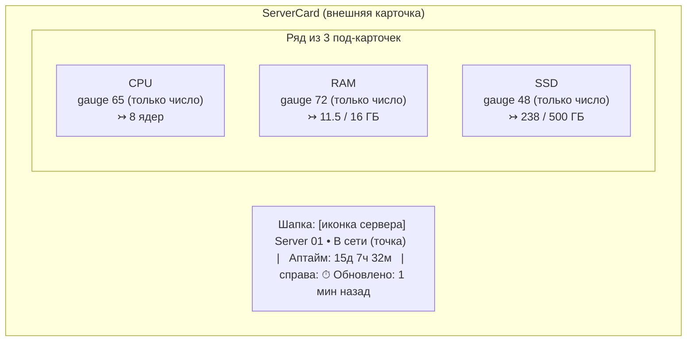

# 08 · Дизайн-система и UI-гайд

Приоритет — **солидный enterprise-вид** (вдохновение Linear / Vercel / Grafana / Datadog), НЕ «типовой ИИ-сайт». Тёмная тема по умолчанию, глубокий нейтральный фон, многослойные поверхности, аккуратная типографика и моноцифры для метрик.

## Эталон карточки (по референсу)

Референс-дизайн: [`docs/assets/reference.png`](assets/reference.png) (исходник также в корне репозитория `reference.png`).




Структура карточки:
1. **Шапка**: иконка сервера (в скруглённом «чипе»), имя крупным полужирным, статус-точка + «В сети / Не в сети», «Аптайм: …» вторичным цветом; справа — иконка часов + «Обновлено: N мин назад». Все подписи — по [словарю локализации](#локализация-ui-русский-словарь-строк).
2. **Три под-карточки** CPU / RAM / SSD — вложенные поверхности на уровень выше фона, тонкая граница, мягкая тень. В каждой:
   - заголовок: иконка метрики в цветном чипе + название (CPU/RAM/SSD) + «…» меню (декоративно на Этапе 1).
   - круговой **gauge** (дуга ~270°, разрыв снизу), градиент по зоне, мягкое внешнее свечение дуги.
   - крупное **моночисло** по центру — **только число, без `%` и без подписи «Usage», без меток `0%`/`100%`** (см. спецификацию Gauge).
   - низ: иконка + абсолютные значения моношрифтом: CPU — `8 ядер` (всегда ядра), RAM — `11.5 / 16 ГБ`, SSD — `238 / 500 ГБ`.

> **Ключевое отличие от картинки:** на референсе дуги CPU/RAM/SSD имеют разные «брендовые» цвета (синий/зелёный/фиолетовый). В нашем продукте **цвет дуги определяется ИСКЛЮЧИТЕЛЬНО зоной нагрузки** (зелёный <80 %, жёлтый 80–90 %, красный >90 %) — одинаково для CPU, RAM и SSD. Композиция, форма, свечение, типографика — как в референсе.

> **Карточка не содержит внешних ссылок.** Drill-down ссылки на Grafana в карточке **нет** (удалена на Этапе 1 — [ADR-005, поправка](adr/ADR-005-custom-gauge-vs-grafana-embed.md#поправка-2026-06-30--удаление-drill-down-ссылки-из-карточки)). Grafana доступна администратору напрямую через `/grafana`. Конфигурация `VITE_GRAFANA_URL` удалена.

## Цветовые токены (CSS custom properties / Tailwind theme)

Тёмная тема (default). Палитра: нейтральная база (slate/zinc) + один акцент (indigo) + семантические статусы.

| Токен | HEX | Применение |
|-------|-----|-----------|
| `--bg-base` | `#0A0C10` | Фон страницы (глубокий, почти чёрный, синеватый) |
| `--surface-1` | `#11141A` | Внешняя карточка сервера |
| `--surface-2` | `#161A22` | Под-карточка метрики |
| `--surface-3` | `#1E232D` | Hover/elevated, чипы иконок |
| `--border-subtle` | `#232834` | Тонкие границы поверхностей |
| `--border-strong` | `#2E3542` | Границы при hover/focus |
| `--text-primary` | `#E6E9EF` | Основной текст, числа |
| `--text-secondary` | `#9AA4B2` | Подписи (Аптайм, Обновлено, заголовки метрик) |
| `--text-tertiary` | `#5C6573` | Третичный текст, «…»-меню |
| `--accent` | `#6366F1` | Акцент (фокус, primary-кнопка) — indigo-500 |
| `--accent-hover` | `#818CF8` | Hover акцента |
| `--status-green` | `#22C55E` | Зона <80 %, Online |
| `--status-yellow` | `#EAB308` | Зона 80–90 % |
| `--status-red` | `#EF4444` | Зона >90 %, Error/Offline |
| `--gauge-track` | `#262C38` | Незаполненная часть дуги |

Градиенты дуги (от тёмного к светлому тона зоны), для свечения — `filter: drop-shadow` цвета зоны с низкой прозрачностью:
- green: `#16A34A → #4ADE80`
- yellow: `#CA8A04 → #FACC15`
- red: `#DC2626 → #F87171`

> Все три gauge в одной карточке могут иметь разные цвета одновременно — каждый по своей нагрузке.

## Зоны нагрузки

Единый источник порогов (совпадает с backend, [04-api.md](04-api.md#пороги-зон)):

```ts
// единый конфиг, frontend
export const ZONE_THRESHOLDS = { yellow: 80, red: 90 } as const;
export function usageToZone(p: number): "green" | "yellow" | "red" {
  if (p > ZONE_THRESHOLDS.red) return "red";      // > 90
  if (p >= ZONE_THRESHOLDS.yellow) return "yellow"; // 80..90
  return "green";                                   // < 80
}
```

## Типографика

- Основной шрифт: **Inter** (variable). Заголовки — 600/700, текст — 400/500.
- Моноширинный: **JetBrains Mono** — для чисел gauge, процентов, IP, абсолютных значений, uptime.
- Масштаб (rem, базовый 16px):

| Роль | Размер | Вес | Шрифт |
|------|--------|-----|-------|
| Имя сервера | 20px / 1.25 | 700 | Inter |
| Число gauge (только число, без `%`) | 40–44px | 700 | JetBrains Mono |
| Заголовок метрики (CPU…) | 15px | 600 | Inter |
| Вторичный (Аптайм, Обновлено) | 13px | 400 | Inter |
| Абсолютные значения (под gauge) | 12–13px | 500 | JetBrains Mono |

> Подпись «Usage», знак `%` в центре и метки `0%`/`100%` — **удалены** из gauge (см. спецификацию ниже).

## Сетка, отступы, скругления

- Базовая сетка **4 / 8 px**. Внешние отступы карточки 20–24px, между под-карточками 16px.
- Скругления: внешняя карточка `16px`, под-карточка `12px`, чип иконки `8px`, кнопки/инпуты `8–10px`.
- Тени: многослойные мягкие (`0 1px 0 rgba(255,255,255,0.03) inset, 0 8px 24px rgba(0,0,0,0.4)`).
- Сетка карточек серверов (нормативно): **адаптивная по числу колонок**, до **3 карточек в ряд** на широких экранах. Карточка становится у́же (раньше была горизонтально-широкой), но внутренняя композиция сохраняется — шапка + ряд из 3 под-карточек CPU/RAM/SSD.
  - Раскладка: **1 колонка** на мобильном (<768px), **2 колонки** на `md`/`lg` (≥768px), **3 колонки** на `xl`/`2xl` (≥1280px). Tailwind: `grid-cols-1 md:grid-cols-2 xl:grid-cols-3`.
  - `gap: 24px` (сохранён).
  - Под-карточки CPU/RAM/SSD внутри карточки остаются в один горизонтальный ряд из 3 (`grid-cols-3`, gap 16px) — при сужении карточки gauge и подписи масштабируются, ряд не переносится.
  - Карточка «+ Добавить» — обычная ячейка той же сетки.

## Компонент Gauge (кастомный SVG)

Спецификация (нормативно для frontend):

- **Форма**: дуга 270°, начало внизу-слева (135°), конец внизу-справа (45°), разрыв 90° снизу. Радиус ~70, толщина обводки 12–14, `stroke-linecap: round`.
- **Слои**:
  1. трек (`--gauge-track`) — полная дуга 270°.
  2. прогресс — дуга на `usage%` от 270°, `stroke` = linear-gradient зоны.
  3. свечение — копия прогресс-дуги с `filter: drop-shadow(0 0 6px <zone>)`.
- **Центр**: **только моночисло** (значение, округление до целого), **без знака `%` и без подписи «Usage»**. Например, показывается `65`, а не `65%` и без слова «Usage» под ним. Это упрощает визуал и устраняет визуальный шум при узких карточках.
- **Метки 0%/100% — УБРАНЫ.** Подписи `0%` у левого конца и `100%` у правого конца дуги не отображаются (раньше наезжали на дугу). У gauge нет min/max-подписей.
- **Анимация**: при изменении значения — плавный transition `stroke-dashoffset` (300–500 мс, ease-out). При первом появлении — анимация от 0 до значения. Уважать `prefers-reduced-motion` (отключать анимацию).
- **Доступность**: семантика процента сохраняется в ARIA, хотя `%` визуально не выводится — `role="meter"`, `aria-valuenow=<value>`, `aria-valuemin=0`, `aria-valuemax=100`, `aria-label="Загрузка CPU 65 процентов"`.
- **Props (контракт)**: `value:number(0..100)`, `label:"CPU"|"RAM"|"SSD"`, `detail:{value,total,unit}`, `size?`, цвет — вычисляется из `usageToZone(value)` (НЕ передаётся снаружи как «брендовый»). `value` — то же `usage_percent` из API (контракт API не меняется; меняется только отображение: без `%` и без «Usage»/меток).

## Карточка «+ Добавить» (glass / blur)

- Тот же размер и форма, что карточка сервера, но:
  - фон полупрозрачный + `backdrop-filter: blur(...)` (glass), тонкая пунктирная/светлая граница.
  - по центру — крупный знак «+» и текст «Добавить».
  - hover: усиление границы/свечения акцентом, лёгкий подъём (`translateY(-2px)`), курсор pointer.
- Клик → открывает `AddServerModal` (Radix Dialog).

## Модалка добавления (`AddServerModal`)

- Radix Dialog, тёмная поверхность `--surface-1`, overlay с затемнением+blur.
- 4 поля: **Название**, **IP** (моношрифт, валидация формата), **Пользователь**, **Пароль** (type=password, toggle видимости).
- Кнопки: «Отмена» (ghost) / «Добавить» (primary, акцент). Состояние loading на «Добавить» (спиннер, disabled).
- Ошибки API: 409 → «Сервер с таким IP уже добавлен»; 422 → подсветка поля IP; общая → toast.
- Закрытие по Esc/overlay (если не идёт отправка), focus-trap, возврат фокуса.

## Режим редактирования модалок (add + edit)

Модалки `AddServerModal` и `AddAiKeyModal` работают в **двух режимах** — `add` (создание) и `edit` (редактирование существующей карточки). Форма переиспользуется, меняются: заголовок/подпись действия, префил полей, набор редактируемых полей, целевой запрос. Решение — [ADR-011](adr/ADR-011-poryadok-blokov-server-side-dnd-kit.md).

**Открытие edit — по клику на карточку** (короткий клик, см. [«Перестановка карточек»](#перестановка-карточек-drag-and-drop)). Кнопка **Удалить** внутри карточки — `stopPropagation`, edit не открывает.

### `AddServerModal` — режим edit
- Заголовок: **«Изменить сервер»**; кнопка действия — **«Сохранить»** (вместо «Добавить»).
- **Редактируется только «Название»** (префил текущим `name`, 1–64). Поля **IP / Пользователь / Пароль** в edit-режиме **не отображаются** (переустановка/смена доступа вне scope Этапа 1 — [modules/servers](modules/servers/README.md#out-of-scope)).
- Отправка → `PATCH /api/servers/{id} {name}`. Успех → toast **«Сервер обновлён»**, карточка обновляется из `GET /api/servers`. Ошибка `400` (пустое/длинное имя) → подсветка поля; общая → toast.

### `AddAiKeyModal` — режим edit
- Заголовок: **«Изменить ключ»**; кнопка действия — **«Сохранить»**.
- Префил: **Название** (текущее `name`), **Провайдер** (текущий `provider`, Select). **Поле «Ключ» — ПУСТОЕ** (секрет никогда не префилится: backend его не отдаёт).
- Под полем «Ключ» — подсказка вторичным цветом: **«Оставьте пустым, чтобы не менять ключ»**. Иконка-глаз (toggle) показывает **вводимое** значение (по умолчанию скрыто, `type=password`).
- Отправка → `PATCH /api/ai-keys/{id}` с изменёнными полями; пустое поле «Ключ» → `key` не отправляется (ключ не меняется). Успех → toast **«Ключ обновлён»**. При смене `provider` или `key` карточка возвращается в статус **Проверка…** и возобновляется polling `GET /api/ai-keys/{id}/status` до выхода из `pending` (см. [modules/ai-keys](modules/ai-keys/README.md#редактирование-ключа-patch-нормативно)).
- Ошибки: `422` (невалидный provider) / `400` (длина) → подсветка поля; общая → toast.

> Общее: закрытие Esc/overlay (если не идёт отправка), focus-trap, возврат фокуса на карточку-источник. Loading-состояние на кнопке «Сохранить».

## Перестановка карточек (drag-and-drop)

Перестановка карточек серверов и AI-ключей мышью/тачем (@dnd-kit), порядок хранится на сервере (`position`). Решение и обоснование — [ADR-011](adr/ADR-011-poryadok-blokov-server-side-dnd-kit.md).

**Разведение жестов (нормативно):**
- **вся карточка — область хвата** (отдельной drag-ручки/grip-иконки НЕТ);
- **короткий клик** (нажатие < 200 мс без сдвига) → открывает **edit-модалку** (см. [«Режим редактирования»](#режим-редактирования-модалок-add--edit));
- **зажать ~200 мс + движение** → старт перетаскивания. Технически — `PointerSensor` с `activationConstraint: { delay: 200, tolerance: 5 }`;
- кнопка **Удалить** на карточке — `stopPropagation`: не тащит и не открывает edit.

**Область перестановки:**
- **Серверы** — единый список, свободная перестановка любой карточки.
- **AI-ключи** — **только внутри своей провайдер-секции** (OpenAI ↔ OpenAI, Anthropic ↔ Anthropic). Между секциями карточки не перемещаются (провайдер меняется только через edit).

**Визуальный фидбэк:** во время drag — приподнятая тень/затемнение перетаскиваемой карточки (drag-overlay), плавное смещение соседних (@dnd-kit `sortable`-анимация), полупрозрачный «слот» на месте исходной позиции. Уважать `prefers-reduced-motion` (сократить/отключить анимацию смещения).

**Сохранение порядка:** на `onDragEnd` — оптимистичное обновление порядка в кэше TanStack Query, затем `PATCH /api/servers/order {ids}` или `PATCH /api/ai-keys/order {provider, ids}`. При ошибке запроса — откат к прежнему порядку + инвалидация списка + toast **«Не удалось сохранить порядок»**. Порядок отрисовки списка всегда берётся из `position` (`GET`-ответа).

**Доступность:** карточки остаются фокусируемыми; edit (Enter/клик) и удаление доступны с клавиатуры. Перетаскивание с клавиатуры (@dnd-kit `KeyboardSensor`) — опционально на Этапе 1 ([TD-022](100-known-tech-debt.md)); при реализации — экранному диктору отдаются русские анонсы (взятие/перемещение/отпускание).

## Состояния UI (обязательны)

| Состояние | Поведение |
|-----------|-----------|
| **loading (список)** | Skeleton-карточки (мягкое мерцание поверхностей). |
| **empty** | Только карточка «+ Добавить» по центру + подсказка. |
| **provisioning** | Карточка с `provision_status` pending/installing: подпись «Ожидание»/«Установка…» (см. [словарь](#локализация-ui-русский-словарь-строк)), спиннер, gauge скрыты или в состоянии «—». |
| **error (провижининг)** | Красная акцентная граница, подпись «Ошибка» + текст ошибки, кнопка «Удалить». |
| **offline** | Статус-точка красная, подпись «Не в сети», gauge приглушены/«—», «Обновлено» показывает давность. |
| **hover** | Подъём карточки, усиление границы. |
| **focus** | Видимый focus-ring (`--accent`, 2px, offset). |
| **disabled** | Снижение прозрачности, `cursor: not-allowed`. |
| **toast** | Успех добавления/удаления, ошибки (sonner), позиция top-right. |

## Доступность (a11y)

- Контраст текста ≥ WCAG AA (NFR-8). Не полагаться только на цвет статуса — дублировать текстом («В сети», «Не в сети», «Ошибка»).
- Все интерактивные элементы фокусируемы, видимый focus-ring.
- Gauge — `role="meter"` с aria-значениями (см. выше).
- Модалка — корректный focus-management (Radix обеспечивает).
- Поддержка `prefers-reduced-motion`.

## Экран входа (двухшаговый)

- Центрированная карточка на `--bg-base`, минимализм. **Только блок логина (форма) — без брендинга**: НЕ показывать заголовок продукта (например, «Мониторинг серверов»), подзаголовок/подпись (например, «Вход в панель администратора») и логотип над формой. На странице — единственная карточка с полями/кнопками/сообщением об ошибке, ничего сверх этого.
- **Шаг 1**: поле «Логин» + кнопка «Далее». Переход — клиентский (без запроса), см. [ADR-002](adr/ADR-002-dvuhshagovyy-auth.md).
- **Шаг 2**: показывается введённый логин (с кнопкой «назад»/сменить) + поле «Пароль» + кнопка «Войти». Запрос `POST /api/auth/login`.
- Ошибка → единое сообщение «Неверный логин или пароль» (без раскрытия, что именно), shake-анимация поля (с учётом reduced-motion).
- После успеха — редирект на `/servers`.

## Локализация UI (русский словарь строк)

Весь пользовательский интерфейс — **на русском**. Технические идентификаторы (значения `provision_status`, коды ошибок, `unit:"cores"/"GB"` в API) остаются английскими в API; локализуется **только отображение**. Нормативный словарь UI-строк (frontend использует ровно эти формулировки):

### Статусы сервера и провижининга
| Источник (API/тех.) | UI (рус.) |
|---------------------|-----------|
| online / `up==1` | **В сети** |
| offline / `up==0` | **Не в сети** |
| `provision_status: pending` | **Ожидание** |
| `provision_status: installing` | **Установка…** |
| `provision_status: online` | **В сети** |
| `provision_status: error` | **Ошибка** |

### Подписи карточки
| Элемент | UI (рус.) |
|---------|-----------|
| Uptime | **Аптайм** (например, «Аптайм: 15д 7ч 32м») |
| Last updated | **Обновлено** (например, «Обновлено: 1 мин назад») |
| Заголовки метрик | `CPU` / `RAM` / `SSD` (оставляем латиницей — общепринятые тех. сокращения) |

Формат uptime (рус. сокращения): `15д 7ч 32м` (`д`/`ч`/`м`). Воспроизводимость числового примера — см. [06-testing-strategy.md](06-testing-strategy.md): `1323120s → 15д 7ч 32м`.

### Относительное время («N min ago»)
| Условие | UI (рус.) |
|---------|-----------|
| < 60 с | **только что** |
| 1–59 мин | **N мин назад** |
| 1–23 ч | **N ч назад** |
| ≥ 1 дн | **N дн назад** |

### Единицы измерения
| API `unit` | UI (рус.) | Примечание |
|------------|-----------|-----------|
| `"GB"` | **ГБ** | например, `11.5 / 16 ГБ` |
| `"cores"` | **ядра** (с формами мн.ч.) | CPU detail, `value:null` → показываем `total` + слово |

Русские формы множественного числа для «ядро» (по `total`, правило по последним цифрам):
- оканчивается на 1 (кроме 11) → **ядро** (`1 ядро`, `21 ядро`);
- на 2–4 (кроме 12–14) → **ядра** (`2 ядра`, `8 → ядер`… см. ниже);
- на 0, 5–9, 11–14 → **ядер** (`5 ядер`, `8 ядер`, `11 ядер`).

Примеры (проверяемо правилом): `1 → «1 ядро»`, `2 → «2 ядра»`, `4 → «4 ядра»`, `5 → «5 ядер»`, `8 → «8 ядер»`, `11 → «11 ядер»`, `22 → «22 ядра»`.

### Кнопки и общие действия
| Контекст | UI (рус.) |
|----------|-----------|
| Карточка «+ Добавить» | **+ Добавить** |
| Модалка (add) — поля | **Название**, **IP**, **Пользователь**, **Пароль** |
| Модалка (add) — кнопки | **Отмена** / **Добавить** |
| Модалка (edit) — заголовок | **Изменить сервер** |
| Модалка (edit) — поле | **Название** (только оно редактируется) |
| Модалка (edit) — кнопки | **Отмена** / **Сохранить** |
| Кнопка на карточке ошибки | **Удалить** |
| Экран входа шаг 1 | поле **Логин**, кнопка **Далее** |
| Экран входа шаг 2 | поле **Пароль**, кнопки **Войти** / **Назад** |

### Empty state, toast, ошибки
| Контекст | UI (рус.) |
|----------|-----------|
| Empty state (нет серверов) | заголовок **«Пока нет серверов»**, подсказка **«Добавьте первый сервер, чтобы начать мониторинг»** |
| Провижининг (installing) | **«Установка агента…»** |
| Toast успех (добавление) | **«Сервер добавлен»** |
| Toast успех (редактирование) | **«Сервер обновлён»** |
| Toast успех (удаление) | **«Сервер удалён»** |
| Toast ошибка (перестановка) | **«Не удалось сохранить порядок»** |
| Ошибка входа | **«Неверный логин или пароль»** |
| Ошибка 409 (дубликат IP) | **«Сервер с таким IP уже добавлен»** |
| Ошибка 422 (невалидный IP) | **«Некорректный IP-адрес»** |
| Ошибка метрик/Prometheus | **«Метрики временно недоступны»** |
| Общая сетевая ошибка | **«Не удалось выполнить запрос. Повторите попытку»** |

> Реализация локализации (захардкоженные русские строки vs i18n-библиотека) — на усмотрение frontend; на Этапе 1 один язык (русский), отдельная i18n-инфраструктура не требуется.

## Навигация (верхние вкладки, `AppLayout`)

С появлением второй страницы вводится общий **`AppLayout`** с верхней навигацией-вкладками (ранее заголовок был зашит в `ServersPage`). Вкладки (`NavLink`, react-router):

| Вкладка | Маршрут |
|---------|---------|
| **Серверы** | `/servers` |
| **ИИ - ключи** | `/ai-keys` |

- Стиль вкладок: горизонтальный ряд в шапке, активная вкладка — акцентная подсветка (`--accent`, нижняя граница/подчёркивание), неактивная — `--text-secondary`, hover → `--text-primary`. Видимый focus-ring (`--accent`, 2px).
- Обе страницы — защищённые (внутри `AppLayout` под auth-guard). Заголовок продукта/бренд в шапке — по текущему решению отсутствует (минимализм), в шапке только вкладки.
- Тёмная тема и токены — те же, что для страницы «Серверы».

## Страница «ИИ - ключи»

Зеркалит страницу «Серверы» по композиции и токенам. Сетка — та же адаптивная (`grid-cols-1 md:grid-cols-2 xl:grid-cols-3`, gap 24px). Ячейки: `AiKeyCard` на каждый ключ + `AddAiKeyCard`.

### Группировка ИИ-ключей по провайдерам

Ключи сгруппированы в **две секции** по `provider`: **OpenAI** и **Anthropic** (решение — [ADR-011](adr/ADR-011-poryadok-blokov-server-side-dnd-kit.md), контракт — [modules/ai-keys](modules/ai-keys/README.md#группировка-по-провайдерам-и-перестановка-нормативно)).

- **Заголовок секции** — название провайдера (**OpenAI** / **Anthropic**) в стиле подзаголовка (Inter 15–16/600, `--text-secondary`), с тонким разделителем/отступом сверху. Опционально — счётчик ключей в секции вторичным цветом.
- Внутри секции — своя адаптивная сетка карточек (те же токены), в порядке `position`. Каждая секция содержит **свою** `AddAiKeyCard` (при добавлении из секции провайдер можно предвыбрать в модалке; поле остаётся редактируемым).
- **Порядок секций** фиксирован: сначала **OpenAI**, затем **Anthropic**.
- **Пустые секции скрываются:** если у провайдера нет ключей — секция (заголовок) не рендерится. Общий empty-state (нет ни одного ключа) — как раньше: только одна карточка **«+ Добавить»** + подсказка **«Пока нет ключей»** / **«Добавьте первый AI-ключ»**, без заголовков секций.
- Перестановка — **внутри секции** (см. [«Перестановка карточек»](#перестановка-карточек-drag-and-drop)); между секциями карточки не перемещаются.
- Frontend получает **плоский** `GET /api/ai-keys` и группирует по `provider`, сохраняя относительный порядок (`position`).

### `AiKeyCard`

Внешняя карточка `--surface-1`, скругление 16px, те же тени/границы, что у `ServerCard`. Содержимое:

1. **Шапка:** иконка ключа в чипе (`--surface-3`) + имя ключа (крупный полужирный, Inter 20/700) + статус-бейдж (`Badge`).
2. **Провайдер:** подпись вторичным цветом — **OpenAI** / **Anthropic** (по `provider`).
3. **Маска ключа:** `key_masked` моношрифтом (JetBrains Mono, `--text-secondary`), например `sk-p…bA3T`. **Полный ключ не показывается никогда.**
4. **Причина ошибки:** при `check_status = error` — строка с `error_message` (красный акцент).
5. **Действие:** кнопка **Удалить** (как на карточке сервера в ошибке).

Статус-бейдж по `check_status`:

| `check_status` | UI-текст | Цвет |
|----------------|----------|------|
| `working` | **Работает** | `--status-green` |
| `error` | **Не работает** | `--status-red` |
| `pending` | **Проверка…** (спиннер) | `--text-secondary` / нейтральный |

> Не полагаться только на цвет — статус всегда дублируется текстом (NFR-8, a11y).

### `AddAiKeyCard` и `AddAiKeyModal`

- `AddAiKeyCard` — glass/blur-ячейка, идентична `AddServerCard` (крупный «+» и текст «Добавить»). Клик → `AddAiKeyModal`.
- `AddAiKeyModal` (Radix Dialog, `--surface-1`, overlay blur). Поля:
  - **Название** (`Input`, 1–64).
  - **Провайдер** (`Select`, значения OpenAI/Anthropic).
  - **Ключ** (`Input type=password`, toggle видимости; моношрифт).
- Кнопки: **Отмена** (ghost) / **Добавить** (primary, loading-спиннер). Закрытие Esc/overlay (если не идёт отправка), focus-trap, возврат фокуса.
- После успеха — toast **«Ключ добавлен»**, карточка появляется со статусом **Проверка…**, лёгкий polling статуса до выхода из `pending`.

## Компонент `Select`

Новый UI-примитив. **Реализация — нативный `<select>`**, стилизованный Tailwind (без новой зависимости; `@radix-ui/react-select` НЕ добавляется — [02-tech-stack.md](02-tech-stack.md#frontend), [modules/ai-keys](modules/ai-keys/README.md#новый-ui-примитив-select)). Причина: два значения, доступность и клавиатурная навигация обеспечиваются нативным контролом (NFR-1, a11y).

- Внешний вид: тёмная поверхность `--surface-2`/`--surface-3`, граница `--border-subtle`, скругление 8–10px, кастомная стрелка (иконка `chevron-down`), видимый focus-ring (`--accent`). Высота/паддинги согласованы с `Input`.
- Props (контракт): `value`, `onChange`, `options: {value, label}[]`, `id`/`name`, `disabled`.
- Значения для формы ключа: `{value:"openai", label:"OpenAI"}`, `{value:"anthropic", label:"Anthropic"}`.

### Состояния UI страницы «ИИ - ключи»

Те же паттерны, что у серверов ([Состояния UI](#состояния-ui-обязательны)): loading (skeleton-карточки), empty (только `AddAiKeyCard` + подсказка), pending («Проверка…», спиннер), error (акцентная граница + причина + «Удалить»), toast успех/ошибка, обработка сетевых ошибок.

## Локализация страницы «ИИ - ключи»

Русский словарь UI-строк для страницы ключей.

Нормативные строки (frontend использует ровно эти формулировки; технические `provider=openai/anthropic`, `check_status` — английские в API):

### Навигация и статусы ключа
| Источник (API/тех.) | UI (рус.) |
|---------------------|-----------|
| вкладка серверов | **Серверы** |
| вкладка ключей | **ИИ - ключи** |
| `check_status: working` | **Работает** |
| `check_status: error` | **Не работает** |
| `check_status: pending` | **Проверка…** |
| `provider: openai` | **OpenAI** |
| `provider: anthropic` | **Anthropic** |

### Подписи и поля
| Элемент | UI (рус.) |
|---------|-----------|
| Заголовок поля/значения ключа | **Ключ** |
| Поле выбора провайдера | **Провайдер** |
| Заголовки секций провайдеров | **OpenAI** / **Anthropic** |
| Модалка (add) — поля | **Название**, **Провайдер**, **Ключ** |
| Модалка (add) — кнопки | **Отмена** / **Добавить** |
| Модалка (edit) — заголовок | **Изменить ключ** |
| Модалка (edit) — подсказка под полем «Ключ» | **Оставьте пустым, чтобы не менять ключ** |
| Модалка (edit) — кнопки | **Отмена** / **Сохранить** |
| Кнопка на карточке | **Удалить** |
| Карточка «+ Добавить» | **+ Добавить** |

### Empty state, toast
| Контекст | UI (рус.) |
|----------|-----------|
| Empty state (нет ключей) | заголовок **«Пока нет ключей»**, подсказка **«Добавьте первый AI-ключ»** |
| Toast успех (добавление) | **«Ключ добавлен»** |
| Toast успех (редактирование) | **«Ключ обновлён»** |
| Toast успех (удаление) | **«Ключ удалён»** |
| Toast ошибка (перестановка) | **«Не удалось сохранить порядок»** |

> Причины ошибок ключа (`error_message`: «Ключ недействителен» / «Доступ запрещён» / «Недостаточно средств» / «Ошибка провайдера») приходят готовыми из API — frontend показывает их как есть, без дополнительной локализации.

## Иконки

`lucide-react`: `server` (шапка сервера), `cpu` (CPU), `memory-stick` (RAM), `hard-drive` (SSD), `clock` (Обновлено), `plus` (добавить), `activity`/`line-chart` (низ под-карточки), `loader` (провижининг/проверка ключа), `key`/`key-round` (карточка AI-ключа), `chevron-down` (`Select`).
