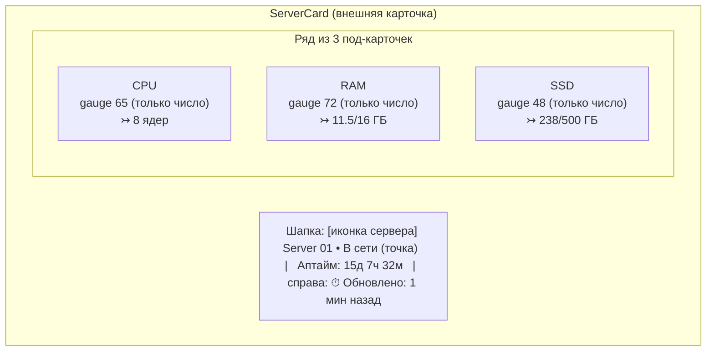

# 08 · Дизайн-система и UI-гайд

Приоритет — **солидный enterprise-вид** (вдохновение Linear / Vercel / Grafana / Datadog), НЕ «типовой ИИ-сайт». **Тёмная тема — основная бренд-идентичность** (глубокий нейтральный фон, многослойные поверхности, аккуратная типографика и моноцифры для метрик). Со Спринта C ([ADR-033](adr/ADR-033-flat-nav-theme-toggle-numbers-table.md)) доступна **светлая тема** (переключатель-иконка в хэдере); **дефолт при первом входе — системная тема ОС** (`prefers-color-scheme`), явный выбор её переопределяет — см. [Темизация](#темизация-светлаятёмная-adr-033). Все поверхности/компоненты используют цвета **только через CSS-переменные** — при переключении темы значения переменных подменяются, компоненты не меняются.

## Эталон карточки (по референсу)

Референс-дизайн: [`docs/assets/reference.png`](assets/reference.png) (исходник также в корне репозитория `reference.png`).




Структура карточки:
1. **Шапка**: иконка сервера (в скруглённом «чипе»), имя крупным полужирным, статус-точка + «В сети / Не в сети», «Аптайм: …» вторичным цветом; справа — иконка часов + «Обновлено: N мин назад». Все подписи — по [словарю локализации](#локализация-ui-русский-словарь-строк).
2. **Три под-карточки** CPU / RAM / SSD — вложенные поверхности на уровень выше фона, тонкая граница, мягкая тень. В каждой:
   - заголовок: иконка метрики в цветном чипе + название (CPU/RAM/SSD) + «…» меню (декоративно на Этапе 1).
   - круговой **gauge** (дуга ~270°, разрыв снизу), градиент по зоне, мягкое внешнее свечение дуги.
   - крупное **моночисло** по центру — **только число, без `%` и без подписи «Usage», без меток `0%`/`100%`** (см. спецификацию Gauge).
   - низ: иконка + абсолютные значения моношрифтом: CPU — `8 ядер` (всегда ядра), RAM — `11.5/16 ГБ`, SSD — `238/500 ГБ`.

> **Ключевое отличие от картинки:** на референсе дуги CPU/RAM/SSD имеют разные «брендовые» цвета (синий/зелёный/фиолетовый). В нашем продукте **цвет дуги определяется ИСКЛЮЧИТЕЛЬНО зоной нагрузки** (зелёный <80 %, жёлтый 80–90 %, красный >90 %) — одинаково для CPU, RAM и SSD. Композиция, форма, свечение, типографика — как в референсе.

> **Карточка не содержит внешних ссылок.** Drill-down ссылки на Grafana в карточке **нет** (удалена на Этапе 1 — [ADR-005, поправка](adr/ADR-005-custom-gauge-vs-grafana-embed.md#поправка-2026-06-30--удаление-drill-down-ссылки-из-карточки)). Grafana доступна администратору напрямую через `/grafana`. Конфигурация `VITE_GRAFANA_URL` удалена.

### Под-карточки метрик

**Формат строки детали (нормативно, НЕ меняется).** Раскладка метрик — фиксированная **`grid-cols-3`** (3 под-карточки CPU/RAM/SSD в ряд). Строка детали внизу под-карточки — абсолютные значения моношрифтом: CPU — `8 ядер`, RAM/SSD — `used/total ГБ` **с десятичными** (напр. `786.3/913.8 ГБ`).

**Значение обязано читаться ПОЛНОСТЬЮ на ВСЕХ штатных вьюпортах (нормативно; 390 / 768 / 1279 / 1280 / 1440, обе темы).** Числовое значение детали метрики — значимый контент.

> **⛔ Прежняя норма «на узких вьюпортах значение контейнерно усекается (`overflow-hidden` на под-карточке метрики)» — ОТМЕНЕНА (2026-07-13).** Она прямо противоречила действующему правилу проекта ([CLAUDE.md](../CLAUDE.md): «переполнение решается размером, а не скрытием значимого контента; обрезка числовых значений = дефект») и была подтверждена как прод-баг: на 768 значение `786.3/913.8 ГБ` имело `clientWidth=72` при `scrollWidth=84` — хвост не читался. Долг [TD-023](100-known-tech-debt.md) закрыт этим фиксом.

- **ЗАПРЕЩЕНО как способ «уместить» значение:** `overflow-hidden` / `clip` / `truncate` / `text-ellipsis` / `whitespace-nowrap` в связке с ними — на под-карточке метрики и на строке значения. Любое усечение числа = дефект (`major`), а не решение.
- **Переполнение решается РАЗМЕРОМ и РАСКЛАДКОЙ** (`claims-from-code`, действующая реализация): горизонтальный padding под-карточки ужат на узких вьюпортах — `px-1 … xl:px-2.5` (`frontend/src/components/MetricSubCard.tsx:50`); шаг сетки метрик ужат — `grid grid-cols-3 gap-2 xl:gap-3` (`frontend/src/components/ServerCard.tsx:203`). `overflow-hidden` с корня под-карточки **снят**; `min-w-0` сохранён — под-карточка не расширяет grid-трек и не наезжает на соседнюю метрику.
- **Крайний случай — ПЕРЕНОС, а не обрезка.** `whitespace-nowrap` на строке значения снят: экстремально длинный тотал переносится по пробелу перед единицей (`1899.9/2048.5` + `ГБ`), `break-words` — страховка для патологически длинного числового токена (`frontend/src/components/MetricSubCard.tsx:91`). Контент остаётся читаемым целиком в любом случае.
- **Формат и `grid-cols-3` НЕ меняются** — десятичные ГБ сохранены (решение владельца); «целые ГБ на узких экранах» из прежней ремедиации [TD-023](100-known-tech-debt.md) **не потребовались**.
- **Доказательство закрытия — фактический рендер**, а не соответствие классов ([CLAUDE.md](../CLAUDE.md)): 0 обрезанных значений на 390/768/1279/1280/1440 в светлой и тёмной темах.

### Усечение контента — общее правило (нормативно, [CLAUDE.md](../CLAUDE.md))

Единая норма для ВСЕХ страниц и компонентов (частные формулировки — [«Вкладка «Почты»»](#вкладка-почты-нормативно) (колонка «Команда»), [«Вкладка «Номера»»](#вкладка-номера), [ADR-047](adr/ADR-047-mail-fix-pack.md) §8, [ADR-048](adr/ADR-048-teams-mailbox-count-mail-row.md)):

| | Правило |
|--|---------|
| **ЗАПРЕЩЕНО усекать** (`overflow-hidden`/`clip`/`truncate`/`text-ellipsis`) | **Значимые значения:** числа и метрики (`786.3/913.8 ГБ`), счётчики, статусы, коды ошибок, номера телефонов, email, раскрытые секреты, значения полей detail-view. Переполнение решается **размером/раскладкой** (ужать паддинги/gap, расширить контейнер, перенести по строкам) или **форматом**, но **не скрытием**. Обрезка значимого контента = дефект **`major`** |
| **ДОПУСТИМО усекать** | **Длинный свободный текст**, где усечение **задизайнено** и значение доступно целиком в другом месте: тема письма в списке (`truncate` + полная тема в детали), длинное имя в узкой строке (`truncate` + `title`). Это не «уместить любой ценой», а осознанный приём |
| **Не путать с серверным усечением** | `body_truncated` (тело письма урезано **при приёме**, [04-api.md](04-api.md#mail)) — свойство ДАННЫХ, а не UI: UI обязан честно показать пометку **«Письмо показано не полностью»**, а не прятать факт |

> **Доказательство закрытия визуального бага — фактический рендер** (скриншот/`scrollWidth` vs `clientWidth` на штатных вьюпортах), а не соответствие CSS-классов спеку ([CLAUDE.md](../CLAUDE.md)).

## Цветовые токены (CSS custom properties / Tailwind theme)

Палитра **тема-зависима**. **Дефолт — СВЕТЛАЯ тема** ([ADR-041](adr/ADR-041-login-theme-session-ux.md)); тёмная включается явным выбором пользователя. Один и тот же набор CSS-переменных определён дважды: **светлые значения — на голом `:root`** (и явно под `[data-theme='light']`), **тёмные — под `[data-theme='dark']`** ([ADR-046](adr/ADR-046-ui-infra-fix-pack.md) §4.2). Компоненты и Tailwind-токены (`tailwind.config.ts`) ссылаются на переменные — при переключении темы **меняются только значения переменных**, разметка/классы компонентов не трогаются. Палитра: нейтральная база (gray-на-белом в светлой, slate/zinc в тёмной) + один акцент (indigo) + семантические статусы.

> **⚠️ Прежняя формулировка «тёмная — default; тёмные значения на `:root`, светлые под `[data-theme=light]`» ([ADR-033](adr/ADR-033-flat-nav-theme-toggle-numbers-table.md)) — ОТМЕНЕНА.** Дефолт развёрнут на светлый [ADR-041](adr/ADR-041-login-theme-session-ux.md); носитель дефолта в CSS развёрнут [ADR-046](adr/ADR-046-ui-infra-fix-pack.md) §4.2 (**отсутствие `data-theme` = светлая, а НЕ тёмная** — иначе провал no-FOUC-скрипта детерминированно даёт тёмный экран, что и было prod-багом). Нормативный механизм — [§Темизация](#темизация-светлаятёмная) (**источник истины**); эта таблица задаёт только **значения** токенов.

**Полная таблица токенов.** Светлые значения подобраны не «инверсией в лоб», а как продуманная светлая тема (белые карточки на светло-сером фоне, тёмный текст) с контрастом текста ≥ WCAG AA (NFR-8). Порядок колонок исторический (dark → light) и **не** отражает приоритет: **default — колонка Light**.

| Токен | Dark (`[data-theme='dark']`) | **Light (default, `:root`)** | Применение |
|-------|------------------------------|------------------------------|-----------|
| `--bg-base` | `#0A0C10` | `#F2F4F7` | Фон страницы/хэдера |
| `--surface-1` | `#11141A` | `#FFFFFF` | Внешняя карточка (в свете — белая, приподнята над серым фоном) |
| `--surface-2` | `#161A22` | `#F7F8FA` | Вложенная под-карточка метрики |
| `--surface-3` | `#1E232D` | `#EAECF1` | Hover/elevated, чипы иконок (в свете — лёгкое затемнение-фидбэк) |
| `--border-subtle` | `#232834` | `#E3E6EB` | Тонкие границы поверхностей |
| `--border-strong` | `#2E3542` | `#CDD2DB` | Границы при hover/focus |
| `--text-primary` | `#E6E9EF` | `#111827` | Основной текст, числа (light: ~16:1 на белом) |
| `--text-secondary` | `#9AA4B2` | `#4B5563` | Подписи (Аптайм/Обновлено/заголовки метрик) (light: ~7.6:1) |
| `--text-tertiary` | `#5C6573` | `#61697A` | Третичный/декоративный текст, «…»-меню (light: затемнён с `#6B7280` до прохождения WCAG AA и на самом светлом фоне — контраст ≈5.0:1 на `--bg-base` `#F2F4F7` и ≈5.5:1 на `--surface-1` `#FFFFFF`, ≥4.5 AA везде) |
| `--accent` | `#6366F1` | `#4F46E5` | Акцент (фокус, primary-кнопка); light = indigo-600 (белый текст на нём ~5.9:1) |
| `--accent-hover` | `#818CF8` | `#4338CA` | Hover акцента (в тёмной — светлее, в светлой — темнее) |
| `--status-green` | `#22C55E` | `#15803D` | Зона <80 %, Online (light: читаем как текст ~4.9:1) |
| `--status-yellow` | `#EAB308` | `#B45309` | Зона 80–90 % (light: amber-700 ~5.0:1; яркий жёлтый как текст на белом нечитаем) |
| `--status-red` | `#EF4444` | `#DC2626` | Зона >90 %, Error/Offline (light: ~4.5:1) |
| `--gauge-track` | `#262C38` | `#E1E4EA` | Незаполненная часть дуги |
| `--shadow-card` | `0 1px 0 rgba(255,255,255,.03) inset, 0 8px 24px rgba(0,0,0,.4)` | `0 1px 2px rgba(16,24,40,.06), 0 8px 24px rgba(16,24,40,.08)` | Тень внешней карточки (тема-зависима, [ADR-033](adr/ADR-033-flat-nav-theme-toggle-numbers-table.md)) |
| `--shadow-sub` | `0 1px 0 rgba(255,255,255,.02) inset, 0 4px 12px rgba(0,0,0,.3)` | `0 1px 2px rgba(16,24,40,.05), 0 4px 12px rgba(16,24,40,.06)` | Тень под-карточки (тема-зависима) |

> **Тени стали тема-зависимыми ([ADR-033](adr/ADR-033-flat-nav-theme-toggle-numbers-table.md)).** Прежде `boxShadow.card`/`boxShadow.sub` в `tailwind.config.ts` были статичными hex/rgba (тяжёлые чёрные тени — уместны только на тёмном фоне). Теперь `boxShadow.card`/`boxShadow.sub` ссылаются на `var(--shadow-card)`/`var(--shadow-sub)`, а значения переопределяются по теме (в светлой — мягче, полупрозрачный `#101828`). Скругления/геометрия теней не меняются.

### Формат цветовых токенов — channel (`rgb(var(--x) / <alpha-value>)`) (нормативно, [ADR-064](adr/ADR-064-design-tokens-channel-format.md))

> **HEX в таблице выше — референс цвета** (для обоснований контраста WCAG). **Литеральное значение в `index.css` — space-separated RGB-триплет** того же цвета (см. таблицу конверсии ниже). Это не расхождение, а разные представления одного цвета.

**Правило формата (инвариант).** Все цветовые токены, экспонированные как Tailwind-утилиты через `tailwind.config.ts.theme.extend.colors`, обязаны:
1. храниться в `index.css` как **space-separated RGB-триплет** (`R G B`, 0–255, без `rgb()`, без запятых, без `#`) — напр. `--status-red: 220 38 38;`;
2. объявляться в `tailwind.config.ts` через **`rgb(var(--<token>) / <alpha-value>)`** (не `var(--<token>)`).

**Зачем.** Только в этом формате работают **opacity-модификаторы** Tailwind (`bg-status-red/90`, `ring-accent/40`, `bg-surface-1/40`, `disabled:bg-accent/60` …): плейсхолдер `<alpha-value>` подставляется как `1` для сплошной заливки и как `0.NN` для `/NN`. **Готовый цвет в переменной (`var(--x)` без обёртки / `#RRGGBB`) ломает alpha-модификатор:** Tailwind собирает невалидное `rgb(#RRGGBB / 0.9)` и **опускает свойство** — фон/кольцо исчезают «тихо» (без ошибки сборки). Это был root cause невидимой в светлой теме `danger`-кнопки (`bg-status-red/90 text-white` → белый текст на прозрачном фоне модалки) и латентно ~25 других мест (границы карточек ошибок `border-status-red/70`, тонировки `bg-status-red/5`/`bg-accent/15`, фокус-кольца `ring-accent/40`/`ring-status-red/40`, полупрозрачные фоны `bg-surface-1/40`/`bg-bg-base/80`). Сплошная заливка без альфы (`bg-status-red`) в channel-формате продолжает работать (`<alpha-value>` → `1`).

**Новый токен вводится ТОЛЬКО в channel-формате** по пп.1–2. Ввод цветового токена, попадающего в `colors`, как готового цвета — **запрещён** (воспроизводит баг).

**Таблица конверсии (15 токенов, экспонируемых в `colors`).** HEX — из таблицы выше; триплет — литерал в `index.css` (light — на голом `:root` + дубль под `[data-theme='light']`; dark — под `[data-theme='dark']`):

| Токен | Light HEX → триплет | Dark HEX → триплет |
|-------|---------------------|--------------------|
| `--bg-base` | `#F2F4F7` → `242 244 247` | `#0A0C10` → `10 12 16` |
| `--surface-1` | `#FFFFFF` → `255 255 255` | `#11141A` → `17 20 26` |
| `--surface-2` | `#F7F8FA` → `247 248 250` | `#161A22` → `22 26 34` |
| `--surface-3` | `#EAECF1` → `234 236 241` | `#1E232D` → `30 35 45` |
| `--border-subtle` | `#E3E6EB` → `227 230 235` | `#232834` → `35 40 52` |
| `--border-strong` | `#CDD2DB` → `205 210 219` | `#2E3542` → `46 53 66` |
| `--text-primary` | `#111827` → `17 24 39` | `#E6E9EF` → `230 233 239` |
| `--text-secondary` | `#4B5563` → `75 85 99` | `#9AA4B2` → `154 164 178` |
| `--text-tertiary` | `#61697A` → `97 105 122` | `#5C6573` → `92 101 115` |
| `--accent` | `#4F46E5` → `79 70 229` | `#6366F1` → `99 102 241` |
| `--accent-hover` | `#4338CA` → `67 56 202` | `#818CF8` → `129 140 248` |
| `--status-green` | `#15803D` → `21 128 61` | `#22C55E` → `34 197 94` |
| `--status-yellow` | `#B45309` → `180 83 9` | `#EAB308` → `234 179 8` |
| `--status-red` | `#DC2626` → `220 38 38` | `#EF4444` → `239 68 68` |
| `--gauge-track` | `#E1E4EA` → `225 228 234` | `#262C38` → `38 44 56` |

**НЕ конвертируются:** `--shadow-card`/`--shadow-sub` (не цвет, экспонируются через `boxShadow`, не `colors`) и стопы градиентов дуги `--gauge-*-from`/`--gauge-*-to` (читаются как готовый цвет в SVG `linearGradient`, в `colors` не входят, alpha не используется) — остаются как есть.

**Ревизия сырых потребителей конвертируемых токенов (обязательна при конверсии, [ADR-064](adr/ADR-064-design-tokens-channel-format.md) §C).** После перехода на триплет переменная `--<token>` **сама по себе не валидный цвет**. Поэтому каждое место, где **конвертируемая** переменная (15 токенов) используется как готовый цвет, обёртывается в **`rgb(var(--x))`**. **Критерий обёртки — ТОКЕН, а не CSS-свойство и не место потребления:** обёртка требуется в любой цвет-позиции — `background-color`/`color`/`border`/`outline`, **shorthand `background`**, **цвет-стопы `linear-gradient()`**, цвет-аргументы `color-mix()`, **презентационные SVG-атрибуты `fill`/`stroke`**, **значения инлайнового `style`** и **строковые JS-константы цвета**. То, что позиция — градиент/тень/shorthand/SVG/inline/JS, **не** освобождает от обёртки; освобождает только не-конвертируемость переменной (тени `--shadow-*`, gauge-стопы `--gauge-*-from`/`-to`, Telegram-нативные `--tg-*`).

**Область ревизии — весь `frontend/src`, не только `index.css`** (конверсия глобальна: единый набор переменных нельзя одновременно держать триплетом для Tailwind и готовым цветом для сырого потребления; гибрид «две переменные» отклонён). Перечень [ADR-064](adr/ADR-064-design-tokens-channel-format.md) §C.1/§C.2:
- **в `index.css` (§C.1):** `* {border-color}`; `body {background-color/-color}`; `:focus-visible {outline}`; `::selection {color-mix}`; **`.skeleton-shimmer {background: linear-gradient(…)}` — все три цвет-стопа `--surface-2`(×2)/`--surface-3`**; `.doc-prose {color}`; `.doc-prose a {color}`; `.doc-prose code {background}`; `.doc-prose pre {background, border}`; `.doc-prose blockquote {border-left, color}`; `.doc-prose hr {border-top}`;
- **вне `index.css` в `.ts/.tsx` (§C.2):** `main.tsx` (инлайн-стиль тоста: `--surface-2`/`--border-strong`/`--text-primary`); `components/Gauge.tsx` (SVG `stroke=--gauge-track`, `fill=--text-tertiary`/`--text-primary`); `components/MailTagChip.tsx` (`color-mix()` с `--text-primary`/`--surface-2`×2); `components/ui/Pill.tsx` (инлайн-стиль/`color-mix()`: `--accent`/`--accent-hover`/`--status-yellow`/`--surface-3`/`--text-secondary`/`--status-green`; примитив используется чипами команд `/users`, [ADR-065](adr/ADR-065-users-flat-list-team-chips.md)); `lib/zones.ts` (JS-константа `ZONE_COLOR`: `--status-green`/`--status-yellow`/`--status-red`).

**НЕ трогаются:** определения теней (`rgba()`-литералы) и gauge-градиент-стопы `--gauge-*-from`/`-to` (SVG-компоненты, `lib/zones.ts` `ZONE_GRADIENT`); Telegram-нативные `--tg-*` в мини-аппах (`MailMiniAppPage`/`SmsMiniAppPage`) — не токены ДС; `box-shadow` с конвертируемым токеном-цветом в `index.css` отсутствует. Контракт-тест `MailTagChip.test.tsx` после обёртки ассертит `rgb(var(--…))` (зона qa). Критерий готовности — ни в собранном CSS, ни в `.ts/.tsx` не осталось «голого» `var(--x)` конвертируемого токена (grep-аудит §C); **skeleton-мерцание видимо в обеих темах**; все alpha-места дают видимый фон/кольцо в обеих темах.

Градиенты дуги (от тёмного к светлому тона зоны), для свечения — `filter: drop-shadow` цвета зоны с низкой прозрачностью. **Тема-зависимы** (в светлой теме светлые концы дуги на белой под-карточке «вымываются» → концы затемнены):

| Зона | Dark | Light |
|------|------|-------|
| green | `#16A34A → #4ADE80` | `#15803D → #22C55E` |
| yellow | `#CA8A04 → #FACC15` | `#B45309 → #EAB308` |
| red | `#DC2626 → #F87171` | `#B91C1C → #EF4444` |

Реализация градиентов дуги — SVG `linearGradient`; концы задаются от тема-зависимых переменных (напр. `--gauge-green-from`/`--gauge-green-to`, значения по таблице выше) или через `[data-theme=light]`-переопределение SVG-стопов. Зона (порог green/yellow/red) считается по `usageToZone(value)` — тема на пороги не влияет.

> Все три gauge в одной карточке могут иметь разные цвета одновременно — каждый по своей нагрузке.

## Темизация (светлая/тёмная)

Механизм переключения светлой/тёмной темы. Действующие решения: [ADR-033](adr/ADR-033-flat-nav-theme-toggle-numbers-table.md) (механизм) + **[ADR-041](adr/ADR-041-login-theme-session-ux.md)** (дефолт — **светлая**; `prefers-color-scheme` не участвует) + **[ADR-046](adr/ADR-046-ui-infra-fix-pack.md) §4** (фикс бага «на проде всегда тёмная»: скрипт темы — отдельный файл, светлые токены на голом `:root`, self-heal). **Этот раздел — источник истины**; расхождения с текстом ADR-033 разрешаются в его пользу.

**Носитель темы — атрибут `data-theme` на `<html>`** (`document.documentElement`), значения `"dark"` | `"light"`.
- **Дефолт при первом входе — СВЕТЛАЯ тема** (решение пользователя, амендмент [ADR-041](adr/ADR-041-login-theme-session-ux.md), [Q-UI-2](99-open-questions.md)). При отсутствии сохранённого выбора активна `data-theme="light"` — **НЕ** `prefers-color-scheme`. Экран входа (`/login`) также следует дефолту → **светлый**. (Прежний системный дефолт [ADR-033](adr/ADR-033-flat-nav-theme-toggle-numbers-table.md) развёрнут на светлый — [ADR-041](adr/ADR-041-login-theme-session-ux.md).)
- **Явный выбор пользователя ПЕРЕОПРЕДЕЛЯЕТ дефолт.** Клик по переключателю пишет выбор в `localStorage['crm-theme']` (`"light"`/`"dark"`) и меняет `data-theme` на `<html>`. Приоритет: **сохранённый выбор > дефолт `light`** (явный выбор «залипает» между сессиями; сохранённая тёмная тема применяется и на логине, и в приложении).
- **За сменой темы ОС приложение НЕ следует (нормативно, [ADR-041](adr/ADR-041-login-theme-session-ux.md)).** Подписка на `matchMedia('(prefers-color-scheme: dark)')` change — снята. При отсутствии выбора всегда `light`; `prefers-color-scheme` в выборе темы не участвует.
- **Персистентность выбора — `localStorage`, ключ `crm-theme`** (значения `"light"`/`"dark"`). Пусто = «выбор не сделан» → действует дефолт `light`.
- **Без FOUC — скрипт темы вынесен из inline в ОТДЕЛЬНЫЙ СТАТИЧЕСКИЙ ФАЙЛ (нормативно, [ADR-046](adr/ADR-046-ui-infra-fix-pack.md) §4.1).** Скрипт подключается в `<head>` синхронным тегом **до бандла**: `<script src="/theme-init.js"></script>` (файл — статика своего origin, напр. `frontend/public/theme-init.js`). Логика: `const t = localStorage.getItem('crm-theme'); document.documentElement.dataset.theme = (t === 'light' || t === 'dark') ? t : 'light';` (+ синхронизация `meta[name=theme-color]`).
  - **Inline-скрипт ЗАПРЕЩЁН.** Прод-CSP несёт `script-src 'self'` **без** `'unsafe-inline'`/nonce/hash → inline-скрипт **не исполняется**, `data-theme` не проставляется. Это и был root cause бага «каждая перезагрузка = тёмная тема» ([ADR-046](adr/ADR-046-ui-infra-fix-pack.md)). **CSP не ослабляется** — меняется способ подключения скрипта, а не политика ([05-security.md](05-security.md#content-security-policy-spa-location-)).
  - **Файл `/theme-init.js` — НЕхешированный корневой ассет** → отдаётся с `Cache-Control: no-cache` (как `index.html`) — [07-deployment.md](07-deployment.md#reverse-proxy-nginx--требования).
- **`color-scheme`** переключается вместе с темой: `:root { color-scheme: light }`, `[data-theme='dark'] { color-scheme: dark }` — чтобы нативные контролы (скроллбары, чекбоксы, date-инпуты) следовали теме.
- **CSS-структура `index.css` (нормативно, [ADR-046](adr/ADR-046-ui-infra-fix-pack.md) §4.2): СВЕТЛЫЕ значения — на голом `:root`** (и дублируются под `[data-theme='light']`); **ТЁМНЫЕ — только под `[data-theme='dark']`** (значения — таблица выше). Прочие компоненты не трогаются (используют переменные).
  - **Инвариант:** отсутствие атрибута `data-theme` означает **дефолт светлую**, а НЕ тёмную. Прежняя структура («тёмные на `:root`») делала провал скрипта детерминированно тёмным экраном — она **отменена**. Продуктовое поведение (дефолт `light`, [ADR-041](adr/ADR-041-login-theme-session-ux.md)) не меняется; меняется носитель дефолта в CSS.
- **Self-heal в theme-хуке (нормативно, [ADR-046](adr/ADR-046-ui-infra-fix-pack.md) §4.3).** `useTheme()` при монтировании проверяет `document.documentElement.dataset.theme`; если значение не `'light'` и не `'dark'` (нет/мусор) — вызывает `applyTheme(resolveTheme())` и берёт результат за начальное состояние. При штатно отработавшем скрипте — no-op.

**Переключатель-иконка (в хэдере, [Навигация](#навигация-плоская-applayout)).**

| Тема активна | Иконка (`lucide-react`) | Действие по клику | `aria-label` |
|--------------|-------------------------|-------------------|--------------|
| тёмная | `Sun` (солнце) | переключить на светлую | **«Светлая тема»** |
| светлая | `Moon` (луна) | переключить на тёмную | **«Тёмная тема»** |

- Кнопка-иконка (`variant="ghost"`, размер как у «Выйти»), размещается в правой части хэдера **рядом с кнопкой «Выйти»** (перед ней). Видимый focus-ring (`--accent`, 2px). Уважает `prefers-reduced-motion` (без анимации при мгновенной подмене темы).
- Показывается **только в хэдере `AppLayout`** (админ-SPA). На экране входа (`/login`, вне `AppLayout`) переключателя нет — страница рендерится в сохранённой/дефолтной теме.

**Исключения (тема-переключатель НЕ распространяется):**
- **Mini App `/tg/sms` и `/tg/mail`** — вне `AppLayout`, наследуют **тему Telegram** через `themeParams` ([Операторская Telegram Mini App (СМС)](#нативный-вид-telegram-themeparams), [Telegram Mini App почты](#telegram-mini-app-почты-tgmail-нормативно)), а не токены админ-SPA. Переключатель там **не показывается**; экран красит собственный фон (`--tg-*`) независимо от `data-theme` на `<html>`. Правило Mini App не меняется.
- **Sandbox-iframe тела письма** (`/mail`) — собственный документ, тема админ-SPA на него не распространяется (изоляция не ослабляется).

## Зоны нагрузки

Единый источник порогов (совпадает с backend, [04-api.md](04-api.md#пороги-зон)):

```ts
// единый конфиг, frontend
export const ZONE_THRESHOLDS = { yellow: 80, red: 90 } as const;
export function usageToZone(p: number): "green" | "yellow" | "red" {
  if (p > ZONE_THRESHOLDS.red) return "red";      // > 90
  if (p >= ZONE_THRESHOLDS.yellow) return "yellow"; // 80..90
  return "green";                                   // < 80
}
```

## Типографика

- Основной шрифт: **Inter** (variable). Заголовки — 600/700, текст — 400/500.
- Моноширинный: **JetBrains Mono** — для чисел gauge, процентов, IP, абсолютных значений, uptime.
- Масштаб (rem, базовый 16px):

| Роль | Размер | Вес | Шрифт |
|------|--------|-----|-------|
| Имя сервера | 20px / 1.25 | 700 | Inter |
| Число gauge (только число, без `%`) | 40–44px | 700 | JetBrains Mono |
| Заголовок метрики (CPU…) | 15px | 600 | Inter |
| Вторичный (Аптайм, Обновлено) | 13px | 400 | Inter |
| Абсолютные значения (под gauge) | 12–13px | 500 | JetBrains Mono |

> Подпись «Usage», знак `%` в центре и метки `0%`/`100%` — **удалены** из gauge (см. спецификацию ниже).

## Сетка, отступы, скругления

- Базовая сетка **4 / 8 px**. Внешние отступы карточки 20–24px, между под-карточками 16px.
- Скругления: внешняя карточка `16px`, под-карточка `12px`, чип иконки `8px`, кнопки/инпуты `8–10px`. Токен `nav: 6px` относился к панели дропдауна навигации (`NavMenu`), которая упразднена плоской навигацией ([ADR-033](adr/ADR-033-flat-nav-theme-toggle-numbers-table.md)) — токен может остаться неиспользуемым (его удаление из `tailwind.config.ts` необязательно).
- Тени: многослойные мягкие (`0 1px 0 rgba(255,255,255,0.03) inset, 0 8px 24px rgba(0,0,0,0.4)`).
- Сетка карточек серверов (нормативно): **адаптивная по числу колонок**, до **3 карточек в ряд** на широких экранах. Карточка становится у́же (раньше была горизонтально-широкой), но внутренняя композиция сохраняется — шапка + ряд из 3 под-карточек CPU/RAM/SSD.
  - Раскладка: **1 колонка** на мобильном (<768px), **2 колонки** на `md`/`lg` (≥768px), **3 колонки** на `xl`/`2xl` (≥1280px). Tailwind: `grid-cols-1 md:grid-cols-2 xl:grid-cols-3`.
  - `gap: 24px` (сохранён).
  - Под-карточки CPU/RAM/SSD внутри карточки остаются в один горизонтальный ряд из 3 (`grid-cols-3`, gap 16px) — при сужении карточки gauge и подписи масштабируются, ряд не переносится.
  - ~~Карточка «+ Добавить» — обычная ячейка той же сетки.~~ **Упразднена** ([ADR-046](adr/ADR-046-ui-infra-fix-pack.md) §2б): добавление — кнопкой в [правой зоне заголовка](#заголовок-страницы-и-правая-зона-действий-нормативно).

## Компонент Gauge (кастомный SVG)

Спецификация (нормативно для frontend):

- **Форма**: дуга 270°, начало внизу-слева (135°), конец внизу-справа (45°), разрыв 90° снизу. Радиус ~70, толщина обводки 12–14, `stroke-linecap: round`.
- **Слои**:
  1. трек (`--gauge-track`) — полная дуга 270°.
  2. прогресс — дуга на `usage%` от 270°, `stroke` = linear-gradient зоны.
  3. свечение — копия прогресс-дуги с `filter: drop-shadow(0 0 6px <zone>)`.
- **Центр**: **только моночисло** (значение, округление до целого), **без знака `%` и без подписи «Usage»**. Например, показывается `65`, а не `65%` и без слова «Usage» под ним. Это упрощает визуал и устраняет визуальный шум при узких карточках.
- **Метки 0%/100% — УБРАНЫ.** Подписи `0%` у левого конца и `100%` у правого конца дуги не отображаются (раньше наезжали на дугу). У gauge нет min/max-подписей.
- **Анимация**: при изменении значения — плавный transition `stroke-dashoffset` (300–500 мс, ease-out). При первом появлении — анимация от 0 до значения. Уважать `prefers-reduced-motion` (отключать анимацию).
- **Доступность**: семантика процента сохраняется в ARIA, хотя `%` визуально не выводится — `role="meter"`, `aria-valuenow=<value>`, `aria-valuemin=0`, `aria-valuemax=100`, `aria-label="Загрузка CPU 65 процентов"`.
- **Props (контракт)**: `value:number(0..100)`, `label:"CPU"|"RAM"|"SSD"`, `detail:{value,total,unit}`, `size?`, цвет — вычисляется из `usageToZone(value)` (НЕ передаётся снаружи как «брендовый»). `value` — то же `usage_percent` из API (контракт API не меняется; меняется только отображение: без `%` и без «Usage»/меток).

## Заголовок страницы и правая зона действий (нормативно, [ADR-046](adr/ADR-046-ui-infra-fix-pack.md) §2б)

Единый паттерн шапки для карточных страниц **«Бэки» / «Серверы» / «ИИ - ключи» / «Прокси»**. Образец-эталон — уже существующая правая кнопка «Обновить» на `/ai-keys`.

- **Структура:** строка-флекс `justify-between` + `items-end` над контентом страницы (`mb-6`, `gap-4`):
  - **слева** — `h1` заголовка страницы (+ опц. подпись вторичным цветом);
  - **справа** — зона действий страницы.
- **Порядок в правой зоне:** вторичные действия (напр. **«Обновить»**, `variant="outline"`, `size="sm"`) — левее; **primary-действие «Добавить»** (иконка `Plus`, `variant="primary"`, `size="sm"`) — **крайнее справа**.
- **Гейт:** кнопка «Добавить» рендерится **только** при `<page>:create`; «Обновить» — при наличии данных (не в loading/error).
- Клик «Добавить» → соответствующая `Add<Entity>Modal` (Radix Dialog).

> ## ~~Карточка «+ Добавить» (glass / blur)~~ — **УПРАЗДНЕНА** ([ADR-046](adr/ADR-046-ui-infra-fix-pack.md) §2б)
>
> Пунктирные карточки-плейсхолдеры `AddServerCard` / `AddAiKeyCard` / `AddProxyCard` / `AddBackendCard` **удаляются полностью** — из сетки карточек **и из пустого состояния**. Добавление сущности живёт **только** в кнопке «Добавить» правой зоны заголовка (см. выше). Сетка карточек больше не содержит нефункциональной ячейки.

## Модалка добавления (`AddServerModal`)

- Radix Dialog, тёмная поверхность `--surface-1`, overlay с затемнением+blur.
- 4 поля: **Название**, **IP** (моношрифт, валидация формата), **Пользователь**, **Пароль** (type=password, toggle видимости).
- Кнопки: «Отмена» (ghost) / «Добавить» (primary, акцент). Состояние loading на «Добавить» (спиннер, disabled).
- Ошибки API: 409 → «Сервер с таким IP уже добавлен»; 422 → подсветка поля IP; общая → toast.
- Закрытие по Esc/overlay (если не идёт отправка), focus-trap, возврат фокуса.

## Режим редактирования модалок (add + edit)

Модалки `AddServerModal` и `AddAiKeyModal` работают в **двух режимах** — `add` (создание) и `edit` (редактирование существующей карточки). Форма переиспользуется, меняются: заголовок/подпись действия, префил полей, набор редактируемых полей, целевой запрос. Решение — [ADR-011](adr/ADR-011-poryadok-blokov-server-side-dnd-kit.md).

**Открытие edit — по карандашу в detail-модалке** ([ADR-035](adr/ADR-035-detail-view-secret-reveal.md)): короткий клик по карточке открывает read-only [`<Entity>DetailModal`](#detail-view-карточных-страниц-read-only--карандаш--edit-adr-035), а edit — по иконке `Pencil` вверху справа (под `<page>:edit`). Ранее короткий клик открывал edit-модалку напрямую — теперь через detail. Кнопка **Удалить** внутри карточки — `stopPropagation`, ни detail, ни edit не открывает.

### `AddServerModal` — режим edit
- Заголовок: **«Изменить сервер»**; кнопка действия — **«Сохранить»** (вместо «Добавить»).
- **Редактируется только «Название»** (префил текущим `name`, 1–64). Поля **IP / Пользователь / Пароль** в edit-режиме **не отображаются** (переустановка/смена доступа вне scope Этапа 1 — [modules/servers](modules/servers/README.md#out-of-scope)).
- Отправка → `PATCH /api/servers/{id} {name}`. Успех → toast **«Сервер обновлён»**, карточка обновляется из `GET /api/servers`. Ошибка `400` (пустое/длинное имя) → подсветка поля; общая → toast.

### `AddAiKeyModal` — режим edit
- Заголовок: **«Изменить ключ»**; кнопка действия — **«Сохранить»**.
- Префил: **Название** (текущее `name`), **Провайдер** (текущий `provider`, Select). **Поле «Ключ» — ПУСТОЕ** (секрет никогда не префилится: backend его не отдаёт).
- Под полем «Ключ» — подсказка вторичным цветом: **«Оставьте пустым, чтобы не менять ключ»**. Иконка-глаз (toggle) показывает **вводимое** значение (по умолчанию скрыто, `type=password`).
- Отправка → `PATCH /api/ai-keys/{id}` с изменёнными полями; пустое поле «Ключ» → `key` не отправляется (ключ не меняется). Успех → toast **«Ключ обновлён»**. При смене `provider` или `key` карточка возвращается в статус **Проверка…** и возобновляется polling `GET /api/ai-keys/{id}/status` до выхода из `pending` (см. [modules/ai-keys](modules/ai-keys/README.md#редактирование-ключа-patch-нормативно)).
- Ошибки: `422` (невалидный provider) / `400` (длина) → подсветка поля; общая → toast.

> Общее: закрытие Esc/overlay (если не идёт отправка), focus-trap, возврат фокуса на карточку-источник. Loading-состояние на кнопке «Сохранить».

## Detail-view карточных страниц (read-only → карандаш → edit, [ADR-035](adr/ADR-035-detail-view-secret-reveal.md))

> **⚠️ Для `/backends` этот паттерн ОТМЕНЁН ([ADR-049](adr/ADR-049-servers-backends-card-first-detail.md) §3).** `BackendDetailModal` **упразднена**: вся информация о бэке живёт **на карточке** (свёрнутый блок «Информация» — [Страница «Бэки»](#страница-бэки)), карандаш (`backends:edit`) — **в блоке действий карточки**. Клик по телу карточки `/backends` **ничего не открывает**. Ниже описанный паттерн действует для **«Серверы»**, **«Прокси»**, **«ИИ-ключи»**.

Единый паттерн для **карточных** страниц «Серверы», «Прокси», «ИИ-ключи» (**и более НЕ для «Бэки»** — см. врезку выше). **Клик по карточке открывает read-only detail-модалку `<Entity>DetailModal`** (Radix Dialog, `--surface-1`, overlay blur) — **вместо** прежнего прямого открытия edit-модалки ([ADR-011](adr/ADR-011-poryadok-blokov-server-side-dnd-kit.md) амендмент). Это modal-вариант той же идиомы, что list-аккордеон detail-панели `/teams`: **просмотр → карандаш → edit**.

**Разведение жестов ([ADR-011](adr/ADR-011-poryadok-blokov-server-side-dnd-kit.md)) сохраняется:** короткий клик (< 200 мс) → detail-модалка; зажатие ~200 мс + движение → drag; кнопка **«Удалить»** на карточке — `stopPropagation` (detail не открывает). Меняется только **цель** короткого клика (detail вместо edit).

**Структура `<Entity>DetailModal` (нормативно):**
- Заголовок — **«Просмотр»** (или имя сущности). Вверху справа — иконка-кнопка **`Pencil`** (aria-label «Редактировать»), видна **только при `<page>:edit`** (гейт `useCan('<page>','edit')`). Без `edit` карандаша нет — модалка чисто просмотровая. Действие карандаша по сущности:
  - **Сервер ([ADR-039](adr/ADR-039-ui-server-inline-edit-backends-search-empty-sms-label.md)):** карандаш **не** открывает отдельную модалку, а переключает `ServerDetailModal` в **inline-edit-режим** — поле «Название» становится редактируемым прямо в detail-view (Сохранить/Отмена, `PATCH name`). См. [Инлайн-редактирование сервера](#инлайн-редактирование-сервера-в-detail-view-adr-039).
  - **Прокси / ИИ-ключ:** карандаш закрывает detail и открывает **существующую** edit-модалку `Add<Entity>Modal mode='edit'` (форма не меняется).
  - **Бэк — detail-модалки БОЛЬШЕ НЕТ** ([ADR-049](adr/ADR-049-servers-backends-card-first-detail.md) §3): карандаш живёт **в блоке действий карточки** (гейт `backends:edit`) и открывает `AddBackendModal mode='edit'` напрямую (форма не меняется; она расширена секцией «Информация» — [ADR-040](adr/ADR-040-backend-relations-secrets-reverse-lookup.md)).
- **Тело — read-only** (label вторичным цветом + значение). Моношрифт для технических значений (IP/хост/домен/маска ключа) — как на карточках. **Точный состав видимой зоны и блока «Информация» — [таблица ниже](#состав-detail-view-нормативно-adr-046-2в-в-редакции-adr-049-0)** (у **ИИ-ключа** и **Прокси** — идентификаторы + свёрнутая «Информация»; у **сервера** — четыре строки сразу, блока «Информация» нет).
- Секретные поля — см. «Reveal секрета» ниже. **Место строки секрета зависит от сущности:** у **ИИ-ключа**/**Прокси** — внутри «Информации»; у **сервера** — в **главном блоке** ([ADR-049](adr/ADR-049-servers-backends-card-first-detail.md) §1); у **бэка** — в блоке «Информация» **на карточке** ([ADR-049](adr/ADR-049-servers-backends-card-first-detail.md) §3). **Гарантии reveal во всех трёх местах ОДИНАКОВЫ** (секрет не преднагружается, значение — только по клику на глаз под `<page>:edit`).
- Доступно держателю **`<page>:view`** (клик по карточке). Закрытие Esc/overlay, focus-trap, возврат фокуса на карточку-источник.

### Состав detail-view (нормативно, [ADR-046](adr/ADR-046-ui-infra-fix-pack.md) §2в в редакции [ADR-049](adr/ADR-049-servers-backends-card-first-detail.md) §0)

**Действующая таблица состава** (заменяет прежнюю; изменённые [ADR-049](adr/ADR-049-servers-backends-card-first-detail.md) строки помечены ⚠️):

| Страница | Видно сразу | Внутри блока **«Информация»** (свёрнут) |
|----------|-------------|------------------------------------------|
| **Бэки** ⚠️ | — **detail-модалка `BackendDetailModal` УПРАЗДНЕНА** | — блок «Информация» переехал **на карточку** ([Страница «Бэки»](#страница-бэки)) |
| **Серверы** ⚠️ | **Название** (`name`, **inline-editable** карандашом — [ADR-039](adr/ADR-039-ui-server-inline-edit-backends-search-empty-sms-label.md)), **IP** (`ip`, моно), **Пользователь** (`ssh_user`, моно), **Пароль** (reveal) | — **блока «Информация» в `ServerDetailModal` БОЛЬШЕ НЕТ**; секция «Бэки» переехала **на карточку** ([Страница «Серверы»](#страница-серверы)) |
| **ИИ-ключи** | **Название** (`name`), **Провайдер** (`provider` → OpenAI/Anthropic) | **Ключ** (`key_masked`, моно + reveal), сворачиваемая секция **«Бэки»** (`backend_count`) — **БЕЗ ИЗМЕНЕНИЙ** |
| **Прокси** | **Название** (`name`), **Хост** (`host`, моно), **Порт** (`port`, моно) | **Тип** (`proxy_type` → HTTP/HTTPS/SOCKS5), **Логин** (`username`), **Пароль** (reveal, если `has_password`) — **БЕЗ ИЗМЕНЕНИЙ** |

**Свёрнутый блок «Информация» в detail-модалке** (паттерн: кнопка-триггер, `aria-expanded`/`aria-controls`, `ChevronDown` с поворотом на 180°) остаётся в силе **только для ИИ-ключа и Прокси**. Для них:

- Кнопка-карандаш `Pencil` — **в шапке модалки** (вне «Информации»), гейт `<page>:edit`.
- Секция **«Бэки»** ИИ-ключа ([ADR-040](adr/ADR-040-backend-relations-secrets-reverse-lookup.md)) — **вложена внутрь** «Информации»; её поведение не меняется.
- **Если внутри «Информации» не осталось ни одной строки и ни одной секции — блок «Информация» НЕ рендерится** (см. правило пустых полей ниже).

**Сервер (`ServerDetailModal`) — четыре строки сразу, без сворачивания** ([ADR-049](adr/ADR-049-servers-backends-card-first-detail.md) §1). Порядок: **Название → IP → Пользователь → Пароль**.

- **Обе новые строки рендерятся ВСЕГДА:** `servers.ssh_user` и `servers.ssh_password_encrypted` — `NOT NULL` в модели, поэтому правило «пустое поле не рендерится» здесь **не срабатывает никогда**. Флаг `has_password` у сервера **не вводится** (у сервера пароль обязателен — в отличие от прокси/бэка).
- **Reveal пароля не ослаблен:** строка показывает маску `••••••••` + глаз; **значение запрашивается только по клику** на глаз (гейт `servers:edit`, `Cache-Control: no-store`, аудит) — перенос строки из свёрнутого блока в главный меняет только её **место**, а не момент раскрытия ([05-security.md](05-security.md#секреты-в-card-first-ui-нормативно-adr-049)).
- Inline-edit «Название» ([ADR-039](adr/ADR-039-ui-server-inline-edit-backends-search-empty-sms-label.md)) — как прежде.

### Пустые поля не рендерятся (нормативно, [ADR-046](adr/ADR-046-ui-infra-fix-pack.md) §3)

- **Строка detail-view с пустым значением (`null` / `undefined` / пустая строка) НЕ рендерится вовсе.** Прочерк **«—» в detail-view упразднён** — ни как символ, ни как placeholder-строка.
- **Секретные поля:**
  - секрет **есть** (`has_api_key` / `has_admin_api_key` / `has_password` = `true`; `key_masked` непуст) → строка рендерится **всегда**: маска `••••••••` + глаз (наличие секрета определяется **флагами `has_*`**, а не значением — сервер значение не отдаёт);
  - секрет **не задан** → строка **не рендерится** (прежние «Пароль: —» / «API KEY: —» — **упразднены**).
- Правило действует **только в detail-view**. Табличные представления (`/sms` «Номера», вкладка «Почты») сохраняют свои плейсхолдеры (`-`), чтобы строки таблицы не «прыгали» — см. [Цветовые пилюли](#цветовые-пилюли-логинприложениепримечание-нормативно).

**Reveal секрета (нормативно, [ADR-035](adr/ADR-035-detail-view-secret-reveal.md)):**
- Секретное поле показывается как **`••••••••`** (`****`). Рядом — иконка-кнопка **глаз** (`Eye`/`EyeOff`, aria-label «Показать пароль» / «Показать ключ»), видна **только при `<page>:edit`** (для прокси — дополнительно только при `has_password=true`; для бэка — API KEY только при `has_api_key=true`, ADMIN API KEY только при `has_admin_api_key=true`, иначе поле «—» без глаза).
- Клик по глазу → **on-demand** запрос к reveal-эндпоинту (`GET /api/servers/{id}/ssh-password` · `GET /api/proxies/{id}/password` · `GET /api/ai-keys/{id}/key` · `GET /api/backends/{id}/api-key` · `GET /api/backends/{id}/admin-api-key`, [04-api.md](04-api.md#reveal-секретов-по-требованию-adr-035)) → показ `value` (моношрифт). Опц. кнопка **копировать** (`Copy`).
- Повторный клик по глазу → снова `••••`. **Значение живёт только в локальном стейте модалки**, не в TanStack Query-кэше / Zustand; сбрасывается при закрытии модалки.
- Состояния кнопки: idle → loading (спиннер во время запроса) → shown / hidden; ошибка запроса (`403`/сеть) → toast **«Не удалось показать»**, поле остаётся `••••`.
- **Значимый контент виден полностью** (CLAUDE.md): раскрытый секрет не обрезается `truncate` — длинный переносится/скроллится в своём контейнере.

**Нормативный словарь detail-view (рус.):**

| Элемент | UI (рус.) |
|---------|-----------|
| Заголовок detail-модалки | **«Просмотр»** |
| aria-label карандаша | **«Редактировать»** |
| aria-label глаза (сервер/прокси) | **«Показать пароль»** / **«Скрыть пароль»** |
| aria-label глаза (ИИ-ключ) | **«Показать ключ»** / **«Скрыть ключ»** |
| Кнопка копировать | aria-label **«Скопировать»**, toast **«Скопировано»** |
| Пустой секрет (нет пароля / нет API KEY) | **строка не рендерится** ([ADR-046](adr/ADR-046-ui-infra-fix-pack.md) §3; прежнее «Пароль: —» упразднено) |
| Сворачиваемый блок доп. полей | заголовок **«Информация»** (свёрнут по умолчанию). В detail-модалке — только у **ИИ-ключа** и **Прокси**; у **бэка** — **на карточке** ([ADR-049](adr/ADR-049-servers-backends-card-first-detail.md) §3); у **сервера** — **упразднён** ([ADR-049](adr/ADR-049-servers-backends-card-first-detail.md) §1) |
| Ошибка reveal | toast **«Не удалось показать»** |
| Метки полей сервера | **«Название»** / **«IP»** / **«Пользователь»** / **«Пароль»** — **все четыре видны сразу**, блока «Информация» нет ([ADR-049](adr/ADR-049-servers-backends-card-first-detail.md) §1) |
| Метки полей прокси | **«Название»** / **«Хост»** / **«Порт»** (видимые) · **«Тип»** / **«Логин»** / **«Пароль»** (в «Информации») |
| Метки полей ИИ-ключа | **«Название»** / **«Провайдер»** (видимые) · **«Ключ»** (в «Информации») |
| Метки полей бэка | **«Код»** / **«Название»** / **«Домен»** — **на карточке**; **«Сервер»** / **«ИИ-ключ»** / **«API KEY»** / **«ADMIN API KEY»** / **«Git»** / **«Примечания»** — в блоке **«Информация» НА КАРТОЧКЕ** ([ADR-049](adr/ADR-049-servers-backends-card-first-detail.md) §3; detail-модалки у бэка больше нет) |
| aria-label глаза (бэк) | **«Показать API KEY»** / **«Показать ADMIN API KEY»** (+ «Скрыть …») |
| Сворачиваемая секция «Бэки» | заголовок **«Бэки»**, свёрнуто — **«Бэков: {N}»** (`backend_count`), раскрыто — список Код/Название/Домен; пусто — **«Бэков нет»**; ошибка — **«Не удалось загрузить»** + «Повторить» ([ADR-040](adr/ADR-040-backend-relations-secrets-reverse-lookup.md)). **Место:** у **ИИ-ключа** — в detail-модалке (внутри «Информации»); у **сервера** — **на карточке `ServerCard`** ([ADR-049](adr/ADR-049-servers-backends-card-first-detail.md) §2) |
| Инлайн-редактирование сервера — кнопки | **«Сохранить»** / **«Отмена»** ([ADR-039](adr/ADR-039-ui-server-inline-edit-backends-search-empty-sms-label.md)) |

### Инлайн-редактирование сервера в detail-view ([ADR-039](adr/ADR-039-ui-server-inline-edit-backends-search-empty-sms-label.md))

Только для **сервера** карандаш в `ServerDetailModal` **не открывает** отдельную `AddServerModal`, а переключает саму detail-модалку в **inline-edit-режим**:
- Поле **«Название»** (`name`) становится редактируемым `Input` (префил текущим значением) прямо в теле detail-view; появляются кнопки **«Сохранить»** (primary) / **«Отмена»** (ghost). Прочие поля (`IP`/`Пользователь`/`Пароль`) остаются read-only (репровижининг вне scope).
- **Сохранить** → `PATCH /api/servers/{id} {name}` → возврат в read-only с обновлённым именем + toast «Сервер обновлён». **Отмена**/Esc → возврат в read-only без запроса. Ошибки (`422`/сеть) — инлайн под полем/toast.
- Гейт — `servers:edit` (карандаш виден только под ним). `AddServerModal mode='edit'` для сервера больше **не используется** (режим `add` — создание — сохраняется). Reveal SSH-пароля доступен и в inline-edit-режиме.
- **Прочие сущности** (прокси/ИИ-ключ/бэк) — карандаш по-прежнему открывает `Add<Entity>Modal mode='edit'` (многополевые формы/секреты).

### Сворачиваемая секция «Бэки» ([ADR-040](adr/ADR-040-backend-relations-secrets-reverse-lookup.md), место — [ADR-049](adr/ADR-049-servers-backends-card-first-detail.md) §2)

Реестр связанных бэков. **Поведение секции едино; различается только МЕСТО:**

| Сущность | Где живёт секция |
|----------|------------------|
| **ИИ-ключ** | в `AiKeyDetailModal`, **внутри свёрнутой «Информации»** — **без изменений** |
| **Сервер** ⚠️ | **на карточке `ServerCard`** (внизу), **НЕ** в `ServerDetailModal` ([ADR-049](adr/ADR-049-servers-backends-card-first-detail.md) §2). Дублировать её и в модалке — **запрещено** |

- **Свёрнута по умолчанию**, заголовок-триггер показывает счётчик **«Бэков: {N}»** (`ServerListItem.backend_count` / `AiKeyListItem.backend_count` — **без запроса**, счётчик уже в list-ответе). `aria-expanded`/`aria-controls`.
- **При раскрытии** — **ленивый** (`enabled`-флаг по раскрытию) запрос `GET /api/servers/{id}/backends` / `GET /api/ai-keys/{id}/backends` → список строк **Код / Название / Домен** (`BackendRef`, порядок `position ASC, created_at DESC, id`). Состояния loading (skeleton) / empty **«Бэков нет»** / error **«Не удалось загрузить»** + «Повторить» — внутри секции.
- **Преднагрузка списков при рендере сетки ЗАПРЕЩЕНА** ([ADR-049](adr/ADR-049-servers-backends-card-first-detail.md) §2): свёрнутая карточка **не делает ни одного запроса**; список грузится **только** при явном раскрытии пользователем (иначе — N запросов на N карточек).
- **`backend_count = 0` → строка «Бэков: 0» рендерится, но секция НЕ раскрывается** (нет chevron, нет `role="button"`, нет запроса) — это информативный счётчик, а не пустой аккордеон. Правило «пустое не рендерится» ([ADR-046](adr/ADR-046-ui-infra-fix-pack.md) §3) на карточки **не распространяется** — оно нормативно ограничено detail-view.
- **⚠️ Разведение жестов на карточке сервера (нормативно, обязательно).** `ServerCard` **одновременно** кликабельна целиком (→ `ServerDetailModal`, [ADR-035](adr/ADR-035-detail-view-secret-reveal.md)) **и** является drag-ручкой DnD ([ADR-011](adr/ADR-011-poryadok-blokov-server-side-dnd-kit.md)). Поэтому триггер «Бэков: N» обязан: **(1)** быть собственным `<button>` с `aria-expanded`/`aria-controls`; **(2)** **гасить всплытие** клика/`keydown` (`stopPropagation`) — раскрытие секции **не должно открывать detail-модалку**; **(3)** **не быть частью drag-ручки** — нажатие на триггер и на строки раскрытого списка **не инициирует перетаскивание**. Нарушение любого пункта = функциональный дефект (**`major`**): пользователь не сможет раскрыть/закрыть секцию, не открыв модалку.
- Строка бэка — только просмотр (без перехода/действий). На reveal-секрет сервера/ключа не влияет.

## Перестановка карточек (drag-and-drop)

Перестановка карточек серверов, AI-ключей и прокси мышью/тачем (@dnd-kit), порядок хранится на сервере (`position`). Решение и обоснование — [ADR-011](adr/ADR-011-poryadok-blokov-server-side-dnd-kit.md).

> **⚠️ На странице «Бэки» DnD УБРАН ([ADR-046](adr/ADR-046-ui-infra-fix-pack.md) §2а).** Порядок карточек `/backends` задаётся **клиентской сортировкой по `name`** (регистронезависимо, `localeCompare` ru; tie-break — `code`), а не рукой. `SortableContext`/`PointerSensor`/`SortableItem` на этой странице не применяются; разведение жестов «короткий клик vs зажатие» там **не требуется** — клик по карточке открывает detail немедленно. Колонка `backends.position` и `PATCH /api/backends/order` **сохраняются** в БД/API, но UI их не вызывает ([TD-054](100-known-tech-debt.md)). Раздел ниже относится к `/servers`, `/ai-keys`, `/proxies`.

**Разведение жестов (нормативно):**
- **вся карточка — область хвата** (отдельной drag-ручки/grip-иконки НЕТ);
- **короткий клик** (нажатие < 200 мс без сдвига) → открывает **edit-модалку** (см. [«Режим редактирования»](#режим-редактирования-модалок-add--edit));
- **зажать ~200 мс + движение** → старт перетаскивания. Технически — `PointerSensor` с `activationConstraint: { delay: 200, tolerance: 5 }`;
- кнопка **Удалить** на карточке — `stopPropagation`: не тащит и не открывает edit.

**Область перестановки:**
- **Серверы** — единый список, свободная перестановка любой карточки.
- **AI-ключи** — **только внутри своей провайдер-секции** (OpenAI ↔ OpenAI, Anthropic ↔ Anthropic). Между секциями карточки не перемещаются (провайдер меняется только через edit).

**Визуальный фидбэк:** во время drag — приподнятая тень/затемнение перетаскиваемой карточки (drag-overlay), плавное смещение соседних (@dnd-kit `sortable`-анимация), полупрозрачный «слот» на месте исходной позиции. Уважать `prefers-reduced-motion` (сократить/отключить анимацию смещения).

**Сохранение порядка:** на `onDragEnd` — оптимистичное обновление порядка в кэше TanStack Query, затем `PATCH /api/servers/order {ids}` или `PATCH /api/ai-keys/order {provider, ids}`. При ошибке запроса — откат к прежнему порядку + инвалидация списка + toast **«Не удалось сохранить порядок»**. Порядок отрисовки списка всегда берётся из `position` (`GET`-ответа).

**Доступность:** карточки остаются фокусируемыми; edit (Enter/клик) и удаление доступны с клавиатуры. Перетаскивание с клавиатуры (@dnd-kit `KeyboardSensor`) — опционально на Этапе 1 ([TD-022](100-known-tech-debt.md)); при реализации — экранному диктору отдаются русские анонсы (взятие/перемещение/отпускание).

## Состояния UI (обязательны)

| Состояние | Поведение |
|-----------|-----------|
| **loading (список)** | Skeleton-карточки (мягкое мерцание поверхностей). |
| **empty** | **Текстовая строка** («Серверов пока нет» / «Ключей пока нет» / «Прокси пока нет» / «Бэков пока нет») по центру. **Карточек-плейсхолдеров нет** ([ADR-046](adr/ADR-046-ui-infra-fix-pack.md) §2б) — добавление доступно кнопкой «Добавить» в правой зоне заголовка (при `<page>:create`). |
| **provisioning** | Карточка с `provision_status` pending/installing: подпись «Ожидание»/«Установка…» (см. [словарь](#локализация-ui-русский-словарь-строк)), спиннер, gauge скрыты или в состоянии «—». |
| **error (провижининг)** | Красная акцентная граница, подпись «Ошибка» + текст ошибки, кнопка «Удалить». |
| **offline** | Статус-точка красная, подпись «Не в сети», gauge приглушены/«—», «Обновлено» показывает давность. |
| **hover** | Подъём карточки, усиление границы. |
| **focus** | Видимый focus-ring (`--accent`, 2px, offset). |
| **disabled** | Снижение прозрачности, `cursor: not-allowed`. |
| **toast** | Успех добавления/удаления, ошибки (sonner), позиция top-right. |

## Доступность (a11y)

- Контраст текста ≥ WCAG AA (NFR-8). Не полагаться только на цвет статуса — дублировать текстом («В сети», «Не в сети», «Ошибка»).
- Все интерактивные элементы фокусируемы, видимый focus-ring.
- Gauge — `role="meter"` с aria-значениями (см. выше).
- Модалка — корректный focus-management (Radix обеспечивает).
- Поддержка `prefers-reduced-motion`.

### Подсказка под полем формы связывается с контролом (нормативно, a11y, NFR-8)

Подсказка (help-text) под полем формы — **часть описания поля, а не соседний абзац**. Скринридер обязан озвучить её вместе с лейблом; визуальной близости `<p>` к контролу для этого **недостаточно**.

Нормативно для **всех** полей форм (`ui/Input`, `ui/Select`, `ui/Textarea`, `ui/MultiSelect`, `ui/Combobox`):

- Подсказка передаётся **в сам примитив** отдельным опциональным пропом (`hint`), а **не** рендерится отдельным `<p>` рядом с примитивом.
- Примитив рендерит подсказку с собственным `id` и **композирует** `aria-describedby` из **id подсказки И id ошибки** — список через пробел (`aria-describedby="<hintId> <errorId>"`), **а не «или»**. Подсказка не должна исчезать из `aria-describedby` при появлении ошибки, а ошибка — вытеснять подсказку.
- Порядок в списке: **подсказка, затем ошибка**. Если подсказки нет — только `errorId`; если нет ни того, ни другого — атрибут не выводится (висячий IDREF запрещён).
- Требование распространяется на **любую** нормативно обязательную подсказку — в частности «Не пароль от почты, а пароль приложения (app password)…» под полем **«Код приложения»** ([Поля формы ящика](#поля-формы-ящика-лейблы-и-порядок-нормативно-adr-054), [ADR-054](adr/ADR-054-mail-app-password-field.md)) и «Оставьте пустым, чтобы не менять …» под полями секретов (ИИ-ключ / прокси / бэк).

Композиция списка — единый хелпер **`composeDescribedBy`** (`frontend/src/lib/a11y.ts:10-15`): принимает id в порядке «подсказка, затем ошибка», отбрасывает пустые, при пустом списке возвращает `undefined`. Сама подсказка — примитив **`ui/FieldHint`** (`frontend/src/components/ui/FieldHint.tsx:16-22`), рендерится **внутри** примитива поля. Собственный `<p>` с подсказкой у потребителя — нарушение нормы.

> **Статус реализации:** код **приведён** к норме — **[TD-061](100-known-tech-debt.md#закрытые--устаревшие) закрыт** (2026-07-14). Все пять примитивов композируют `aria-describedby` через `composeDescribedBy`: `frontend/src/components/ui/Input.tsx:43`/`:60`, `Select.tsx:52`/`:76`, `Textarea.tsx:45`/`:56`, `MultiSelect.tsx:76`/`:100`, `Combobox.tsx:336`/`:435` (у `ui/Combobox` слота ошибки нет ⇒ список описания состоит из одного id подсказки). Потребители переведены с соседнего `<p>` на проп `hint`. Норма действует для **всех** полей и подсказок — и новых, и существующих.
>
> **Исключение (осознанное):** подсказка, описывающая **группу** полей или **кнопку**, а не один контрол, связывается **напрямую** через `aria-describedby` на владельце (`<fieldset>` / ссылка), а не через проп `hint` примитива: `frontend/src/components/MailboxFormModal.tsx:947-951` (`connectionHint` → оба `<fieldset>` параметров подключения, `:981`/`:1027`) и `:914`/`:926` (подсказка кнопки «Открыть» для OAuth-ссылки Outlook). Норма «подсказка — часть описания» соблюдена; проп `hint` тут неприменим, т.к. описываемый объект — не поле.

## Экран входа (двухшаговый)

- Центрированная карточка на `--bg-base`, минимализм. **Только блок логина (форма) — без брендинга**: НЕ показывать заголовок продукта (например, «CRM»), подзаголовок/подпись (например, «Вход в панель администратора») и логотип над формой. На странице — единственная карточка с полями/кнопками/сообщением об ошибке, ничего сверх этого.
- **Шаг 1**: поле **«Логин или Телеграм»** (идентификатор входа — логин **или** телеграм-ник, [ADR-025](adr/ADR-025-passwordless-users-login-identifier-open-first-login.md)) + кнопка «Далее». Переход — клиентский (без запроса), см. [ADR-002](adr/ADR-002-dvuhshagovyy-auth.md).
- **Шаг 2**: показывается введённый идентификатор (с кнопкой «назад»/сменить) + поле **«Пароль»** + кнопка «Войти». Запрос `POST /api/auth/login`. **Поле «Пароль» не является обязательным на клиенте** — беспарольный пользователь оставляет его пустым и жмёт «Войти» (**никакого пароля на шаге логина он не вводит**; см. «Придумайте пароль» ниже).
- **Открытый первый вход — экран «Придумайте пароль» (нормативно, [ADR-025](adr/ADR-025-passwordless-users-login-identifier-open-first-login.md), заголовок/UX — [ADR-029](adr/ADR-029-ui-login-password-nav-team-form.md)).** Если ответ `POST /api/auth/login` содержит `password_setup_required: true` (у пользователя нет пароля), вместо ошибки показывается экран/модалка **«Придумайте пароль»** (заголовок — **«Придумайте пароль»**, ранее «Задайте пароль»): единственное поле **«Новый пароль»** (`type=password`, toggle видимости, ≥ 8 символов), которое пользователь **придумывает и вводит сам** + кнопка **«Сохранить»**. **Генератора/случайного пароля нет** — окно не предлагает и не требует ввода системно-сгенерированного пароля. Отправка → `POST /api/auth/set-password` (Bearer setup-token из ответа login). Успех → пользователь сразу залогинен (получен access-token) → редирект на первую доступную вкладку. Ошибки: `422` (короткий пароль) → подсветка поля; `409 password_already_set` → сообщение «Пароль уже задан, войдите с паролем» + возврат к шагу 2; `401` (просрочен setup-token) → «Сессия установки истекла, начните заново».
- Ошибка входа парольного пользователя → единое сообщение «Неверный логин или пароль» (без раскрытия, что именно), shake-анимация поля (с учётом reduced-motion).
- После успеха — редирект на **первую доступную по правам вкладку** нового порядка навигации (permission-aware, [ADR-022](adr/ADR-022-teams-nav-categories.md); `mail → servers → ai-keys → proxies → backends → users → roles → teams → documents`, **без `dashboard`**). Прежний дефолт `/dashboard` отменён ([Гейтинг навигации](#гейтинг-навигации-и-действий-по-правам-rbac-нормативно)); `/dashboard` доступен по прямому URL.

## Локализация UI (русский словарь строк)

Весь пользовательский интерфейс — **на русском**. Технические идентификаторы (значения `provision_status`, коды ошибок, `unit:"cores"/"GB"` в API) остаются английскими в API; локализуется **только отображение**. Нормативный словарь UI-строк (frontend использует ровно эти формулировки):

### Статусы сервера и провижининга
| Источник (API/тех.) | UI (рус.) |
|---------------------|-----------|
| online / `up==1` | **В сети** |
| offline / `up==0` | **Не в сети** |
| `provision_status: pending` | **Ожидание** |
| `provision_status: installing` | **Установка…** |
| `provision_status: online` | **В сети** |
| `provision_status: error` | **Ошибка** |

### Подписи карточки
| Элемент | UI (рус.) |
|---------|-----------|
| Uptime | **Аптайм** (например, «Аптайм: 15д 7ч 32м») |
| Last updated | **Обновлено** (например, «Обновлено: 1 мин назад») |
| Заголовки метрик | `CPU` / `RAM` / `SSD` (оставляем латиницей — общепринятые тех. сокращения) |

Формат uptime (рус. сокращения): `15д 7ч 32м` (`д`/`ч`/`м`). Воспроизводимость числового примера — см. [06-testing-strategy.md](06-testing-strategy.md): `1323120s → 15д 7ч 32м`.

### Относительное время («N min ago»)
| Условие | UI (рус.) |
|---------|-----------|
| < 60 с | **только что** |
| 1–59 мин | **N мин назад** |
| 1–23 ч | **N ч назад** |
| ≥ 1 дн | **N дн назад** |

### Единицы измерения
| API `unit` | UI (рус.) | Примечание |
|------------|-----------|-----------|
| `"GB"` | **ГБ** | например, `11.5/16 ГБ` |
| `"cores"` | **ядра** (с формами мн.ч.) | CPU detail, `value:null` → показываем `total` + слово |

Русские формы множественного числа для «ядро» (по `total`, правило по последним цифрам):
- оканчивается на 1 (кроме 11) → **ядро** (`1 ядро`, `21 ядро`);
- на 2–4 (кроме 12–14) → **ядра** (`2 ядра`, `8 → ядер`… см. ниже);
- на 0, 5–9, 11–14 → **ядер** (`5 ядер`, `8 ядер`, `11 ядер`).

Примеры (проверяемо правилом): `1 → «1 ядро»`, `2 → «2 ядра»`, `4 → «4 ядра»`, `5 → «5 ядер»`, `8 → «8 ядер»`, `11 → «11 ядер»`, `22 → «22 ядра»`.

### Кнопки и общие действия
| Контекст | UI (рус.) |
|----------|-----------|
| Кнопка в правой зоне заголовка страницы | **Добавить** (иконка `Plus`, гейт `<page>:create` — [ADR-046](adr/ADR-046-ui-infra-fix-pack.md) §2б; карточка-плейсхолдер «+ Добавить» упразднена) |
| Модалка (add) — поля | **Название**, **IP**, **Пользователь**, **Пароль** |
| Модалка (add) — кнопки | **Отмена** / **Добавить** |
| Модалка (edit) — заголовок | **Изменить сервер** |
| Модалка (edit) — поле | **Название** (только оно редактируется) |
| Модалка (edit) — кнопки | **Отмена** / **Сохранить** |
| Кнопка на карточке ошибки | **Удалить** |
| Экран входа шаг 1 | поле **Логин**, кнопка **Далее** |
| Экран входа шаг 2 | поле **Пароль**, кнопки **Войти** / **Назад** |

#### Компонент `Button` — варианты (нормативно, [ADR-064](adr/ADR-064-design-tokens-channel-format.md))

Варианты: `primary` (акцентный фон + белый текст), `ghost` (прозрачный), `outline` (обводка), `danger` (красный фон + белый текст). Размеры `sm`/`md`.

- **`danger` в resting-состоянии — сплошной насыщенный красный фон с белым текстом** (`--status-red`: light `#DC2626`, dark `#EF4444`), различимый на поверхности модалки (`--surface-1`, в свете `#FFFFFF`) **в обеих темах**. Класс варианта — `bg-status-red/… text-white` (alpha-модификатор допустим, но благодаря channel-формату токенов теперь реально рендерит красный фон; сплошная `bg-status-red` эквивалентна). Визуальная цель — **не прозрачная кнопка**. `hover` — как прежде. Вариант `danger` используется во **всех** диалогах удаления (карточки серверов/бэков/прокси/ИИ-ключей, `RoleEditorModal`, `AddUserModal`, `AddTeamModal`, строки почт/номеров/тегов и др.).
- **`primary` в `disabled` — приглушённый акцент** (`disabled:bg-accent/60`) — теперь фактически рендерится (в channel-формате `/60` даёт 60 % акцента; прежде фон «тихо» пропадал).
- Фикс — **системный (формат токенов, [ADR-064](adr/ADR-064-design-tokens-channel-format.md) §D)**, а не правка одного компонента.

> **⚠️ Прежнее поведение (баг, ОТМЕНЁН [ADR-064](adr/ADR-064-design-tokens-channel-format.md)):** `danger: bg-status-red/90` на var-цвете компилировался в отсутствующий фон → в светлой теме кнопка «Удалить» была **невидима** (белый текст на прозрачном фоне модалки), красный появлялся только на hover. Причина — формат токенов, см. [§Формат цветовых токенов](#формат-цветовых-токенов--channel-rgbvar--x--alpha-value-нормативно-adr-064).

### Empty state, toast, ошибки
| Контекст | UI (рус.) |
|----------|-----------|
| Empty state (нет серверов) — [ADR-046](adr/ADR-046-ui-infra-fix-pack.md) §2б | **«Серверов пока нет»** (единый текст независимо от прав; карточек-плейсхолдеров нет — кнопка «Добавить» живёт в шапке и сама гейтится `servers:create`) |
| Провижининг (installing) | **«Установка агента…»** |
| Toast успех (добавление) | **«Сервер добавлен»** |
| Toast успех (редактирование) | **«Сервер обновлён»** |
| Toast успех (удаление) | **«Сервер удалён»** |
| Toast ошибка (перестановка) | **«Не удалось сохранить порядок»** |
| Ошибка входа | **«Неверный логин или пароль»** |
| Ошибка 409 (дубликат IP) | **«Сервер с таким IP уже добавлен»** |
| Ошибка 422 (невалидный IP) | **«Некорректный IP-адрес»** |
| Ошибка метрик/Prometheus | **«Метрики временно недоступны»** |
| Общая сетевая ошибка | **«Не удалось выполнить запрос. Повторите попытку»** |

> Реализация локализации (захардкоженные русские строки vs i18n-библиотека) — на усмотрение frontend; на Этапе 1 один язык (русский), отдельная i18n-инфраструктура не требуется.

## Скрытие полосы прокрутки (нормативно)

По явному требованию продукта визуальная **полоса прокрутки (scrollbar) скрывается** на ключевых прокручиваемых поверхностях — **при полном сохранении прокрутки**. Скрывается только сама полоса (визуальный элемент); контент остаётся **полностью прокручиваемым и доступным** колёсиком мыши, тачпадом/тач-жестом, клавиатурой (PgUp/PgDn/стрелки/Home/End) и программно. Это **не** скрытие контента и **не** нарушение правила CLAUDE.md «переполнение решается размером, а не скрытием контента»: контент никуда не исчезает и не обрезается — прокрутка работает, просто без видимого бара.

> **Разграничение (важно, снимает прежний ложный запрет).** Ранее в docs/промтах фигурировал запрет «не прятать скроллбар через `overflow:hidden`/`scrollbar-width:none`». Он относился к попыткам спрятать **сам скролл/контент** (`overflow:hidden` убирает возможность прокрутки → часть контента становится недостижимой) — это и запрещено. Скрытие **только полосы** при **сохранённой** прокрутке (`scrollbar-width:none` + `::-webkit-scrollbar{display:none}`, **без** `overflow:hidden`) — **разрешено** и является целевым поведением по явному запросу пользователя. Запрет на скрытие/обрезку значимого контента (`overflow-hidden`/`truncate`/`clip` поверх значений/чисел) остаётся в силе — это другой случай.

### Утилита `scrollbar-none`

Единая кросс-браузерная утилита скрытия полосы. Реализуется как класс `scrollbar-none` через Tailwind-плагин или глобальный CSS-слой (`@layer utilities` в глобальном `index.css`; **без новой зависимости**):

```css
.scrollbar-none {
  scrollbar-width: none;        /* Firefox */
  -ms-overflow-style: none;     /* legacy Edge/IE */
}
.scrollbar-none::-webkit-scrollbar {
  display: none;                /* Chrome/Safari/WebKit */
}
```

**Инвариант:** класс НЕ содержит `overflow:hidden` и не отменяет прокрутку — прокрутка задаётся отдельно (`overflow-y:auto` на контейнере / нативный поток документа), `scrollbar-none` лишь прячет бар. Кроссбраузерность: Chrome/WebKit (`::-webkit-scrollbar`) + Firefox (`scrollbar-width`).

### Где применяется

| Поверхность | Контейнер | Как |
|-------------|-----------|-----|
| **MAIL — список писем** | левая панель списка (скролл-контейнер `overflow-y-auto` в `MailPage`) | класс `scrollbar-none` на скролл-контейнере списка |
| **MAIL — тело письма (текст)** | контейнер `body_text` (блок с `overflow-auto`) | класс `scrollbar-none` на контейнере тела |
| **SERVERS / AI-KEYS** | скролл **документа** (`body`) | глобальное скрытие полосы документа (см. ниже) |

- **MAIL.** Прокрутка списка (бесконечная лента) и тела письма — внутри своих контейнеров (`overflow-y-auto`/`overflow-auto`, см. [Full-bleed](#full-bleed-layout-нормативно) и [Layout master-detail](#layout-master-detail)). На эти контейнеры добавляется `scrollbar-none`. Прокрутка колёсиком/тач/клавиатурой сохраняется; `IntersectionObserver`-догрузка ленты не затрагивается. **sandbox-iframe тела письма НЕ трогаем** — у него собственный документ, его внутренний скролл вне нашего CSS ([изоляция HTML](#деталь-письма-правая-панель); sandbox не ослабляется).
- **SERVERS / AI-KEYS** скроллятся **нативным скроллом `body`** (обычный поток документа, shell `min-h-screen`, см. [Full-bleed](#full-bleed-layout-нормативно)). Их полоса скрывается на уровне **документа** глобально: `html, body { scrollbar-width: none; -ms-overflow-style: none }` + `html::-webkit-scrollbar, body::-webkit-scrollbar { display: none }` (в глобальном `index.css`). Прокрутка `body` сохраняется.

### Выбранный подход для SERVERS / AI-KEYS: глобальное скрытие полосы документа

Из двух вариантов — **(A)** глобально скрыть полосу документа (`html`/`body`), сохранив обычный поток документа; или **(B)** вернуть не-mail к container-scroll (`shell h-screen`, `main overflow-y-auto` + `scrollbar-none` на `main`) — выбран **вариант A (глобальное скрытие полосы документа)**.

**Обоснование:**
1. **Минимальность изменения.** Вариант A не трогает недавно стабилизированную архитектуру shell/main (два режима по маршруту; обычный поток документа для не-mail — фиксы 2026-07-06 контейнерного/фантомного скролла, [changelog mail](modules/mail/README.md#changelog)). Вариант B **откатил бы** не-mail обратно к container-scroll (`main overflow-y-auto`), который те фиксы намеренно устранили → риск возврата регресса «панели скролла» и scroll-dependent ширины. A добавляет лишь одно CSS-правило на `html/body`, не меняя ни shell-режимы, ни ширину `1400px` (scroll-independent сохраняется).
2. **Скролл-контейнер не переносится.** В варианте B полоса всё равно жила бы внутри `<main>` (пусть и скрытая) — это воскрешает конфигурацию, дававшую баги ширины. A оставляет скролл на `body`.
3. **Скоуп приемлем.** Правило `html/body` скроет полосу документа во **всём** SPA. Это ок: `/mail` — full-bleed, `body` не скроллит (страница `h-screen overflow-hidden`, скролл внутри панелей); экран входа не скроллит. Единственные body-скроллящие поверхности — `/servers` и `/ai-keys`, где скрытие как раз и требуется. Побочных «жертв» нет.

Компромисс варианта A (осознанный): полоса документа скрыта глобально — если в будущем появится ещё одна body-скроллящая страница, её полоса тоже будет скрыта. Для внутренней админ-панели приемлемо; при необходимости точечного скоупа позже можно перейти к классу `scrollbar-none` на конкретной обёртке (сейчас не делается ради минимальности).

**Инварианты (не регрессируют):** прокрутка работает везде (контент доступен целиком); `/mail` по-прежнему заполняет высоту без пустого места снизу; ширина `/servers` == `/ai-keys` (`1400px`, scroll-independent) сохраняется; sandbox-iframe тела письма не трогаем; кроссбраузерность Chrome/WebKit + Firefox.

## Навигация (плоская, `AppLayout`)

Общий **`AppLayout`** с верхней навигацией. **Со Спринта C ([ADR-033](adr/ADR-033-flat-nav-theme-toggle-numbers-table.md)) навигация — плоская: все пункты-страницы отображаются в хэдере напрямую, БЕЗ категорий-дропдаунов** (Агрегатор / Мониторинг / Пользователи как визуальные группы-триггеры **упразднены**). Каждый пункт — `NavLink` (react-router) прямо в ряду навигации. Прежняя модель «3 категории-дропдауна» ([ADR-022](adr/ADR-022-teams-nav-categories.md) §Навигация, рестайл панели [ADR-023](adr/ADR-023-ui-nav-dropdown-proxy-ip-single-delete.md)/[ADR-029](adr/ADR-029-ui-login-password-nav-team-form.md)) отменена этим ADR; компонент-обёртка `NavMenu` и разделитель «\|» между категориями ([ADR-029](adr/ADR-029-ui-login-password-nav-team-form.md)) для основной навигации больше **не используются**.

**Структура навигации (нормативно) — плоский ряд пунктов в порядке:**

| # | Пункт | Маршрут | Гейт видимости (`page`) |
|---|-------|---------|-------------------------|
| 1 | **Почты** | `/mail` | `mail:view` |
| 2 | **СМС** | `/sms` | `sms:view` |
| 3 | **Серверы** | `/servers` | `servers:view` |
| 4 | **ИИ - ключи** | `/ai-keys` | `ai-keys:view` |
| 5 | **Прокси** | `/proxies` | `proxies:view` |
| 6 | **Бэки** | `/backends` | `backends:view` |
| 7 | **Пользователи** | `/users` | `is_superadmin \|\| role=="admin"` (admin-only, вне матрицы) |
| 8 | **Роли** | `/roles` | `roles:view` |
| 9 | **Команды** | `/teams` | `teams:view` |
| 10 | **Документы** | `/documents` | `documents:view` ([ADR-061](adr/ADR-061-documents-sidebar-two-panel-nav.md)) |

Порядок **сохраняет прежнюю логику группировки** (сначала «агрегатор» Почты+СМС, затем «мониторинг» Серверы/ИИ-ключи/Прокси/Бэки, затем «пользователи» Пользователи/Роли/Команды), но **без визуальных заголовков-категорий и без дропдаунов** — просто плоский горизонтальный ряд. Порядок совпадает с плоским порядком листьев `DefaultRoute` (см. ниже).

- **Гейтинг видимости пунктов сохраняется (только UX).** Пункт виден ⇔ у пользователя есть доступ к нему (`<page>:view ∈ permissions`, или `is_superadmin`; `users` — `is_superadmin || role=="admin"`). Без права пункт **не рендерится**. Граница безопасности — серверный `403 forbidden`.
- **Активный пункт** (`NavLink isActive`) — акцентная подсветка (`--accent`); неактивные — `--text-secondary`, hover → `--text-primary`. Видимый focus-ring (`--accent`, 2px). `chevron-down` и панели-дропдауна больше нет.
- **«Дашборд» по-прежнему вне меню** ([ADR-022](adr/ADR-022-teams-nav-categories.md)): пункта нет; маршрут **`/dashboard` доступен по прямому URL** под page-level view-guard `dashboard:view` (без права → заглушка «нет доступа к разделу»). `dashboard:view` остаётся в каталоге.
- **Плоский порядок листьев навигации** (для резолва дефолт-маршрута, **без `dashboard`**, [DefaultRoute.tsx](../frontend/src/routes/DefaultRoute.tsx)): `mail, sms, servers, ai-keys, proxies, backends, users, roles, teams, documents`. **Порядок резолва DefaultRoute НЕ меняется** прежними ADR — `sms` остаётся сразу после `mail` ([ADR-030](adr/ADR-030-sms-module-full-merge.md)); **`documents` добавлен в конец** ([ADR-061](adr/ADR-061-documents-sidebar-two-panel-nav.md), существующие приоритеты сохранены).
- **Layout-ветка:** все пункты идут по **не-full-bleed** ветке `AppLayout` (обычный поток документа, `mx-auto max-w-[1400px] px-6 py-8`), кроме `/mail` **и `/documents`** — **full-bleed** ([ADR-061](adr/ADR-061-documents-sidebar-two-panel-nav.md): `/documents` — двухпанельный сайдбар, [Страница «Документы»](#страница-документы-нормативно-adr-061)). `/dashboard` (по прямому URL) — тоже не-full-bleed.

### Деградация хэдера на узких вьюпортах (нормативно, [ADR-033](adr/ADR-033-flat-nav-theme-toggle-numbers-table.md))

10 плоских пунктов (со «Документами», [ADR-061](adr/ADR-061-documents-sidebar-two-panel-nav.md)) помещаются в хэдер на десктопе (контейнер `max-w-[1400px]`). На узких вьюпортах (планшет/мобайл) весь ряд не влезает. **Выбранная деградация — горизонтальный скролл ряда навигации** при сохранении фиксированной высоты хэдера:

- `<nav>` — единый горизонтальный ряд (`flex`, `overflow-x-auto`) с утилитой **`scrollbar-none`** ([Скрытие полосы прокрутки](#скрытие-полосы-прокрутки-нормативно)): полоса скрыта, прокрутка ряда колёсиком/тач/клавиатурой **сохранена** (значимый контент — пункты — не скрывается и не обрезается, все достижимы скроллом). Это согласуется с общим правилом «переполнение решается размером/скроллом, а не скрытием контента».
- **Высота хэдера фиксирована** (ряд не переносится на вторую строку — `flex-nowrap`), чтобы не ломать `sticky top-0` и высотный расчёт full-bleed `/mail`.
- Имя пользователя в правой части уже скрыто на `<sm` (`hidden sm:inline`) — освобождает место ряду навигации.
- **Бургер-меню (гамбургер) рассмотрено и отклонено** для Этапа 1 ([ADR-033](adr/ADR-033-flat-nav-theme-toggle-numbers-table.md)): вводит новый stateful-компонент/оверлей ради узких вьюпортов во внутренней админ-панели (преимущественно desktop) — избыточно. Горизонтальный скролл минимален и переиспользует существующую утилиту `scrollbar-none`. При будущем росте числа пунктов бургер можно ввести отдельным решением.

Историческая справка: вкладки исходно добавлялись плоским рядом — «Прокси» ([ADR-019](adr/ADR-019-proxies-availability-monitor.md)), «Бэки» ([ADR-020](adr/ADR-020-backends-healthcheck-monitor.md)), «Пользователи» ([ADR-021](adr/ADR-021-rbac-users-roles.md)); Спринт B сгруппировал их в 3 категории-дропдауна ([ADR-022](adr/ADR-022-teams-nav-categories.md)); Спринт C ([ADR-033](adr/ADR-033-flat-nav-theme-toggle-numbers-table.md)) вернул **плоский ряд** (без дропдаунов) — по требованию продукта.

### Гейтинг навигации и действий по правам (RBAC, нормативно)

Права берутся из `GET /api/auth/me` (`{ role, is_superadmin, permissions }`, [04-api.md](04-api.md#get-apiauthme)). **UI-гейтинг — только UX; безопасность обеспечивает сервер (`403 forbidden`).**

**Заглушки «Недостаточно прав» (нормативные строки — ЕДИНЫЙ источник).** Обе заглушки — страница с общим заголовком **«Недостаточно прав»**; различаются только подсказкой в зависимости от причины отказа:

| Заглушка | Причина | Заголовок | Подсказка |
|----------|---------|-----------|-----------|
| **«нет ни одного раздела»** | У пользователя **нет ни одного `view`** (доступа нет вообще) — дефолт-маршрут после логина, index `/`, fallback `*` | **«Недостаточно прав»** | **«У вашей учётной записи нет доступа ни к одному разделу. Обратитесь к администратору.»** |
| **«нет доступа к разделу»** | Отказ по **конкретной странице** (page-level view-guard / `AdminRoute`), при этом доступ к другим разделам у пользователя может быть | **«Недостаточно прав»** | **«У вашей учётной записи нет доступа к этому разделу. Обратитесь к администратору.»** |

Обе заглушки — **без сброса сессии** и **без редиректа на `/login`**. Это единственное нормативное место строк заголовка/подсказки — все пункты ниже и другие разделы ссылаются сюда, **без дословного повтора**.

- **Пункты меню (нормативно, [ADR-033](adr/ADR-033-flat-nav-theme-toggle-numbers-table.md) — плоская навигация):** пункт виден ⇔ у пользователя есть доступ к нему: ресурсный/`roles`/`teams` — `view ∈ permissions[page]` (или `is_superadmin`); `users` — `is_superadmin || role=="admin"`. Пункты — плоский ряд без категорий-дропдаунов ([Навигация](#навигация-плоская-applayout)); скрытый по правам пункт не рендерится. «Дашборд» **в меню отсутствует** (маршрут — по прямому URL под `dashboard:view`).
- **Кнопки действий** на странице: «Добавить» (создать) — по `create`; клик-редактирование/перестановка карточки — по `edit`; «Удалить» — по `delete`. Для страниц «Роли»/«Команды» — по `roles:*`/`teams:*` соответственно. Отсутствует право → соответствующий контрол **не рендерится** (карточки остаются в режиме просмотра; drag-and-drop недоступен без `edit`).
- **Empty-state ([ADR-046](adr/ADR-046-ui-infra-fix-pack.md) §2б):** единый текст независимо от прав («Серверов пока нет» / «Ключей пока нет» / «Прокси пока нет» / «Бэков пока нет»). Отдельного read-only-варианта **больше нет**: кнопка «Добавить» живёт в правой зоне заголовка и сама гейтится `<page>:create` — при отсутствии права её просто нет. Прежние пары «Пока нет … / Добавьте первый …» и «Список … пуст» — **отменены**. Нормативные строки — в таблицах «Empty state» соответствующих страниц.
- **Дефолтный маршрут после логина (permission-aware, [ADR-022](adr/ADR-022-teams-nav-categories.md)) — «Дашборд» больше НЕ дефолт.** Резолвится в **первую доступную по правам вкладку** нового порядка листьев навигации (сверху вниз, **без `dashboard`**): `mail → servers → ai-keys → proxies → backends → users → roles → teams → documents`; берётся первый лист, к которому у пользователя есть доступ (`view`, а для `users` — `is_superadmin || role=="admin"`). Если у пользователя **нет ни одного доступного листа** (и он не admin/superadmin) — заглушка **«нет ни одного раздела»** (нормативные строки — блок [«Заглушки «Недостаточно прав»»](#гейтинг-навигации-и-действий-по-правам-rbac-нормативно) выше). Прежний дефолт `/dashboard` ([ADR-017](adr/ADR-017-dashboard-client-aggregation-mail-server-filters.md)/[ADR-021](adr/ADR-021-rbac-users-roles.md)) отменён — `/dashboard` доступен только по прямому URL.
- **Page-level view-guard прямого доступа (нормативно, единообразно для ВСЕХ permission-gated страниц):** любая страница под RBAC, открытая **по прямому URL** (закладка/ручной ввод/перезагрузка) или **в результате навигации/редиректа**, при отсутствии у пользователя требуемого для неё права **рендерит страницу-заглушку «Недостаточно прав»** — а не полноценный контент, не редирект и не сброс сессии. Требуемое право по странице: `dashboard` → `dashboard:view`; `mail` → `mail:view`; `servers`/`ai-keys`/`proxies`/`backends` → `<page>:view`; **`roles` → `roles:view`; `teams` → `teams:view`** ([ADR-022](adr/ADR-022-teams-nav-categories.md)); `users` → `is_superadmin || role=="admin"` (страница «Пользователи» вне матрицы прав, [ADR-021](adr/ADR-021-rbac-users-roles.md)). Показывается заглушка **«нет доступа к разделу»** (page-scoped подсказка — блок «Заглушки «Недостаточно прав»» выше; **НЕ** строка «нет ни одного раздела», т.к. доступ к другим разделам у пользователя может быть). Правило применяется ко ВСЕМ страницам под правами единообразно (Дашборд, Почты, Роли, Команды гейтятся так же). **`AdminRoute` для `/users` показывает эту заглушку («нет доступа к разделу»), а НЕ редиректит.** Супер-админ и `role=="admin"` видят все страницы (заглушка к ним не применяется). Это UI-гейт (UX); граница безопасности — серверный `403 forbidden` ([ADR-021](adr/ADR-021-rbac-users-roles.md)).
- **Обработка `403`:** сессия **НЕ сбрасывается** (в отличие от `401`), показывается toast/inline **«Недостаточно прав»**. Сброс сессии/редирект на `/login` — только на `401`.

- **Дефолтный маршрут — permission-aware ([ADR-022](adr/ADR-022-teams-nav-categories.md)):** index-роут `/` и **fallback `*`** (несуществующий путь) резолвятся **той же permission-aware логикой**, что редирект после логина (см. «Дефолтный маршрут после логина» выше): **первая доступная по правам вкладка** нового порядка листьев (`mail → servers → ai-keys → proxies → backends → users → roles → teams → documents`, **без `dashboard`**); если нет ни одного доступного листа — заглушка **«нет ни одного раздела»**. «Дашборд» **не** участвует в дефолт-резолве (убран из меню); `/dashboard` доступен только по прямому URL под `dashboard:view`. Прежняя базовая цель `/dashboard` ([ADR-017](adr/ADR-017-dashboard-client-aggregation-mail-server-filters.md)) отменена.
- **Layout-ветка:** `/dashboard` (по прямому URL), «Роли» (`/roles`), «Команды» (`/teams`) идут по **не-full-bleed** ветке `AppLayout` (обычный поток документа, `min-h-screen`, внутренний `mx-auto max-w-[1400px] px-6 py-8`) — как «Серверы»/«ИИ - ключи». Full-bleed-режим — у `/mail` **и `/documents`** (`isFullBleed = pathname.startsWith('/mail') || pathname.startsWith('/documents')`, см. [Full-bleed](#full-bleed-layout-нормативно) и [Страница «Документы»](#страница-документы-нормативно-adr-061), [ADR-061](adr/ADR-061-documents-sidebar-two-panel-nav.md)).
- Стиль навигации ([ADR-033](adr/ADR-033-flat-nav-theme-toggle-numbers-table.md), плоский ряд): пункты-`NavLink` в шапке напрямую; активный пункт (текущий маршрут) — акцентная подсветка (`--accent`), неактивные — `--text-secondary`, hover → `--text-primary`. Видимый focus-ring (`--accent`, 2px). Категорий-триггеров, `chevron-down`, панели-дропдауна и разделителя «\|» между категориями **больше нет** (упразднены [ADR-033](adr/ADR-033-flat-nav-theme-toggle-numbers-table.md); прежняя модель — [ADR-022](adr/ADR-022-teams-nav-categories.md)/[ADR-029](adr/ADR-029-ui-login-password-nav-team-form.md)).
- Все страницы — защищённые (внутри `AppLayout` под auth-guard). Заголовок продукта/бренд в шапке — по текущему решению отсутствует (минимализм). В правой части хэдера — **переключатель темы** (иконка `Sun`/`Moon`, [Темизация](#темизация-светлаятёмная-adr-033)) + имя пользователя (скрыто на `<sm`) + кнопка «Выйти».
- Тёмная тема и токены — те же, что для страницы «Серверы».

## Страница «Дашборд»

Обзорная страница-сводка (`/dashboard`): сетка **кликабельных карточек** по разделам со счётчиками. Решение — [ADR-017](adr/ADR-017-dashboard-client-aggregation-mail-server-filters.md). **Со Спринта B ([ADR-022](adr/ADR-022-teams-nav-categories.md)) «Дашборд» убран из меню и больше не является дефолт-маршрутом** — страница доступна только по **прямому URL** `/dashboard` под page-level view-guard `dashboard:view` (без права → заглушка «нет доступа к разделу»). Пункта навигации у неё нет. Токены/шрифты — те же тёмные, что на остальных страницах. Layout — **не-full-bleed** (обычный поток документа, `mx-auto max-w-[1400px] px-6 py-8`, как «Серверы»/«ИИ - ключи»; см. [Full-bleed](#full-bleed-layout-нормативно)).

### Клиентская агрегация (нет backend-агрегатора)

Дашборд собирает счётчики **на фронте** из существующих list-эндпоинтов — отдельного backend-эндпоинта нет ([ADR-017](adr/ADR-017-dashboard-client-aggregation-mail-server-filters.md), NFR-1). Каждая карточка сама запрашивает свой источник (TanStack Query, по образцу `features/*`) и считает значения клиентски. Наружу фронт не ходит — только `/api/*` через `lib/api`.

### Сетка карточек

- **Сетка** — адаптивная (`grid-cols-1 md:grid-cols-2 xl:grid-cols-3`, `gap 24px`), те же токены/скругления/тени, что у карточек серверов и ключей. Структура **расширяема** — новые разделы добавляются той же карточкой-паттерном («и т.д.»).
- **Карточка раздела (`Card interactive`)** — кликабельная: клик по карточке = навигация (`useNavigate`) на страницу раздела. Внешний вид `--surface-1`, скругление 16px; hover — подъём (`translateY(-2px)`)/усиление границы акцентом, `cursor: pointer`; фокусируема (`role`/`tabIndex`, видимый focus-ring `--accent`, активация Enter/Space — a11y, NFR-8).
- **Содержимое карточки:** иконка раздела в чипе (`--surface-3`) + заголовок раздела (Inter 20/700) + **статус-строка** счётчиков (**`Badge`-тона**): «активная» группа — `--status-green`, «неактивная» — `--status-red` (или нейтральный тон для семантически-нейтральных). Счётчики моношрифтом (JetBrains Mono). Не полагаться только на цвет — счётчик всегда подписан текстом (a11y). Поведение статус-строки — по [Статус-строке карточки](#статус-строка-карточки-нормативно).

### Блоки (Этап 1)

| Карточка | Переход | Источник | Счётчики (клиентский подсчёт) |
|----------|---------|----------|-------------------------------|
| **Почты** | `/mail` | `GET /api/mail/mailboxes` | **Активные** = ящики с `is_active=true` (green, всегда виден) / **Неактивные** = `is_active=false` (red/neutral, скрыт при `0`) |
| **Серверы** | `/servers` | `GET /api/servers` | **В сети** = `items` с `online=true` (green, всегда виден) / **Не в сети** = `online=false` (red, скрыт при `0`) |
| **ИИ - ключи** | `/ai-keys` | `GET /api/ai-keys` | **Работает** = `check_status='working'` (green, всегда виден) / **Не работает** = `check_status='error'` (red, скрыт при `0`); опц. **Проверяется** = `check_status='pending'` (neutral, скрыт при `0`) |

> **Скрытие нулевых неактивных счётчиков (нормативно).** «Неактивный» счётчик (**Неактивные** / **Не в сети** / **Не работает**), а также любой вторичный статус (**Проверяется**) **не рендерится**, когда его значение `= 0`. Активный счётчик (**Активные** / **В сети** / **Работает**) виден **всегда** (значимый контент), даже если равен `0` (в этом случае показывается `0`, что согласуется с состоянием **empty** ниже). Т.е. при «всё зелёное» (нет неактивных/ошибок/проверяемых) на карточке остаётся только активный счётчик. Правило распространяется на все три карточки. Это не скрытие значимого контента — убирается лишь избыточный нулевой вторичный счётчик, активный остаётся полностью виден.

### Состояния карточки (независимы для каждой)

| Состояние | Поведение |
|-----------|-----------|
| **loading** | Skeleton карточки (мягкое мерцание поверхности вместо счётчиков). |
| **error** | Источник вернул ошибку (`502`/сеть) → в карточке подпись **«Не удалось загрузить»** + кнопка **«Повторить»**; переход по клику остаётся доступен. |
| **empty** | Источник вернул пустой список → активный счётчик показывает `0` (виден всегда), неактивный при `0` скрыт (см. [Скрытие нулевых неактивных счётчиков](#блоки-этап-1)); карточка остаётся кликабельной. |
| **почта не настроена** | Карточка «Почты» при `503 mail_not_configured` (`GET /api/mail/mailboxes`) → нейтральная подпись **«Сервис почт не настроен»** вместо счётчиков; переход на `/mail` остаётся. |

- Ошибки/пустота **одной** карточки не ломают остальные — состояния изолированы (каждая карточка = свой запрос).

### Статус-строка карточки (нормативно)

Ряд счётчиков карточки **центрируется по горизонтали** (`justify-center`), в обоих случаях:

- **Только активный счётчик** (всё зелёное — все вторичные счётчики `= 0` и скрыты): единственный активный `Badge` стоит **по центру** статус-строки.
- **Активный + неактивный** (есть неактивные/ошибки/проверяемые `> 0`): видимые счётчики центрируются **как группа** (активный + видимые вторичные) — группа `Badge`-ей по центру с обычным внутренним `gap`.

Скрытые нулевые вторичные счётчики (см. [Скрытие нулевых неактивных счётчиков](#блоки-этап-1)) не занимают место и не смещают центрирование. Badge-тона при этом сохраняются: green — активные, red — неактивные, neutral — семантически-нейтральные. Центрирование применяется единообразно ко всем трём карточкам.

> _Уточнено 2026-07-06: скрытие нулевых неактивных/вторичных счётчиков + центрирование статус-строки карточек дашборда._

### Локализация страницы «Дашборд»

| Контекст | UI (рус.) |
|----------|-----------|
| Заголовок страницы | **Дашборд** (пункта в меню нет — доступ по прямому URL `/dashboard`, [ADR-022](adr/ADR-022-teams-nav-categories.md)) |
| Карточка «Почты» — счётчики | **Активные** (всегда) / **Неактивные** (скрыт при `0`) |
| Карточка «Серверы» — счётчики | **В сети** (всегда) / **Не в сети** (скрыт при `0`) |
| Карточка «ИИ - ключи» — счётчики | **Работает** (всегда) / **Не работает** (скрыт при `0`) (опц. **Проверяется**, скрыт при `0`) |
| Ошибка загрузки карточки | **«Не удалось загрузить»** |
| Кнопка повтора | **Повторить** |
| Почта не настроена (карточка «Почты») | **«Сервис почт не настроен»** |

### Иконки дашборда

`lucide-react`: `layout-dashboard`/`gauge` (страница «Дашборд»), `mail`/`inbox` (карточка «Почты»), `server` (карточка «Серверы»), `key`/`key-round` (карточка «ИИ - ключи»).

## Страница «Серверы»

Композиция страницы описана выше ([Эталон карточки](#эталон-карточки-по-референсу), [Сетка](#сетка-отступы-скругления), [Состояния UI](#состояния-ui-обязательны), [Перестановка карточек](#перестановка-карточек-drag-and-drop)). Дополнительно (нормативно):

- **Шапка страницы — [заголовок + правая зона действий](#заголовок-страницы-и-правая-зона-действий-нормативно)** ([ADR-046](adr/ADR-046-ui-infra-fix-pack.md) §2б): слева `h1` «Серверы», справа кнопка **«Добавить»** (`Plus`, гейт `servers:create`).
- **Без кнопки «Обновить».** Ручной кнопки обновления списка серверов **нет** (в отличие от `/ai-keys`). Данные обновляются **штатным polling'ом/`refetch`** TanStack Query (фоновая переинвалидация по интервалу/фокусу окна). Правая зона заголовка содержит только «Добавить».
- **Клик по карточке → detail-view ([ADR-035](adr/ADR-035-detail-view-secret-reveal.md), состав — [ADR-049](adr/ADR-049-servers-backends-card-first-detail.md) §1).** Короткий клик по `ServerCard` открывает `ServerDetailModal`, где **сразу, без сворачивания, видны ЧЕТЫРЕ строки**: **Название** → **IP** → **Пользователь** (`ssh_user`, моно) → **Пароль** (`••••••••` + глаз-reveal под `servers:edit`). **Свёрнутый блок «Информация» в модалке сервера УПРАЗДНЁН** ([ADR-049](adr/ADR-049-servers-backends-card-first-detail.md) §1 — разворот [ADR-046](adr/ADR-046-ui-infra-fix-pack.md) §2в), **секция «Бэки» из модалки УБРАНА** (переехала на карточку — см. ниже). Обе строки кредов рендерятся **всегда** (`ssh_user`/`ssh_password_encrypted` — `NOT NULL`). Карандаш вверху справа → **inline-редактирование `name` прямо в модалке** (Сохранить/Отмена, `PATCH name`; **не** отдельная `AddServerModal` — [ADR-039](adr/ADR-039-ui-server-inline-edit-backends-search-empty-sms-label.md)); `ip`/`ssh_user`/`ssh_password` не редактируются (репровижининг вне scope, [modules/servers](modules/servers/README.md#out-of-scope)). Паттерн — [Detail-view карточных страниц](#detail-view-карточных-страниц-read-only--карандаш--edit-adr-035).

### Секция «Бэки» на карточке сервера (нормативно, [ADR-049](adr/ADR-049-servers-backends-card-first-detail.md) §2)

**Внизу каждой `ServerCard`** (в сетке страницы, **вне** модалки) — сворачиваемая секция-триггер **«Бэков: {N}»**, где `N` = `ServerListItem.backend_count` (**уже в ответе `GET /api/servers`** — дополнительного запроса на счётчик нет).

- **Нормативная строка — «Бэков: N»** (родительный падеж), **не** «Бэки: N»: переиспользуется **уже действующая** строка словаря той же секции ([Сворачиваемая секция «Бэки»](#сворачиваемая-секция-бэки-adr-040-место--adr-049-2)), чтобы одна и та же секция не называлась на карточке и в модалке ИИ-ключа по-разному.
- **Загрузка списка — ТОЛЬКО по раскрытию** (ленивый `GET /api/servers/{id}/backends` → **Код / Название / Домен**). Свёрнутая карточка = **0 запросов**; **преднагрузка списков для всех карточек сетки ЗАПРЕЩЕНА** (N+1).
- **`backend_count = 0`** → строка **«Бэков: 0»** рендерится, но **не раскрывается** (без chevron/`role="button"`/запроса).
- **Разведение жестов обязательно:** триггер — собственный `<button>`, **гасит всплытие** (не открывает `ServerDetailModal`) и **не является drag-ручкой** DnD. Полная норма и состояния — [Сворачиваемая секция «Бэки»](#сворачиваемая-секция-бэки-adr-040-место--adr-049-2).

## Страница «ИИ - ключи»

Зеркалит страницу «Серверы» по композиции и токенам. Сетка — та же адаптивная (`grid-cols-1 md:grid-cols-2 xl:grid-cols-3`, gap 24px). Ячейки — только `AiKeyCard`. **Шапка** — [заголовок + правая зона действий](#заголовок-страницы-и-правая-зона-действий-нормативно): «Обновить» (вторичная) и **«Добавить»** (primary, гейт `ai-keys:create`).

### Группировка ИИ-ключей по провайдерам

Ключи сгруппированы в **две секции** по `provider`: **OpenAI** и **Anthropic** (решение — [ADR-011](adr/ADR-011-poryadok-blokov-server-side-dnd-kit.md), контракт — [modules/ai-keys](modules/ai-keys/README.md#группировка-по-провайдерам-и-перестановка-нормативно)).

- **Заголовок секции** — название провайдера (**OpenAI** / **Anthropic**) в стиле подзаголовка (Inter 15–16/600, `--text-secondary`), с тонким разделителем/отступом сверху. Опционально — счётчик ключей в секции вторичным цветом.
- Внутри секции — своя адаптивная сетка карточек (те же токены), в порядке `position`. ~~Каждая секция содержит свою `AddAiKeyCard`~~ — **упразднено** ([ADR-046](adr/ADR-046-ui-infra-fix-pack.md) §2б): добавление — единой кнопкой «Добавить» в шапке страницы (провайдер выбирается в модалке).
- **Порядок секций** фиксирован: сначала **OpenAI**, затем **Anthropic**.
- **Пустые секции скрываются:** если у провайдера нет ключей — секция (заголовок) не рендерится. Общий empty-state (нет ни одного ключа) — как раньше: только одна карточка **«+ Добавить»** + подсказка **«Пока нет ключей»** / **«Добавьте первый AI-ключ»**, без заголовков секций.
- Перестановка — **внутри секции** (см. [«Перестановка карточек»](#перестановка-карточек-drag-and-drop)); между секциями карточки не перемещаются.
- Frontend получает **плоский** `GET /api/ai-keys` и группирует по `provider`, сохраняя относительный порядок (`position`).

### `AiKeyCard`

Внешняя карточка `--surface-1`, скругление 16px, те же тени/границы, что у `ServerCard`. Содержимое:

1. **Шапка:** иконка ключа в чипе (`--surface-3`) + имя ключа (крупный полужирный, Inter 20/700) + статус-бейдж (`Badge`).
2. **Провайдер:** подпись вторичным цветом — **OpenAI** / **Anthropic** (по `provider`).
3. **Маска ключа:** `key_masked` моношрифтом (JetBrains Mono, `--text-secondary`), например `sk-p…bA3T`. **Полный ключ не показывается никогда.**
4. **Причина ошибки:** при `check_status = error` — строка с `error_message` (красный акцент).
5. **Действие:** кнопка **Удалить** (как на карточке сервера в ошибке).

> **Клик по карточке → `AiKeyDetailModal` ([ADR-035](adr/ADR-035-detail-view-secret-reveal.md)):** read-only **Название**/**Провайдер**/**Ключ** (`key_masked` + глаз-reveal полного ключа под `ai-keys:edit`); снизу — сворачиваемая секция **«Бэки»** (бэки, использующие этот ключ; свёрнуто «Бэков: N» по `backend_count`, раскрытие → `GET /api/ai-keys/{id}/backends` — [ADR-040](adr/ADR-040-backend-relations-secrets-reverse-lookup.md)). Карандаш → `AddAiKeyModal mode='edit'`. Паттерн — [Detail-view карточных страниц](#detail-view-карточных-страниц-read-only--карандаш--edit-adr-035).

Статус-бейдж по `check_status`:

| `check_status` | UI-текст | Цвет |
|----------------|----------|------|
| `working` | **Работает** | `--status-green` |
| `error` | **Не работает** | `--status-red` |
| `pending` | **Проверка…** (спиннер) | `--text-secondary` / нейтральный |

> Не полагаться только на цвет — статус всегда дублируется текстом (NFR-8, a11y).

### `AddAiKeyModal`

- Открывается кнопкой **«Добавить»** из [правой зоны заголовка](#заголовок-страницы-и-правая-зона-действий-нормативно). ~~`AddAiKeyCard`~~ — **упразднена** ([ADR-046](adr/ADR-046-ui-infra-fix-pack.md) §2б).
- `AddAiKeyModal` (Radix Dialog, `--surface-1`, overlay blur). Поля:
  - **Название** (`Input`, 1–64).
  - **Провайдер** (`Select`, значения OpenAI/Anthropic).
  - **Ключ** (`Input type=password`, toggle видимости; моношрифт).
- Кнопки: **Отмена** (ghost) / **Добавить** (primary, loading-спиннер). Закрытие Esc/overlay (если не идёт отправка), focus-trap, возврат фокуса.
- После успеха — toast **«Ключ добавлен»**, карточка появляется со статусом **Проверка…**, лёгкий polling статуса до выхода из `pending`.

## Компонент `Select`

Новый UI-примитив. **Реализация — нативный `<select>`**, стилизованный Tailwind (без новой зависимости; `@radix-ui/react-select` НЕ добавляется — [02-tech-stack.md](02-tech-stack.md#frontend), [modules/ai-keys](modules/ai-keys/README.md#новый-ui-примитив-select)). Причина: два значения, доступность и клавиатурная навигация обеспечиваются нативным контролом (NFR-1, a11y).

- Внешний вид: тёмная поверхность `--surface-2`/`--surface-3`, граница `--border-subtle`, скругление 8–10px, кастомная стрелка (иконка `chevron-down`), видимый focus-ring (`--accent`). Высота/паддинги согласованы с `Input`.
- Props (контракт): `value`, `onChange`, `options: {value, label}[]`, `id`/`name`, `disabled`.
- Значения для формы ключа: `{value:"openai", label:"OpenAI"}`, `{value:"anthropic", label:"Anthropic"}`.
- Значения для формы прокси (тип): `{value:"http", label:"HTTP"}`, `{value:"https", label:"HTTPS"}`, `{value:"socks5", label:"SOCKS5"}` (тот же примитив, три опции — [Страница «Прокси»](#страница-прокси)).

### Состояния UI страницы «ИИ - ключи»

Те же паттерны, что у серверов ([Состояния UI](#состояния-ui-обязательны)): loading (skeleton-карточки), **empty — текст «Ключей пока нет»** (карточек-плейсхолдеров нет, [ADR-046](adr/ADR-046-ui-infra-fix-pack.md) §2б), pending («Проверка…», спиннер), error (акцентная граница + причина + «Удалить»), toast успех/ошибка, обработка сетевых ошибок.

## Локализация страницы «ИИ - ключи»

Русский словарь UI-строк для страницы ключей.

Нормативные строки (frontend использует ровно эти формулировки; технические `provider=openai/anthropic`, `check_status` — английские в API):

### Навигация и статусы ключа
| Источник (API/тех.) | UI (рус.) |
|---------------------|-----------|
| вкладка серверов | **Серверы** |
| вкладка ключей | **ИИ - ключи** |
| `check_status: working` | **Работает** |
| `check_status: error` | **Не работает** |
| `check_status: pending` | **Проверка…** |
| `provider: openai` | **OpenAI** |
| `provider: anthropic` | **Anthropic** |

### Подписи и поля
| Элемент | UI (рус.) |
|---------|-----------|
| Заголовок поля/значения ключа | **Ключ** |
| Поле выбора провайдера | **Провайдер** |
| Заголовки секций провайдеров | **OpenAI** / **Anthropic** |
| Модалка (add) — поля | **Название**, **Провайдер**, **Ключ** |
| Модалка (add) — кнопки | **Отмена** / **Добавить** |
| Модалка (edit) — заголовок | **Изменить ключ** |
| Модалка (edit) — подсказка под полем «Ключ» | **Оставьте пустым, чтобы не менять ключ** |
| Модалка (edit) — кнопки | **Отмена** / **Сохранить** |
| Кнопка на карточке | **Удалить** |
| Кнопка в правой зоне заголовка страницы | **Добавить** (иконка `Plus`, гейт `<page>:create` — [ADR-046](adr/ADR-046-ui-infra-fix-pack.md) §2б; карточка-плейсхолдер «+ Добавить» упразднена) |

### Empty state, toast
| Контекст | UI (рус.) |
|----------|-----------|
| Empty state (нет ключей) — [ADR-046](adr/ADR-046-ui-infra-fix-pack.md) §2б | **«Ключей пока нет»** (единый текст независимо от прав; карточек-плейсхолдеров нет — кнопка «Добавить» живёт в шапке и сама гейтится `ai-keys:create`) |
| Toast успех (добавление) | **«Ключ добавлен»** |
| Toast успех (редактирование) | **«Ключ обновлён»** |
| Toast успех (удаление) | **«Ключ удалён»** |
| Toast ошибка (перестановка) | **«Не удалось сохранить порядок»** |

> Причины ошибок ключа (`error_message`: «Ключ недействителен» / «Доступ запрещён» / «Недостаточно средств» / «Ошибка провайдера») приходят готовыми из API — frontend показывает их как есть, без дополнительной локализации.

## Страница «Прокси»

Пятая вкладка `AppLayout` (`/proxies`). Зеркалит страницу «Серверы» по композиции и токенам: **единый список** карточек (без секций/группировки), адаптивная сетка (`grid-cols-1 md:grid-cols-2 xl:grid-cols-3`, gap 24px), drag-and-drop, **клик=detail→карандаш=edit** ([ADR-035](adr/ADR-035-detail-view-secret-reveal.md)). Решение — [ADR-019](adr/ADR-019-proxies-availability-monitor.md), контракт — [modules/proxies](modules/proxies/README.md#frontend--тз). Ячейки — только `ProxyCard`. **Шапка** — [заголовок + правая зона действий](#заголовок-страницы-и-правая-зона-действий-нормативно) с кнопкой **«Добавить»** (гейт `proxies:create`). Layout — **не-full-bleed** (обычный поток документа, как «Серверы»/«ИИ - ключи»).

### `ProxyCard`

Внешняя карточка `--surface-1`, скругление 16px, те же тени/границы, что у `ServerCard`. Содержимое:

1. **Шапка:** иконка прокси в чипе (`--surface-3`) + имя прокси (крупный полужирный, Inter 20/700) + статус-бейдж (`Badge`).
2. **Тип:** подпись вторичным цветом — **HTTP** / **HTTPS** / **SOCKS5** (по `proxy_type`).
3. **Адрес (только IP, нормативно, [ADR-023](adr/ADR-023-ui-nav-dropdown-proxy-ip-single-delete.md)):** на карточке отображается **только IP-адрес прокси** (`host`) моношрифтом (JetBrains Mono, `--text-secondary`), например `138.16.43.116`. **Порт (`port`), Логин (`username`) и Пароль/индикатор пароля (`has_password`) на карточке НЕ показываются.** Эти поля остаются в ответе API (`ProxyListItem`) и доступны в форме редактирования — правка только отображения, контракт не меняется.
4. **Причина ошибки:** при `check_status = error` — строка с `error_message` (красный акцент).
5. **Действие:** **единственная** кнопка **Удалить** (одна на карточку; дубль в error-состоянии не рендерится — [ADR-023](adr/ADR-023-ui-nav-dropdown-proxy-ip-single-delete.md)).

> **Клик по карточке → `ProxyDetailModal` ([ADR-035](adr/ADR-035-detail-view-secret-reveal.md), состав — [ADR-046](adr/ADR-046-ui-infra-fix-pack.md) §2в):** сразу видны **Название**/**Хост**/**Порт**; **Тип**, **Логин** (`username`) и **Пароль** (`••••` + глаз-reveal под `proxies:edit`, только при `has_password`) — внутри свёрнутого блока **«Информация»**. **Пустые поля не рендерятся** ([ADR-046](adr/ADR-046-ui-infra-fix-pack.md) §3): нет логина → строки «Логин» нет; нет пароля → строки «Пароль» нет (прежние «— »-плейсхолдеры упразднены). Карандаш → `AddProxyModal mode='edit'`. Паттерн — [Detail-view карточных страниц](#detail-view-карточных-страниц-read-only--карандаш--edit-adr-035).

Статус-бейдж по `check_status` (тот же маппинг, что у ключей):

| `check_status` | UI-текст | Цвет |
|----------------|----------|------|
| `working` | **Работает** | `--status-green` |
| `error` | **Не работает** | `--status-red` |
| `pending` | **Проверка…** (спиннер) | `--text-secondary` / нейтральный |

> Не полагаться только на цвет — статус всегда дублируется текстом (NFR-8, a11y).

### `AddProxyModal`

- Открывается кнопкой **«Добавить»** из [правой зоны заголовка](#заголовок-страницы-и-правая-зона-действий-нормативно). ~~`AddProxyCard`~~ — **упразднена** ([ADR-046](adr/ADR-046-ui-infra-fix-pack.md) §2б).
- `AddProxyModal` (Radix Dialog, `--surface-1`, overlay blur). Поля:
  - **Название** (`Input`, 1–64).
  - **Тип** (`Select`, значения HTTP/HTTPS/SOCKS5 — [Компонент `Select`](#компонент-select)).
  - **Хост** (`Input`, 1–255).
  - **Порт** (`Input`, числовой, 1–65535).
  - **Логин** (`Input`, опц.).
  - **Пароль** (`Input type=password`, toggle видимости, опц.).
- Кнопки: **Отмена** (ghost) / **Добавить** (primary, loading-спиннер). Закрытие Esc/overlay (если не идёт отправка), focus-trap, возврат фокуса.
- **Режим edit:** префил `name`/`proxy_type`/`host`/`port`/`username`; поле **Пароль пустое** с подсказкой **«Оставьте пустым, чтобы не менять пароль»**; иконка-глаз показывает вводимое значение. Кнопка действия — **Сохранить**. `PATCH /api/proxies/{id}` отправляет только изменённые поля; пустой (неотправленный) `password` не меняет секрет. После смены связанного с подключением поля карточка возвращается в **Проверка…** и polling статуса возобновляется.

### Перестановка и состояния UI

- **Перестановка** — единый `SortableContext` по всему списку (клик=detail→карандаш=edit / зажатие ~200 мс=drag, @dnd-kit — [Перестановка карточек](#перестановка-карточек-drag-and-drop)); на `onDragEnd` — оптимистично + `PATCH /api/proxies/order {ids}`; при ошибке — откат и инвалидация `GET /api/proxies`.
- **Состояния UI** — те же паттерны, что у серверов/ключей ([Состояния UI](#состояния-ui-обязательны)): loading (skeleton), **empty — текст «Прокси пока нет»** (карточек-плейсхолдеров нет, [ADR-046](adr/ADR-046-ui-infra-fix-pack.md) §2б), pending («Проверка…», спиннер), error (акцентная граница + причина + «Удалить»), toast успех/ошибка, обработка `422`/сетевых ошибок.

## Локализация страницы «Прокси»

Русский словарь UI-строк (frontend использует ровно эти формулировки; технические `proxy_type=http/https/socks5`, `check_status` — английские в API):

### Навигация и статусы прокси
| Источник (API/тех.) | UI (рус.) |
|---------------------|-----------|
| вкладка прокси | **Прокси** |
| `check_status: working` | **Работает** |
| `check_status: error` | **Не работает** |
| `check_status: pending` | **Проверка…** |
| `proxy_type: http` | **HTTP** |
| `proxy_type: https` | **HTTPS** |
| `proxy_type: socks5` | **SOCKS5** |

### Подписи и поля
| Элемент | UI (рус.) |
|---------|-----------|
| Модалка (add) — поля | **Название**, **Тип**, **Хост**, **Порт**, **Логин**, **Пароль** |
| Поле выбора типа | **Тип** |
| Модалка (add) — кнопки | **Отмена** / **Добавить** |
| Модалка (edit) — заголовок | **Изменить прокси** |
| Модалка (edit) — подсказка под полем «Пароль» | **Оставьте пустым, чтобы не менять пароль** |
| Модалка (edit) — кнопки | **Отмена** / **Сохранить** |
| Кнопка на карточке | **Удалить** |
| Кнопка в правой зоне заголовка страницы | **Добавить** (иконка `Plus`, гейт `<page>:create` — [ADR-046](adr/ADR-046-ui-infra-fix-pack.md) §2б; карточка-плейсхолдер «+ Добавить» упразднена) |

### Empty state, toast
| Контекст | UI (рус.) |
|----------|-----------|
| Empty state (нет прокси) — [ADR-046](adr/ADR-046-ui-infra-fix-pack.md) §2б | **«Прокси пока нет»** (единый текст независимо от прав; карточек-плейсхолдеров нет — кнопка «Добавить» живёт в шапке и сама гейтится `proxies:create`) |
| Toast успех (добавление) | **«Прокси добавлен»** |
| Toast успех (редактирование) | **«Прокси обновлён»** |
| Toast успех (удаление) | **«Прокси удалён»** |
| Toast ошибка (перестановка) | **«Не удалось сохранить порядок»** |

> Причины ошибок прокси (`error_message`: «Таймаут подключения» / «Прокси недоступен» / «Ошибка прокси») приходят готовыми из API — frontend показывает их как есть, без дополнительной локализации.

## Страница «Бэки»

Шестая вкладка `AppLayout` (`/backends`). Композиция и токены — как у «Прокси»/«Серверы»: **одна плоская сетка** карточек (без секций/группировки/кластеров), адаптивная (`grid-cols-1 md:grid-cols-2 xl:grid-cols-3`, gap 24px). Решение — [ADR-020](adr/ADR-020-backends-healthcheck-monitor.md) + [ADR-046](adr/ADR-046-ui-infra-fix-pack.md) §2 + **[ADR-049](adr/ADR-049-servers-backends-card-first-detail.md) §3**, контракт — [modules/backends](modules/backends/README.md#frontend--тз). Ячейки — только `BackendCard`. Layout — **не-full-bleed** (обычный поток документа, как «Серверы»/«Прокси»).

> **⚠️ Страница CARD-FIRST: паттерн «клик=detail→карандаш=edit» ([ADR-035](adr/ADR-035-detail-view-secret-reveal.md)) здесь ОТМЕНЁН ([ADR-049](adr/ADR-049-servers-backends-card-first-detail.md) §3).** `BackendDetailModal` **упразднена**; **вся** информация о бэке — **на карточке** (Код/Название/Домен + свёрнутый блок «Информация»), **карандаш** (`backends:edit`) — **в блоке действий карточки**. **Клик по телу карточки не открывает ничего.** На `/servers`, `/proxies`, `/ai-keys` паттерн detail-модалки **в силе**.
>
> **⚠️ С ТЕЛА карточки снимаются ВСЕ интерактивные семантики (нормативно, a11y).** Тело `BackendCard` — **обычный неинтерактивный контейнер**: у него **нет** `role="button"`, `tabIndex={0}`, `onClick`-обработчика открытия, `cursor-pointer` и focus-ring. Кликабельная по ARIA карточка, которая ничего не делает, — **дефект доступности** (скринридер анонсирует кнопку, клавиатурный фокус на неё встаёт, нажатие не даёт эффекта). **Интерактивны только:** триггер блока «Информация» (`<button>` + `aria-expanded`/`aria-controls`), карандаш (`backends:edit`), «Удалить» (`backends:delete`), глаз-reveal и ссылка Git — каждый со своим focus-ring и доступный с клавиатуры. `stopPropagation` на этих элементах больше **не требуется** (всплывать некуда — обработчика на теле нет), но и не вредит.

**Шапка страницы** — [паттерн «заголовок + правая зона действий»](#заголовок-страницы-и-правая-зона-действий-нормативно): слева `h1` «Бэки», справа кнопка **«Добавить»** (`Plus`, гейт `backends:create`).

**Порядок карточек (нормативно, [ADR-046](adr/ADR-046-ui-infra-fix-pack.md) §2а):** стабильная **клиентская сортировка по `name`** (регистронезависимо, `localeCompare` с локалью `ru`), tie-break — `code` (UNIQUE ⇒ порядок детерминирован). Бэки с одинаковым именем стоят **рядом** — это и заменяет прежние кластеры. **DnD убран**; `position`/`PATCH /api/backends/order` UI не использует ([TD-054](100-known-tech-debt.md)).

### `BackendCard`

Внешняя карточка `--surface-1`, скругление 16px, те же тени/границы, что у `ServerCard`/`ProxyCard`. Содержимое:

1. **Шапка:** иконка бэка в чипе (`--surface-3`) + имя бэка (`name`, крупный полужирный, Inter 20/700) + статус-бейдж (`Badge`).
2. **Код:** подпись/чип с `code` (моношрифт, JetBrains Mono, `--text-secondary`), например `api-eu`.
3. **Домен:** `domain` моношрифтом (JetBrains Mono, `--text-secondary`) в **каноничной форме `https://<host>/`** ([ADR-042](adr/ADR-042-backend-domain-canonical-https.md)), например `https://api.example.com/`. Проверка идёт по `{domain}health` (= `https://api.example.com/health`).
4. **Причина ошибки:** при `check_status = error` — строка с `error_message` (красный акцент). **Отдельная кнопка «Удалить» в этом блоке НЕ рендерится** (см. п.5).
5. **Действия (блок действий карточки):** иконка-кнопка **`Pencil`** (aria-label «Редактировать», гейт **`backends:edit`** — без права не рендерится) → открывает `AddBackendModal mode='edit'`; и **единственная** кнопка **Удалить** (гейт `backends:delete`). Дубль-кнопки «Удалить» в error/недоступном состоянии **нет** — удаление доступно в любом статусе через эту единственную кнопку ([ADR-023](adr/ADR-023-ui-nav-dropdown-proxy-ip-single-delete.md)).
6. **Блок «Информация» (свёрнутый) — внизу карточки** (см. ниже).

> **⚠️ `BackendDetailModal` УПРАЗДНЕНА ([ADR-049](adr/ADR-049-servers-backends-card-first-detail.md) §3 — разворот [ADR-046](adr/ADR-046-ui-infra-fix-pack.md) §2в и [ADR-035](adr/ADR-035-detail-view-secret-reveal.md) для этой страницы).** **Клик по телу карточки `/backends` больше НЕ открывает ничего.** Кликабельны только: триггер «Информация», карандаш, «Удалить», глаз-reveal, ссылка Git. Это не регресс — DnD на `/backends` уже убран ([ADR-046](adr/ADR-046-ui-infra-fix-pack.md) §2а), поэтому разводить «клик vs зажатие» здесь не нужно.

### Блок «Информация» на карточке бэка (нормативно, [ADR-049](adr/ADR-049-servers-backends-card-first-detail.md) §3)

**Внизу каждой `BackendCard`** — **свёрнутый по умолчанию** блок **«Информация»** (кнопка-триггер, `aria-expanded`/`aria-controls`, `ChevronDown` с `rotate-180`; содержимое монтируется только при раскрытии). Состав и **порядок** строк:

1. **Сервер** (`server_name`)
2. **ИИ-ключ** (`ai_key_name`)
3. **API KEY** — `••••••••` + глаз-reveal (гейт `backends:edit`), **только при `has_api_key = true`**
4. **ADMIN API KEY** — `••••••••` + глаз-reveal (гейт `backends:edit`), **только при `has_admin_api_key = true`**
5. **Git** (`git`, ссылка)
6. **Примечания** (`note`)

- **Пустые поля не рендерятся** ([ADR-046](adr/ADR-046-ui-infra-fix-pack.md) §3 — **в силе, распространяется на этот блок**): `null`/пустая строка → строки нет; прочерк «—» не используется. **Если не осталось ни одной строки** (бэк без связей, секретов, git и примечаний) — **блок «Информация» на карточке не рендерится вовсе** (ни триггера, ни chevron).
- **Раскрытие НЕ делает ни одного запроса:** все шесть значений (`server_name`, `ai_key_name`, `has_api_key`, `has_admin_api_key`, `git`, `note`) **уже пришли** в `BackendListItem` вместе с `GET /api/backends`. Раскрытие — чисто клиентское разворачивание имеющихся данных.
- **⚠️ Секреты НЕ преднагружаются (нормативно).** Рендерится **маска** по флагу `has_*`; **значение** запрашивается **только по клику на глаз**, по одному ресурсу за раз (гейт `backends:edit`, `Cache-Control: no-store`, аудит `secret_revealed`). **ЗАПРЕЩЕНЫ:** батч-reveal, `useQueries` по карточкам сетки, авто-reveal при раскрытии блока, кнопка «раскрыть все». Раскрытие «Информации» у 20 бэков подряд обязано давать **ноль** обращений к reveal-эндпоинтам ([05-security.md](05-security.md#секреты-в-card-first-ui-нормативно-adr-049)).

Статус-бейдж по `check_status` (тот же маппинг, что у прокси/ключей):

| `check_status` | UI-текст | Цвет |
|----------------|----------|------|
| `working` | **Работает** | `--status-green` |
| `error` | **Не работает** | `--status-red` |
| `pending` | **Проверка…** (спиннер) | `--text-secondary` / нейтральный |

> Не полагаться только на цвет — статус всегда дублируется текстом (NFR-8, a11y).

### `AddBackendModal`

- Открывается кнопкой **«Добавить»** из [правой зоны заголовка](#заголовок-страницы-и-правая-зона-действий-нормативно). ~~`AddBackendCard`~~ — **упразднена** ([ADR-046](adr/ADR-046-ui-infra-fix-pack.md) §2б).
- `AddBackendModal` (Radix Dialog, `--surface-1`, overlay blur). **Основные поля:**
  - **Код** (`Input`, 1–64). Уникален; при `409` — ошибка **пофилдово под полем «Код»**: **«Код занят»**.
  - **Название** (`Input`, 1–64). **НЕ уникально** (дубли допускаются — группируются на странице, [ADR-039](adr/ADR-039-ui-server-inline-edit-backends-search-empty-sms-label.md)).
  - **Домен** (`Input`, 1–255). Принимается с/без схемы (`https://…`, с путём/`/`) — **канонизируется на backend к `https://<host>/`** ([ADR-042](adr/ADR-042-backend-domain-canonical-https.md)); на карточке/detail показывается канон.
- **Сворачиваемая секция «Информация» ([ADR-040](adr/ADR-040-backend-relations-secrets-reverse-lookup.md), свёрнута по умолчанию, все поля опциональны).** Порядок полей:
  1. **Сервер** — `Select` из `GET /api/servers` (первая опция «Не выбрано» → `server_id=null`).
  2. **ИИ-ключ** — `Select` из `GET /api/ai-keys` (первая опция «Не выбрано» → `ai_key_id=null`).
  3. **API KEY** — `Input` (маска + иконка-глаз toggle вводимого значения, `type=password` по умолчанию — как поле ключа `AddAiKeyModal`). **Секрет.**
  4. **ADMIN API KEY** — `Input` (маска + глаз). **Секрет.**
  5. **Git** — `Input` (URL репозитория). Не секрет.
  6. **Примечания** — `Textarea` (свободный текст). **Последнее поле формы.** Не секрет.
- Кнопки: **Отмена** (ghost) / **Добавить** (primary, loading-спиннер). Закрытие Esc/overlay (если не идёт отправка), focus-trap, возврат фокуса.
- **Режим edit:** префил `code`/`name`/`domain` + `server_id`/`ai_key_id`/`git`/`note`; поля секретов **пустые** с подсказкой **«Оставьте пустым, чтобы не менять»** (очистка секрета пустым полем в UI не выполняется — [TD-035](100-known-tech-debt.md); FK очищается опцией «Не выбрано», `git`/`note` — очисткой поля). Кнопка действия — **Сохранить**. `PATCH /api/backends/{id}` отправляет только изменённые поля. После смены `domain` карточка возвращается в **Проверка…** и polling статуса возобновляется; смена прочих полей (`code`/`name`/связи/секреты/`git`/`note`) статус не меняет. При смене `code` на занятый другим бэком — `409` пофилдово под «Код».

### Поиск по бэкам ([ADR-039](adr/ADR-039-ui-server-inline-edit-backends-search-empty-sms-label.md))

- Над сеткой карточек — поле поиска (`Input`, плейсхолдер **«Поиск по бэкам…»**), по образцу поиска вкладки «Номера» `/sms`.
- Фильтрация **клиентская** по загруженному `GET /api/backends` (бэков немного): совпадение по подстроке (регистронезависимо) в **любом** из полей `code`, `name`, `domain`. Серверного поиска нет.
- При активном непустом запросе без совпадений — состояние **«Ничего не найдено»**. Фильтр применяется **до** сортировки.

### ~~Группировка по одинаковому `name`~~ — **УПРАЗДНЕНА** ([ADR-046](adr/ADR-046-ui-infra-fix-pack.md) §2а)

Кластеры-контейнеры с заголовком **«`<name>` · N»** ([ADR-039](adr/ADR-039-ui-server-inline-edit-backends-search-empty-sms-label.md)) **больше не рисуются**. `code` уникален, `name` — нет; дубли имён теперь просто **стоят рядом** в единой плоской сетке благодаря сортировке по `name` (tie-break `code`). Контейнеров/счётчиков/заголовков групп нет.

### Состояния UI

- **Перестановки нет** ([ADR-046](adr/ADR-046-ui-infra-fix-pack.md) §2а): DnD на `/backends` убран, порядок — сортировка по имени. Клик по карточке → detail-модалка **немедленно** (без delay-жеста).
- **Состояния UI** — те же паттерны, что у прокси/серверов ([Состояния UI](#состояния-ui-обязательны)): loading (skeleton), **empty — текст «Бэков пока нет»** (карточек-плейсхолдеров нет; «Добавить» — в шапке), pending («Проверка…», спиннер), error (акцентная граница + причина + «Удалить»), «Ничего не найдено» (активный поиск без совпадений), toast успех/ошибка, `409` «Код занят» пофилдово, обработка `422`/сетевых ошибок.

## Локализация страницы «Бэки»

Русский словарь UI-строк (frontend использует ровно эти формулировки; технические `check_status` — английские в API):

### Навигация и статусы бэка
| Источник (API/тех.) | UI (рус.) |
|---------------------|-----------|
| вкладка бэков | **Бэки** |
| `check_status: working` | **Работает** |
| `check_status: error` | **Не работает** |
| `check_status: pending` | **Проверка…** |

### Подписи и поля
| Элемент | UI (рус.) |
|---------|-----------|
| Модалка (add) — основные поля | **Код**, **Название**, **Домен** |
| Секция доп. полей ([ADR-040](adr/ADR-040-backend-relations-secrets-reverse-lookup.md)) | заголовок **«Информация»** (сворачиваемая); поля **Сервер**, **ИИ-ключ**, **API KEY**, **ADMIN API KEY**, **Git**, **Примечания** (в этом порядке; Примечания — последнее) |
| Опция «пусто» в `Select` Сервер/ИИ-ключ | **«Не выбрано»** |
| Подсказка под полем секрета (edit) | **«Оставьте пустым, чтобы не менять»** |
| Подпись кода на карточке | **Код** |
| Подпись домена на карточке | **Домен** |
| Поле поиска ([ADR-039](adr/ADR-039-ui-server-inline-edit-backends-search-empty-sms-label.md)) | плейсхолдер **«Поиск по бэкам…»** |
| ~~Заголовок кластера группы (дубли `name`)~~ | **упразднён** ([ADR-046](adr/ADR-046-ui-infra-fix-pack.md) §2а — группировки нет) |
| Модалка (add) — кнопки | **Отмена** / **Добавить** |
| Модалка (edit) — заголовок | **Изменить бэк** |
| Модалка (edit) — кнопки | **Отмена** / **Сохранить** |
| Ошибка поля «Код» (`409 backend_code_taken`) | **Код занят** |
| Кнопка на карточке | **Удалить** |
| Кнопка в правой зоне заголовка страницы | **Добавить** (иконка `Plus`, гейт `backends:create` — [ADR-046](adr/ADR-046-ui-infra-fix-pack.md) §2б) |

### Empty state, toast
| Контекст | UI (рус.) |
|----------|-----------|
| Empty state (нет бэков) — [ADR-046](adr/ADR-046-ui-infra-fix-pack.md) §2б | **«Бэков пока нет»** (единый текст независимо от прав; карточек-плейсхолдеров нет — кнопка «Добавить» живёт в шапке и сама гейтится `backends:create`). Прежние варианты («только `AddBackendCard` без текста» / «Список бэков пуст») — **отменены** |
| Поиск без совпадений ([ADR-039](adr/ADR-039-ui-server-inline-edit-backends-search-empty-sms-label.md)) | **«Ничего не найдено»** |
| Toast успех (добавление) | **«Бэк добавлен»** |
| Toast успех (редактирование) | **«Бэк обновлён»** |
| Toast успех (удаление) | **«Бэк удалён»** |
| Toast ошибка (перестановка) | **«Не удалось сохранить порядок»** |

> Причины ошибок бэка (`error_message`: «Таймаут подключения» / «Бэк недоступен» / «Ошибка бэка (HTTP N)») приходят готовыми из API — frontend показывает их как есть, без дополнительной локализации.

## Страница «Почты»

Пункт **«Почты»** плоской навигации (`/mail`, [ADR-033](adr/ADR-033-flat-nav-theme-toggle-numbers-table.md); первый лист permission-aware дефолт-порядка). Модуль — [modules/mail](modules/mail/README.md), контракт — [04-api.md#mail](04-api.md#mail). Действующие решения: **[ADR-044](adr/ADR-044-mail-full-merge-into-crm.md)** (CRM — система-запись; письма/теги/ящики в БД CRM) + [ADR-045](adr/ADR-045-mail-outlook-oauth-headless-reonboarding.md) (Outlook OAuth) + **[ADR-047](adr/ADR-047-mail-fix-pack.md)** (фикс-пакет 2026-07-11). UI-наследие master-detail/newest-first/inline-reply идёт от [ADR-013](adr/ADR-013-mail-newest-first-master-detail-inline-reply.md); инвариант sandbox-изоляции тела письма — от [ADR-012](adr/ADR-012-mail-read-through-proxy.md) (**пережил супессию**). Токены/шрифты — общие, тема (светлая/тёмная) применяется и к телу письма ([ADR-047](adr/ADR-047-mail-fix-pack.md) §6).

### Вкладки страницы «Почты» (нормативно)

`/mail` — **три вкладки** (локальный `useState<Tab>`, ARIA `role="tablist"`/`tab`/`tabpanel`, **не** роутинг — по образцу вкладок `SmsPage`). Нормативные лейблы (frontend использует ровно эти строки):

| Вкладка | Лейбл | Содержимое |
|---------|-------|-----------|
| 1 | **Сообщения** | Существующий master-detail ленты писем (переезжает как есть; см. ниже). Дефолтная вкладка |
| 2 | **Почты** | Таблица почтовых ящиков (CRUD, статус, фильтр активности) |
| 3 | **Теги** | Таблица глобальных тегов (CRUD, правила, цвет) |

Вкладки «Почты»/«Теги» и мутации гейтятся правами (`mail:create/edit/delete/sync/tags`) — кнопки действий скрыты без прав; сам просмотр — под `mail:view`. Фильтр **«Команда»** (обе вкладки) рендерится по **[единому правилу пяти экранов](#фильтр-команда--единое-правило-на-пяти-экранах-нормативно-adr-055)** — при доступности **≥ 2 вариантов канала** (команды + «Без команды»; опции — из `GET /api/auth/me` у любого актора) ([ADR-055](adr/ADR-055-per-channel-teams-mail-sms.md) §6; прежнее «только при `sees_all_mail_teams`» **отменено**).

#### Вкладка «Почты» (нормативно)

Таблица ящиков (образец `NumbersTab`/`SmsNumberRow`).

**Рендер строки ящика (нормативно, [ADR-047](adr/ADR-047-mail-fix-pack.md) §5; референс — `screen/1.jpg` в репозитории).** Идентификационная ячейка ящика — **два ряда**; **отдельной колонки статуса нет** (кружок переехал внутрь первого ряда):

- **Ряд 1:** индикатор статуса (кружок) → лейбл **«Номер»** (вторичный цвет, `--text-secondary`) + значение `number` (**крупно, полужирно**, `--text-primary`) → лейбл **«Приложение»** (вторичный цвет) + значение `app_name` в **подсвеченной пилюле**.
- **Ряд 2:** адрес почты (`email`).
- **Пилюля «Приложение» — существующий примитив [`ui/Pill`](#компонент-uipill) с `tone="accent"`. Новый примитив НЕ вводится.** Почему не тег-чип: [тег-чип](#тег-чип-нормативно) выводит все три цветовые составляющие из HEX-цвета тега (`tag.color`) — у «Приложения» цвета нет; `ui/Pill` — ровно тот существующий примитив пилюли на tone-токенах темы, которым нарисованы пилюли «Логин»/«Приложение» на `/sms`. Референс показывает индиго-заливку = `--accent`.
- **Пустые значения:** пустой `number` → пара «лейбл + значение» **не рендерится**; то же для `app_name`. Оба пусты → ряд 1 содержит только индикатор статуса. (Лейбл без значения не показывается никогда.)
- **Индикатор статуса** (`Badge` с `dot`, `tone="green"|"red"`, токены `--status-green`/`--status-red`): **зелёный** — ящик активен (`is_active=true`) и без ошибок синка (`consecutive_failures=0`); **красный** — ящик неактивен (`is_active=false`) **или** есть ошибки синка (`consecutive_failures>0` / `last_sync_error≠null`). Значение статуса дублируется текстом/`aria-label` (a11y, не только цвет).

**Колонка «Команда» (нормативно, [ADR-047](adr/ADR-047-mail-fix-pack.md) §4).** **Источник имён команд ([ADR-055](adr/ADR-055-per-channel-teams-mail-sms.md) §6.3) — `me.mail_teams`** (`GET /api/auth/me`) для **любого** актора: у admin-уровня это все команды системы, у не-админа — его scope канала (у mail-оператора нет `teams:view` ⇒ `GET /api/teams` вернул бы пусто и имя не резолвилось бы). `team_id === null` → текст «Без команды». **Дропдаун переноса** ящика в этой колонке рендерится **только admin-уровню** (перенос ящика admin-only, [ADR-044](adr/ADR-044-mail-full-merge-into-crm.md) §4), но его опции берутся из **того же** `me.mail_teams` — отдельный `GET /api/teams` не нужен. Значение команды обязано читаться **ПОЛНОСТЬЮ**. **`truncate`, `overflow-hidden` и любое клиппирование значения команды — ЗАПРЕЩЕНЫ** (правило CLAUDE.md: переполнение решается размером, а не скрытием значимого контента). Решение — **размером**: контрол команды — **`w-full min-w-[14rem]`** внутри колонки **`w-[22rem]`**; статичное (не-admin) значение **переносится** (`break-words`), а не обрезается.

> **Уточнение нормы для нативного `<select>` (нормативно, решение architect 2026-07-11).** Контрол выбора команды — **существующий `ui/Select` на нативном `<option>`**. Нативный `<select>` **физически не переносит текст** выбранной опции: очень длинное имя команды (**>≈35 символов**) упирается в край контрола средствами браузера. Это **НЕ** запрещённая обрезка (`truncate`/`overflow-hidden` в коде **нет** — правило CLAUDE.md не нарушено), а конструктивное ограничение нативного элемента.
>
> **Требование к полноте читаемости для нативного `<select>` считается выполненным при выполнении ВСЕХ трёх условий:**
> 1. контрол **растёт вместе с колонкой** (`w-full min-w-[14rem]` в `w-[22rem]`) — обычные имена команд видны целиком;
> 2. на контроле — **`title` с полным именем команды** (тултип раскрывает значение при наведении);
> 3. **раскрытый список опций** браузер показывает **полностью** (обрезается только «схлопнутое» отображение выбранного значения) — значение остаётся доступным пользователю.
>
> **Селектор КОМАНДЫ остаётся нативным `ui/Select`** (норма в силе): ради краевого кейса (имя команды >35 символов; на проде таких нет) менять контрол не требуется. Остаточное ограничение — [TD-056](100-known-tech-debt.md).
>
> **⚠️ Обоснование уточнено ([ADR-052](adr/ADR-052-mail-mailbox-combobox.md), 2026-07-13).** Прежний довод — «пришлось бы завести **новый** примитив ДС с собственным a11y-контрактом и заменить `ui/Select` на всех страницах» — **более не действует**: примитив [**`ui/Combobox`**](#компонент-uicombobox-нормативно-adr-052) **уже существует** (введён для поля поиска/выбора **почты**; опция панели переносится `break-words`), а массовая миграция `ui/Select` **не требуется** — `ui/Select` остаётся дефолтным дропдауном ДС. Актуальный довод прост: миграция **этого** in-row селектора — отдельная точечная правка со своими тестами, а на проде длинных имён команд нет. Долг [TD-056](100-known-tech-debt.md) сузился до «мигрировать селектор команды на существующий `ui/Combobox`» и **остаётся открытым**.
>
> **Для не-admin ограничения нет:** статичное значение — обычный текст, переносится полностью (`break-words`).
- Смена команды = **перенос** (`PATCH /api/mail/mailboxes/{id}` с `team_id`). **Перенос — только admin-уровень:** in-row `ui/Select` команды рендерится/активен **только** при `me.sees_all_mail_teams === true` (участник переносить не вправе — сервер вернёт `403`); для не-admin команда показывается статично (без `Select`).

**Прочие колонки строки:** время последнего **успешного** синка (`last_synced_at`, относительное; ошибочные ветки синка его не освежают — [ADR-044](adr/ADR-044-mail-full-merge-into-crm.md) §3 + агрегаторский `ADR-0046` §1, поэтому у сбоящего ящика значение **стареет** — это норма), ошибка синка (`last_sync_error`, если есть — вторичным/red). **Кружок статуса от свежести `last_synced_at` НЕ зависит** — формула строго `is_active` / `consecutive_failures` / `last_sync_error` (см. выше). **Действия:** «Синхронизировать сейчас» (`mail:sync`), редактировать (`mail:edit`), удалить (`mail:delete`, подтверждение через `ui/Modal`).

**Фильтр активности** — сегмент над таблицей, три значения (нормативные лейблы): **Все** / **Активные** / **Неактивные** (маппинг `is_active`: не задан / `true` / `false` в `GET /api/mail/mailboxes?is_active=`). **Серверный** (единственный серверный фильтр этой вкладки).

**Тулбар вкладки «Почты» (нормативно, [ADR-050](adr/ADR-050-mail-search-team-filter-personal-read-state.md) §1 в редакции [ADR-052](adr/ADR-052-mail-mailbox-combobox.md) §3).** В **одной строке** с сегментом активности — **рядом с кнопками «Все / Активные / Неактивные»** — ещё два контрола. При нехватке ширины контролы **переносятся** (`flex-wrap`), значимый текст **не обрезается** (правило CLAUDE.md).

**1. Поиск/выбор почты — `ui/Combobox`, КЛИЕНТСКИЙ, гибридная семантика ([ADR-052](adr/ADR-052-mail-mailbox-combobox.md) §3).**

> **⚠️ Разворот нормы [ADR-050](adr/ADR-050-mail-search-team-filter-personal-read-state.md) §1.1:** контрол «`ui/Input` + `trailing={<Search/>}`, **новый примитив не вводится**» — **ОТМЕНЁН**. Контрол — **[`ui/Combobox`](#компонент-uicombobox-нормативно-adr-052)** (`mode='search'`) с выпадающим списком почт; иконка — `ChevronDown`, **не** `Search`. **Правило поиска (три поля), клиентская фильтрация и все нормативные строки §1.1 — В СИЛЕ.**

- Контрол — **[`ui/Combobox`](#компонент-uicombobox-нормативно-adr-052)**, **`mode='search'`**. Нормативные строки: плейсхолдер **«Поиск по почтам…»** (символ `…` — **один** символ, не три точки), `aria-label` **«Поиск по почтам»**.
- **Опции списка** — из **того же уже загруженного набора, что рендерит таблица** (`GET /api/mail/mailboxes?is_active=…`, серверный сегмент активности уже применён). В сегментах «Активные»/«Неактивные» список показывает только ящики этого сегмента. **Опции сброса («Все почты») здесь НЕТ** — сброс делает кнопка очистки `X` / `Escape`; поле при отсутствии выбора и запроса **пусто** (виден плейсхолдер).
- **⚠️ Смена сегмента активности НЕ сбрасывает выбор и текст (нормативно, [ADR-052](adr/ADR-052-mail-mailbox-combobox.md) §3.1а).** Сегмент — **серверный** фильтр: он меняет сам набор, поэтому выбранный ящик может из него **выпасть** (последовательность «выбрал в «Все» → переключил на «Неактивные»» достижима). Норма: `selectedMailboxId` и `query` **сохраняются**; выбранного ящика нет в наборе → таблица **пуста** → **«Ничего не найдено»**, а поле продолжает показывать его лейбл (в списке его уже нет). **Авто-сброса НЕТ** — выход только явный (`X`/`Escape` или возврат сегмента). Причина: правило «ни один фильтр не сбрасывает другие» действует **в обе стороны**, и это тот же класс штатного пустого пересечения, что и «выбранный ящик не проходит по фильтру команды».
- **Лейбл опции** — **тот же, что на вкладке «Сообщения»:** `display_name` + `email` (при пустом `display_name` — только `email`).
- **Поля поиска — ровно три:** **`number`** («Номер»), **`app_name`** («Приложение»), **`email`** (адрес почты). Совпадение — **подстрока, регистронезависимо**, по `trim()`-нутому запросу; пустой запрос → фильтр не применяется. `display_name` в поиск **не входит** (производная склейка `number`+`app_name` — искать по ней значит искать по тем же данным дважды). **То же правило — на обеих вкладках и в списке, и в таблице** (см. [Единое правило поиска по почтам](#единое-правило-поиска-по-почтам-нормативно-adr-052)).
- **Что фильтрует ТАБЛИЦА (нормативно — развилки нет):**

  | Состояние вкладки | Таблица показывает |
  |---|---|
  | **выбрана** почта из списка (`selectedMailboxId !== null`) | **ровно одну** строку — этот ящик («быстрый переход к конкретной почте»). Если ящик выпал из набора (сменился сегмент активности) или не проходит по фильтру команды → строк **ноль** → «Ничего не найдено» (штатно, [§3.1а](adr/ADR-052-mail-mailbox-combobox.md)) |
  | иначе **введён текст** (`query.trim() !== ''`) | **ВСЕ совпадения** по правилу трёх полей. **Таблица НЕ схлопывается до одной строки при вводе** (требование владельца; поведение [ADR-050](adr/ADR-050-mail-search-team-filter-personal-read-state.md) §1.1 сохранено) |
  | иначе | все ящики набора |

  Выбор и текст **взаимоисключающи**: ввод символа **сбрасывает выбор** (`mode='search'`, см. [Режимы](#режимы-нормативно--ровно-два)). Сброс — кнопка `X` / `Escape` при закрытом списке → и выбор, и текст очищаются, таблица возвращается к полному набору.
- **Клиентский** — фильтрует уже загруженный `GET /api/mail/mailboxes` (список возвращается **целиком**, пагинации в контракте нет). **Серверного поиска и параметра `q` НЕТ** ([04-api.md](04-api.md#get-apimailmailboxes)).
- **Пустой результат:** активный непустой запрос/выбор без совпадений → **«Ничего не найдено»** (не путать с «Почт пока нет» — пустой каталог). **Пустое пересечение фильтров — штатно в ЛЮБОЙ комбинации** (выбранная почта не проходит по фильтру команды; выбранная почта выпала из сегмента активности; текст без совпадений): показывается «Ничего не найдено», **авто-сброса других фильтров НЕТ**, выход — явный (`X`/`Escape` или возврат фильтра).

**2. Фильтр по команде — КЛИЕНТСКИЙ `ui/Select`, порог «≥ 2 команды канала» ([ADR-055](adr/ADR-055-per-channel-teams-mail-sms.md) §6).**

- Контрол — **`ui/Select`**, `aria-label` **«Команда»**. Первая опция — **«Все команды»** (сброс); далее команды канала (`value = team.id` (UUID), лейбл — `name`); последняя опция — **«Без команды»** (ящики с `team_id = null`).
- **Правило рендера и источник опций — [единое на пяти экранах](#фильтр-команда--единое-правило-на-пяти-экранах-нормативно-adr-055).** ⚠️ Прежняя норма «**рендерится ТОЛЬКО при `me.sees_all_mail_teams === true`**» ([ADR-050](adr/ADR-050-mail-search-team-filter-personal-read-state.md) §1.2, наследие [ADR-036](adr/ADR-036-sms-team-filter-admin-only.md)) — **ОТМЕНЕНА**; [TD-058](100-known-tech-debt.md) **закрыт**.
- **Клиентский** — фильтрует по `mailbox.team_id` уже загруженного списка. **Серверного параметра `team_id` у `GET /api/mail/mailboxes` НЕТ.**
  > **⚠️ Осознанное отличие от вкладки «Сообщения», где team-фильтр СЕРВЕРНЫЙ.** Причина в природе данных: лента писем **курсорная** (загружена частично) — клиентский фильтр над загруженным набором сломал бы догрузку (известный дефект [тумблера «С тегами»](#тумблер-с-тегами-клиентский-переименован)); каталог ящиков загружен **целиком** — клиентский фильтр здесь полон и точен.

**Порядок применения фильтров (нормативно, [ADR-050](adr/ADR-050-mail-search-team-filter-personal-read-state.md) §1.3 в редакции [ADR-052](adr/ADR-052-mail-mailbox-combobox.md) §3.2):** серверный `is_active` → **клиентский combobox (выбор ИЛИ текст)** → **клиентский фильтр по команде** → рендер строк. Все три комбинируются (AND); ни один **не сбрасывает** другие (в т.ч. выбор почты из списка не сбрасывает сегмент активности и фильтр команды).

#### Единое правило поиска по почтам (нормативно, [ADR-052](adr/ADR-052-mail-mailbox-combobox.md))

Правило поиска по почтам — **ОДНО на все три места** (расхождение «в списке ищет иначе, чем в таблице» запрещено):

| # | Место | Что фильтрует |
|---|-------|---------------|
| 1 | Выпадающий список `ui/Combobox`, вкладка **«Сообщения»** | опции списка |
| 2 | Выпадающий список `ui/Combobox`, вкладка **«Почты»** | опции списка |
| 3 | **Таблица** ящиков, вкладка **«Почты»** | строки таблицы |

- **Поля — ровно три:** `number`, `app_name`, `email`. Подстрока, **регистронезависимо**, по `trim()`-нутому запросу. **`display_name` НЕ входит.**
- **Единый источник истины — ОДИН модуль** (`frontend/src/features/mail/mailboxSearch.ts`): `mailboxSearchKeywords(mb)` → `[number ?? '', app_name ?? '', email]` (ровно три элемента, отдаются в `ComboboxOption.keywords`) и `matchesMailboxQuery(mb, query)` (предикат таблицы). **Дублировать предикат в двух файлах ЗАПРЕЩЕНО** — прецедент: раздвоенный билдер `srcDoc` («починили в одном месте, забыли в другом», [ADR-047](adr/ADR-047-mail-fix-pack.md) §6).
- **Осознанное ограничение (не дефект, не долг):** поля матчатся **по отдельности** ⇒ запрос, пересекающий границу полей (напр. `«12345 What»` при `number="12345"`, `app_name="WhatsApp"`), совпадения **не даёт**, хотя в лейбле опции строка выглядит слитной. Склейка полей в поисковый ключ = поиск по `display_name`, что нормой прямо запрещено.

**Создание/редактирование** — модалка (`ui/Modal`) с полями IMAP/SMTP (host/port/ssl/starttls, email, **«Код приложения»**, опц. SMTP-логин/пароль), **двумя полями имени — «Номер» и «Приложение»** ([ADR-047](adr/ADR-047-mail-fix-pack.md) §3; поле **«Отображаемое имя» УПРАЗДНЕНО** — `display_name` производный и клиентом не отправляется), селектором **«Команда»** (`ui/Select`, `value=team.id`; **источник опций — см. врезку ниже**) и кнопкой **«Проверить соединение»** (`POST /api/mail/mailboxes/test`). Секрет — поле ввода (`type="password"`), наружу не показывается. **Ящик привязывается к команде по `team_id`** ([ADR-044](adr/ADR-044-mail-full-merge-into-crm.md) §4).

> **⚠️ Селектор «Команда» в форме ящика — источник опций и гейт «Без команды» (нормативно, [ADR-055](adr/ADR-055-per-channel-teams-mail-sms.md) §6.3; закрывает [TD-050](100-known-tech-debt.md) и прод-баг 2026-07-14).** Правило то же, что у фильтра «Команда», и распространяется на **оба** режима (`add`/`edit`) и на OAuth-подключение:
> - **Опции команд — ТОЛЬКО `me.mail_teams`** (`GET /api/auth/me`), для **любого** актора: у admin-уровня там **все** команды системы ([04-api.md](04-api.md#get-apiauthme)), у не-админа — его scope канала. Ходить за `GET /api/teams` ради этого селектора **запрещено** — эндпоинт гейтится `teams:view` (у mail-оператора его нет) и вернёт `403`/пусто.
> - **Опция «Без команды» (`team_id = null`) не ПРЕДЛАГАЕТСЯ к выбору никому, кроме admin-уровня (`me.sees_all_mail_teams === true`).** Не-админу она **не рендерится**: создание/перевод ящика без команды — admin-уровень ([ADR-044](adr/ADR-044-mail-full-merge-into-crm.md) §4, не разворачивается), т.е. предложенная к выбору опция = гарантированный `403` по клику.
> - **Единственное исключение — «зеркало текущего состояния»** ([ADR-055](adr/ADR-055-per-channel-teams-mail-sms.md) §6.3.1, [см. ниже](#исключение-зеркало-текущего-состояния-нормативно-adr-055-631)): в режиме **`edit`** у **не-админа** селектор **`disabled` целиком** (перенос ящика — admin-only), и если редактируемый ящик **бесхозный** (`team_id = null`; такой ящик виден не-админу при `mail_includes_unassigned`), опция **«Без команды» ОТОБРАЖАЕТСЯ** — иначе `<select>` с `value ∉ options` показал бы **чужую** команду (первую из списка). **Выбрать её нельзя** (`disabled`) ⇒ ловушки `403` не возникает. В режиме **`add`** опция не-админу **не рендерится никогда**.
> - **Состояния селектора и подписи под ним (нормативно, словарь):**
>   - `edit` + не-админ (селектор `disabled`) → подпись **«Перенос между командами доступен только администратору.»** (`frontend/src/components/MailboxFormModal.tsx:843-846`);
>   - не-админ, у которого **ноль** команд канала (`me.mail_teams` пуст) ⇒ опций нет вовсе → селектор **`disabled`**, подпись **«Нет доступных команд — обратитесь к администратору.»**, submit **заблокирован** (`MailboxFormModal.tsx:370` — `noTeamOptions`; `:372` — `submitBlockedNoTeam`; `:848-851`). Отправлять форму с заведомо запрещённым `team_id = null` **запрещено** — это тот же прод-баг.
>   - `add` + не-админ → предвыбирается **первая доступная команда** (`me.mail_teams[0]`, `MailboxFormModal.tsx:317`), а не «Без команды».
> - **Прод-баг, который это чинит:** роль «Пользователь» с полным `mail:*`, но **без `teams:view`**, получала пустой список команд ⇒ единственной опцией оставалась admin-only «Без команды» ⇒ **создать ящик было невозможно вовсе** («Недостаточно прав»). Выдавать роли лишнее право `teams:view` как «лекарство» — **не решение**.
> - **Принцип (нормативно):** **вариант, который пользователь не вправе выбрать, не ПРЕДЛАГАЕТСЯ к выбору.** Backend остаётся границей безопасности (`403`), но UI не имеет права предлагать заведомо запрещённый вариант. **Отображение фактического состояния объекта в неактивном (`disabled`) контроле предложением НЕ является** — [исключение «зеркало текущего состояния»](#исключение-зеркало-текущего-состояния-нормативно-adr-055-631).

#### Поля формы ящика: лейблы и ПОРЯДОК (нормативно, [ADR-054](adr/ADR-054-mail-app-password-field.md))

> **⚠️ Разворот:** лейбл **`«Пароль (IMAP)»` ОТМЕНЁН** → **«Код приложения»**; поле перенесено с **последней** позиции формы на **вторую** — **сразу под «Адрес почты»**. Причина: провайдеры (Gmail, Яндекс, AOL, Yahoo, iCloud) не принимают пароль от почты — нужен **app password**, а лейбл «Пароль» провоцирует ввести именно пароль от почты; аккордеон-инструкция свёрнут, а лейбл виден всегда.

| # | Поле / блок | Режим | Лейбл (побуквенно) |
|---|---|---|---|
| 1 | Аккордеон [«Как добавить почту?»](#инструкция-как-добавить-почту-нормативно) | только `add` | «Как добавить почту?» |
| 2 | `email` | add + edit | **«Адрес почты»** |
| 3 | `password` | add + edit | **«Код приложения»** ⬅ **перемещено сюда** |
| 4 | `number` + `app_name` (одна строка) | add + edit | **«Номер»**, **«Приложение»** |
| 5 | `team_id` | add + edit | **«Команда»** |
| 6 | Секция [«Outlook (OAuth)»](#секция-outlook-oauth-нормативно) + разделитель | только `add` | «или добавьте ящик вручную (IMAP / пароль)» |
| 7 | Fieldset IMAP | add + edit | «IMAP-хост», «Порт», «SSL/TLS» |
| 8 | Fieldset SMTP | add + edit | «SMTP-хост», «Порт», «Шифрование», «SMTP-логин (опц.)», **«SMTP-пароль (опц.)»** |
| 9 | `is_active` | только `edit` | «Активна» |

- **Блок сообщения об отказе подключения** ([ADR-053](adr/ADR-053-mail-timeouts-error-passthrough.md) §2/§4) остаётся **перед** fieldset'ом IMAP (позиция не меняется).
- **Подсказка под «Кодом приложения» (обязательна):** `add` — **«Не пароль от почты, а пароль приложения (app password) из настроек безопасности почтового сервиса. Как его получить — в блоке «Как добавить почту?» выше.»**; `edit` — **«Оставьте пустым, чтобы не менять код приложения.»**. Инлайн-ошибка пустого поля — **«Укажите код приложения»**. Подсказка обязана быть **программно связана** с полем (`aria-describedby`) — см. [Подсказка под полем формы](#подсказка-под-полем-формы-связывается-с-контролом-нормативно-a11y-nfr-8); связь **реализована**: подсказка передаётся пропом `hint` в `ui/Input` (`frontend/src/components/MailboxFormModal.tsx:825`), примитив рендерит её как `ui/FieldHint` и композирует `aria-describedby` (`ui/Input.tsx:43`/`:60`). Прежний долг [TD-061](100-known-tech-debt.md#закрытые--устаревшие) — **закрыт**.
- **«SMTP-пароль (опц.)» НЕ переименовывается** — это **другое** понятие (отдельные креды, когда SMTP их требует; пусто → берётся «Код приложения»). Плейсхолдер приведён к словарю: **«По умолчанию — Код приложения»**. Переименовывать его в «Код приложения (SMTP)» **запрещено**.
- **Контракт API не меняется:** поле запроса остаётся **`password`**; `400 validation_error` с `details[].field == "password"` показывается под полем **«Код приложения»**.
- Созвучие **«Код приложения»** (секрет) ↔ **«Приложение»** (`app_name`, имя приложения) принято осознанно (требование владельца); поля разнесены по зонам формы и различаются типом ввода.

#### Фильтр «Команда» — единое правило на пяти экранах (нормативно, [ADR-055](adr/ADR-055-per-channel-teams-mail-sms.md))

Правило **ОДНО** для **пяти** экранов, где есть фильтр по команде: (1) `/mail` вкладка **«Сообщения»** (серверный `team_id`/`no_team`), (2) `/mail` вкладка **«Почты»** (клиентский), (3) `/sms` вкладка **«Сообщения»** (серверный), (4) **Mini App `/tg/mail`**, (5) **Mini App `/tg/sms`** (вкладка «Сообщения», серверные). Расхождение порогов между вебом и Mini App **запрещено** (один и тот же пользователь не может видеть фильтр на телефоне и не видеть в браузере).

**Опции — ОДИН источник для ВСЕХ акторов:**

| Актор | Опции контрола |
|---|---|
| **любой** (и admin-уровень, и не-админ) | **«Все команды»** + команды из **`me.<channel>_teams`** (`GET /api/auth/me`; у admin-уровня там **все** команды системы — [04-api.md](04-api.md#get-apiauthme)) + **«Без команды»** — **только** при `me.<channel>_includes_unassigned === true` (у admin-уровня — всегда `true`) |

**Условие рендера (нормативно):**

```
options_count = me.<channel>_teams.length + (me.<channel>_includes_unassigned ? 1 : 0)   // «Все команды» НЕ считается
render_filter = options_count >= 2
```

- **Порог — 2** (решение владельца). При одном варианте выбора контрол **не рендерится вовсе** (не пустой, не `disabled` — отсутствует; правило мусорных контролов [ADR-036](adr/ADR-036-sms-team-filter-admin-only.md) сохранено).
- **Отдельной ветки «`sees_all_<channel>_teams === true` → рендерить всегда» НЕТ** ([ADR-055](adr/ADR-055-per-channel-teams-mail-sms.md) §6.2, редакция 2): у admin-уровня `includes_unassigned = true` и виден весь список команд ⇒ порог выполняется сам, а при нуле команд в системе форсированный рендер дал бы контрол с единственной опцией — снова мусорный контрол.
- **Источник опций — ТОЛЬКО `GET /api/auth/me`** (`mail_teams`/`sms_teams`), для **любого** актора, включая admin-уровень. Ходить за `GET /api/teams` ради фильтра **запрещено** — и из Mini App, и из веба, и под admin-уровнем ([TD-058](100-known-tech-debt.md), закрыт). Ветвление «admin — `GET /api/teams`, прочие — `/me`» **запрещено**: в Mini App `GET /api/teams` не берётся вовсе, и такая ветка дала бы admin-уровню **пустой фильтр**.
- **Выбор «Без команды»**: серверные ленты (`/mail` «Сообщения», `/sms`, обе Mini App) шлют **`no_team=true`** ([04-api.md](04-api.md#get-apimailmessages); `team_id` при этом **не** отправляется — параметры взаимоисключающи); клиентский фильтр вкладки «Почты» сравнивает `mailbox.team_id === null`.
- AND-комбинируемость с прочими фильтрами и правило «ни один фильтр не сбрасывает другие» ([ADR-052](adr/ADR-052-mail-mailbox-combobox.md) §3.1а) — **без изменений**. Смена серверного фильтра сбрасывает пагинацию ленты.
- **Фильтра по почте/номеру в Mini App нет** (там только «Команда») — норма [ADR-037](adr/ADR-037-mini-app-tabs.md) в части «Все номера» **в силе**.

#### Единый источник команд канала на клиенте — НЕ только фильтр (нормативно, [ADR-055](adr/ADR-055-per-channel-teams-mail-sms.md) §6.3)

Правило «источник команд канала — `GET /api/auth/me`, а не `GET /api/teams`» относится к **любому** контролу со списком команд канала и к **любому** актору (включая admin-уровень) — не только к фильтру и не только к не-админу. `GET /api/teams` гейтится правом **`teams:view`**, которого у mail/sms-оператора нет ⇒ список приходит **пустым**, и контрол молча деградирует (прод-баг 2026-07-14 — [TD-050](100-known-tech-debt.md)); а в Mini App `GET /api/teams` не берётся **вовсе** ⇒ ветка «для admin — `GET /api/teams`» дала бы там **пустой фильтр у admin-уровня**. Поэтому источник **один на всех**, ветвления по актору в клиенте **нет** (`me.<channel>_teams` у admin-уровня = все команды системы, [04-api.md](04-api.md#get-apiauthme)).

| Контрол | Опции команд (**один источник для всех акторов**) | Опция «Без команды» |
|---|---|---|
| Фильтр **«Команда»** (5 экранов, вкл. обе Mini App) | **`me.<channel>_teams`** | только при `me.<channel>_includes_unassigned === true` |
| **Селектор «Команда» в форме ящика** (`MailboxFormModal`, `add`+`edit`, вкл. OAuth) | **`me.mail_teams`** | **к выбору предлагается только admin-уровню** — гейт **`me.sees_all_mail_teams === true`**, а **не** `mail_includes_unassigned` (создание ящика без команды — admin-only). **Исключение — зеркало состояния:** в `edit` под не-админом (селектор `disabled`) у **бесхозного** ящика опция **отображается** (выбрать нельзя) — [см. ниже](#исключение-зеркало-текущего-состояния-нормативно-adr-055-631) |
| **Имя команды в таблице вкладки «Почты»** (колонка «Команда») | **`me.mail_teams`** (все видимые ящики ∈ scope ⇒ имя резолвится) | `team_id === null` → текст **«Без команды»** |
| **Дропдаун переноса ящика** (вкладка «Почты») | **`me.mail_teams`** — контрол рендерится только admin-уровню (перенос ящика admin-only), а у него `mail_teams` = все команды ⇒ `GET /api/teams` **не нужен** | — |
| **`Select` переноса номера** (таблица «Номера» `/sms`, гейт `sms:transfer` — **бывает у не-админа**) | **`me.sms_teams`** (ровно те команды, куда перенос разрешён — [ADR-055](adr/ADR-055-per-channel-teams-mail-sms.md) §3.2) + **опция-зеркало текущей команды номера**, если её нет в `me.sms_teams` ([см. ниже](#исключение-зеркало-текущего-состояния-нормативно-adr-055-631)) | только при `me.sms_includes_unassigned === true` (иначе снятие команды → `403`) |

- **Принцип (нормативно):** **вариант, который пользователь не вправе выбрать, не ПРЕДЛАГАЕТСЯ к выбору.** Контрол не должен предлагать вариант, гарантированно оканчивающийся `403`, — это ловушка, а не «защита сервером». **Отображение фактического текущего значения объекта в контроле, где выбрать этот вариант невозможно, предложением НЕ является** (см. исключение ниже).
- `GET /api/teams` на клиенте остаётся **только** на страницах **«Пользователи»** и **«Команды»** (admin-only / `teams:view`), где нужен **каталог всех команд** как справочник (мультивыбор «Команды», чекбоксы блоков «СМС»/«Почты» в форме пользователя) и право у актора заведомо есть.

#### Исключение «зеркало текущего состояния» (нормативно, [ADR-055](adr/ADR-055-per-channel-teams-mail-sms.md) §6.3.1)

Контролируемый `<select>`, чей `value` отсутствует в `options`, показывает **первую опцию списка** — то есть **ЧУЖОЕ** значение вместо фактического состояния объекта. Врать пользователю о данных — не меньший дефект, чем ловушка `403`. Поэтому принцип выше **уточнён**: запрещено **предлагать к выбору**; **отображать фактическое состояние** — можно, но только по строгим условиям.

**Опция, недоступная актору по праву, допускается в `options` контрола ТОЛЬКО при ВСЕХ ТРЁХ условиях (кумулятивно):**

1. **Зеркало, а не вариант** — `option.value === ТЕКУЩЕЕ значение редактируемого объекта` (форма ящика — `mailbox.team_id`; строка номера — `number.team?.id ?? null`). Опции, которой нет в текущем состоянии объекта, исключение **не покрывает никогда**.
2. **Выбор не может привести к мутации** — либо контрол в этом состоянии **`disabled` целиком**, либо обработчик изменения **no-op** при `next === current` (ранний выход без запроса). Пути «клик → запрос → `403`» быть не должно.
3. **Без опции контрол соврал бы** — `value ∉ options` ⇒ отображается чужое значение.

**Анти-лазейка:** режим **`add`** под исключение **не подпадает никогда** (текущего значения нет ⇒ условие 1 невыполнимо), и **enabled**-контрол не вправе предлагать недоступную опцию как выбираемую — именно так выглядел прод-баг 2026-07-14 ([TD-050](100-known-tech-debt.md)).

**Исчерпывающий перечень мест сегодня:**

| Контрол | Состояние | Опция-зеркало | Почему безопасно |
|---|---|---|---|
| **Селектор «Команда» формы ящика** (`MailboxFormModal`), `edit`, не-админ, ящик **бесхозный** (`team_id = null`) | селектор **`disabled` целиком** (перенос — admin-only) | **«Без команды»** | выбрать нельзя ⇒ `403` недостижим; без опции показалась бы **чужая** команда |
| **`Select` переноса номера** (`SmsNumberRow`, enabled) | текущая команда номера **отсутствует** в `me.sms_teams` (оборонительно; по scope — недостижимо) | текущая команда номера | выбор = текущее значение ⇒ обработчик выходит **без запроса** |

- Опция **«Без команды» в `Select` переноса номера** исключением **НЕ покрывается**: контрол enabled, её выбор = **мутация** (снятие команды) ⇒ гейт строгий — `me.sms_includes_unassigned === true`.

#### Инструкция «Как добавить почту?» (нормативно, [ADR-045](adr/ADR-045-mail-outlook-oauth-headless-reonboarding.md))

В модалке **создания** ящика (`MailboxFormModal`, режим `add`; в режиме `edit` — **не** показывается) — **свёрнутый по умолчанию** аккордеон (`ui/Accordion`/`<details>`) с заголовком **«Как добавить почту?»**. Перенос содержательных подсказок из старого help-box агрегатора, актуализированный под CRM. Порядок и точные строки — нормативны (frontend использует ровно этот текст; ссылки открываются `target="_blank" rel="noopener noreferrer"`).

**Вводный абзац:**
> Современные почтовые сервисы запрещают сторонним приложениям вход по обычному паролю. Нужен **«пароль приложения»** (app password) — отдельный длинный пароль, который вставляется сюда вместо основного. Параметры IMAP/SMTP для популярных доменов подставятся автоматически после ввода адреса.

**Подсказки по провайдерам** (каждый — вложенный свёрнутый пункт):

| Провайдер (домены) | Нормативная подсказка |
|--------------------|-----------------------|
| **Gmail** (`@gmail.com`) | 1) Включить 2FA: [myaccount.google.com/security](https://myaccount.google.com/security) → «2-Step Verification». 2) Включить IMAP: [Gmail](https://mail.google.com) → «See all settings» → «Forwarding and POP/IMAP» → «Enable IMAP». 3) Создать app password: [myaccount.google.com/apppasswords](https://myaccount.google.com/apppasswords) → скопировать 16-символьный пароль *(показывается один раз)*. 4) В форме: адрес `you@gmail.com`, пароль — этот 16-символьный *(без пробелов)*. Хосты: `imap.gmail.com:993 SSL`, `smtp.gmail.com:465 SSL`. **⚠️ Корпоративный Workspace Gmail: app passwords часто отключены администратором домена → подключиться не получится (OAuth не поддерживается).** |
| **Яндекс** (`@yandex.ru`, `@yandex.com`, `@ya.ru`) | 1) 2FA: [id.yandex.ru/security](https://id.yandex.ru/security). 2) Включить IMAP: [mail.yandex.ru](https://mail.yandex.ru) → «Все настройки» → «Почтовые программы» → «С сервера imap.yandex.ru по протоколу IMAP». 3) «Пароли приложений» → «Создать» → «Почта». 4) Хосты: `imap.yandex.ru:993 SSL`, `smtp.yandex.ru:465 SSL`. |
| **Mail.ru и семейство** (`@mail.ru`, `@inbox.ru`, `@bk.ru`, `@list.ru`) | 1) 2FA: [account.mail.ru/user/2-step-auth](https://account.mail.ru/user/2-step-auth/). 2) «Пароли для внешних приложений»: [account.mail.ru/user/2-step-auth/passwords](https://account.mail.ru/user/2-step-auth/passwords) → «Добавить». 3) IMAP включён по умолчанию. 4) Хосты: `imap.mail.ru:993 SSL`, `smtp.mail.ru:465 SSL`. |
| **Outlook / Hotmail / Live** (`@outlook.com`, `@hotmail.com`, `@live.com`) | **Личные Outlook-ящики с сентября 2024 не принимают пароль приложения — используйте кнопку «Подключить Outlook (OAuth)» ниже** (см. [Outlook OAuth](#секция-outlook-oauth-нормативно)). **⚠️ Корпоративный Office 365 (рабочий ящик своего домена): app passwords часто запрещены, OAuth рабочего тенанта недоступен — подключить нельзя.** |
| **Apple iCloud** (`@icloud.com`, `@me.com`, `@mac.com`) | 1) 2FA для Apple ID: [appleid.apple.com](https://appleid.apple.com) → «Sign-In and Security». 2) «App-Specific Passwords» → «Generate Password» (формат `xxxx-xxxx-xxxx-xxxx`). 3) Хосты вручную: `imap.mail.me.com:993 SSL`, `smtp.mail.me.com:587 STARTTLS`; в «SMTP-логин» укажите свой email *(для iCloud обязательно)*. |
| **Yahoo Mail** (`@yahoo.com`, `@yahoo.ru`, `@ymail.com`) | 1) 2FA + app password: [login.yahoo.com/account/security](https://login.yahoo.com/account/security) → «Generate and manage app passwords». 2) Хосты вручную: `imap.mail.yahoo.com:993 SSL`, `smtp.mail.yahoo.com:465 SSL`. |
| **Другой провайдер / свой сервер** | Найдите настройки на сайте провайдера («IMAP settings»). Обычно: IMAP `imap.<домен>:993 SSL`, SMTP `smtp.<домен>:465 SSL` либо `587 STARTTLS`; логин — полный email (иногда нужен отдельный SMTP-логин). **⚠️ ProtonMail без платной подписки не работает** (IMAP/SMTP — только через локальный ProtonMail Bridge, недоступный серверу). |
| **Если «Проверить соединение» не работает** | `Application-specific password required` (Gmail) — нужен app password, не обычный пароль. `imap_login_failed`/`Invalid credentials` — пароль неверный или нужен app password. `imap_connect_error`/`smtp_connect_error` — неверный host/port/SSL, сверьте с таблицей. `invalid_host` — введён `localhost`/приватный IP (блокируется защитой от SSRF). `Web login required` — провайдер требует первый раз войти в браузере. IMAP проходит, SMTP падает — заполните «SMTP-логин» своим email. |

#### Секция «Outlook (OAuth)» (нормативно, [ADR-045](adr/ADR-045-mail-outlook-oauth-headless-reonboarding.md))

Под аккордеоном «Как добавить почту?», **только в режиме `add`**, отдельная секция:

- **Заголовок** «Outlook» + лид «Для ящиков `@outlook.com`, `@hotmail.com`, `@live.com`».
- Кнопка **«Подключить Outlook (OAuth)»**. По клику — `POST /api/mail/mailboxes/oauth/authorize { team_id }` (`mail:create`) с **текущим значением селектора «Команда»** — точно так же, как обычная кнопка «Добавить» отправляет `team_id: teamId || null` (`MailboxFormModal.handleCreate`). **Семантика `team_id` селектора — идентична созданию ящика вручную (нормативно, [ADR-045](adr/ADR-045-mail-outlook-oauth-headless-reonboarding.md) §5, Вариант B):**
  - **admin-уровень** (`me.sees_all_mail_teams === true`): селектор показывает команды + опцию **«Без команды»**; выбор «Без команды» **допустим**, кнопка активна, отправляется `team_id: null` (ящик без команды — как при ручном создании; backend разрешает `null` только admin, ADR-044 §4). Отдельного гейта «сначала выберите команду» для admin **нет** (иначе OAuth-подключение было бы строже обычного создания в той же модалке — асимметрия).
  - **не-admin (⚠️ норма ИЗМЕНЕНА [ADR-055](adr/ADR-055-per-channel-teams-mail-sms.md) §6.3; прежнее «опция «Без команды» показывается всем, а её гейтинг — UX-долг [TD-050](100-known-tech-debt.md)» **ОТМЕНЕНО**, TD-050 **закрыт**):** селектор «Команда» — **тот же общий контрол** (`MailboxFormModal`), опции которого приходят из **`me.mail_teams`** (`GET /api/auth/me`) у **любого** актора, **не** из `GET /api/teams` (гейт `teams:view` ⇒ пустой список у mail-оператора), а опция **«Без команды» не-админу НЕ рендерится** (создание ящика без команды — admin-only ⇒ это гарантированный `403` по клику). Штатный выбор не-admin — своя/доп-команда канала → `mail:create` проходит. Backend (`_ensure_team_writable` → `403`) остаётся границей безопасности. **Прод-баг, который это чинит:** роль с полным `mail:*` **без** `teams:view` видела **только** «Без команды» ⇒ ящик не создавался вовсе.
- По `200 { authorize_url }` — панель результата с **инструкцией**: «**Откройте эту ссылку в нужном профиле OctoBrowser**, войдите в аккаунт Outlook и подтвердите доступ. После подтверждения ящик появится в списке.» + readonly-инпут со ссылкой, кнопки **«Скопировать»** и **«Открыть»** (`target="_blank"`). Подсказка: «Кнопка «Открыть» откроет ссылку в текущем браузере — используйте только если вы уже в нужном профиле; для OctoBrowser скопируйте ссылку.»
- Пока панель открыта, вкладка «Почты» **периодически перезапрашивает** `GET /api/mail/mailboxes` (react-query `refetchInterval`) — новый ящик появляется, когда агрегатор долетит уведомлением до CRM (`POST /api/mail/oauth/ingest`, [ADR-045](adr/ADR-045-mail-outlook-oauth-headless-reonboarding.md) §3).
- При ответе authorize **`503 mail_not_configured`** (единый нормативный код — Outlook-OAuth выключен на агрегаторе ИЛИ почта не настроена глобально; [ADR-045](adr/ADR-045-mail-outlook-oauth-headless-reonboarding.md) §3) — кнопка скрывается и показывается **«Подключение Outlook временно недоступно. Обратитесь к администратору или добавьте ящик вручную ниже.»**
- **Разделитель** «или добавьте ящик вручную (IMAP / пароль)» — между Outlook-секцией и полями IMAP/SMTP.

Для ящика, помеченного как OAuth-Outlook (детали ящика), доступна кнопка **«Переподключить Outlook»** (тот же flow — при просроченном consent, [ADR-045](adr/ADR-045-mail-outlook-oauth-headless-reonboarding.md) §3; серверный индикатор `oauth_needs_consent` в CRM — [TD-048](100-known-tech-debt.md)).

#### Вкладка «Теги» (нормативно)

Таблица глобальных тегов. **Колонки — ровно три: Имя тега / Правила / Действия.** Колонки «Тип» **НЕТ** — тип правила выбирается при создании правила и рендерится **внутри** колонки «Правила» человекочитаемой строкой.

- **Имя тега** — тег отображается **тег-чипом** по `tag.color` (HEX-палитра; **не** через `ui/Pill` — тот работает только с tone-токенами темы и произвольный HEX не принимает; см. [Тег-чип](#тег-чип-нормативно)). Слева в чипе — точка-свотч сплошного `tag.color`; сам цвет тега редактируется свотч-селектором палитры (см. ниже) в модалке правки.
  - **⚠️ Подписи «встроенный» БОЛЬШЕ НЕТ** ([ADR-047](adr/ADR-047-mail-fix-pack.md) §1). Признак `is_builtin` **упразднён** (колонка дропнута миграцией `0023`, поля в `MailTagFull` нет). Слово «встроенный» из UI **удалено**.
- **Правила** — список правил тега; каждое правило — человекочитаемая строка `<лейбл типа> «<pattern>»`. **Нормативный словарь типов правил ([ADR-047](adr/ADR-047-mail-fix-pack.md) §2 — заменяет прежний):**

  | `type` (API/БД) | Лейбл в UI | В выпадающем списке создания правила |
  |-----------------|-----------|--------------------------------------|
  | `subject_contains` | **Тема письма** | **да** |
  | `body_contains` | **Текст письма** | **да** |
  | `sender_contains` | **Отправитель** | **да** |
  | `sender_exact` | **Отправитель равен** | **НЕТ** — опция убрана из списка |

  - Пример: правило `{type:"subject_contains", pattern:"счёт"}` → «Тема письма «счёт»».
  - **`sender_exact` — только отображение.** Тип остаётся в БД/контракте (CHECK не меняется), **существующие правила этого типа продолжают работать и корректно отображаются** лейблом «Отправитель равен»; создать новое правило такого типа из CRM нельзя ([TD-055](100-known-tech-debt.md)).
  - `match_mode` тега (`any`/`all`) отображается подписью **«любое правило»** / **«все правила»**.
- **Действия** — редактировать тег (имя/цвет/`match_mode`), добавить/удалить правило, применить к существующим («Применить к существующим»), **удалить тег — доступно для ЛЮБОГО тега** ([ADR-047](adr/ADR-047-mail-fix-pack.md) §1; прежняя блокировка удаления встроенных тегов и `409` — **отменены**).

**Палитра цвета тега (нормативно) — ровно 8 фиксированных цветов** (совпадают с `PALETTE_COLORS` агрегатора; свотч-селектор предлагает только их, произвольный HEX запрещён — backend/агрегатор отвергнут):

| Токен | HEX | Название (подсказка) |
|-------|-----|----------------------|
| c1 | `#2563eb` | синий |
| c2 | `#dc2626` | красный |
| c3 | `#f59e0b` | янтарный |
| c4 | `#16a34a` | зелёный |
| c5 | `#7c3aed` | фиолетовый |
| c6 | `#0891b2` | бирюзовый |
| c7 | `#db2777` | розовый |
| c8 | `#475569` | серый |

#### Тег-чип (нормативно)

Тег во **всех** местах CRM (лента писем, деталь письма, вкладка «Теги») рендерится **единым элементом «тег-чип»**, производным от `tag.color` (HEX из [палитры](#вкладка-теги-нормативно) 8 цветов). Это **отдельный** элемент дизайн-системы, **не** `ui/Pill` и **не** `ui/Badge`: `ui/Pill` принимает только tone-токены темы (`accent`/`yellow`/`neutral`/`green`) и произвольный HEX не поддерживает; `ui/Badge` заливку не даёт. Единый элемент важнее минимальной правки — чип в списке, в детали и во вкладке «Теги» выглядит одинаково (различие только в размере и в лимите числа тегов, см. ниже).

**Форма.** `inline-flex`, скруглённый (`rounded-full`), компактные паддинги, текст = `tag.name`. Во вкладке «Теги» слева — **точка-свотч** сплошного `tag.color` (`h-2.5 w-2.5 rounded-full`); в ленте/детали точка не обязательна (хью несёт сам чип). Значимый контент не обрезается (CLAUDE.md): длинное имя **переносится** (`break-words`) в детали и во вкладке «Теги»; в компактном списке допустимо `truncate` с `title=tag.name` и/или ограничение числа чипов с «+N».

**Цвет и контраст (нормативно — обязательно для читаемости в обеих темах, [ADR-033](adr/ADR-033-flat-nav-theme-toggle-numbers-table.md)).** HEX из палитры имеет фиксированную светлоту, а тема переключается (`data-theme` light/dark), поэтому «сырой» `tag.color` как **цвет текста** нечитаем: тёмные цвета палитры (серый `#475569`, синий `#2563eb`, фиолетовый `#7c3aed`) как текст на **тёмном** фоне не проходят контраст, а светлые (янтарный `#f59e0b`) — на **светлом**. Правило (по образцу `color-mix`-подхода [`ui/Pill`](#компонент-uipill)) выводит все три составляющих из `tag.color` тема-зависимо:

  - **Заливка** — тинт **текущей поверхности**, а не «цвет поверх прозрачного вслепую»: `background: color-mix(in srgb, {tag.color} 16%, var(--surface-2))`. (Допустимый эквивалент на заведомо известной сплошной поверхности — hex-alpha `{tag.color}1f`; но `color-mix` с surface-токеном предпочтителен — он явно тема-зависим.)
  - **Граница** — `border-color: color-mix(in srgb, {tag.color} 40%, var(--surface-2))` (эквивалент `{tag.color}66`).
  - **Текст** — **обязательно** приводится к теме, а не берётся сырым: `color: color-mix(in srgb, {tag.color} 50%, var(--text-primary))`. Микс сохраняет узнаваемый хью тега (половина исходного цвета + полный хью в границе/заливке/точке-свотче), но подтягивает светлоту к читаемому тексту темы (на тёмной теме `--text-primary` светлый → тёмные цвета осветляются; на светлой — затемняются). Сырой `color: {tag.color}` как текст **запрещён** — он ломает читаемость тёмных цветов палитры на тёмной теме и светлого янтарного на светлой. **Доля 50/50 выбрана по расчёту** (таблица CR ниже): при 70% tag шесть из 16 комбинаций < 4.5 (янтарный light = 3.23), при 60% — янтарный light = 4.02, при 55% — 4.51 без запаса; 50% даёт worst-case **5.07** с запасом над порогом AA. Дальше сдвигать к `--text-primary` (< 50% tag) не нужно — это размывает хью.
  - **Точка-свотч** (вкладка «Теги») — единственное место, где `tag.color` берётся **сплошным** (`background: {tag.color}`): маленький элемент-индикатор, его контраст не критичен (несёт хью, не текст).

**Достижимый уровень контраста (нормативно).** Формула даёт **CR ≥ 4.5:1 (WCAG AA для нормального текста) во ВСЕХ 16 комбинациях** (8 цветов × 2 темы) при фактических токенах ([таблица токенов](#цветовые-токены-css-custom-properties--tailwind-theme): dark `--surface-2 #161A22`/`--text-primary #E6E9EF`, light `#F7F8FA`/`#111827`) и фактической палитре (`PALETTE_COLORS`, агрегатор `backend/app/tags/schemas.py`); минимум — **5.07** (янтарный `#f59e0b` на светлой теме). Безусловное «≥ AA» без оговорок **не** заявляется — гарантия привязана к этой формуле, этим токенам и этой палитре. **Проверенные CR** (текст `color-mix 50% tag / 50% --text-primary` на заливке `color-mix 16% tag / 84% --surface-2`):

| Цвет | HEX | CR тёмная | CR светлая |
|------|-----|-----------|------------|
| c1 синий | `#2563eb` | 6.24 | 7.61 |
| c2 красный | `#dc2626` | 6.00 | 7.72 |
| c3 янтарный | `#f59e0b` | 7.95 | **5.07** |
| c4 зелёный | `#16a34a` | 7.03 | 6.23 |
| c5 фиолетовый | `#7c3aed` | 6.02 | 8.02 |
| c6 бирюзовый | `#0891b2` | 6.81 | 6.52 |
| c7 розовый | `#db2777` | 6.13 | 7.48 |
| c8 серый | `#475569` | **5.87** | 8.95 |

**Светлая тема — самый слабый режим формулы** (её минимумы ниже тёмных: янтарный 5.07, зелёный 6.23). Поэтому **смена темы по умолчанию на светлую гарантию не ослабляет** — светлый столбец проверен целиком и весь ≥ 4.5. **При добавлении/смене цвета палитры** пересчитать оба столбца этой таблицы и не принимать цвет, дающий < 4.5 в любой теме (либо скорректировать долю микса под него).

### Full-bleed layout (нормативно)

Страница `/mail` — **full-bleed**: занимает **всю ширину** и **всю высоту** вьюпорта под хэдером, примыкая к нему вплотную (без внешнего `max-w-[1400px]`-контейнера и без отступа `py-8`). Список писем начинается **сразу под хэдером**, двухпанельный блок заполняет остаток экрана **точно до нижней границы вьюпорта — без пустого места снизу и без второго (внешнего) скролла**. Страницы «Серверы»/«ИИ - ключи» — **обычный поток документа** (нативный скролл `body`): когда их контент длиннее вьюпорта — страница скроллится штатным браузерным скроллом `body`; когда влезает — контейнерного/фантомного скролла нет. **Полоса прокрутки документа при этом визуально скрыта** (`scrollbar-none` глобально на `html/body`) — прокрутка `body` полностью сохранена, контент доступен целиком (см. [Скрытие полосы прокрутки](#скрытие-полосы-прокрутки-нормативно)).

- **Два режима shell по маршруту (нормативно).** `AppLayout` применяет структуру **условно по активному маршруту** (`isFullBleed = useLocation().pathname.startsWith('/mail') || useLocation().pathname.startsWith('/documents')` — **`/documents` добавлен [ADR-061](adr/ADR-061-documents-sidebar-two-panel-nav.md)**, двухпанельный сайдбар, [Страница «Документы»](#страница-документы-нормативно-adr-061)). Разница режимов — не только у `<main>`, а у **всей тройки shell/header/main**: full-bleed режим (`/mail`, `/documents`) — модель фиксированной высоты (`h-screen` flex-column, страница сама не скроллится), остальные — **обычный поток документа** (`min-h-screen`, скроллится `body`). Смешивать режимы запрещено: не-mail страницы **НЕ** оборачиваются в `h-screen`/`overflow-hidden`-shell и **НЕ** используют `<main>` как внутренний скролл-контейнер (`overflow-y-auto`) — именно это давало **контейнерный/фантомный скролл** («панель скролла» внутри `<main>` на реальных высотах окна, напр. 1536×730: `main.scrollHeight=764 > clientHeight=668`), которого при обычном потоке документа не возникает.

**Режим `/mail` (full-bleed) — БЕЗ изменений, не регрессирует:**
- **Shell** — `flex h-screen flex-col overflow-hidden` (фиксированная высота вьюпорта, страница по вертикали сама не скроллится).
- **Хэдер** — `shrink-0` (не сжимается, не скроллится; лежит вне скролл-области flex-column-shell, поэтому визуально закреплён сверху).
- **`<main>`** — `flex-1 min-h-0 w-full overflow-hidden` (заполняет остаток высоты под хэдером; `min-h-0` обязателен, чтобы flex-ребёнок мог сжиматься и отдавать внутренний скролл панелям, а не растягивать shell; без `mx-auto`/`max-w-[1400px]`/`px-6`/`py-8`; внешнего скролла нет). `<Outlet/>` — **напрямую** в `<main>` (нет внутренней max-w-обёртки).
- **`MailPage`** растит двухпанельный блок на всю высоту через `h-full` (панель наследует высоту от `flex-1`-`<main>`; **запрещён** магический `h-[calc(100vh-Nрем)]` — константа `N` ломается при изменении хэдера/паддингов и ранее давала пустое место ~87px снизу). Вертикальный скролл — **внутри** панелей master-detail (`overflow-y-auto`), не на странице. На очень низких вьюпортах блок остаётся во всю высоту `<main>`, панели скроллятся внутри себя. На скролл-контейнерах списка и тела письма применяется `scrollbar-none` — полоса скрыта, прокрутка сохранена (см. [Скрытие полосы прокрутки](#скрытие-полосы-прокрутки-нормативно)).
- **Результат:** `/mail` заполняет высоту точно до нижней границы вьюпорта — пустого места снизу НЕТ, внешнего скролла НЕТ (`main.scrollHeight == clientHeight`).

**Режим не-mail (`/dashboard`, `/servers`, `/ai-keys`) — ОБЫЧНЫЙ поток документа (нативный body-скролл):**
- **Shell** — `flex min-h-screen flex-col` (**НЕ** `h-screen`, **НЕ** `overflow-hidden`): shell растёт под контент, вертикальный скролл отдаётся `body` — это нативный браузерный скролл, скроллбар **у края окна**.
- **Хэдер** — снова `sticky top-0 z-30` (закреплён при скролле `body`; в потоке документа `sticky` эквивалентен прежнему закреплённому хэдеру). Внутренняя разметка хэдера (лого, вкладки, кнопка «Выйти», внутренний `mx-auto max-w-[1400px] px-6`) — без изменений.
- **`<main>`** — **простой контейнер БЕЗ** `flex-1`/`min-h-0`/`overflow-y-auto`/`h-*`/`w-full`-как-скролл-области и **БЕЗ** `mx-auto`/`max-w-[1400px]`/`px-6`/`py-8`. `<main>` **не является скролл-контейнером** — он не порождает собственный скроллбар. Внутри `<main>` — **внутренний `<div className="mx-auto max-w-[1400px] px-6 py-8">`** как обёртка вокруг `<Outlet/>`: именно он центрирует и ограничивает ширину контента до `1400px` и задаёт внешние паддинги.
- **Ширина scroll-independent (оба прежних бага не возвращаются).** Ширину `1400px` держит **внутренний `<div>`**, а скроллит **`body`** (не `<main>`, не max-w-контейнер). Поэтому: (1) скроллбар — **у края окна** (нет «панели скролла» ни посреди max-w-контейнера, ни внутри `<main>`); (2) появление/отсутствие body-скроллбара не «съедает» ширину именно у max-w-контейнера непропорционально → `/servers` (влезает, скроллбара нет) и `/ai-keys` (скроллится) рендерятся **одинаковой ширины 1400px**.
- **Результат:** когда контент длиннее вьюпорта — нативный скролл `body`; когда влезает — **скроллбара нет** (контейнерный/фантомный скролл `<main>` устранён).

- **Правка теста (для qa) — assert'ы `AppLayout.test.tsx` снова меняются.** Ожидаемое по режимам:
  - **`/mail`**: `<main>` содержит `w-full` и `overflow-hidden`, НЕ содержит `overflow-y-auto`/`max-w-[1400px]`/`mx-auto`/`px-6`/`py-8`; `<Outlet/>`-контент рендерится **напрямую** в `<main>` (`content.parentElement.tagName === 'MAIN'`). Shell содержит `h-screen`; хэдер содержит `shrink-0`. (Как сейчас — не регрессирует.)
  - **не-mail (`/dashboard`, `/servers`, `/ai-keys`)**: `<main>` **НЕ** содержит `overflow-y-auto`, **НЕ** содержит `flex-1`/`min-h-0`, **НЕ** содержит `max-w-[1400px]`/`mx-auto`/`px-6`/`py-8`/`w-full`; ширину держит **внутренний `<div>`**-обёртка вокруг `<Outlet/>` с `mx-auto max-w-[1400px] px-6 py-8` (`content.parentElement.tagName === 'DIV'`, класс обёртки идентичен на `/dashboard`, `/servers`, `/ai-keys`). Shell содержит `min-h-screen` и **НЕ** содержит `h-screen`/`overflow-hidden`; хэдер содержит `sticky` и `top-0`.
  - Прежние assert'ы, ожидавшие у не-mail `<main>` классы `overflow-y-auto`/`flex-1`/`min-h-0`/`w-full`, **устаревают** и удаляются/переписываются под обычный поток документа (это правка тест-файла — зона qa).
- **Эквивалентная реализация.** Допустим per-route layout (отдельный layout-роут для `/mail`) вместо условных классов — критерии те же: **только** `/mail` full-bleed и во всю высоту (без пустого места снизу); не-mail страницы — обычный поток документа с нативным body-скроллом (или без скролла, если влезает), ширина `1400px` scroll-independent, никаких магических `calc`-высот и никакого контейнерного `overflow-y-auto` у `<main>`. Выбор — за frontend; целевое поведение — как описано.
- **Скролл (нормативно).** `/mail` целиком не скроллится (нет двойного скролла): широкий контент (HTML/iframe тела, длинные строки) скроллится **внутри своих контейнеров** (см. [Layout](#layout-master-detail)), вертикальный скролл — внутри панелей master-detail. `/servers`/`/ai-keys` скроллятся **нативным скроллом `body`** (обычный поток документа), когда контент длиннее вьюпорта. **Полоса прокрутки визуально скрыта при сохранённой прокрутке:** `scrollbar-none` на скролл-контейнерах mail (список, тело `body_text`); глобальное скрытие полосы документа для body-скролла не-mail. Прокрутка колёсиком/тач/клавиатурой работает, контент доступен **целиком** — скрыта только полоса, НЕ контент и НЕ скролл (это **не** `overflow:hidden`), правило CLAUDE.md «значимый контент не скрывать/не обрезать» соблюдается. Детали и обоснование выбора — [Скрытие полосы прокрутки](#скрытие-полосы-прокрутки-нормативно). Хэдер закреплён сверху на всех страницах (`shrink-0` в full-bleed-shell / `sticky top-0` в потоке документа).

### Layout (master-detail)

Двухпанельный: **список писем слева (~30% ширины блока)**, **тело выбранного письма справа (~70%)**. Разделитель — тонкая граница `--border-subtle`. По умолчанию при открытии выбрано и показано **самое свежее** письмо (первое в desc-ленте).

- **Адаптив.** На узких вьюпортах (`< md`, ~768px) — **одна колонка**: показывается список на всю ширину; выбор письма → **full-width деталь** с кнопкой **«Назад»** (стрелка) к списку. Значимый контент (тело письма, текст, значения) **не скрывается и не обрезается** (см. правило CLAUDE.md) — деталь занимает всю ширину, тело скроллится внутри своего контейнера (`overflow-y:auto`; для широкого HTML/iframe — горизонтальный скролл внутри контейнера, страница по горизонтали не скроллится).
- **Пустое состояние (нет писем):** левая панель — подсказка **«Писем пока нет»**; правая панель — нейтральная заглушка (без тела и формы reply).

### Список писем (левая панель)

- **Порядок `id` DESC глобально** (backward-лента, `order=desc` — строгий newest-first, [пагинация модуля](modules/mail/README.md#пагинация-нормативно)). Активный (выбранный) элемент — акцентная подсветка фона/границы.
- Элемент `MailListItem`:
  - **Отправитель:** `from_name` (если есть) + `from_addr` (моношрифт, вторичный цвет).
  - **Тема:** `subject`; при `null` — **«(без темы)»** вторичным цветом. Длинная тема — `truncate` с многоточием (усечение задизайнено; в детали видна целиком).
  - **Дата:** `internal_date` — относительное время по [словарю относительного времени](#относительное-время-n-min-ago); полная дата — в детали/подсказке.
  - **Теги:** **тег-чипы** по каждому `tags[]` (единый элемент — см. [Тег-чип](#тег-чип-нормативно); **не** `Badge`/`Pill`), цвет выводится из `tag.color`, текст — `tag.name`. Компактно; при переполнении — ограничение числа с «+N» или перенос.
  - **Аккаунт-получатель:** подпись **«Получено на:»** + `mail_account` — вторичным цветом ([словарь](#локализация-страницы-почты)). В списке допустимо компактно (`display_name` или `email`); в детали — полный формат имя + адрес (см. [Деталь письма](#деталь-письма-правая-панель)). Лейбл «Кому» в UI **больше не используется** (поле `to` формы ответа удалено — см. [Inline-ответ](#inline-ответ-reply-chat-like)).
  - **Непрочитанность:** см. [Непрочитанные письма](#непрочитанные-письма-нормативно-adr-050).

### Непрочитанные письма (нормативно, [ADR-050](adr/ADR-050-mail-search-team-filter-personal-read-state.md))

Прочитанность — **ЛИЧНАЯ у каждого пользователя** (поле `MailMessage.is_unread`, [04-api.md](04-api.md#схема-mailmessage)). Один и тот же `id` письма у разных пользователей может гореть по-разному.

**Вид непрочитанного письма в ленте (`MailListItem`):**

- **Тема (`subject`) — полужирным** (прочитанное — обычный вес).
- **Точка-индикатор** акцентного цвета (**`--accent`**) в начале строки (у прочитанного — **нет**).
- **Не полагаться только на цвет/вес** (a11y, NFR-8): у элемента — **sr-only / `aria-label` текст «Непрочитано»**.
- **Новый примитив ДС НЕ вводится.** Точка — простой элемент строки, залитый `--accent`. **[`Badge`](#эталон-карточки-по-референсу) с `dot` НЕ переиспользуется:** его тон-палитра — **статусная** (`green`/`red` = здоровье ящика/сервера), а непрочитанность — не статус здоровья; вешать на неё зелёный/красный значит сломать семантику цвета в дизайн-системе.

**Пометка ПРИ ОТКРЫТИИ (нормативно):**

- **Триггер — СМЕНА выбранного письма** (не каждый рендер): выбор письма в списке **и авто-выбор самого свежего** при открытии вкладки/смене серверного фильтра ([Layout](#layout-master-detail)) → **`POST /api/mail/messages/{id}/read`**. Авто-выбранное письмо **тоже помечается прочитанным** — его тело полностью отрендерено в правой панели, т.е. оно фактически открыто.
- **Повторные рендеры/ре-фетчи при неизменном выборе `POST` НЕ шлют** (иначе — шторм запросов на поллинге и кнопка «Отметить непрочитанным» стала бы бесполезной: её эффект тут же затирался бы).
- **Best-effort:** ошибка `POST …/read` (сеть/`5xx`) **не** блокирует показ письма и **не** даёт toast-спама — максимум **индикатор остаётся гореть** (письмо и правда осталось непрочитанным).
- **Локальное обновление кэша — ТОЛЬКО ПО УСПЕШНОМУ `204`** (нормативно, развилки нет): точечная правка `is_unread` у одного элемента **уже загруженного** набора ленты. **Оптимистичное обновление ДО ответа ЗАПРЕЩЕНО** — оно противоречит best-effort выше (при ошибке индикатор погас бы, хотя на сервере письмо непрочитано), а корректный оптимистичный вариант требовал бы обязательного отката, т.е. того самого состояния ошибки, которого мы избегаем.
- **Полный инвалидэйт ленты после отметки ЗАПРЕЩЁН** — он перезапрашивал бы все страницы бесконечного скролла на каждый клик по письму.

**Кнопка «Отметить непрочитанным»** — в **шапке детали письма** (правая панель). Рендерится **только** когда письмо уже прочитано (`is_unread === false`). Клик → **`DELETE /api/mail/messages/{id}/read`** → `204` → письмо в ленте загорается индикатором, **но остаётся открытым** (деталь не закрывается; авто-пометка повторно не срабатывает — триггер = смена письма).

**Супер-админ из `.env`** (`me.is_superadmin === true`): **никакого гейта прочитанности НЕТ** ([ADR-051](adr/ADR-051-superadmin-db-anchor-personal-state.md); прежняя норма [ADR-050](adr/ADR-050-mail-search-team-filter-personal-read-state.md) §2.5 — «индикатор/фильтр/кнопка не рендерятся» — **ОТМЕНЕНА**). Индикатор непрочитанного, фильтр «Непрочитанные» и кнопка «Отметить непрочитанным» рендерятся **любому** носителю `mail:view`, включая супер-админа; `POST`/`DELETE …/read` под ним возвращают `204` (у него есть системная строка-якорь в `users`). **Отдельный контрол «Уведомления»** (`MailNotificationsToggle`, шапка вкладок `/mail`) — **остаётся скрытым** при `me.is_superadmin === true`, но по другому основанию: bootstrap-учётке запрещена Telegram-привязка ⇒ уведомления ей не доставляются и настраивать нечего ([ADR-051 §1.6](adr/ADR-051-superadmin-db-anchor-personal-state.md), сервер отдаёт `403` на `/api/mail/me/settings`).

### Фильтры ленты («С тегами» · «Непрочитанные» · «Почта» · «Команда»)

Над списком писем (левая панель) — компактный **тулбар** с четырьмя контролами: тумблер **«С тегами»** (**клиентский**) + тумблер **«Непрочитанные»** (**СЕРВЕРНЫЙ**, [ADR-050](adr/ADR-050-mail-search-team-filter-personal-read-state.md)) + дропдаун **«Почта»** (**`ui/Combobox`**, [ADR-052](adr/ADR-052-mail-mailbox-combobox.md)) + дропдаун **«Команда»** (**`ui/Select`**) — оба серверные. Фильтрация выполняется **в БД CRM** ([ADR-044](adr/ADR-044-mail-full-merge-into-crm.md); прежняя проксирующая модель ADR-017/ADR-038 отменена).

- **Расположение:** горизонтальный тулбар вверху левой панели, над списком (под хэдером). При нехватке ширины — контролы переносятся/сжимаются, значимый текст не обрезается.

#### Тумблер «Непрочитанные» (СЕРВЕРНЫЙ, [ADR-050](adr/ADR-050-mail-search-team-filter-personal-read-state.md))

- Контрол — toggle-кнопка (`Button`, toggle-стиль, `aria-pressed`), **рядом** с «С тегами». Нормативный лейбл — **«Непрочитанные»**. Активное состояние визуально выражено (акцентная заливка/граница `--accent`).
- **⚠️ Он СЕРВЕРНЫЙ** — в отличие от соседнего клиентского «С тегами»: включение → **`unread=true`** в `GET /api/mail/messages` → **сброс пагинации** и новый первый запрос **без `before`** (та же механика, что у [«Почта»/«Команда»](#дропдауны-почта-и-команда-серверные)). **Клиентская фильтрация непрочитанных ЗАПРЕЩЕНА** — лента курсорная, фильтр над загруженным набором ломает догрузку (это и есть известный дефект «С тегами», тиражировать его нельзя).
- **Комбинируемость (AND):** с «Почта»/«Команда» (серверно) и с клиентским «С тегами» (поверх).
- **Пустой результат:** **«Непрочитанных писем нет»**.
- **⚠️ Открытие письма при активном фильтре НЕ удаляет его из текущего списка (нормативно).** Письмо помечается прочитанным, индикатор гаснет, но **строка остаётся на месте** до следующего ре-запроса ленты (смена фильтра / ручной refetch). Иначе выбранное письмо исчезало бы **из-под курсора** в момент открытия и деталь схлопывалась бы сама. Прямое следствие запрета на инвалидэйт ленты после отметки ([Непрочитанные письма](#непрочитанные-письма-нормативно-adr-050)).
- **⚠️ ПРЕДПОСЫЛКА нормы выше: ЛЕНТА НЕ АВТОПОЛЛИТСЯ (нормативно, [ADR-050](adr/ADR-050-mail-search-team-filter-personal-read-state.md) §2.8).** Сегодня лента не перезапрашивается сама (`useMailFeed` — без `refetchInterval`, `refetchOnWindowFocus: false`; фоновый poll новых писем не реализован — [TD-025](100-known-tech-debt.md)); поллится **каталог ящиков** (вкладка «Почты»), **а не лента**. **Вводить автополлинг / `refetchOnWindowFocus` на ленте ЗАПРЕЩЕНО без отдельного ADR:** при активном `unread=true` любой фоновый refetch выбросит только что открытое (уже прочитанное) письмо из ответа сервера — оно исчезнет из-под курсора, деталь схлопнется. Реализовать поллинг «заодно» — **дефект**.
- **Рендерится ВСЕМ** носителям `mail:view`, **включая супер-админа из `.env`** ([ADR-051](adr/ADR-051-superadmin-db-anchor-personal-state.md) — прежнее «не рендерится у супер-админа» отменено вместе с [ADR-050](adr/ADR-050-mail-search-team-filter-personal-read-state.md) §2.5).

#### Тумблер «С тегами» (клиентский, переименован)

- **Переименование (нормативно).** Прежний лейбл **«Только с тегами»** заменён на **«С тегами»** (словарь — [Локализация страницы «Почты»](#локализация-страницы-почты)). Поведение не меняется.
- **Клиентский фильтр.** Тегового фильтра в API нет — тумблер фильтрует **уже загруженный** (в т.ч. серверно-отфильтрованный по ящику/команде) набор: при активном состоянии показываются **только** письма с непустым `tags[]`; при выключенном — все загруженные. Кнопка — toggle-стиль (`Button`, ghost/secondary); **активное состояние визуально выражено** (акцентная заливка/граница `--accent`, `aria-pressed=true`).
- **Взаимодействие с бесконечной лентой.** Фильтр — представление поверх загруженного набора; механизм догрузки не меняется. `IntersectionObserver` на sentinel продолжает догружать более старые батчи (`before=<next_cursor>`, с текущим серверным фильтром) по скроллу как обычно (дедуп по `id`, порядок `internal_date DESC, id DESC`). Если писем с тегами среди загруженных мало (отфильтрованный список короче вьюпорта и sentinel виден), догрузка старых батчей **продолжается автоматически**, пока `next_cursor ≠ null`.
- **Пустое состояние:** если среди загруженных писем нет ни одного с тегами (и `next_cursor = null`) — в списке подсказка **«Нет писем с тегами среди загруженных»**; тумблер остаётся активным.

#### Дропдауны «Почта» и «Команда» (серверные)

**«Почта» — `ui/Combobox`; «Команда» — `ui/Select`.** Оба фильтра — **серверные**.

> **⚠️ Разворот нормы ([ADR-052](adr/ADR-052-mail-mailbox-combobox.md) §2):** дропдаун **«Почта»** — больше **НЕ** `ui/Select`, а **[`ui/Combobox`](#компонент-uicombobox-нормативно-adr-052)** (`mode='select'`) с поиском по списку почт. **Семантика фильтра НЕ изменилась** (серверный `mail_account_id`, вход в `queryKey`, сброс пагинации, AND с «Команда»). Дропдаун **«Команда»** — по-прежнему **`ui/Select`**, не затронут.

- **Серверный фильтр (нормативно).** В отличие от тумблера тегов, дропдауны фильтруют **весь** набор ленты в БД CRM (не только загруженное) — через `GET /api/mail/messages` (`mail_account_id` / `team_id`, [04-api.md#mail](04-api.md#get-apimailmessages)).
- **«Почта»** — примитив **`ui/Combobox`** (`mode='select'`, `aria-label` **«Почта»**): опции из `GET /api/mail/mailboxes` (**полный** каталог, без `is_active`), лейбл опции — **`display_name` + `email`** (при пустом `display_name` — только `email`), `value = mailbox.id`. Первая опция — **«Все почты»** (сброс фильтра), **`pinned`**: она **не отсекается фильтром** и всегда видна первой (сброс обязан оставаться достижимым при любом запросе). Выбор → `mail_account_id=<id>` в запросе ленты (параметр **повторяемый** — допускает несколько ящиков).
  - **«Нет фильтра» — РОВНО ОДНО состояние (нормативно, [ADR-052](adr/ADR-052-mail-mailbox-combobox.md) §1.1а):** `value=''` (опция сброса «Все почты») + `query='Все почты'`. Страница инициализирует поле именно так (`value = mailAccountId != null ? String(mailAccountId) : ''`; `query` — лейбл опции сброса). **Кнопка `X` при этом НЕ рендерится** (сбрасывать нечего), `placeholder` **не задаётся** (поле никогда не пусто), а `Escape` при закрытом списке ≡ **выбор опции «Все почты»** (`onChange('')`, текст → «Все почты»), а **не** пустое поле. `onChange(null)` страница трактует как `''` (оборонительно; примитив его при наличии `pinned`-сброса не шлёт).
  - **Ввод текста фильтрует ТОЛЬКО выпадающий список — ленту НЕ фильтрует** (нормативно). Серверного поиска по письмам нет. Ленту меняет **только выбор опции**.
  - **Поля поиска в списке — те же три** (`number`/`app_name`/`email`, подстрока, ci): [Единое правило поиска по почтам](#единое-правило-поиска-по-почтам-нормативно-adr-052).
  - **Запрос без совпадений (нормативно):** «нет совпадений» считается **по НЕ-`pinned` опциям** ⇒ панель показывает **«Все почты»** (она `pinned`, фильтром не отсекается) **И** строку **«Ничего не найдено»** под ней. Одинокая опция «Все почты» **без** этой строки — **дефект**: пользователь не понял бы, что его запрос ничего не нашёл, и принял бы сброс за результат. См. [Состояния](#состояния-нормативно).
  - Пока каталог ящиков грузится — `loading` (в панели **«Загрузка…»**), поле активно.
- **«Команда»** — примитив `Select`: **правило рендера и источник опций — [единые на пяти экранах](#фильтр-команда--единое-правило-на-пяти-экранах-нормативно-adr-055)** (порог «≥ 2 команды канала», [ADR-055](adr/ADR-055-per-channel-teams-mail-sms.md) §6). **Источник опций (нормативно) — ТОЛЬКО `me.mail_teams` из `GET /api/auth/me`**, для **любого** актора (у admin-уровня там все команды системы). `GET /api/teams` под гейтом `teams:view`, которого у mail-оператора нет ⇒ ходить за ним ради фильтра **запрещено**: фильтр, который [ADR-055](adr/ADR-055-per-channel-teams-mail-sms.md) как раз открывает не-админу, не наполнился бы. Эндпоинта `GET /api/mail/teams` и схемы `MailTeam` **не существует** ([ADR-044](adr/ADR-044-mail-full-merge-into-crm.md)). Лейбл опции — **`name`**, `value = team.id` (**UUID**). Первая опция — **«Все команды»** (сброс), последняя — **«Без команды»** (→ **`no_team=true`**, [ADR-055](adr/ADR-055-per-channel-teams-mail-sms.md) §5.3), причём не-админу «Без команды» показывается **только** при `me.mail_includes_unassigned === true`. Выбор команды → **`team_id=<uuid>`** в запросе ленты (`team_id` и `no_team` **взаимоисключающи** — вместе backend вернёт `400 validation_error`). **Команда ≠ тег.** ⚠️ Прежняя норма «**рендерится ТОЛЬКО при `me.sees_all_mail_teams === true`**» ([ADR-036](adr/ADR-036-sms-team-filter-admin-only.md)) — **ОТМЕНЕНА** [ADR-055](adr/ADR-055-per-channel-teams-mail-sms.md) §6. «Почта» рендерится **всем** под `mail:view`.
- **Комбинируемость почта+команда (нормативно).** Дропдауны **комбинируемы** (AND): выбор одного **не сбрасывает** другой; переданные вместе `mail_account_id`+`team_id` (или `mail_account_id`+`no_team`) — не ошибка (backend пересекает их и со scope пользователя). «Все почты»+«Все команды» = без пользовательского серверного фильтра. Для не-админа backend всё равно пересекает набор со `MailScope.team_ids` — чужой ящик через «Почта» даёт пустую ленту.
- **Ре-запрос ленты.** Смена любого серверного фильтра **сбрасывает пагинацию** и заново запускает бесконечную ленту: первый запрос **без `before`** + активные `mail_account_id`/`team_id`, авто-выбор самого свежего письма из нового набора. Клиентский тумблер «С тегами» продолжает применяться **поверх** нового серверного набора. Пустой результат → подсказка **«Писем пока нет»**.
- **Загрузка опций.** Список ящиков — `GET /api/mail/mailboxes`. Список команд — **из уже загруженного `GET /api/auth/me` (`mail_teams`) у ЛЮБОГО актора**, включая admin-уровень ⇒ **дополнительный запрос `GET /api/teams` на `/mail` не делается вовсе** ([ADR-055](adr/ADR-055-per-channel-teams-mail-sms.md) §6.2/§6.3; под ролью без `teams:view` он вернул бы `403`/пусто, а в Mini App запрещён). **Лента/ящики/теги читаются из БД CRM и НЕ гейтятся `mail_enabled`** — недоступность агрегатора (`MAIL_API_KEY` пуст / `502`) ленту и фильтры **не ломает**; отказ затрагивает только операции с ящиком (создание/правка/синк/тест) и reply.

### Деталь письма (правая панель)

- **Шапка:** отправитель (`from_name`/`from_addr`), тема, полная дата, **теги-чипы** (`tags[]` по `tag.color` — **тот же** [тег-чип](#тег-чип-нормативно), что в списке и во вкладке «Теги»; в детали — без лимита числа, с переносом), аккаунт-получатель («Получено на:»).
  - **Формат аккаунта-получателя (нормативно).** `mail_account = {id, email, display_name, number, app_name, team}` ([`MailAccountRef`](04-api.md#схема-mailaccountref) расширен [ADR-056](adr/ADR-056-mail-mini-app-mailbox-context.md)) — **но десктоп рендерит только `display_name`/`email`** (пилюли «Номер»/«Приложение»/«Команда» — норма **только** для [Mini App](#telegram-mini-app-почты-tgmail-нормативно); менять десктоп этой задачей **не требуется**). Подпись показывает **и имя, и сам адрес**: **«Получено на: {display_name} <{email}>»** (`email` — моношрифтом, вторичным цветом). Если `display_name` пуст/`null` — показывать **только** `{email}` (без пустых скобок и дублирования). Оба значения видны **полностью** (правило CLAUDE.md — значимый контент не обрезать): при длинном адресе — **перенос** (`break-all`/`break-words`), **не** `truncate`.
- **Фон тела письма СЛЕДУЕТ ТЕМЕ CRM (нормативно, [ADR-047](adr/ADR-047-mail-fix-pack.md) §6).** Область отображения тела имеет **единый фон `--surface-2`** — для **всех** писем (и `body_text`, и `body_html`) — и он **меняется вместе с темой**: тёмная `#161A22`, светлая `#F7F8FA`. Прежний **хардкод тёмного фона** в `srcDoc` (`background:#161A22;color:#E6E9EF` независимо от темы) — **отменён**: в светлой теме тело оставалось тёмным.
  - **Литералы цвета (нормативно; iframe — собственный документ и CSS-переменные родителя в него НЕ наследуются, поэтому подставляются значения, а не `var(--surface-2)`):**

    | Тема | `background` | `color` |
    |------|--------------|---------|
    | `dark` | `#161A22` (`--surface-2` тёмной) | `#E6E9EF` (`--text-primary` тёмной) |
    | `light` | `#F7F8FA` (`--surface-2` светлой) | `#111827` (`--text-primary` светлой) |

    Литералы обязаны совпадать с [таблицей токенов](#цветовые-токены-css-custom-properties--tailwind-theme); при смене токенов — синхронизировать.
  - **Билдер `srcDoc` — ЕДИНЫЙ ИСТОЧНИК (нормативно).** Один общий модуль (напр. `features/mail/mailBody.ts`, сигнатура вида `buildMailBodySrcDoc(bodyHtml, theme)`), импортируемый **и** `MailDetail`, **и** Mail Mini App (`/tg/mail`). **Дублировать билдер в двух файлах ЗАПРЕЩЕНО** — именно дублирование дало «починили фон в одном месте, забыли в другом».
- **Тело:**
  - `body_html` (не пустой) → **sandbox-iframe**: `<iframe srcDoc={…} sandbox="">` **без** `allow-scripts` и **без** `allow-same-origin` (изоляция недоверенного HTML — [ADR-012](adr/ADR-012-mail-read-through-proxy.md) — **инвариант пережил супессию ADR-012 и НЕ ослабляется**; [modules/mail](modules/mail/README.md#изоляция-html-тела-нормативно--инвариант-adr-012-не-ослаблен)). `srcDoc` собирается как **обёртка** с инъекцией базового стиля **перед** телом письма: `<style>html,body{background:<bg>;color:<fg>;margin:0;padding:12px}</style>` + `body_html`, где `<bg>`/`<fg>` — литералы текущей темы из таблицы выше. **Смена темы перерисовывает iframe.** Инъекция — чисто стилевая; CSP не трогается. **Best-effort:** произвольный HTML письма может нести собственный `background`/цвет — тогда фон под ним не гарантирован; цель — корректный фон по умолчанию для контейнера и текстовых/бесфоновых писем. Контейнер-обёртка iframe тоже `--surface-2`. Высота iframe — адаптивная/со скроллом. Удалённые (remote https) **изображения** отрисовываются (`img-src ... https:` — [ADR-015](adr/ADR-015-csp-img-src-remote-mail-images.md)); на iframe — `referrerPolicy="no-referrer"`. Скрипты письма не исполняются; внешние **шрифты** не подгружаются (`font-src` не расширен); `cid:`-инлайн-картинки не резолвятся ([TD-026](100-known-tech-debt.md)).
  - иначе → `body_text` в блоке с моношрифтом и сохранением переносов (`white-space: pre-wrap`) на том же фоне `--surface-2`. Скролл-контейнер тела (`overflow-auto`) несёт `scrollbar-none` — полоса скрыта, прокрутка сохранена ([Скрытие полосы прокрутки](#скрытие-полосы-прокрутки-нормативно)). Внутренний скролл sandbox-iframe (для `body_html`) — вне нашего CSS, не трогаем.
  - `body_truncated=true` → пометка **«Письмо показано не полностью»** вторичным цветом. `body_present=false` → **«Тело письма недоступно»**.

### Inline-ответ (reply, chat-like)

Форма ответа — **инлайн под телом письма** в правой панели (без модалки; прежняя `ReplyModal` **удалена/заменена** — [ADR-013](adr/ADR-013-mail-newest-first-master-detail-inline-reply.md)). Форма состоит **только** из многострочного `Textarea` и кнопки «Ответить» — **без каких-либо дополнительных полей**.

- **Строка ответа (chat-like):** многострочный примитив **`Textarea`** (`body`, обязательное, непустое; `rows` ~3, растёт вертикально) + кнопка **«Ответить»** (primary, loading-спиннер) **рядом** — «написал и сразу отправил».
- **Выравнивание кнопки (нормативно).** Строка — flex-контейнер `flex items-center gap-2`: `Textarea` занимает всю доступную ширину (`flex-1`, `resize-y`), кнопка **«Ответить»** — **фиксированной высоты дизайн-системы** (согласована с `Input`/`Button`, **НЕ** растягивается на всю высоту Textarea) и **выровнена по центру высоты** текстового поля (`self-center`). При многострочном/растущем Textarea кнопка остаётся аккуратно центрированной по вертикали и сохраняет штатную высоту (без «тяжёлого» вытянутого блока, ломающего высоту кнопок ДС).
- **Без «Расширенно».** Поля `to`/`cc`/`subject` в UI формы ответа **отсутствуют** (тумблер/блок «Расширенно» **удалён**). Ответ отправляется телом `body`; `to`/`cc`/`subject` **не передаются** — они опциональны в контракте `MailReplyRequest`, и дефолты подставляет **backend CRM**: `to` = `[from_addr]` исходного письма, `subject` = `"Re: " + subject` ([modules/mail](modules/mail/README.md), [04-api.md#mail](04-api.md#mail)).
- Отправка → `POST /api/mail/messages/{id}/reply` с телом `{body}`. Успех → toast **«Ответ отправлен»** + **очистка поля** (`body` очищается, форма остаётся на месте для следующего ответа). Ошибки: `404` → **«Письмо не найдено»**; `422`/`400` (пустое сообщение) → подсветка поля/сообщение; `502` → toast **«Почтовый сервис временно недоступен»**; общая → toast.

### Бесконечная лента (infinite scroll)

- Первый запрос — **без `before`** (`limit=20` → новейшие 20). **Кнопки «Загрузить ещё» нет.**
- **Догрузка старых** при скролле вниз — **`before=<next_cursor>&limit=20`** (непрозрачный курсор из предыдущего ответа; клиент его **не интерпретирует**); триггер — **`IntersectionObserver`** на sentinel в конце списка. Новые батчи мержатся вниз, **дедуп по `id`**, порядок **`internal_date DESC, id DESC`** сохраняется. Остановка при **`next_cursor = null`** ([modules/mail](modules/mail/README.md#лента-писем-чтение-из-бд-crm)).
- **Индикатор догрузки** — спиннер/skeleton внизу списка во время подгрузки.
- **Опционально (v1) — фоновый poll новых:** периодически запрос **без `before`**; письма, которых нет в текущем наборе, — **prepend** вверх с дедупом по `id` (порядок newest-first не нарушается). Интервал — `env.pollIntervalMs`. Выбор письма при prepend не сбрасывается. Не реализовано — [TD-025](100-known-tech-debt.md).

### Состояния UI страницы «Почты»

| Состояние | Поведение |
|-----------|-----------|
| **loading** | Skeleton-строки списка (левая панель). |
| **empty** | Нет писем — подсказка **«Писем пока нет»** в списке; правая панель — заглушка. |
| **не настроено** (`503 mail_not_configured`) | Возникает **только на операциях, требующих агрегатора** (создание/правка/тест/синк ящика, reply, Outlook-OAuth). Лента/ящики/теги читаются из БД CRM и этим кодом **не гейтятся** — страница работает. Для затронутого действия — сообщение **«Сервис почт не настроен»** (без toast-спама). |
| **error** (`502 mail_unavailable`) | Агрегатор **недоступен** — сообщение **«Почтовый сервис временно недоступен»** + кнопка **«Повторить»**. Затрагивает только операции через агрегатор; лента остаётся читаемой. |
| **отказ проверки ящика** (`422 mail_imap_failed` / `mail_smtp_failed` / `mail_invalid_host`) | **Истинная причина** отказа IMAP/SMTP ([ADR-053](adr/ADR-053-mail-timeouts-error-passthrough.md) §2) — показывается **в форме ящика**, рядом с полями (не тостом-«недоступен»): «Не удалось подключиться к IMAP…» / «…к SMTP…» / «Недопустимый адрес сервера…». Кнопка **«Повторить»** не нужна — пользователь правит поля и жмёт **«Проверить»**. |
| **таймаут операции** (`504 mail_timeout`) | Агрегатор доступен, но **не успел**. **НЕЛЬЗЯ** показывать «сервис временно недоступен» — это дезинформация. Тексты — по действию (проверка / создание-правка / отправка ответа), см. [словарь](#локализация-ui-русский-словарь-строк). Автоповтора нет (анти-двойная-запись). |
| **ожидание проверки соединения** (long-running) | `POST /mailboxes/test`, `POST /mailboxes`, `PATCH /mailboxes/{id}` законно длятся **десятки секунд**: read-бюджет `MAIL_API_MAILSERVER_TIMEOUT_SEC` = 75 с при overall-deadline одного вызова `MAIL_API_MAILSERVER_DEADLINE_SEC` = 85 с; худший бюджет **запроса** (`POST /mailboxes` с компенсирующей уборкой сироты) — **105 с** ([ADR-053](adr/ADR-053-mail-timeouts-error-passthrough.md) §1.2.1/§4). **Обязательно** прогресс-состояние: кнопка `disabled` + спиннер + подпись **«Проверяем соединение — это может занять до двух минут…»** (обещание обязано быть **не короче** худшего бюджета запроса: 105 с < 120 с = 2 мин; прежние «до минуты»/«до полутора минут» обещали меньше фактического бюджета). Клиентского таймаута короче серверного бюджета (105 с) быть **не должно** — иначе баг «ложный обрыв» вернётся на уровень браузера. |
| **отказ отправки ответа** (`502 mail_send_failed`) | Удалённый SMTP не принял письмо — **«Почтовый сервер не принял письмо. Проверьте настройки SMTP ящика.»** (не «сервис недоступен»: агрегатор работал). |
| **догрузка** | Спиннер/skeleton внизу списка при подгрузке старых батчей. |
| **reply отправляется** | Спиннер и `disabled` на кнопке **«Ответить»**. |
| **toast** | Успех/ошибка (sonner), top-right. |

## Компонент `Textarea`

Новый UI-примитив (`components/ui/Textarea`) для поля ответа на письмо. **Реализация — нативный `<textarea>`**, стилизованный Tailwind (**без новой зависимости** — [02-tech-stack.md](02-tech-stack.md#frontend), [modules/mail](modules/mail/README.md#новый-ui-примитив-textarea)).

- Внешний вид: тёмная поверхность `--surface-2`/`--surface-3`, граница `--border-subtle`, скругление 8–10px, видимый focus-ring (`--accent`), паддинги согласованы с `Input`. Вертикальный ресайз разрешён (`resize-y`), `rows` по умолчанию ~6.
- Props (контракт): `value`, `onChange`, `rows?`, `placeholder?`, `disabled?`, `id`/`name`.

## Компонент `ui/Combobox` (нормативно, [ADR-052](adr/ADR-052-mail-mailbox-combobox.md))

Поле ввода с **выпадающим списком опций**, который **фильтруется вводом**: клик/фокус → раскрывается список **всех** опций; ввод → список сужается; выбор опции → её лейбл подставляется в поле. Реализация — **своя** (`frontend/src/components/ui/Combobox.tsx`), **без новой зависимости** ([02-tech-stack.md](02-tech-stack.md#frontend) — как `Select`/`MultiSelect`/`Textarea`).

**Почему не `ui/Select`:** нативный `<select>` **физически не умеет** фильтровать опции вводом (только type-ahead по первым буквам). **`ui/Select` НЕ упраздняется** — он остаётся дефолтным дропдауном ДС там, где опций мало и поиск не нужен (в т.ч. фильтр «Команда» на обеих вкладках `/mail`). `ui/Combobox` применяется **только** там, где нормативно предписан.

**Где применяется (исчерпывающе, на 2026-07-13):** дропдаун **«Почта»** ленты, вкладка [«Сообщения»](#дропдауны-почта-и-команда-серверные) (`mode='select'`); **поле поиска/выбора почты**, вкладка [«Почты»](#вкладка-почты-нормативно) (`mode='search'`).

### Контракт (props)

```ts
export interface ComboboxOption {
  /** Значение опции. Пустая строка допустима (опция сброса). */
  value: string;
  /** Основной текст опции. Он же подставляется в поле при выборе. */
  label: string;
  /** Поля, по которым фильтруется список. По умолчанию — [label]. */
  keywords?: string[];
  /** Опция всегда видима: фильтром НЕ отсекается, рендерится первой (опция сброса). */
  pinned?: boolean;
}

interface ComboboxProps {
  /** ПОЛНЫЙ список опций (нефильтрованный) — фильтрует сам примитив. */
  options: ComboboxOption[];
  /** Controlled: value выбранной опции; null — не выбрано. */
  value: string | null;
  onChange: (value: string | null) => void;
  /** Controlled: текст поля. */
  query: string;
  onQueryChange: (next: string) => void;
  /** Семантика текста — см. «Режимы». По умолчанию 'select'. */
  mode?: 'select' | 'search';
  label?: string;
  'aria-label'?: string;
  /**
   * Подсказка (help-text) под полем — рендерится примитивом как `ui/FieldHint` и связывается
   * с `<input>` через `aria-describedby` (§ «Подсказка под полем формы»). Соседним `<p>` НЕ рендерить.
   */
  hint?: ReactNode;
  placeholder?: string;
  disabled?: boolean;
  /** Опции ещё грузятся → в панели «Загрузка…». Поле остаётся активным. */
  loading?: boolean;
  /** Нет совпадений с запросом. Default — «Ничего не найдено». */
  emptyMessage?: string;
  /** Опций нет вовсе (пустой источник). */
  noOptionsMessage?: string;
  id?: string;
  className?: string;
}
```

- **Два независимых состояния** — `value` (выбор) и `query` (текст) — **контролируемые снаружи**: семантикой владеет страница. Примитив владеет только внутренним `open` / активной опцией / флагом `dirty`.
- **Фильтрация — ВНУТРИ примитива**, по `keywords` (подстрока, регистронезависимо, по `trim()`-нутому запросу). Страница отдаёт полный список — она **не** фильтрует опции сама.

### Режимы (нормативно — ровно два)

| | `mode='select'` | `mode='search'` |
|---|---|---|
| Смысл **текста** | **Эфемерный** — фильтрует только выпадающий список | **Значимое состояние** — страница может фильтровать им свой контент |
| Текст при **закрытии без выбора** | **Возвращается** к лейблу выбранной опции: `onQueryChange(labelOf(value))`. **⚠️ Если `labelOf(value) === undefined`** (выбранной опции **нет в текущем наборе** — см. [состояния](#состояния-нормативно)) — **`query` НЕ трогается вовсе** (`onQueryChange` не вызывается): поле продолжает показывать **ТЕКУЩИЙ текст** — лейбл, если пользователь не печатал; **напечатанный текст**, если печатал (в `mode='select'` ввод выбор не сбрасывает). Поле **не пустеет**. Обнулять текст при живом `value` **ЗАПРЕЩЕНО** — это дало бы разрыв «фильтр есть, а поле его не показывает» | **Сохраняется** как есть |
| **Ввод текста** | Выбор **НЕ сбрасывает** | **СБРАСЫВАЕТ выбор** (`onChange(null)`) — текст и выбор взаимоисключающи |
| **Выбор опции** | `onChange(value)`; текст → лейбл опции; список закрывается; фокус остаётся в поле | то же |

**Правило открытия (нормативно, оба режима):** при **открытии** панель показывает **ВСЕ** опции — даже если в поле уже стоит текст (лейбл выбранной опции в `select`; сохранённый запрос в `search`). Фильтрация включается с **первого введённого/изменённого пользователем символа** (внутренний флаг `dirty`).

**Жизненный цикл `dirty` (нормативно — перечень ПОЛНЫЙ, все ЧЕТЫРЕ точки сброса обязательны):** `dirty = true` — только при **вводе/изменении текста пользователем**; `dirty = false` — при **(1) открытии** панели, **(2) выборе** опции, **(3) ЗАКРЫТИИ** панели **любым** способом (`Escape` при открытом списке, `Tab`, клик вне, выбор) и **(4) ОЧИСТКЕ** (клик по `X` / `Escape` при закрытом списке).

- **Зачем точка (3) — сброс на ЗАКРЫТИИ:** без неё «напечатал → закрыл без выбора» оставляет `dirty = true` при уже вернувшемся к лейблу тексте ⇒ кнопка `X` отрисовалась бы там, где **сбрасывать нечего** — ровно то, что запрещает [Очистка и состояние «нет выбора»](#очистка-и-состояние-нет-выбора-нормативно--одно-состояние-не-два).

> **⚠️ Оговорка к точке (1) — открытие ВВОДОМ (нормативно).** Сброс на открытии относится к открытию **кликом / фокусом / шевроном / `↓` / `↑` / `Home` / `End`**. Открытие **вводом** (печать символа при закрытом списке, [Клавиатура](#клавиатура-нормативно--перечень-полный-каждая-строка-обязательна)) **оставляет `dirty = true`** — фильтрация списка включается **с этого же символа**. Порядок операций в реализации: если `openPanel()` сбрасывает `dirty`, он обязан вызываться **ДО** `setDirty(true)`; обратный порядок даёт молчаливый баг «первый напечатанный символ не фильтрует список».

Правило открытия — буквальное требование владельца («при нажатии на поле выпадает список из **всех** почт») и оно снимает противоречие «в поле есть текст → список схлопнут до одной опции».

> **⚠️ Панель ≠ контент страницы.** Выпадающий **список** фильтруется текстом только после ввода (правило выше). Контент, который страница фильтрует по `query` (напр. таблица ящиков), фильтруется **всегда** — это состояние страницы, а не панели. Расхождение намеренное: панель — «куда перейти», контент — результат поиска.

### Очистка и состояние «нет выбора» (нормативно — ОДНО состояние, не два)

«Нет выбора» **не должно** быть представимо двумя разными состояниями (`value=''` с текстом опции сброса **против** `value=null` с пустым полем) — иначе `Escape`/`X` и явный выбор опции сброса давали бы **одинаковый результат при разном виде поля**, а `X` висел бы всегда и «очищал» состояние в эквивалентное самому себе.

| В `options` есть `pinned`-опция сброса | Что делает очистка (`X` / `Escape` при закрытом списке) |
|---|---|
| **ДА** (напр. `{value:'', label:'Все почты', pinned:true}`) | ≡ **ВЫБОР этой опции**: `onChange(resetOption.value)` + `onQueryChange(resetOption.label)`. **`onChange(null)` НЕ эмитится** |
| **НЕТ** | `onChange(null)` + `onQueryChange('')` |

- **Кнопка `X` рендерится ТОЛЬКО когда есть что сбрасывать:** выбрана **не-`pinned`** опция **ИЛИ** поле `dirty` (текст изменён пользователем) **ИЛИ** (`mode='search'` и `query !== ''`). **При выбранной `pinned`-опции сброса и не-`dirty` поле `X` НЕ рендерится.**
- **`onChange(null)` = «нет выбранной опции».** Страница с `pinned`-сбросом обязана трактовать `null` как `value` опции сброса (`v ?? ''`) — оборонительно; примитив ей `null` не шлёт.
- **Плейсхолдер имеет смысл только там, где поле бывает пустым** — т.е. при **отсутствии** `pinned`-опции сброса. Если `pinned`-сброс есть, поле никогда не пусто (в нём лейбл выбранной опции) ⇒ `placeholder` не задаётся.

### ARIA-контракт (нормативно — поэлементно, реализовать ВСЁ)

| Элемент | Обязательные атрибуты |
|---------|----------------------|
| `<input>` | `role="combobox"`, `aria-expanded={open}`, `aria-controls={listboxId}`, `aria-haspopup="listbox"`, `aria-autocomplete="list"`, `aria-activedescendant={activeOptionId \| undefined}`, `autoComplete="off"`, `aria-label` (или связанный `<label htmlFor>`), **`aria-describedby={hintId \| undefined}`** — при заданном пропе `hint` (см. ниже) |
| Панель | `<ul role="listbox" id={listboxId}>` |
| Опция | `<li role="option" id={optionId} aria-selected={option.value === value}>`; **активная** (клавиатурная) опция помечена визуально (фон `--surface-3`) — это **не** `aria-selected` |
| Кнопка очистки | `<button type="button" aria-label="Очистить">` (`X`, lucide); рендерится **только когда есть что сбрасывать** — точное условие и семантика очистки: [Очистка и состояние «нет выбора»](#очистка-и-состояние-нет-выбора-нормативно--одно-состояние-не-два) |
| Состояния панели | «Загрузка…» / «Ничего не найдено» / текст `noOptionsMessage` — обычным текстовым узлом внутри панели (**не** `role="option"`) |

- Опции **не фокусируются** (фокус всегда в `<input>`); активная опция сообщается скринридеру через `aria-activedescendant` — стандартный паттерн ARIA 1.2 combobox.
- **Активная опция при открытии МЫШЬЮ/фокусом — ЕЁ НЕТ (нормативно):** `aria-activedescendant` **не задан**. Активная опция появляется **только** от клавиш `↓`/`↑`/`Home`/`End` и **НЕ выводится из `value`** — в том числе когда выбранной опции **нет в текущем наборе** (иначе `aria-activedescendant` сослался бы на **несуществующий** `optionId`). Выбранная опция при этом всё равно помечена `aria-selected="true"` — если она в наборе есть.
- **Подсказка (`hint`) — часть описания поля (нормативно, [§ Подсказка под полем формы](#подсказка-под-полем-формы-связывается-с-контролом-нормативно-a11y-nfr-8)):** рендерится примитивом как `ui/FieldHint` со своим `id` и связывается с `<input>` через `aria-describedby` (`frontend/src/components/ui/Combobox.tsx:336`/`:435`). Слота **ошибки** у `ui/Combobox` **нет** ⇒ список описания состоит из **одного** id; при отсутствии `hint` атрибут **не выводится** (висячий IDREF запрещён — как и у `aria-controls`). Композиция — общий хелпер `composeDescribedBy` (`frontend/src/lib/a11y.ts`), тот же, что у остальных примитивов.
- Видимый focus-ring на поле — обязателен ([a11y](#доступность-a11y)); значение не передаётся **только** цветом.

### Клавиатура (нормативно — перечень ПОЛНЫЙ, каждая строка обязательна)

| Клавиша | Список **закрыт** | Список **открыт, активной опции НЕТ** (открыт мышью/фокусом — [ARIA](#aria-контракт-нормативно--поэлементно-реализовать-всё)) | Список **открыт, активная опция ЕСТЬ** |
|---------|---------------|-----------------------------------|--------------------------|
| `ArrowDown` | открыть + активировать **первую** опцию | активировать **ПЕРВУЮ** опцию | активировать **следующую** (на последней — остаётся на ней; **зацикливания нет**) |
| `ArrowUp` | открыть + активировать **последнюю** опцию | активировать **ПОСЛЕДНЮЮ** опцию (симметрично колонке «закрыт» — правило **не зависит** от того, как панель была открыта) | активировать **предыдущую** (на первой — остаётся на ней) |
| `Home` / `End` | — (**событие не перехватывается** — курсор в начало/конец текста поля, штатное поведение `<input>`) | активировать **первую** / **последнюю** опцию | активировать **первую** / **последнюю** опцию |
| `Enter` | — (событие не перехватывается) | **ВЫБОРА НЕТ** (`onChange` **не** вызывается — выбирать нечего): **панель остаётся ОТКРЫТОЙ**, состояние не меняется. `preventDefault()` — **применяется** (сабмита формы не происходит: панель открыта ⇒ поле в режиме выбора) | **выбрать активную опцию** (`onChange`), закрыть, фокус остаётся в поле; `preventDefault()` — сабмита формы не происходит |
| `Escape` | **очистить** — строго по правилу [Очистка и состояние «нет выбора»](#очистка-и-состояние-нет-выбора-нормативно--одно-состояние-не-два) (есть `pinned`-сброс → выбор этой опции; нет → `onChange(null)` + `onQueryChange('')`) | **закрыть без выбора** (текст — по правилу режима) | **закрыть без выбора** (текст — по правилу режима) |
| `Tab` | — | **закрыть без выбора**, фокус уходит дальше | **закрыть без выбора**, фокус уходит дальше. Активная опция **НЕ** выбирается (иначе Tab незаметно менял бы фильтр) |
| печать символа | **открыть** + `onQueryChange(next)` + `dirty = true` (открытие **вводом** `dirty` **НЕ** сбрасывает — см. [жизненный цикл `dirty`](#режимы-нормативно--ровно-два)) | `onQueryChange(next)` + `dirty = true` | `onQueryChange(next)` + `dirty = true` |

- **Состояние «панель открыта, активной опции нет» — штатное и достижимое:** оно возникает при **любом** открытии мышью/фокусом (`aria-activedescendant` не задан) и обязано быть покрыто тестами наравне с остальными.
- **Клик вне поля/панели** → закрыть без выбора (та же семантика, что `Escape` при открытом списке).
- **Клик по опции** ≡ `Enter` на ней (клик **активирует и выбирает** опцию — предварительной активации стрелкой не требуется).
- **Клик по САМОМУ ПОЛЮ при уже ОТКРЫТОЙ панели → панель ОСТАЁТСЯ открытой (нормативно).** Это **не** «клик вне» и **не** toggle: пользователь кликает в текст, чтобы поставить курсор / выделить его, — закрытие списка в этот момент было бы потерей контекста. (Клик по полю при **закрытой** панели → **открыть**, [Правило открытия](#режимы-нормативно--ровно-два).)
- **Клик по кнопке `X` — очистка по правилу [§Очистка](#очистка-и-состояние-нет-выбора-нормативно--одно-состояние-не-два), НЕЗАВИСИМО от того, открыта панель или нет (нормативно).** Это **НЕ** «клик вне». Дополнительно:
  - **панель ЗАКРЫВАЕТСЯ** (единое правило для **обоих** режимов). Причина: при наличии `pinned`-опции очистка **есть выбор** этой опции ([§Очистка](#очистка-и-состояние-нет-выбора-нормативно--одно-состояние-не-два)), а «выбор опции → список закрывается» ([Режимы](#режимы-нормативно--ровно-два)) — два имени одного действия обязаны вести себя одинаково. Разное поведение по режимам **запрещено**;
  - **`dirty = false`** (точка (4) [жизненного цикла](#режимы-нормативно--ровно-два)) — иначе `X` остался бы отрисован после собственного клика;
  - **фокус ОСТАЁТСЯ в `<input>`**: `onMouseDown` → `preventDefault()` (иначе `mousedown` по кнопке уводит фокус из поля);
  - после клика `X` **исчезает** (сбрасывать больше нечего — по условию видимости).
- **Активная опция ВСЕГДА прокручивается в видимую область панели (нормативно):** при изменении активной опции от `↓`/`↑`/`Home`/`End` — `scrollIntoView({ block: 'nearest' })`. Панель — `max-h-64` со скроллом, а каталог ящиков на проде — **121** позиция: без этого `End` и длинный проход `↓` уводят активную опцию за границу скролла, и стрелки выглядят «не работающими».
- **Трейлинг-`ChevronDown` — КЛИКАБЕЛЕН, это toggle (нормативно).** Клик: панель закрыта → **открыть**; панель открыта → **закрыть без выбора**. Фокус в обоих случаях остаётся/ставится **в поле**. Это единственный явный способ закрыть список мышью, не уводя фокус. Реализация — `<button type="button" tabIndex={-1} aria-hidden="true">`: **вне таб-порядка** (клавиатурный путь — `↓`/`↑`/`Escape`) и **не** дублирует `aria-expanded`, который уже несёт `<input role="combobox">`. ⚠️ Отличие от [`ui/Select`](#компонент-select), где шеврон **декоративен** (`pointer-events-none`): там клик обрабатывает нативный `<select>`, здесь поле — обычный `<input>`, и клик по шеврону иначе просто провалился бы в поле.
- Реализация «мышью работает, клавиатурой нет» — **дефект**, а не долг.

### Состояния (нормативно)

| Состояние | Панель |
|-----------|--------|
| **опции грузятся** (`loading`) | **«Загрузка…»** (поле активно, ввод не блокируется) |
| **опций нет вовсе** | `noOptionsMessage` |
| **нет совпадений** с запросом — предикат: **среди НЕ-`pinned` опций фильтр не прошла НИ ОДНА** (нормативно; `pinned`-опции в предикате **НЕ участвуют** — они не результат поиска, а сброс) | **«Ничего не найдено»** (`emptyMessage`) — **вместе с `pinned`-опциями**, которые остаются отрисованными сверху. Т.е. панель показывает «Все почты» **И** строку «Ничего не найдено» под ней |
| **есть совпадения** (хотя бы одна не-`pinned` опция прошла фильтр) | список опций; `pinned`-опции — первыми, фильтром не отсекаются |
| **выбрано** | лейбл выбранной опции — в поле; у опции `aria-selected="true"`; кнопка очистки — **строго по правилу** [Очистка и состояние «нет выбора»](#очистка-и-состояние-нет-выбора-нормативно--одно-состояние-не-два) (условие здесь **не воспроизводится** — единственная его формулировка живёт там) |
| **выбранной опции нет в текущем наборе** (набор сменился снаружи — напр. серверный фильтр страницы) | поле продолжает показывать **лейбл выбранной опции**; в списке её **нет**; **выбор НЕ сбрасывается автоматически**. Что при этом показывает контент страницы — решает страница (для вкладки «Почты» — [§Тулбар](#вкладка-почты-нормативно)) |
| **disabled** | поле не фокусируемо, панель не открывается (`disabled:opacity-60`) |

### Визуал (существующие токены; новых НЕТ)

- **Поле** — те же классы, что у `ui/Input` / [`ui/Select`](#компонент-select): `h-10 w-full rounded-[10px] border border-border-strong bg-surface-2 px-3 text-sm text-text-primary`, `placeholder:text-text-tertiary`, focus — `focus-visible:border-accent focus-visible:ring-2 focus-visible:ring-accent/40`, `disabled:cursor-not-allowed disabled:opacity-60`. Высота/скругление/палитра **согласованы** с `Input`/`Select`.
- **Трейлинг:** `ChevronDown` (lucide, `h-4 w-4 text-text-tertiary`) — **внешне** как у `ui/Select`; при открытом списке — `rotate-180`. **⚠️ Но здесь он КЛИКАБЕЛЕН (toggle), а не декоративен** — `pointer-events-none` у `ui/Select` **не копировать** (см. [Клавиатура](#клавиатура-нормативно--перечень-полный-каждая-строка-обязательна), буллеты о мыши). Слева от него — кнопка очистки `X`, которая рендерится **только когда есть что сбрасывать**. **Условие видимости `X` задано РОВНО В ОДНОМ месте — [Очистка и состояние «нет выбора»](#очистка-и-состояние-нет-выбора-нормативно--одно-состояние-не-два); здесь оно НЕ дублируется** (формулировка «когда поле непусто» **отменена**: на «Сообщениях» поле не пусто никогда — в нём лейбл выбранной опции — и `X` висел бы всегда). **Иконка `Search` в этом примитиве не используется** — аффорданс поля именно «выпадающий список» ([ADR-052](adr/ADR-052-mail-mailbox-combobox.md); прежняя норма [ADR-050](adr/ADR-050-mail-search-team-filter-personal-read-state.md) §1.1 «`ui/Input` + `Search`» отменена).
- **Панель:** `absolute z-20 mt-1 w-full max-h-64 overflow-y-auto rounded-[10px] border border-border-strong bg-surface-2 shadow-card`, скролл — со `scrollbar-none` ([Скрытие полосы прокрутки](#скрытие-полосы-прокрутки-нормативно)). **Портал НЕ вводится** (панель ≤16rem помещается в обоих местах применения — тулбары в верхней части своих контейнеров).
- **Опция:** `px-3 py-2 text-sm`; hover/активная — фон `--surface-3`; выбранная — текст `--text-primary` (прочие — `--text-secondary`). Длинный лейбл — **переносится** (`break-words`), **не** `truncate` (значимый контент не обрезается — [CLAUDE.md](../CLAUDE.md), [Усечение контента](#усечение-контента--общее-правило-нормативно-claudemd)).

## Локализация страницы «Почты»

Русский словарь UI-строк (frontend использует ровно эти формулировки; технические поля DTO — `from_addr`, `internal_date`, `body_html` и т.п. — приходят из API как есть).

| Контекст | UI (рус.) |
|----------|-----------|
| Вкладка почты | **Почты** |
| Тема отсутствует (`subject: null`) | **(без темы)** |
| Аккаунт-получатель (подпись перед `mail_account` в ленте) | **Получено на:** |
| Аккаунт-получатель в детали (формат имя + адрес) | **Получено на: {display_name} <{email}>** (при пустом `display_name` — только `{email}`) |
| Вкладки страницы (`role="tablist"`) | **Сообщения** / **Почты** / **Теги** |
| Фильтр активности (вкладка «Почты») | **Все** / **Активные** / **Неактивные** |
| Кнопка проверки соединения (модалка ящика) | **Проверить соединение** |
| Кнопка синхронизации ящика | **Синхронизировать сейчас** |
| Колонки вкладки «Теги» | **Имя тега** / **Правила** / **Действия** |
| Лейблы типов правил тега ([ADR-047](adr/ADR-047-mail-fix-pack.md) §2) | **Тема письма** (`subject_contains`) / **Текст письма** (`body_contains`) / **Отправитель** (`sender_contains`) / **Отправитель равен** (`sender_exact` — **только отображение**, в списке создания правила опции нет) |
| Строка правила | **`<лейбл типа> «<pattern>»`** (напр. «Тема письма «счёт»») |
| Признак «встроенный тег» | **упразднён** ([ADR-047](adr/ADR-047-mail-fix-pack.md) §1) — слова «встроенный» в UI нет; удалить можно **любой** тег |
| Поля имени ящика (модалка) — [ADR-047](adr/ADR-047-mail-fix-pack.md) §3 | **Номер** / **Приложение** (поле «Отображаемое имя» **упразднено**) |
| Лейблы в строке ящика (вкладка «Почты») | **Номер** / **Приложение** (значение «Приложение» — пилюлей `ui/Pill tone="accent"`) |
| Режим тега (`match_mode`) | **любое правило** (`any`) / **все правила** (`all`) |
| Действие тега | **Применить к существующим** |
| Секции detail-панели `/teams` | **Номера команды** / **Почты команды** (обе свёрнуты по умолчанию) |
| Пустое состояние «Почты команды» | **Почт нет** (у команды нет ящиков — `mail_accounts WHERE team_id={id}` пуст). Состояния «Почты не привязаны» **больше нет** — групп не существует ([ADR-044](adr/ADR-044-mail-full-merge-into-crm.md)) |
| ~~Поле «Почтовая группа» в форме команды~~ | **УПРАЗДНЕНО** ([ADR-044](adr/ADR-044-mail-full-merge-into-crm.md) §11): групп нет; селектор удалён из формы команды и в `add`, и в `edit`. Легаси-поле `mail_group_id` контракта — не задавать ([TD-051](100-known-tech-debt.md)) |
| Фильтр списка по тегам (кнопка-тумблер) | **С тегами** (**клиентский**) |
| Пустое состояние фильтра тегов | **Нет писем с тегами среди загруженных** |
| Фильтр непрочитанных (кнопка-тумблер, лента) — [ADR-050](adr/ADR-050-mail-search-team-filter-personal-read-state.md) | **Непрочитанные** (**СЕРВЕРНЫЙ** — `unread=true`, сбрасывает пагинацию; рендерится **всем** с `mail:view`, включая супер-админа — [ADR-051](adr/ADR-051-superadmin-db-anchor-personal-state.md)) |
| Пустое состояние фильтра непрочитанных | **Непрочитанных писем нет** |
| Индикатор непрочитанного письма (лента, Mini App) | точка **`--accent`** + **полужирная тема**; sr-only/`aria-label` — **«Непрочитано»** (новый примитив не вводится; `Badge dot` **не** переиспользуется) |
| Кнопка возврата письма в «непрочитано» (шапка детали) | **Отметить непрочитанным** (рендерится только при `is_unread === false`; в Mini App **отсутствует**) |
| Поиск/выбор почты на вкладке «Почты» — [ADR-050](adr/ADR-050-mail-search-team-filter-personal-read-state.md) §1.1 + [ADR-052](adr/ADR-052-mail-mailbox-combobox.md) §3 | **`ui/Combobox`** (`mode='search'`): плейсхолдер **«Поиск по почтам…»**, `aria-label` **«Поиск по почтам»** (**клиентский**, по `number`/`app_name`/`email`). Ввод → фильтрует **таблицу** (все совпадения) и список; выбор опции → таблица сужается до **одной** строки. Иконка — `ChevronDown` (**не** `Search`) |
| Поиск на вкладке «Почты» без совпадений (таблица И выпадающий список) | **«Ничего не найдено»** |
| Выпадающий список `ui/Combobox` без совпадений — **обе** вкладки | **«Ничего не найдено»**. Предикат — **по НЕ-`pinned` опциям**: на «Сообщениях» строка показывается **вместе** с всегда видимой `pinned`-опцией «Все почты» ([Состояния](#состояния-нормативно)) |
| Фильтр по команде на вкладке «Почты» — [ADR-050](adr/ADR-050-mail-search-team-filter-personal-read-state.md) §1.2 в редакции [ADR-055](adr/ADR-055-per-channel-teams-mail-sms.md) §6 | **Команда** (**`ui/Select`**, **клиентский**; первая опция **«Все команды»**, последняя — **«Без команды»**; опции — из **`me.mail_teams`** (`GET /api/auth/me`) у **любого** актора; рендерится при **≥ 2 доступных вариантах канала** (команды + «Без команды») — прежнее «только при `sees_all_mail_teams`» **отменено**) |
| Дропдаун серверного фильтра по ящику (лента) — [ADR-052](adr/ADR-052-mail-mailbox-combobox.md) §2 | **Почта** (**`ui/Combobox`**, `mode='select'`, `aria-label` «Почта»; первая опция **«Все почты»** — `pinned`, фильтром не отсекается). Ввод фильтрует **только список**, ленту — **только выбор** |
| Кнопка очистки поля `ui/Combobox` | `aria-label` **«Очистить»** (иконка `X`) |
| Панель `ui/Combobox`: опции грузятся | **«Загрузка…»** |
| Дропдаун серверного фильтра по команде (лента) | **Команда** (первая опция **«Все команды»**, последняя — **«Без команды»** → `no_team=true`; опции — из **`me.mail_teams`** (`GET /api/auth/me`) у **любого** актора; значение — `team_id` UUID; рендерится при **≥ 2 доступных вариантах канала** (команды + «Без команды») — [ADR-055](adr/ADR-055-per-channel-teams-mail-sms.md) §6; прежнее «только при `sees_all_mail_teams`» **отменено**) |
| Тело обрезано (`body_truncated`) | **Письмо показано не полностью** |
| Тело недоступно (`body_present: false`) | **Тело письма недоступно** |
| Кнопка отправки ответа (inline, chat-like) | **Ответить** |
| Placeholder поля ответа (`body`) | **Напишите ответ…** |
| Toast успех (reply) | **«Ответ отправлен»** |
| Кнопка «Назад» к списку (узкие вьюпорты) | **Назад** |
| Empty state (лента) | **«Писем пока нет»** |
| Empty state (вкладка «Почты») | **«Почт пока нет»** |
| Empty state (вкладка «Теги») | **«Тегов пока нет»** |
| Почта не настроена (`503`) | **«Сервис почт не настроен»** |
| Ошибка сервиса (`502 mail_unavailable`) | **«Почтовый сервис временно недоступен»** |
| Отказ IMAP при проверке ящика (`422 mail_imap_failed`) | **«Не удалось подключиться к IMAP. Проверьте хост, порт, SSL и пароль.»** |
| Отказ SMTP при проверке ящика (`422 mail_smtp_failed`) | **«Не удалось подключиться к SMTP. Проверьте хост, порт, SSL/STARTTLS и пароль.»** |
| Недопустимый хост (`422 mail_invalid_host`) | **«Недопустимый адрес сервера: приватные и локальные хосты запрещены.»** |
| Отказ отправки ответа (`502 mail_send_failed`) | **«Почтовый сервер не принял письмо. Проверьте настройки SMTP ящика.»** |
| Таймаут проверки ящика (`504 mail_timeout`, `test`) | **«Проверка не завершилась за отведённое время: почтовый сервер не ответил. Проверьте хост и порт.»** |
| Таймаут создания/правки ящика (`504 mail_timeout`) | **«Операция не завершилась вовремя. Состояние ящика могло измениться — обновите список.»** |
| Таймаут отправки ответа (`504 mail_timeout`, reply) | **«Отправка не подтверждена: сервис не ответил вовремя. Письмо могло быть отправлено — проверьте перед повтором.»** |
| Ожидание проверки соединения (long-running) | **«Проверяем соединение — это может занять до двух минут…»** ([ADR-053](adr/ADR-053-mail-timeouts-error-passthrough.md) §4: подпись обязана быть **не короче** худшего бюджета **запроса** — 105 с) |
| Письмо не найдено (`404`) | **«Письмо не найдено»** |
| Кнопка повтора | **Повторить** |

> **Дизамбигуация лейбла (нормативно).** Подпись аккаунта-получателя — **«Получено на:»** (перед `mail_account`): в ленте — компактно (`display_name`/`email`), в детали — полный формат **«Получено на: {display_name} <{email}>»** (при пустом `display_name` — только `{email}`). Лейбл **«Кому»** в UI **больше не используется**: поля `to`/`cc`/`subject` (и блок «Расширенно») удалены из формы ответа — форма reply = только `Textarea` + «Ответить».

### Пустое состояние команды без почты (нормативно)

Участник команды с правом `mail:create` может **сам** завести первую почту — ящик привяжется к его команде (`mail_accounts.team_id`, [ADR-044](adr/ADR-044-mail-full-merge-into-crm.md) §4). Поэтому «нет почты у команды» — **actionable**-состояние, а не тупиковая пустая лента.

> **Формулировки обновлены ([ADR-044](adr/ADR-044-mail-full-merge-into-crm.md) §11):** **почтовых групп больше нет** — тексты про «почтовую группу», «привязку» и «создастся автоматически» **отменены**; ящик просто привязывается к команде.

| Контекст | Условие | Строка / CTA |
|----------|---------|--------------|
| Вкладка «Почты» (`/mail`), у пользователя есть `mail:create`, но у его команд нет ни одного ящика | лента/список ящиков пусты | Заголовок **«У вашей команды пока нет почты»** + подсказка **«Добавьте первую почту — ящик привяжется к вашей команде.»** + кнопка **«Добавить почту»** (открывает модалку создания ящика с выбором команды) |
| Вкладка «Почты» (`/mail`), у пользователя **нет** `mail:create` | то же | Пассивная подсказка **«Почта для команды ещё не настроена. Обратитесь к администратору.»** (без CTA) |
| Секция «Почты команды» на `/teams`, у команды нет ящиков | detail-панель команды | **«Почт нет»** + подсказка **«Добавьте первую почту команде на странице «Почты».»** |

Строки **нормативны** (frontend использует ровно их). Статус «Сервис почт не настроен» (`503 mail_not_configured`) — отдельный кейс (не настроен агрегатор; затрагивает **операции с ящиком/reply**, но не чтение ленты), не смешивается с этим состоянием.

## Страница «Пользователи»

Пункт **«Пользователи»** плоской навигации (`/users`), **admin-only** (виден только `is_superadmin || role=="admin"`). Со Спринта B ([ADR-022](adr/ADR-022-teams-nav-categories.md)) управление **ролями** вынесено на отдельную страницу [«Роли»](#страница-роли), а **командами** — на [«Команды»](#страница-команды); эта страница содержит **только пользователей** — **плоским списком** (без группировки по командам, [ADR-065](adr/ADR-065-users-flat-list-team-chips.md)). Решения — [ADR-021](adr/ADR-021-rbac-users-roles.md), [ADR-022](adr/ADR-022-teams-nav-categories.md), [ADR-029](adr/ADR-029-ui-login-password-nav-team-form.md), [ADR-065](adr/ADR-065-users-flat-list-team-chips.md); API — [04-api.md](04-api.md#users). Токены/шрифты — те же тёмные. Layout — **не-full-bleed** (`mx-auto max-w-[1400px] px-6 py-8`).

> **Без заголовка страницы (нормативно, [ADR-029](adr/ADR-029-ui-login-password-nav-team-form.md)).** Страница **не рендерит** H1-заголовок «Пользователи» и подпись-описание под ним («Учётные записи…»). Контент начинается сразу (кнопка «Добавить пользователя» + список). Раздел обозначен активным пунктом навигации.

### Список пользователей (плоский список, чипы команд, [ADR-065](adr/ADR-065-users-flat-list-team-chips.md))

- **Список** (`GET /api/users`): **плоский, один элемент на пользователя** — **без группировки по командам и без дублирования** пользователя. Сортировка — **по `username`, алфавитная** (`localeCompare`, локаль `ru`).
  - **Принадлежность к командам — чипами в строке пользователя:** массив `user.teams` (`TeamRef{id,name}`) рендерится набором чипов с названиями команд; при **пустом** массиве — единичный фолбэк **«Без команды»** (вторичным цветом). Чип — presentational (существующие токены, новых нет; примитив — `ui/Pill` нейтрального/`accent` tone либо существующая чип-идиома строки, новый примитив ДС не вводится).
  - `useTeams` на странице **остаётся** — он нужен модалке `AddUserModal` (мультивыбор команд), **не** раскладке списка.

  > **⚠️ Прежняя норма «список сгруппирован по CRM-командам; пользователь дублируется в каждой своей секции; бакет «Без команды» в конце» ([ADR-021](adr/ADR-021-rbac-users-roles.md)/[ADR-022](adr/ADR-022-teams-nav-categories.md)) — ОТМЕНЕНА [ADR-065](adr/ADR-065-users-flat-list-team-chips.md).** Секции-заголовки команд и `groupByTeams` в раскладке списка упразднены; backend-контракт `GET /api/users` (плоский `items[]` с `teams[]`) и модалки add/edit при этом **не меняются** — изменение чисто клиентское-презентационное.
- Строка/карточка пользователя: `username`, **Телеграм** (`telegram`, если задан, вторичным цветом — с ведущим `@` при отображении), **чипы команд** (см. выше), название роли (`role_name`), **статус-бейдж по производному `status`** ([ADR-028](adr/ADR-028-user-status-first-login.md)): `"active"` → **«Активен»**, `"pending"` → **«Ожидает входа»**, `"inactive"` → **«Неактивен»**. «Активен» — только после первого входа пользователя; заведённая, но ещё не входившая учётка (при `is_active=true`) показывается **«Ожидает входа»**. Опц. индикатор **«Без пароля»** при `has_password=false` (беспарольный пользователь ещё не завершил первый вход, [ADR-025](adr/ADR-025-passwordless-users-login-identifier-open-first-login.md)). Супер-админ (`.env`) в списке **не отображается**: его системная строка-якорь исключена из ответа `GET /api/users` на сервере ([ADR-051](adr/ADR-051-superadmin-db-anchor-personal-state.md) §1.4) — он по-прежнему не редактируется и не удаляется из UI.
- **Кнопка «Добавить пользователя»** → модалка создания (`POST /api/users`). Поля формы (нормативно):
  - **Логин** (`username`, допускает кириллицу) — **без placeholder-примера «Никита»** ([ADR-022](adr/ADR-022-teams-nav-categories.md); поле пустое/нейтральный placeholder, конкретное имя-пример не подставляется).
  - **Телеграм** (`telegram`, **опционально**) — `Input` с плейсхолдером `@username`; пусто → без телеграма. Невалидный формат телеграм-ника → инлайн-подсказка (`422`), дубль → `409 telegram_taken`.
  - **Пароль** (`password`, **опционально**, 8–128 при заполнении) — маскируется (`<input type="password">`), в списке/ответах не показывается. Под полем — подсказка **«Оставьте пустым — пользователь задаст пароль при первом входе»** (беспарольный пользователь, «открытый первый вход», [ADR-025](adr/ADR-025-passwordless-users-login-identifier-open-first-login.md)).
  - **Роль** (`Select` из `GET /api/roles`) — **обязательна**.
  - **Команды** (**мультивыбор**, [MultiSelect](#компонент-мультивыбор-multiselect) из `GET /api/teams`) — **опционально** (0..N); пользователь может быть без команды. Это **базовое членство** (`team_ids`).
  - **Блоки «СМС» и «Почты»** — внизу формы, **свёрнуты** (см. ниже).
- **Клик по пользователю** → модалка редактирования (`PATCH /api/users/{id}`): **Телеграм** (`telegram`), **Роль** (`Select`), **Команды** (мультивыбор), **блоки «СМС»/«Почты»** (свёрнуты), **Статус** (`Checkbox`/тумблер «Активен»), **Сброс/установка пароля** (поле «Новый пароль» — пустое = не менять; для беспарольного — задаёт пароль). Логин не редактируется (read-only). Удаление — кнопка «Удалить» в модалке (`DELETE`).

### Блоки «СМС» и «Почты» в форме пользователя (нормативно, [ADR-055](adr/ADR-055-per-channel-teams-mail-sms.md))

**Назначение:** пользователь основной команды может смотреть и обрабатывать почты одних команд и СМС — других. Блок канала задаёт **ДОПОЛНИТЕЛЬНЫЕ** команды; базовые (из блока «Команды») входят в scope канала **всегда**. Модель — [03-data-model.md](03-data-model.md#таблица-user_channel_teams-per-channel-добавки-adr-055), правила — [05-security.md](05-security.md#per-channel-scope-команд-нормативно-adr-055), контракт — [04-api.md](04-api.md#users).

- **Расположение и порядок:** **внизу** формы (после блока «Команды», перед кнопками), в порядке **«СМС»**, затем **«Почты»**. Оба **свёрнуты по умолчанию** — и в `add`, и в `edit`.
- **Примитив:** общего `ui/Collapsible` в ДС **нет** ([TD-057](100-known-tech-debt.md)) → используется **тот же ручной паттерн**, что у прочих сворачиваемых блоков: кнопка-триггер с `aria-expanded`/`aria-controls`, иконка `ChevronDown` с `rotate-180` при раскрытии, содержимое монтируется при раскрытии. **Новый примитив ДС не вводится** (блоки — ещё два потребителя [TD-057](100-known-tech-debt.md)).
- **Заголовок свёрнутого блока — со сводкой** (чтобы не раскрывать ради проверки): **«СМС · доп. команд: N»** / **«Почты · доп. команд: N»**; при включённом «Без команды» — **«… + Без команды»**; при нулевой добавке — **«СМС · доп. команд нет»** / **«Почты · доп. команд нет»**.
- **Содержимое:** список **всех** команд (`GET /api/teams`; страница admin-only — гейт есть) чекбоксами (`ui/Checkbox`) + **последним** пунктом чекбокс **«Без команды»** (доступ к ящикам/номерам с `team_id = null`).
- **Подсказка под чекбоксом «Без команды» — ОБЯЗАТЕЛЬНА и РАЗНАЯ по каналам (нормативные строки, [ADR-055](adr/ADR-055-per-channel-teams-mail-sms.md) §3.1/§6.1).** Флаг симметричен по форме, но **не по объёму**: бесхозные **ящики** заводит вручную только админ, а бесхозные **номера** появляются массово и автоматически из синхронизации Twilio ⇒ галочка в блоке «СМС» открывает **весь ещё не распределённый поток номеров** — с правкой, удалением и переносом. Админ, ставящий галочку, обязан это видеть:
  - блок **«СМС»** — вторичным цветом под чекбоксом: **«Даст доступ ко ВСЕМ номерам без команды — это весь ещё не распределённый поток из синхронизации Twilio, включая правку, удаление и перенос номера.»**
  - блок **«Почты»** — **«Даст доступ к ящикам без команды (их заводит только администратор), включая правку, синк и удаление.»**
- **Базовая команда внутри блока канала:** чекбокс **отмечен и `disabled`** (снять нельзя), рядом — вторичная подпись **«из блока «Команды»»**. **Реактивность обязательна:** снятие команды в блоке «Команды» немедленно превращает её чекбокс в блоке канала в обычный **неотмеченный** (доступный); авто-простановки галочки при этом **не происходит** (потеря доступа — намеренное действие администратора).
- **Отправляется только ДОБАВКА:** базовые (disabled) чекбоксы в `mail_extra_team_ids`/`sms_extra_team_ids` **не включаются**; чекбокс «Без команды» → `mail_extra_includes_unassigned`/`sms_extra_includes_unassigned`.
- **Подпись блока (пояснение):** **«Дополнительные команды: пользователь видит и обрабатывает их наравне со своей.»**
- Ошибки формы: `409 username_taken` → «Пользователь с таким логином уже существует»; `409 telegram_taken` → «Пользователь с таким Телеграмом уже существует»; `422` невалидный логин/телеграм/пароль → инлайн-подсказка. Удаление пользователя-лидера **не блокируется** (лидерство авто-передаётся, [ADR-026](adr/ADR-026-teams-optional-leader-auto-transfer.md)) — специального сообщения об ошибке нет.

### Гейтинг и `403`

Пункт и страница доступны только `is_superadmin || role=="admin"` (иначе пункт скрыт, прямой переход на `/users` → заглушка **«нет доступа к разделу»** без сброса сессии; `AdminRoute` показывает эту заглушку, **не редиректит**). Нормативные строки заглушки и общее правило page-level гейтинга — [Гейтинг навигации](#гейтинг-навигации-и-действий-по-правам-rbac-нормативно). Любой `403` от API — inline/toast «Недостаточно прав», сессия сохраняется.

## Страница «Роли»

Пункт **«Роли»** плоской навигации (`/roles`), гейт **`roles:view`** (page-level view-guard, [ADR-022](adr/ADR-022-teams-nav-categories.md)). Управление ролями и матрицей прав (вынесено из прежней страницы «Пользователи»). API — [04-api.md](04-api.md#roles), [04-api.md](04-api.md#permissions). Layout — не-full-bleed.

> **Без заголовка страницы (нормативно, [ADR-029](adr/ADR-029-ui-login-password-nav-team-form.md)).** Страница **не рендерит** H1-заголовок «Роли» и подпись-описание под ним («Роли и матрица…»). Контент начинается сразу (кнопка «Добавить роль» + список).

- **Список ролей** (`GET /api/roles`): `name` + сводка прав + **число пользователей под ролью** (`user_count`, например «3 пользователя» — формы мн.ч. по правилу, аналогично «ядрам»). Кнопка «Добавить роль» — по `useCan('roles','create')`.
- **Редактор роли** (`POST`/`PATCH /api/roles/{id}`): поле **Название** (`name`) + **матрица прав**. Матрица строится из `GET /api/permissions/catalog`:
  - **строки** — страницы каталога **в порядке ответа**: Дашборд, Серверы, ИИ - ключи, Прокси, Бэки, Почты, **СМС** ([ADR-039](adr/ADR-039-ui-server-inline-edit-backends-search-empty-sms-label.md); подпись `sms → «СМС»`), **Роли**, **Команды**, **Документы** (`documents → «Документы»`, [ADR-063](adr/ADR-063-documents-editor-cache-lifecycle-focus.md) §D). Порядок — как в каталоге ([05-security.md](05-security.md#каталог-прав-канон-на-сервере));
  - **столбцы** — действия каталога; ячейка существует только если действие есть у страницы в каталоге (**канон — `backend/app/domain/permissions.py::CATALOG`**): у `dashboard` — только `view`; у `mail` — **`view`/`create`/`edit`/`delete`/`sync`/`tags`** (`backend/app/domain/permissions.py:21`; прежняя запись «у `dashboard`/`mail` — только `view`» описывала отменённую read-through-модель [ADR-012](adr/ADR-012-mail-read-through-proxy.md) и устарела с [ADR-044](adr/ADR-044-mail-full-merge-into-crm.md)); у `sms` — `view`/`edit`/`transfer`/`sync`/`delete`; у `documents` — `view`/`create`/`edit`/`delete`/**`share`** ([ADR-059](adr/ADR-059-documents-module.md));
  - ⚠️ **Известный пробел — [TD-068](100-known-tech-debt.md):** фактически матрица рендерит **только** столбцы `view/create/edit/delete`, поэтому действия `documents:share`, `mail:sync`/`mail:tags`, `sms:transfer`/`sms:sync` **невозможно выдать через UI**. Норма выше описывает целевое состояние; расхождение ведёт TD-068 (функциональный пробел, не косметика);
  - каждая ячейка — примитив **`Checkbox`**; отмеченные складываются в `permissions` `{page:[actions]}` и отправляются в запросе.
  - Страница «Пользователи» (`users`) в матрице **отсутствует** (вне каталога — доступ по роли `admin`).
- **Кнопки** create/edit/delete роли — по `useCan('roles', action)`.
- Удаление роли — кнопка «Удалить»; при `409 role_in_use` → «Роль назначена пользователям — удаление невозможно».
- Ошибки: `409 role_name_taken` → «Роль с таким названием уже существует»; **`403 forbidden`** (эскалация/правка роли `admin` не-админом, [ADR-022](adr/ADR-022-teams-nav-categories.md)) → inline/toast «Недостаточно прав» (сессия сохраняется). UI-гейтинг матрицы не защищает — граница на сервере.

## Страница «Команды»

Пункт **«Команды»** плоской навигации (`/teams`), гейт **`teams:view`** (page-level view-guard, [ADR-022](adr/ADR-022-teams-nav-categories.md)). Управление **CRM-командами** (лидер + участники). Модуль — [modules/teams](modules/teams/README.md), API — [04-api.md](04-api.md#teams). Layout — не-full-bleed.

> **Дизамбигуация снята ([ADR-044](adr/ADR-044-mail-full-merge-into-crm.md)).** Команда в системе **одна** — CRM-команда (`/api/teams`, uuid, БД CRM). Прежних mail-«команд» (`groups` агрегатора, `/api/mail/teams`, `MailTeam`) **не существует**: ящик привязан к CRM-команде напрямую (`mail_accounts.team_id`). Дропдаун «Команда» на странице «Почты» фильтрует по **той же** CRM-команде.

> **Без заголовка страницы (нормативно, [ADR-029](adr/ADR-029-ui-login-password-nav-team-form.md)).** Страница **не рендерит** H1-заголовок «Команды» и подпись-описание под ним («CRM-команды…»). Контент начинается сразу (кнопка «Добавить команду» + список).

- **Список команд** (`GET /api/teams`): по команде — **Название**, **Лидер** (`leader_username`; при `null` — **«Без лидера»** вторичным цветом, [ADR-026](adr/ADR-026-teams-optional-leader-auto-transfer.md)), «**N участников**» (`member_count`, формы мн.ч.; может быть `0`), **чип «N номеров»** (`number_count`, формы мн.ч.; может быть `0`; хелпер склонения `numbersPlural` в `lib/plural.ts` по образцу `membersPlural`, [ADR-030](adr/ADR-030-sms-module-full-merge.md)) и **чип «N почт»** (`mailbox_count`, формы мн.ч.; может быть `0`; хелпер склонения `mailsPlural` в `lib/plural.ts` по тому же образцу — [ADR-048](adr/ADR-048-teams-mailbox-count-mail-row.md) §1). Кнопка «Добавить команду» — по `useCan('teams','create')`.
- **Detail-панель команды (аккордеон, нормативно, [ADR-030](adr/ADR-030-sms-module-full-merge.md), [ADR-034](adr/ADR-034-teams-number-login-app.md), [ADR-038](adr/ADR-038-mail-headless-integration.md)).** Клик по карточке команды **раскрывает/сворачивает** `TeamDetailPanel` (аккордеон, `aria-expanded`, стейт `expandedId`) — **вместо** прежнего открытия edit-модалки. Панель (только просмотр): **Название**, **Лидер** (`leader_username`/«Без лидера»), **Участники** (`team.members` — уже в `TeamListItem`), затем **две раскрывающиеся секции** (см. ниже). Вверху справа — иконка `Pencil` (`stopPropagation`) → **существующий `AddTeamModal mode='edit'`** (модалка не меняется). Гейт `canEdit` сохраняется. Layout существующих карточек не регрессирует (CLAUDE.md: без сужения/переносов существующего контента).
- **Две секции detail-панели (нормативно, [ADR-038](adr/ADR-038-mail-headless-integration.md)).** Внутри `TeamDetailPanel` — **две раскрывающиеся секции**, обе **свёрнуты по умолчанию**, с **ленивой загрузкой при первом раскрытии** (`enabled`-флаг `useQuery` переводится на состояние раскрытия секции — сейчас `useTeamNumbers(team.id, true)` грузит сразу; второй аргумент `enabled` привязывается к раскрытию). Нормативные заголовки секций:
  - **«Номера команды»** — ленивый `GET /api/teams/{id}/numbers`; состояния loading/empty «Номеров нет»/error с кнопкой «Повторить» внутри секции. **Строка номера — `phone_number` + пилюли `Логин: {value}` и `Приложение: {value}`** ([ADR-034](adr/ADR-034-teams-number-login-app.md); `TeamNumberItem` содержит `login`/`app_name`). Пилюли — [`ui/Pill`](#компонент-uipill) (`Логин` — tone `accent`, `Приложение` — tone `yellow`), пустое значение → `-`. `note`/`label` **НЕ** показываются (сужены под `sms:*`, [ADR-030](adr/ADR-030-sms-module-full-merge.md) §8).
  - **«Почты команды»** — ленивый `GET /api/teams/{id}/mailboxes` ([ADR-044](adr/ADR-044-mail-full-merge-into-crm.md) §4: ящики читаются из БД CRM по `mail_accounts.team_id`); состояния loading / empty **«Почт нет»** / error с кнопкой «Повторить». Схема `TeamMailboxItem` (без кредов/статуса синка; `number`/`app_name` — [ADR-048](adr/ADR-048-teams-mailbox-count-mail-row.md) §2). Состояния «Почты не привязаны» **больше нет** — групп не существует. **Рендер строки — см. ниже.**

**Рендер строки почты в секции «Почты команды» (нормативно, [ADR-048](adr/ADR-048-teams-mailbox-count-mail-row.md) §3).** Строка — **одна логическая строка** (`flex` с `flex-wrap`, `items-center`), слева направо:

1. **Индикатор статуса** — `Badge` `dot` с **ВИДИМЫМ текстом** внутри: **«Активна»** (`tone="green"`, `is_active=true`) / **«Неактивна»** (`tone="red"`, `is_active=false`). **Ровно один вариант (нормативно):** текст статуса **видимый**, а **НЕ** `sr-only`/только-`aria-label` — сохраняется текущее поведение секции «Почты команды» (регрессии не вносим; a11y-требование «не только цвет» выполняется самим видимым текстом). На `/mail` статус решён иначе (там кружок компактный) — **расхождение осознанное**, см. критерий ниже. Критерий статуса — **только `is_active`**: полей ошибок синка (`consecutive_failures`/`last_sync_error`) схема `TeamMailboxItem` не содержит и намеренно не раскрывает ([ADR-048](adr/ADR-048-teams-mailbox-count-mail-row.md) §2/§4). Это осознанное упрощение относительно [вкладки «Почты»](#вкладка-почты-нормативно) на `/mail`.
2. **Адрес почты** — `email` (моноширинный, `break-all` — виден полностью).
3. **Лейбл «Номер»** (вторичный цвет, `--text-secondary`, `text-[13px]`) + значение `number` — **крупно, полужирно** (`text-lg font-bold leading-tight`, `--text-primary`). **Ровно те же классы, что в строке ящика на `/mail`** (`MailboxRow`, [ADR-047](adr/ADR-047-mail-fix-pack.md) §5) — размер «Номера» на `/teams` и `/mail` совпадает.
4. **Лейбл «Приложение»** (вторичный цвет) + значение `app_name` в **подсвеченной пилюле** — существующий примитив [`ui/Pill`](#компонент-uipill) с **`tone="accent"`** (`wrap`, `title` = полное значение). **Тот же примитив и тот же tone, что на вкладке «Почты»** ([ADR-047](adr/ADR-047-mail-fix-pack.md) §5); **новый примитив НЕ вводится** (почему не тег-чип — там же).

- **Пустые значения:** `number = null` → пара «лейбл + значение» **не рендерится**; то же для `app_name`. Оба пусты → строка = статус + `email`. (Лейбл без значения не показывается никогда — правило [ADR-047](adr/ADR-047-mail-fix-pack.md) §5.)
- **`display_name` в строке НЕ рендерится** ([ADR-048](adr/ADR-048-teams-mailbox-count-mail-row.md) §2): он производный (`"<number> <app_name>"`), а составляющие показаны явно — иначе имя дублировалось бы дважды в одной строке. Поле остаётся в схеме, но UI его не использует.
- **Переполнение решается размером, не обрезкой** (CLAUDE.md): при нехватке ширины строка **переносится** (`flex-wrap`); `truncate`/`overflow-hidden`/клиппирование значений `email`/`number`/`app_name` — **ЗАПРЕЩЕНЫ**, значения обязаны читаться полностью.
- **⚠️ «Приложение» кодируется ПО-РАЗНОМУ в двух секциях одной панели — это РЕШЕНИЕ, а не баг ([ADR-048](adr/ADR-048-teams-mailbox-count-mail-row.md) §3).** В секции **«Номера команды»** «Приложение» — пилюля с лейблом **внутри** (`Приложение: {value}`, `tone="yellow"`) — норма [ADR-034](adr/ADR-034-teams-number-login-app.md), она **НЕ меняется**. В секции **«Почты команды»** — **внешний** лейбл «Приложение» + значение пилюлей `tone="accent"`. Причина расхождения: требование владельца — строка почты обязана повторять визуальный язык **вкладки «Почты» на `/mail`** («Приложение так же подсвечено»), а там нормативен именно внешний лейбл + `tone="accent"` ([ADR-047](adr/ADR-047-mail-fix-pack.md) §5). Унификация двух секций отвергнута: она потребовала бы разворота либо [ADR-034](adr/ADR-034-teams-number-login-app.md) (строка номера), либо требования владельца (строка почты). **Приводить строку номера к виду строки почты (и наоборот) — НЕ нужно.**
- **Создание/редактирование** (`AddTeamModal`, add+edit; `POST`/`PATCH /api/teams`): поля **Название** (`Input`), **Участники** ([мультивыбор](#компонент-мультивыбор-multiselect) пользователей, опционально), **Лидер**. Отправляются только изменённые поля (edit).
  - **~~Почтовая группа~~ — СЕЛЕКТОР УПРАЗДНЁН ЦЕЛИКОМ** ([ADR-044](adr/ADR-044-mail-full-merge-into-crm.md) §11). Поле «Почтовая группа» **удалено из формы команды и в `add`, и в `edit`**: групп в агрегаторе больше нет, ящик привязывается к команде напрямую (`mail_accounts.team_id`) при создании почты. Легаси-поле `mail_group_id` контракта `/api/teams` фронт **не отправляет и не показывает** ([TD-051](100-known-tech-debt.md)).
- **Лидер выбирается ТОЛЬКО из выбранных Участников (нормативно, [ADR-029](adr/ADR-029-ui-login-password-nav-team-form.md)).** Поле **«Лидер»** (`Select`) предлагает кандидатов **не из всех пользователей `GET /api/users`, а только из уже выбранных Участников** этой команды. Пока участники не выбраны — выбор лидера недоступен (пусто).
  - **Дефолт лидера = первый добавленный участник** (авто-назначение): при добавлении первого участника он **сразу становится лидером** в форме; пользователь может затем сменить лидера на другого из участников. Это согласовано с серверным авто-назначением `team_service.create_team` ([ADR-026](adr/ADR-026-teams-optional-leader-auto-transfer.md)).
  - **Лидер всегда ∈ участники:** выбранного лидера нельзя убрать из участников (исключение лидера из состава в форме означает передачу лидерства следующему участнику).
  - **Пустой состав → без лидера** (`leader_id = NULL`) — **единственный** легитимный кейс «Без лидера». Команда с участниками всегда имеет лидера (первого или выбранного). Прежнее массовое «Без лидера» у непустых команд было багом (первый участник не подставлялся лидером) — устранено.
- **Отображение «Без лидера» (нормативно, [ADR-026](adr/ADR-026-teams-optional-leader-auto-transfer.md)):** `leader_id=null` (**только пустая команда**) → в списке и форме показывается «Без лидера». При исключении текущего лидера из участников лидерство авто-передаётся следующему по дате добавления (UI отражает нового лидера после ответа сервера); если участников не осталось — команда становится «Без лидера».
- **Управление составом (создание/редактирование) де-факто admin-only** ([ADR-022](adr/ADR-022-teams-nav-categories.md#3-гейтинг-api-нормативно)). `teams:view` даёт полноценный **просмотр** списка; но форма выбирает лидера/участников из `GET /api/users`, который под `require_admin` (страница «Пользователи» admin-only). У пользователя без admin-доступа список кандидатов **пуст** → назначение лидера/участников невозможно. UI обрабатывает это **gracefully** (фактическая реализация): при пустом `GET /api/users` **внутри модалки** `AddTeamModal` над полями показывается баннер **«Нет пользователей для назначения лидера и участников.»**, а **submit-кнопка «Добавить» внутри модалки** — **disabled** (`disabled={noUsers}`). **Страничная** кнопка «Добавить команду» disabled **только во время загрузки** списка пользователей (`usersQuery.isLoading`); при пустом списке она остаётся активной и открывает модалку с баннером. Это осознанное поведение, не ошибка; серверные гейты `teams:*` не меняются.
- **Удалить** (по `teams:delete`) → `DELETE /api/teams/{id}` (с подтверждением).
- Ошибки: `409 team_name_taken` → пофилдово под «Название» («Команда с таким названием уже существует»); `422` (несуществующий лидер/участник) → инлайн; `403` → «Недостаточно прав».

## Страница «СМС»

Пункт **«СМС»** плоской навигации (`/sms`, рядом с «Почты»), гейт **`sms:view`** (page-level view-guard, [ADR-030](adr/ADR-030-sms-module-full-merge.md)). Модуль — [modules/sms](modules/sms/README.md), API — [04-api.md](04-api.md#sms). Layout — **не-full-bleed** (обычный поток документа, как «Серверы»/«Почты»-нет — здесь обычная страница). Тёмная тема, токены — общие. Две вкладки-тумблера (`role="tablist"`, как в `MailPage`), default = **«Сообщения»**.

> **Скриншоты-макеты светлые** — берётся **композиция**, цвета — из токенов этого файла, не из макета.

### Нормативный словарь UI-строк (СМС)

| Ключ | Строка |
|------|--------|
| Пункт навигации / заголовок таба | **«СМС»** |
| Вкладка 1 | **«Сообщения»** |
| Вкладка 2 | **«Номера»** |
| Фильтр номера (первая опция) | **«Все номера»** |
| Фильтр команды (первая опция) | **«Все команды»** |
| Бейдж команды (есть) | название команды |
| Бейдж команды (нет) | **«Команды нет»** |
| Пилюля логина | **«Логин: {value}»** |
| Пилюля приложения | **«Приложение: {value}»** |
| Пилюля примечания | **«Примечание: {note ?? '-'}»** |
| Поиск в «Номерах» | placeholder **«Поиск по номеру…»** |
| Действие переноса | **«Перенести»** |
| Действие удаления | **«Удалить»** |
| Действие синхронизации | **«Синхронизировать»** |
| Пусто (лента) | **«Сообщений пока нет»** |
| Пусто (номера) | **«Номеров нет»** |
| Не найдено (поиск) | **«Ничего не найдено»** |
| Ошибка ленты/номеров | **«Не удалось загрузить»** + повтор |
| Тост: поля номера сохранены | **«Изменения сохранены»** |
| Тост: номер перенесён | **«Номер перенесён»** |
| Тост: номер удалён | **«Номер удалён»** |
| Тост: синхронизация | **«Синхронизировано: {added} новых»** |
| Подтверждение удаления | **«Удалить номер {phone}? История SMS сохранится.»** |

### Цветовые пилюли `Логин/Приложение/Примечание` (нормативно)

В палитре ([Цветовые токены](#цветовые-токены-css-custom-properties--tailwind-theme)) **нет** оранжевого/фиолетового/голубого — **новые токены не вводятся** ([ADR-030](adr/ADR-030-sms-module-full-merge.md), решение architect). Три пилюли различаются по **существующим** семантическим токенам (заливка с низкой прозрачностью + акцентный текст, идиома mail `TagPill`):

| Пилюля | Токен | Заливка / текст |
|--------|-------|-----------------|
| **Логин** | `--accent` (indigo `#6366F1`) | фон `color-mix(--accent 16%, transparent)` / текст `--accent-hover` |
| **Приложение** | `--status-yellow` (`#EAB308`) | фон `color-mix(--status-yellow 16%, transparent)` / текст `--status-yellow` |
| **Примечание** | нейтральный (`--surface-3` / `--text-secondary`) | фон `--surface-3` / текст `--text-secondary` |
| **Команда** (бейдж на карточке SMS) | `--status-green` (`#22C55E`) есть / нейтральный «Команды нет» | assigned: фон `color-mix(--status-green 16%, transparent)` / текст `--status-green`; нет команды: фон `--surface-3` / текст `--text-secondary` |

- Пустые значения полей: пилюля всё равно рендерится с `-` (`note ?? '-'`; `login`/`app_name` пустые → `-`), чтобы строка не «прыгала».
- **Значимый контент виден полностью** (CLAUDE.md): номера/значения не обрезаются `truncate`; длинные — переносятся. Обрезка допустима только для декоративно-длинных строк с явным многоточием, не для номеров/значений.

### Компонент `ui/Pill`

Цветная пилюля **с заливкой** (обобщение mail `TagPill`; `ui/Badge` фон-заливку не даёт). Props: `label`, `tone ∈ {accent, yellow, neutral, green}`, опц. `title` (для value). Тёмные токены, скругление ~8px, компактные паддинги, `whitespace-nowrap` сохраняется там, где был.

> **`ui/Pill` работает ТОЛЬКО с tone-токенами темы** (SMS `Логин`/`Приложение`/`Примечание`, «Команда»; пилюли номеров в `TeamDetailPanel`) — произвольный HEX он **не** принимает. Теги (`tag.color`, палитра из 8 HEX) рендерятся **отдельным** элементом [тег-чип](#тег-чип-нормативно), **не** через `ui/Pill` (расширять `ui/Pill` HEX-пропом сознательно не стали: это смешало бы две цветовые модели — семантические токены и сырой HEX — в одном компоненте и продублировало бы уже существующую идиому `TagPill`).

### Вкладка «Сообщения»

- Тулбар: `Select` **«Все номера»** (опции из `useSmsNumbers`, `value=id`, лейбл `phone_number` + `label` если есть) — рендерится **всем** держателям `sms:view` (у не-admin — только его номера по scope). `Select` **«Все команды»** — **правило рендера и источник опций единые с почтой**: см. [Фильтр «Команда» — единое правило на пяти экранах](#фильтр-команда--единое-правило-на-пяти-экранах-нормативно-adr-055) (порог **«≥ 2 доступных варианта канала»**, опции — из `me.sms_teams` у **любого** актора, опция **«Без команды»** при `me.sms_includes_unassigned` → серверный **`no_team=true`**). ⚠️ Прежняя норма «**рендерится только при `me.sees_all_sms_teams === true`**» ([ADR-036](adr/ADR-036-sms-team-filter-admin-only.md)) — **ОТМЕНЕНА** [ADR-055](adr/ADR-055-per-channel-teams-mail-sms.md) §6. Когда оба фильтра видны — они **комбинируемы** (AND, выбор одного не сбрасывает другой).
  - **`sees_all_sms_teams`** берётся из `GET /api/auth/me` ([04-api.md](04-api.md#get-apiauthme)) — производный backend-признак admin-уровня видимости SMS (`is_superadmin OR полный каталог`, [ADR-032](adr/ADR-032-sms-visibility-admin-full-catalog.md)); фронт **не** вычисляет его сам (не дублирует `permissions_subset`). Оттуда же — `sms_teams`/`sms_includes_unassigned` ([ADR-055](adr/ADR-055-per-channel-teams-mail-sms.md) §5.1).
- Лента `SmsMessageCard` (newest-first) + `IntersectionObserver`-догрузка (`useInfiniteQuery`, курсор `cursor`, без кнопки «Загрузить ещё», дедуп по `id`).
- **Карточка `SmsMessageCard`:** строка 1 — `from_number → to_number` (моноширинный) + **бейдж команды** (`--status-green` / серый «Команды нет») + дата справа (абсолютный `ru-RU`, `DD.MM.YYYY HH:MM`); строка 2 — пилюли `Логин:`/`Приложение:`/`Примечание:`; строка 3 — текст SMS (`body`, `white-space: pre-wrap`).
- Состояния loading (skeleton) / empty («Сообщений пока нет») / error («Не удалось загрузить» + повтор) / догрузка (индикатор внизу).

### Вкладка «Номера»

- Тулбар: поиск `Input` (**клиентский** фильтр по подстроке номера, placeholder «Поиск по номеру…») + кнопка **«Синхронизировать»** (по `useCan('sms','sync')`).
- **Таблица `SmsNumberRow` (нормативно, [ADR-033](adr/ADR-033-flat-nav-theme-toggle-numbers-table.md) — упрощение таблицы).** Пагинации нет (номеров немного). Колонки:

| Колонка (заголовок) | Содержимое | Гейт |
|---------------------|------------|------|
| **Номер** | `phone_number` (моно) + системный `label` вторичным | — |
| **Логин** | инлайн-редактируемое поле (`login`) — карандаш → `Input` + `Check`/`X` | `sms:edit` |
| **Приложение** | инлайн-редактируемое поле (`app_name`) | `sms:edit` |
| **Примечание** | инлайн-редактируемое поле (`note`, `Textarea`) | `sms:edit` |
| **Команда** | `Select` команд — **перенос применяется сразу при выборе** (см. ниже) | `sms:transfer` |
| _(без заголовка)_ | компактная иконка-кнопка `Trash2` (danger) — удаление с confirm | `sms:delete` |

- **Колонка «ДЕЙСТВИЯ» убрана ([ADR-033](adr/ADR-033-flat-nav-theme-toggle-numbers-table.md)).** Прежняя колонка «Действия» (`Select` команд + кнопка «Перенести» + кнопка «Удалить») **упразднена** — по требованию продукта. Её функции перераспределены:
  - **Перенос номера** переезжает в колонку **«Команда»**: `Select` команд **коммитит перенос сразу при изменении значения** (`useTransferSmsNumber`, toast «Номер перенесён») — отдельная кнопка «Перенести» больше не нужна. Гейт `sms:transfer`; без права — колонка показывает **имя текущей команды текстом** (read-only, как прежде).
    - **Опции `Select` (нормативно, [ADR-055](adr/ADR-055-per-channel-teams-mail-sms.md) §3.2/§6.3) — ТОЛЬКО `me.sms_teams`** (`GET /api/auth/me`) у **любого** актора (у admin-уровня там все команды системы) — ровно те команды, в которые перенос **разрешён** (целевая команда вне scope → `403 forbidden`). Опция **«Без команды»** (снятие, `team_id=null`) показывается admin-уровню всегда, а не-админу — **только при `me.sms_includes_unassigned === true`** (без флага снятие команды даёт `403`, а сам номер ушёл бы из его scope). Прежний источник `GET /api/teams` у не-админа давал **пустой** список (гейт `teams:view`) — контрол молча деградировал. Строка «Действие переноса»/«Перенести» в [словаре](#нормативный-словарь-ui-строк-смс) остаётся для `aria-label`/тоста, но отдельной кнопки нет.
  - **Удаление номера** остаётся, но как **одиночная иконка-кнопка `Trash2`** (danger-тон) в **последней колонке без текстового заголовка** — не как отдельная labeled-колонка «Действия». Confirm-модалка и её текст (**«Удалить номер {phone}? История SMS сохранится.»**) не меняются. Гейт `sms:delete`.
  - **RBAC не меняется:** действия `sms:transfer` и `sms:delete` остаются в каталоге прав и в API (`POST /api/sms/numbers/{id}/transfer`, `DELETE /api/sms/numbers/{id}`, [04-api.md](04-api.md#sms)) — меняется только их размещение в таблице, не наличие. (Альтернатива «убрать удаление из таблицы совсем» — [Q-UI-3](99-open-questions.md); принята текущая: удаление сохранено компактной иконкой.)
- **Карандаш инлайн-редактирования отображается ПОСТОЯННО ([ADR-033](adr/ADR-033-flat-nav-theme-toggle-numbers-table.md)).** В состоянии покоя строки иконка-карандаш (`Pencil`) полей **Логин/Приложение/Примечание** видна **всегда**, а не только по hover строки. Прежнее поведение `opacity-0 group-hover:opacity-100` в `InlineEditField` (карандаш проявлялся по наведению) заменяется на постоянную видимость (полная непрозрачность) при `canEdit`. Без права `sms:edit` карандаш не рендерится (просмотр). Это касается инлайн-полей таблицы «Номера»; общий компонент `InlineEditField` меняет дефолт видимости карандаша на «всегда».
- Без соответствующего права контролы **не рендерятся** (UI-гейтинг; безопасность — сервер `403`).
- Состояния loading / empty («Номеров нет») / «Ничего не найдено» (поиск) / error.

### Данные

Feature-слой `features/sms` (`api.ts`, `hooks.ts`) на TanStack Query по образцу `features/mail` (курсор `useInfiniteQuery`) + `features/teams` (мутации с инвалидацией): `useSmsMessages(filter)` (infinite), `useSmsNumbers()`, `useUpdateSmsNumber`, `useTransferSmsNumber`, `useDeleteSmsNumber`, `useSyncSmsNumbers`. Типы — `types/api.ts` (`SmsMessage`, `SmsMessagesResponse`, `SmsNumber`, `SmsNumbersResponse`, `SmsNumberUpdateRequest`, `SmsNumberTransferRequest`, `SmsTeamRef`; `TeamListItem += number_count`).

## Операторская Telegram Mini App (СМС)

Экран, который **оператор** открывает **внутри Telegram** (по кнопке SMS-бота), чтобы **беспарольно** войти (по Telegram-идентичности) и видеть свои номера/сообщения. Решение — [ADR-031](adr/ADR-031-sms-operator-mini-app.md); модуль — [modules/sms](modules/sms/README.md#операторская-telegram-mini-app-нормативно). **Отдельный** от админской страницы «СМС» экран `SmsMiniAppPage` на публичном маршруте **`/tg/sms`** (вне `AppLayout`, вне nav-shell, без page-guard/redirect). **Формы входа/пароля НЕТ** — аутентификация беспарольная (`POST /api/sms/telegram/auth` SSO → CRM-JWT).

### Нативный вид Telegram (themeParams)
- Mini App **наследует тему Telegram**, а не тёмные токены админ-SPA: применяются `Telegram.WebApp.themeParams` (`bg_color`/`secondary_bg_color`/`text_color`/`hint_color`/`link_color`/`button_color`/`button_text_color`) в CSS custom properties (`--tg-bg`/`--tg-text`/`--tg-button`/… по образцу донорского `tg.js`), подписка на `themeChanged`. Вызвать `WebApp.ready()` и `WebApp.expand()` при старте. Так экран выглядит нативно и в светлой, и в тёмной теме клиента Telegram.
- Fallback (значение `themeParams` недоступно / открыто вне Telegram) — нейтральные тёмные токены дизайн-системы.
- **Telegram WebApp SDK — self-hosted** (`/telegram-web-app.js`, свой origin), CSP `script-src 'self'` не ослабляется ([ADR-031](adr/ADR-031-sms-operator-mini-app.md), [05-security.md](05-security.md#операторская-mini-app-tgsms-adr-031)).

### Состояния экрана (нормативно)
| Состояние | Когда | Содержимое |
|-----------|-------|------------|
| **Загрузка** | SSO `POST /api/sms/telegram/auth` | индикатор «Загрузка…» |
| **Успех** (`200`) | оператор сопоставлен, получен `access_token` | **две вкладки «Сообщения» / «Номера»** (дефолт «Сообщения») с контентом под `sms:view`; **без** статус-блока привязки ([ADR-037](adr/ADR-037-mini-app-tabs.md)) |
| **Не сопоставлен** (`403 sms_operator_not_provisioned`) | Telegram не сопоставлен с активным оператором | экран-подсказка «обратитесь к администратору» |
| **Ошибка initData** (`401 invalid_init_data` / `init_data_expired`) | плохой/протухший `init_data` | сообщение + «Открыть заново через бота» |
| **Вне Telegram** | пустой/битый `initData` (обычный браузер) | подсказка «Откройте приложение по кнопке бота в Telegram» |
| **Сетевая ошибка** | сбой запроса | сообщение + повтор |

Формы входа/пароля и экрана «Придумайте пароль» в Mini App **нет** (беспарольный SSO).

### Вкладки «Сообщения» / «Номера» (нормативно, [ADR-037](adr/ADR-037-mini-app-tabs.md))

После успешного SSO Mini App показывает **две вкладки-тумблера** (`role="tablist"`, как на основной [странице «СМС»](#страница-смс)):

- **Порядок и дефолт:** **«Сообщения»** (первая, **дефолтная** — оператору важнее входящие) и **«Номера»** (вторая). Дефолт согласован с основной страницей «СМС».
- **«Сообщения»** — лента входящих SMS оператора: `GET /api/sms/messages` под его SSO-JWT и SMS-scope ([ADR-032](adr/ADR-032-sms-visibility-admin-full-catalog.md), [ADR-055](adr/ADR-055-per-channel-teams-mail-sms.md)). Карточка/пилюли/состояния — переиспользуют [вкладку «Сообщения»](#вкладка-сообщения) основной страницы (курсорная догрузка `useInfiniteQuery`). **Фильтр «Все номера» в Mini App НЕ показывается** (норма [ADR-037](adr/ADR-037-mini-app-tabs.md) в силе). **⚠️ Фильтр «Команда» — ПОКАЗЫВАЕТСЯ** ([ADR-055](adr/ADR-055-per-channel-teams-mail-sms.md) §6, разворот ADR-037 в этой части): по **[единому правилу пяти экранов](#фильтр-команда--единое-правило-на-пяти-экранах-нормативно-adr-055)** — рендерится при **≥ 2 доступных вариантах канала** (команды + «Без команды»), опции из `GET /api/auth/me` (`sms_teams`, «Без команды» при `sms_includes_unassigned`) — источник **тот же у любого актора**, `GET /api/teams` из Mini App **запрещён**, выбор → серверные `team_id`/`no_team` (сброс пагинации). Порог **тот же, что в вебе**.
- **«Номера»** — список номеров оператора: `GET /api/sms/numbers` под его scope (переиспортует представление номеров). Инлайн-правка/перенос/удаление/синк — по правам оператора (обычно только просмотр).
- **Статус-блок привязки убран ([ADR-037](adr/ADR-037-mini-app-tabs.md)):** информационный блок «Telegram привязан — новые SMS вашей команды приходят сюда.» и бейдж «Привязан» **не рендерятся**. Привязка (линк) технически сохраняется — SSO по-прежнему требуется для доступа; убрано только информационное подтверждение из UI. Оператор после входа сразу попадает на вкладку «Сообщения».
- **Контракт НЕ меняется** — эндпоинты `messages`/`numbers` уже существуют и уже используются Mini App под SSO-JWT; это чисто UI-изменение.

### Нормативный словарь UI-строк (Mini App)
| Ключ | Строка |
|------|--------|
| Заголовок экрана | **«СМС — уведомления»** |
| Вкладка 1 (дефолт) | **«Сообщения»** |
| Вкладка 2 | **«Номера»** |
| Не сопоставлен (`403 sms_operator_not_provisioned`) — заголовок | **«Доступ не настроен»** |
| Не сопоставлен — пояснение | **«Ваш Telegram не сопоставлен с оператором CRM. Обратитесь к администратору.»** |
| Ошибка initData | **«Сессия Telegram устарела — откройте приложение заново через бота»** |
| Вне Telegram | **«Откройте это приложение по кнопке бота в Telegram»** |
| Сетевая ошибка | **«Не удалось загрузить»** + повтор |
| Пусто (сообщения) | **«Сообщений пока нет»** |
| Пусто (номера) | **«Номеров нет»** |
| Просмотр недоступен (нет `sms:view`) | вкладки пусты; **без** статус-блока привязки |

- Просмотр номеров/сообщений (только под `sms:view`) переиспользует карточки/пилюли страницы «СМС» ([Страница «СМС»](#страница-смс)) — отдельных токенов не вводит.
- Пункта навигации у Mini App **нет** (вход — только по кнопке Telegram-бота); в меню/`DefaultRoute` `/tg/sms` не участвует.

## Telegram Mini App почты (`/tg/mail`) (нормативно)

Экран, который **сотрудник** открывает **внутри Telegram** (по кнопке mail-бота `@ba_mail_bot`), чтобы **беспарольно** войти и читать письма своих команд. Решение — [ADR-044 §6](adr/ADR-044-mail-full-merge-into-crm.md) + [Поправка 2026-07-10 «UX Telegram Mini App почты»](adr/ADR-044-mail-full-merge-into-crm.md#поправка-2026-07-10--ux-telegram-mini-app-почты-tgmail-без-заголовка-без-лейбла-сообщения-full-text-по-клику). Отдельный от десктопной [страницы «Почты»](#страница-почты) экран `MailMiniAppPage` на публичном маршруте **`/tg/mail`** (вне `AppLayout`, вне nav-shell, без page-guard/redirect на `/login`). **Формы входа/пароля НЕТ** — аутентификация беспарольная (`POST /api/mail/telegram/auth` SSO → CRM-JWT). Экран **наследует тему Telegram** через `themeParams` (`--tg-*` custom properties, подписка на `themeChanged`, `WebApp.ready()`/`expand()` на старте) — как [SMS Mini App](#нативный-вид-telegram-themeparams); переключатель темы админ-SPA не показывается. Telegram WebApp SDK — self-hosted (`script-src 'self'` не ослабляется).

### Структура экрана (нормативно)

**Экран рендерится БЕЗ `h1`-заголовка (нормативно, [ADR-044 поправка](adr/ADR-044-mail-full-merge-into-crm.md#поправка-2026-07-10--ux-telegram-mini-app-почты-tgmail-без-заголовка-без-лейбла-сообщения-full-text-по-клику)).** Прежний провизорный заголовок «Почта — уведомления» **удалён полностью** — строки заголовка у почтового Mini App нет вовсе. (Отличие от [SMS Mini App](#нормативный-словарь-ui-строк-mini-app), где «СМС — уведомления» сохраняется.)

Два состояния контента после SSO — **лента** (по умолчанию) и **detail письма** (по клику), внутри одного webview, переключение локальным `useState` (**НЕ роутинг**):

- **Лента (дефолт).** После успешного SSO Mini App показывает ленту входящих писем команд пользователя (`GET /api/mail/messages` под SSO-JWT и `MailScope`) **напрямую — без таб-лейбла/секционного заголовка «Сообщения»**. Прежняя декоративная таб-пилюля «Сообщения» (единственная, переключать не на что) **удалена** ([ADR-044 поправка](adr/ADR-044-mail-full-merge-into-crm.md#поправка-2026-07-10--ux-telegram-mini-app-почты-tgmail-без-заголовка-без-лейбла-сообщения-full-text-по-клику)). **Важно:** это касается только Mini App; вкладка «Сообщения» десктопной страницы `/mail` ([Вкладки страницы «Почты»](#вкладки-страницы-почты-нормативно)) **остаётся** (там — настоящая вкладка-переключатель).
  - **Карточка письма (`MailMiniAppCard`)** — компактная, **кликабельная** (весь блок — область клика/тапа, `role="button"`/`<button>`, доступна с клавиатуры, видимый focus-ring): отправитель (`from_name`/`from_addr`) + **пилюля команды**, относительное время справа, тема (или «(без темы)» при `null`), теги-чипы (по `tags[]`, [тег-чип](#тег-чип-нормативно)), **ряд пилюль «Номер»/«Приложение»**, строка **«Получено на: {email}»**. Тело письма в карточке ленты **не показывается** (превью тела нет — оно на detail-экране).
  - **⚠️ Контекст ящика в каждом письме (нормативно, [ADR-056](adr/ADR-056-mail-mini-app-mailbox-context.md); образец — [`SmsMessageCard`](#вкладка-сообщения)).** Требование владельца «Код + Название + Команда, как у СМС» сопоставлено с фактической схемой ([`MailAccountRef`](04-api.md#схема-mailaccountref)): **Код → `number` («Номер»)**, **Название → `app_name` («Приложение»)**, **Команда → `team`**. Лейблы «Код»/«Название» в почте **вводить запрещено** (словарь ящика един с `/mail`).

    | Элемент | Примитив | Строка |
    |---|---|---|
    | Команда ящика | **`ui/Pill tone="green"`** (`title = team.name`) | `team.name` |
    | Команды нет (`team === null`) | **`ui/Pill tone="neutral"`** | **«Команды нет»** |
    | Номер | **`ui/Pill tone="accent"`** | **«Номер: {number}»** |
    | Приложение | **`ui/Pill tone="yellow"`** | **«Приложение: {app_name}»** |

    **Пустое значение → `'-'`** (как `orDash` в SMS): пилюля рендерится **всегда**, строка не «прыгает». Это **осознанное отличие** от [вкладки «Почты»](#вкладка-почты-нормативно) десктопа, где пустая пара «лейбл+значение» не рендерится (там строка таблицы, здесь — карточка-образец СМС). **Новый примитив НЕ вводится**; ряд пилюль переносится (`flex-wrap`), значения **не обрезаются**.
  - **Фильтр «Команда» (нормативно, [ADR-055](adr/ADR-055-per-channel-teams-mail-sms.md) §6)** — над лентой; рендерится по **[единому правилу пяти экранов](#фильтр-команда--единое-правило-на-пяти-экранах-нормативно-adr-055)** (порог **≥ 2 доступных варианта канала**, опции из `GET /api/auth/me`: `mail_teams` + «Без команды» при `mail_includes_unassigned` — источник **тот же у любого актора**, включая admin-уровень; `GET /api/teams` из Mini App **запрещён**), выбор → серверные `team_id`/`no_team` в `GET /api/mail/messages` (сброс пагинации). **Фильтров по почте и «Непрочитанные» в Mini App нет.**
  - **Индикатор непрочитанного — ЕСТЬ** ([ADR-050](adr/ADR-050-mail-search-team-filter-personal-read-state.md)): тот же визуальный язык, что в вебе — **точка `--accent`** + **полужирная тема** + sr-only **«Непрочитано»** (см. [Непрочитанные письма](#непрочитанные-письма-нормативно-adr-050)). **Фильтра «Непрочитанные» в Mini App НЕТ** (единственный фильтр Mini App — **«Команда»**, [ADR-055](adr/ADR-055-per-channel-teams-mail-sms.md) §6; фильтра по почте тоже нет).
  - **Бесконечная лента:** newest-first (`internal_date DESC, id DESC`), курсорная догрузка более старых через `IntersectionObserver` на sentinel (без кнопки «Загрузить ещё»), дедуп по `id` — как десктоп/[SMS Mini App](#вкладки-сообщения--номера-нормативно-adr-037).
- **Detail письма (по клику, read-only, [ADR-044 поправка](adr/ADR-044-mail-full-merge-into-crm.md#поправка-2026-07-10--ux-telegram-mini-app-почты-tgmail-без-заголовка-без-лейбла-сообщения-full-text-по-клику)).** Клик по карточке → **full-width detail-экран** внутри того же webview (master-detail рядом НЕ показывается — узкий вьюпорт ~390px; модель как адаптивный одноколоночный режим десктопного [`/mail`](#деталь-письма-правая-панель)). Detail показывает **полный сохранённый текст** выбранного письма:
  - **Шапка:** отправитель (`from_name` / `from_addr` моно), полная дата (`ru-RU`, `dateStyle:'long'`+`timeStyle:'short'`), тема, теги-чипы, **те же пилюли команды/«Номер»/«Приложение»**, что в карточке ([ADR-056](adr/ADR-056-mail-mini-app-mailbox-context.md)), и строка **«Получено на: {email}»** (значения видны полностью, длинный адрес переносится, не `truncate`). ⚠️ Прежняя строка «Получено на: {display_name} <{email}>» **ОТМЕНЕНА**: `display_name` — производная склейка `number`+`app_name` ([TD-052](100-known-tech-debt.md)), и печатать её рядом с теми же значениями в пилюлях значит показывать одно и то же дважды.
  - **Тело:** `body_html` → **sandbox-iframe** (`srcDoc` + `sandbox=""` без `allow-scripts`/`allow-same-origin`, `referrerPolicy="no-referrer"`) через **тот же единый билдер `srcDoc`**, что и десктопная `/mail` ([ADR-047](adr/ADR-047-mail-fix-pack.md) §6 — **дублировать билдер запрещено**); фон/цвет — по теме Telegram (`colorScheme`), литералы — из [таблицы тела письма](#деталь-письма-правая-панель). Инварианты [изоляции HTML](modules/mail/README.md#изоляция-html-тела-нормативно--инвариант-adr-012-не-ослаблен)/[ADR-012](adr/ADR-012-mail-read-through-proxy.md) **не ослабляются**; иначе `body_text` (моно, `white-space: pre-wrap`). Тело скроллится внутри своего контейнера, значимый контент не обрезается.
  - **Кнопка «Назад»** вверху detail → возврат к ленте (позиция скролла ленты сохраняется best-effort).
  - **Read-only:** формы reply/ответа в Mini App **НЕТ** (Mini App только читает; reply — функция десктопной `/mail`, [Inline-ответ](#inline-ответ-reply-chat-like)). Кнопки **«Отметить непрочитанным»** в Mini App **тоже нет** (возврат в «непрочитано» — функция десктопной `/mail`).
  - **⚠️ Пометка ПРИ ОТКРЫТИИ — ЕСТЬ (нормативно, [ADR-050](adr/ADR-050-mail-search-team-filter-personal-read-state.md) §2.6).** Клик по `MailMiniAppCard` → открытие detail-оверлея → **`POST /api/mail/messages/{id}/read`** — **тем же эндпоинтом**, что и веб. Спец-эндпоинта для Mini App **нет и не нужно**: Mini App несёт **обычный CRM access-JWT** с `uid` реального пользователя (SSO `POST /api/mail/telegram/auth` → `issue_access_token(uid=…)`), поэтому `principal.user_id` там **всегда непуст** и личная прочитанность работает **идентично** вебу. Поведение — best-effort (ошибка отметки не ломает показ письма), локальное обновление кэша без инвалидэйта ленты.
  - **Без нового запроса/эндпоинта для ЧТЕНИЯ:** лента `GET /api/mail/messages` уже возвращает **полный** `MailMessage` (`body_text`/`body_html`/`body_present`/`body_truncated`/`is_unread`) — detail рендерится из уже загруженного объекта письма.

**Источник «полного текста» ограничен БД CRM (нормативно).** «Полный текст» = **полный сохранённый** `body_text`/`body_html`, а НЕ оригинал у отправителя. `body_truncated=true` (тело усечено при приёме) → пометка **«Письмо показано не полностью»**, дозагрузки нет (такого API/данных нет). `body_present=false` → **«Тело письма недоступно»**. Frontend не проектирует показ того, чего нет в БД.

### Состояния экрана (нормативно)

| Состояние | Когда | Содержимое |
|-----------|-------|------------|
| **Загрузка** | SSO `POST /api/mail/telegram/auth` | индикатор «Загрузка…» |
| **Успех** (`200`) | пользователь сопоставлен, получен `access_token` | лента писем команд под `mail:view` (**без** заголовка и **без** таб-лейбла «Сообщения») → detail по клику |
| **Не привязан** (`403 mail_operator_not_provisioned`) | Telegram не сопоставлен с пользователем CRM | экран-подсказка «обратитесь к администратору» (текст ниже) |
| **Ошибка initData** (`401 invalid_init_data` / `init_data_expired`) | плохой/протухший `init_data` | сообщение «Сессия Telegram устарела…» |
| **Вне Telegram** | пустой/битый `initData` (обычный браузер) | подсказка «Откройте это приложение по кнопке бота в Telegram» |
| **Сетевая ошибка** | сбой запроса/`5xx` | сообщение «Не удалось загрузить» + повтор |
| **Пусто (лента)** | лента пуста / нет `mail:view` | «Писем пока нет» |

### Нормативный словарь UI-строк (Mini App почты)

| Ключ | Строка |
|------|--------|
| Заголовок экрана | **отсутствует** (`h1` не рендерится — [ADR-044 поправка](adr/ADR-044-mail-full-merge-into-crm.md#поправка-2026-07-10--ux-telegram-mini-app-почты-tgmail-без-заголовка-без-лейбла-сообщения-full-text-по-клику)) |
| Таб-лейбл «Сообщения» | **отсутствует** (удалён — лента показывается напрямую) |
| Не привязан (`403 mail_operator_not_provisioned`) — заголовок | **«Доступ не настроен»** |
| Не привязан — пояснение | **«Ваш Telegram не привязан к пользователю CRM. Обратитесь к администратору.»** |
| Ошибка initData | **«Сессия Telegram устарела — откройте приложение заново через бота»** |
| Вне Telegram | **«Откройте это приложение по кнопке бота в Telegram»** |
| Сетевая ошибка | **«Не удалось загрузить»** + повтор («Повторить») |
| Пусто (лента) | **«Писем пока нет»** |
| Тема письма отсутствует | **«(без темы)»** |
| Аккаунт-получатель (карточка/деталь) | **«Получено на: {email}»** ([ADR-056](adr/ADR-056-mail-mini-app-mailbox-context.md); прежняя строка «Получено на: {display_name} <{email}>» **отменена** — `display_name` дублировал бы пилюли «Номер»/«Приложение») |
| Пилюля команды ящика (карточка/деталь) | `team.name` — **`ui/Pill tone="green"`**; `team === null` → **«Команды нет»** (`tone="neutral"`) |
| Пилюля номера ящика | **«Номер: {number}»** — `ui/Pill tone="accent"`; пустое значение → **`-`** |
| Пилюля приложения ящика | **«Приложение: {app_name}»** — `ui/Pill tone="yellow"`; пустое значение → **`-`** |
| Фильтр «Команда» | **«Все команды»** / имена команд / **«Без команды»** — рендерится при **≥ 2 доступных вариантах канала** (команды + «Без команды»; опции — из `GET /api/auth/me` у **любого** актора, [ADR-055](adr/ADR-055-per-channel-teams-mail-sms.md) §6); `aria-label` **«Команда»** |
| Кнопка возврата из detail | **«Назад»** |
| Тело усечено (`body_truncated`) | **«Письмо показано не полностью»** |
| Тело недоступно (`body_present=false`) | **«Тело письма недоступно»** |
| Индикатор непрочитанного (карточка ленты) | точка **`--accent`** + полужирная тема + sr-only **«Непрочитано»** ([ADR-050](adr/ADR-050-mail-search-team-filter-personal-read-state.md)) |
| Фильтр «Непрочитанные» / кнопка «Отметить непрочитанным» | **отсутствуют** (возврат в «непрочитано» — функция десктопной `/mail`). **Единственный фильтр Mini App — «Команда»** ([ADR-055](adr/ADR-055-per-channel-teams-mail-sms.md) §6); фильтра по почте тоже нет |

- Пункта навигации у Mini App **нет** (вход — только по кнопке Telegram-бота); в меню/`DefaultRoute` `/tg/mail` не участвует.
- Просмотр писем — только под `mail:view` (роль пользователя обязана его включать; вне scope лента пуста, `MailScope`).

## Компонент мультивыбор (`MultiSelect`)

Новый UI-примитив (в проекте его нет — существующий [`Select`](#компонент-select) одиночный). Мультивыбор из списка сущностей (чекбокс-список на базе [`Checkbox`](#компонент-checkbox) либо отдельный `MultiSelect`) — без новой обязательной зависимости (по образцу нативного `Select`/`Checkbox`; конкретная реализация — на усмотрение frontend, [02-tech-stack.md](02-tech-stack.md#frontend)).

- **Где применяется:** поле **«Команды»** в форме пользователя (выбор CRM-команд) и поле **«Участники»** в форме команды (выбор пользователей).
- Тёмные токены как у `Select`/`Checkbox`; выбранные элементы — отмеченные чекбоксы/чипы; видимый focus-ring (`--accent`, 2px), доступность с клавиатуры и screenreader (список опций «страница/сущность»).
- Пустой выбор допустим (команды у пользователя опциональны); в форме команды лидер зафиксирован как выбранный участник.

## Компонент `Checkbox`

Новый UI-примитив (в проекте его нет). **Нативный стилизованный `<input type="checkbox">`** в `components/ui` — без новой зависимости (по образцу нативного [`Select`](#компонент-select); `@radix-ui/react-checkbox` не добавляется, [ADR-021](adr/ADR-021-rbac-users-roles.md), [02-tech-stack.md](02-tech-stack.md#frontend)).

- Тёмные токены: невыбранный — рамка `--border`, фон `--bg-elevated`; выбранный — фон `--accent`, галочка контрастная; focus-ring `--accent` 2px (NFR-8); disabled — приглушённый.
- Обязательны видимый focus-ring и связь с подписью (`<label>`/`aria-label`) — ячейки матрицы прав должны быть доступны с клавиатуры и screenreader (страница×действие).
- Используется в матрице прав роли и как тумблер статуса «Активен» в форме пользователя.

## Локализация страниц «Пользователи» / «Роли» / «Команды»

### Пункты навигации (плоский ряд, [ADR-033](adr/ADR-033-flat-nav-theme-toggle-numbers-table.md))
| Ключ | Русский |
|------|---------|
| Пункт / заголовок «Пользователи» | **Пользователи** |
| Пункт / заголовок «Роли» | **Роли** |
| Пункт / заголовок «Команды» | **Команды** |

> Категории-группы («Агрегатор» / «Мониторинг» / «Пользователи») и разделитель «\|» между ними **упразднены** ([ADR-033](adr/ADR-033-flat-nav-theme-toggle-numbers-table.md), плоская навигация) — эти строки больше не используются в UI. Переключатель темы (`aria-label` «Светлая тема»/«Тёмная тема») — [Темизация](#темизация-светлаятёмная-adr-033).

### Страница «Пользователи»
| Ключ | Русский |
|------|---------|
| Кнопка добавления пользователя | **Добавить пользователя** |
| Чипы команд в строке (`user.teams`, [ADR-065](adr/ADR-065-users-flat-list-team-chips.md)) | названия команд чипами; список — **плоский**, сортировка по `username` |
| Фолбэк при пустых командах в строке ([ADR-065](adr/ADR-065-users-flat-list-team-chips.md)) | **Без команды** (вторичным цветом) |
| Поле логина | **Логин** (без placeholder-примера «Никита») |
| Поле телеграма | **Телеграм** (опционально, плейсхолдер `@username`) |
| Поле пароля (создание) | **Пароль** (опционально) |
| Подсказка под пустым паролем | **«Оставьте пустым — пользователь задаст пароль при первом входе»** |
| Поле нового пароля (сброс/установка) | **Новый пароль** (пусто — не менять) |
| Поле роли | **Роль** |
| Поле команд (мультивыбор) | **Команды** (опционально) — базовое членство |
| Секция без команды | **Без команды** |
| Блок канала СМС ([ADR-055](adr/ADR-055-per-channel-teams-mail-sms.md)) | **СМС** (свёрнут; заголовок со сводкой: **«СМС · доп. команд: N»** / **«СМС · доп. команд нет»**, при флаге — **«… + Без команды»**) |
| Блок канала Почты ([ADR-055](adr/ADR-055-per-channel-teams-mail-sms.md)) | **Почты** (свёрнут; сводка — по тому же правилу) |
| Подпись блока канала | **«Дополнительные команды: пользователь видит и обрабатывает их наравне со своей.»** |
| Чекбокс базовой команды внутри блока канала | отмечен + `disabled`, подпись **«из блока «Команды»»** |
| Чекбокс «без команды» внутри блока канала | **Без команды** |
| Индикатор беспарольного пользователя | **Без пароля** |
| Статус пользователя (`status`, [ADR-028](adr/ADR-028-user-status-first-login.md)) | `"active"` → **Активен** · `"pending"` → **Ожидает входа** · `"inactive"` → **Неактивен** |
| Логин занят (`409`) | **«Пользователь с таким логином уже существует»** |
| Телеграм занят (`409 telegram_taken`) | **«Пользователь с таким Телеграмом уже существует»** |
| Экран входа — поле идентификатора (шаг 1), label | **Логин или Телеграм** |
| Экран входа — поле идентификатора, **плейсхолдер** ([ADR-041](adr/ADR-041-login-theme-session-ux.md)) | **«Логин или @username»** (было «admin или @username»). Принимается логин ИЛИ Telegram-ник с/без `@` |
| Окно установки пароля первого входа — заголовок ([ADR-029](adr/ADR-029-ui-login-password-nav-team-form.md)) | **Придумайте пароль** |
| Окно установки пароля — поле | **Новый пароль** |
| Окно установки пароля — кнопка | **Сохранить** |

### Страница «Роли»
| Ключ | Русский |
|------|---------|
| Кнопка добавления роли | **Добавить роль** |
| Поле названия роли | **Название** |
| Заголовок матрицы прав | **Права** |
| Число пользователей роли (`user_count`) | **N пользователь / пользователя / пользователей** (формы мн.ч. по правилу, как «ядра») |
| Столбцы действий | **Просмотр** (view) / **Создание** (create) / **Изменение** (edit) / **Удаление** (delete) — рендерятся только эти четыре, см. [TD-068](100-known-tech-debt.md) |
| Строки страниц матрицы (`PAGE_LABEL`, `features/users/labels.ts`) | **Дашборд** / **Серверы** / **ИИ - ключи** / **Прокси** / **Бэки** / **Почты** / **СМС** (`sms → «СМС»`, [ADR-039](adr/ADR-039-ui-server-inline-edit-backends-search-empty-sms-label.md)) / **Роли** / **Команды** / **Документы** (`documents → «Документы»`, [ADR-063](adr/ADR-063-documents-editor-cache-lifecycle-focus.md) §D) |
| Название роли занято (`409`) | **«Роль с таким названием уже существует»** |
| Роль назначена (`409 role_in_use`) | **«Роль назначена пользователям — удаление невозможно»** |

### Страница «Команды»
| Ключ | Русский |
|------|---------|
| Кнопка добавления команды | **Добавить команду** |
| Поле названия | **Название** |
| Поле лидера | **Лидер** (выбор **только из выбранных участников**; дефолт — первый добавленный участник; [ADR-029](adr/ADR-029-ui-login-password-nav-team-form.md)) |
| Команда без лидера (`leader_id=null`, только пустой состав) | **Без лидера** |
| Поле участников (мультивыбор) | **Участники** |
| Счётчик участников (`member_count`) | **N участник / участника / участников** (формы мн.ч. по правилу; `0` допустим) |
| Счётчик номеров (`number_count`) — чип на карточке | **N номер / номера / номеров** (формы мн.ч.; `0` допустим; [ADR-030](adr/ADR-030-sms-module-full-merge.md)) |
| Счётчик почт (`mailbox_count`) — чип на карточке | **N почта / почты / почт** (формы мн.ч.; `0` допустим; [ADR-048](adr/ADR-048-teams-mailbox-count-mail-row.md)) |
| Лейблы в строке почты (секция «Почты команды») | **Номер** / **Приложение** (значение «Приложение» — пилюлей `ui/Pill tone="accent"`; [ADR-048](adr/ADR-048-teams-mailbox-count-mail-row.md)) |
| Название команды занято (`409 team_name_taken`) | **«Команда с таким названием уже существует»** |
| Нет кандидатов (не-admin, пустой `GET /api/users`) — баннер в модалке | **«Нет пользователей для назначения лидера и участников.»** |
| Toast команды | **«Команда создана»** / **«Команда обновлена»** / **«Команда удалена»** |

### Общее
| Ключ | Русский |
|------|---------|
| Кнопка удаления | **Удалить** |
| Нет прав (`403`) | **«Недостаточно прав»** |

> **Локализация каталога прав — инвариант (нормативно, [ADR-063](adr/ADR-063-documents-editor-cache-lifecycle-focus.md) §D).** Подписи страниц/действий матрицы — **на стороне frontend**: сервер (`backend/app/domain/permissions.py::CATALOG`, [05-security.md](05-security.md#каталог-прав-канон-на-сервере)) отдаёт **только технические ключи** `page`/`action` и человекочитаемых имён не содержит — так и остаётся. **Каждый ключ каталога обязан иметь русскую подпись в этом словаре**; фолбэк «показать сырой ключ» — **не** допустимое конечное состояние UI. Добавление страницы/действия в серверный каталог **обязано в том же изменении** сопровождаться добавлением подписи здесь и в `features/users/labels.ts`; отсутствие подписи — дефект локализации (так `documents` отображался сырым ключом до [ADR-063](adr/ADR-063-documents-editor-cache-lifecycle-focus.md)). Словарь един для **всех** потребителей подписи — строки матрицы редактора роли, её `aria-label` и чипы прав в списке ролей.
>
> Прочее: Формы мн.ч. для «пользователь»/«участник» — по тому же правилу русских окончаний, что и «ядро» ([Единицы измерения](#единицы-измерения)). `lucide-react`: `users`/`user` (пункт «Пользователи»), `shield`/`shield-check` (роли), `users-round`/`user-cog` (команды), `check` (Checkbox), `sun`/`moon` (переключатель темы, [ADR-033](adr/ADR-033-flat-nav-theme-toggle-numbers-table.md)).

## Брендинг и favicon (нормативно)

Иконка сервиса (favicon вкладки браузера) — **брендовый логотип CRM** в растровом формате **PNG**.

- **Файл:** `frontend/public/favicon.png` (растровый PNG; папку `frontend/public/` создать при отсутствии — Vite копирует её содержимое в корень билда как есть).
- **Подключение** в `frontend/index.html` — в `<head>`:

  ```html
  <link rel="icon" type="image/png" href="/favicon.png" />
  ```

- **Логотип (мотив):** скруглённый квадрат тёмно-бирюзового цвета (`#0C3B3B`), в центре — **белая строчная буква «b»**, сверху — **розовый полумесяц**. Форма читаемая на 16×16.
- **Самодостаточность / CSP:** PNG отдаётся с того же origin, что и приложение; совместимо с CSP `img-src 'self'` (same-origin, без внешних ссылок/шрифтов/CDN).
- **Заголовок страницы (`<title>`)** — **«CRM»**.
- **OpenAPI-title (backend, нормативно):** в `backend/app/main.py` — `FastAPI(title=...)` → **«CRM»** (текущее значение **«CRM — Мониторинг серверов»** заменяется на **«CRM»**), чтобы `/api/openapi.json` и Swagger не остались со старым именем сервиса.
- **Прежний favicon.** Ранее favicon был самодостаточным SVG (`frontend/public/favicon.svg`, мотив «сервер/стойка + пульс-линия»). Он **заменяется** новым PNG-логотипом и **удаляется** вместе с сопутствующим `aria-label` «Мониторинг серверов».

## Иконки

`lucide-react`: `server` (шапка сервера), `cpu` (CPU), `memory-stick` (RAM), `hard-drive` (SSD), `clock` (Обновлено), `plus` (добавить), `activity`/`line-chart` (низ под-карточки), `loader` (провижининг/проверка ключа), `key`/`key-round` (карточка AI-ключа), `chevron-down` (`Select`), `mail`/`inbox` (вкладка/лента «Почты»), `reply`/`send` (ответ на письмо).

> Favicon сервиса (`frontend/public/favicon.png`) — брендовый PNG-логотип, не из `lucide-react` (см. [Брендинг и favicon](#брендинг-и-favicon-нормативно)).

## Страница «Документы» (нормативно, [ADR-061](adr/ADR-061-documents-sidebar-two-panel-nav.md))

Маршрут **`/documents`** — Notion/Kaiten-подобный менеджер знаний ([modules/documents](modules/documents/README.md), [ADR-059](adr/ADR-059-documents-module.md)). **Второй full-bleed маршрут** после `/mail` (`isFullBleed = startsWith('/mail') || startsWith('/documents')`, см. [Навигация](#навигация-плоская-applayout)/[Full-bleed](#full-bleed-layout-нормативно)). Пункт хэдера «Документы» — плоская навигация ([ADR-033](adr/ADR-033-flat-nav-theme-toggle-numbers-table.md), пункт 10), гейт `documents:view`.

### Layout (двухпанельный сайдбар)

Full-bleed под хэдером (без внешнего `max-w-[1400px]`/`py-8`): **левый сайдбар** ([TreeView](#компонент-treeview-нормативно-adr-061), дерево папок/документов, ~28–32% ширины) + **правая панель** (просмотр/[DocumentEditor](#компонент-documenteditor-wysiwyg-нормативно-adr-062)). Разделитель — граница `--border-subtle`. Вертикальный скролл — **внутри** панелей (`overflow-y-auto`, `scrollbar-none`), не на странице; shell — `flex h-screen flex-col overflow-hidden`, `<main>` — `flex-1 min-h-0 overflow-hidden` (та же модель фиксированной высоты, что `/mail`; смешивать режимы запрещено).

- **Адаптив (`< md`, ~768px):** одна колонка — сайдбар-дерево на всю ширину; выбор узла → **full-width** просмотр/редактор с кнопкой **«Назад»** к дереву. Значимый контент не скрывается/не обрезается (правило CLAUDE.md).
- **Пустое состояние (нет узлов):** сайдбар — подсказка «Документов пока нет»; кнопка создания (папка/документ) — в правой зоне заголовка сайдбара, гейтится `documents:create`.
- **Только что созданный узел открывается сразу (нормативно, [ADR-063](adr/ADR-063-documents-editor-cache-lifecycle-focus.md)).** Создание документа/папки и **загрузка `.md`** идут одним путём: узел немедленно виден в дереве (в т.ч. внутри свёрнутой папки) и открыт в правой панели — **без** промежуточного мигания заглушкой «Выберите документ или папку». Требование распадается на два: (1) **цепочка предков раскрывается от `parent_id` вверх** — родитель существовал до создания, поэтому присутствует даже в ещё не обновлённом снимке дерева, и раскрытие не ждёт рефетча; (2) правая панель показывает **локальный фолбэк на созданный узел**, пока рефетч дерева его не принёс; фолбэк **самоочищается** — как только узел приходит с сервера, используется серверное значение. Оптимистичная вставка узла в кэш дерева **не применяется**: потребовала бы угадать позицию в серверной сортировке (`position ASC, created_at DESC, id`) и давала бы дребезг порядка при рефетче.

### Компонент `TreeView` (нормативно, [ADR-061](adr/ADR-061-documents-sidebar-two-panel-nav.md))

Новый UI-примитив (`components/ui/TreeView`) — **рекурсивное дерево** папок/документов. **Реализация — своя** (без новой зависимости): рекурсивный рендер узлов по `parent_id`, раскрытие/сворачивание папок (`aria-expanded`), иконки `folder`/`folder-open`/`file-text` (`lucide-react`).

- Тёмные/светлые токены как у списков (`--surface-2/3`, `--border-subtle`); активный узел — акцент `--accent`; видимый focus-ring (`--accent`, 2px), клавиатурная навигация (стрелки/Enter), ARIA `role="tree"`/`treeitem`.
- **На строке узла — [kebab-меню](#компонент-kebab-меню-dropdownmenu-нормативно-adr-061)** (3 точки): «Переименовать» (`edit`) / «Создать копию» (`create`) / «Сменить видимость» (`share`) / «Удалить» (`delete`) — пункт рендерится ⇔ есть право (UX-гейт).
- **Порядок узлов уровня** — `position ASC, created_at DESC, id` (перестановка — `PATCH /api/documents/order`, [04-api.md](04-api.md#documents)).

### Компонент kebab-меню (`DropdownMenu`, нормативно, [ADR-061](adr/ADR-061-documents-sidebar-two-panel-nav.md))

Меню на 3 точки (`more-vertical` из `lucide-react`) — **обёртка над `@radix-ui/react-dropdown-menu`** (**уже в `package.json`** `2.1.2` — новой зависимости нет; [02-tech-stack.md](02-tech-stack.md#frontend)). Тёмная поверхность `--surface-1`, граница `--border-subtle`, тень `--shadow-card`; пункты — hover `--surface-2`, danger-пункт («Удалить») — `--status-red`. Закрытие по Esc/клику вне, focus-trap/возврат фокуса — из Radix. Props (контракт): `items: {label, icon?, onSelect, tone?: 'default'|'danger', disabled?}[]`, `triggerAriaLabel`.

### Компонент `DocumentEditor` (WYSIWYG, нормативно, [ADR-062](adr/ADR-062-documents-wysiwyg-tiptap.md))

WYSIWYG-редактор документа на **TipTap** (`@tiptap/react`+`@tiptap/starter-kit`+`@tiptap/extension-link`+`tiptap-markdown`, [02-tech-stack.md](02-tech-stack.md#frontend)) — **новая зависимость** (осознанный отход от NFR-1). **Хранение — markdown** в `content_md`: редактор сериализует ProseMirror ↔ markdown, БД/внешний RAG видят только markdown; редактор заменяем без миграции данных.

- Тулбар форматирования (заголовки/жирный/курсив/списки/код/цитата/ссылка) — иконки `lucide-react`; тёмные/светлые токены (`--surface-2/3`, `--border-subtle`, `--accent`); видимый focus-ring; a11y тулбара.
- **Пункт «ссылка» — нормативен** ([поправка ADR-062 §2](adr/ADR-062-documents-wysiwyg-tiptap.md#поправка-2026-07-18--граница-расширена-tiptapextension-link) от 2026-07-18): реализуется через `@tiptap/extension-link` (в `@tiptap/starter-kit` Link-расширения нет). Кнопка тулбара добавляет/снимает ссылку на выделении; markdown-ссылки `[text](url)` в загруженном документе открываются кликабельными и **сохраняются при round-trip** (URL не теряется).
- Сохранение — `PATCH /api/documents/nodes/{id}` (`content_md` из markdown-сериализации; `content_version` инкрементируется сервером). Optimistic-lock (`expected_version`) — опционален ([TD-064](100-known-tech-debt.md)).
- Грузится только на `/documents` (можно lazy-route — ProseMirror увеличивает бандл).

#### Кэш узла после мутации (нормативно, [ADR-063](adr/ADR-063-documents-editor-cache-lifecycle-focus.md) §A)

Ответ `PATCH /api/documents/nodes/{id}` несёт **`content_md: null`** — контент отдаёт только `GET /nodes/{id}` ([04-api.md](04-api.md#patch-apidocumentsnodesid)). Поэтому:

- **ЗАПРЕЩЕНО** класть ответ мутации в кэш узла **целиком** — это затирает контент и даёт видимую потерю текста на экране (данные на сервере целы).
- Ответ **сливается** поверх предыдущего значения кэша: `content_md` — из **тела запроса**, если оно там было (строгая проверка `!== undefined`; `''` — валидный контент нового документа), иначе — из **предыдущего** значения кэша; остальные поля (`name`, `content_version`, `updated_at`, `position`) — из ответа сервера. Предыдущего значения нет → частичная запись **не сеется**.
- Правило действует для **всех** потребителей этого `PATCH` — и сохранения контента, и **переименования** (общий мутационный хук; иначе rename открытого документа опустошает его).
- **Инвалидация узла на успешном пути не применяется** (лишний round-trip `GET`) — только в ветке `409 document_node_conflict`, где нужны чужие данные.

#### Жизненный цикл компонента и ресинк версии (нормативно, [ADR-063](adr/ADR-063-documents-editor-cache-lifecycle-focus.md) §B)

> ⚠️ **Отменена** прежняя норма «`DocumentEditor` keyed родителем по `id:content_version`» (зафиксирована при реализации [ADR-062](adr/ADR-062-documents-wysiwyg-tiptap.md)): она делала **собственное** сохранение неотличимым от внешнего изменения и пересобирала редактор — курсор в начало, скролл сброшен.

- **Ключ ремоунта — только `id` узла.** Редактор пересобирается **при смене документа** и ни при каком другом событии.
- **Ресинк — по расхождению версий.** Компонент хранит **базовую версию текущего маунта**. Пришедшая с сервера `content_version` ≠ базовой ⇒ контент изменён **извне** (рефетч после `409`, чужая правка): содержимое редактора заменяется серверным, базовая версия обновляется, флаг несохранённых изменений сбрасывается. Замена контента **не должна** порождать событие правки (иначе документ сразу помечается изменённым).
- **Собственное сохранение — не внешнее изменение:** базовая версия обновляется значением `content_version` из ответа `PATCH` **в колбэке мутации** ⇒ ресинк на своё сохранение не срабатывает, **курсор и позиция скролла сохраняются** (в т.ч. при `Ctrl+S` посреди длинного документа).
- **Optimistic-lock не меняется** ([TD-064](100-known-tech-debt.md)): `409 document_node_conflict` → перечитать узел; свежий контент попадает в редактор **ресинком**, а не ремоунтом.

#### Фокус по клику и колонка контента (нормативно, [ADR-063](adr/ADR-063-documents-editor-cache-lifecycle-focus.md) §C)

- **Клик по любому месту области документа при наличии права на редактирование ставит курсор.** Клик по пустому пространству **ниже последнего блока** и **сбоку от колонки текста** фокусирует редактор и ставит каретку в ближайшую к точке клика позицию: координаты клика **зажимаются** в прямоугольник области редактирования, чтобы клик правее середины документа ставил курсор в конец **той же строки**, а не в конец документа; позиция не определяется → фолбэк «конец документа».
- Клик **внутри** редактируемого текста обрабатывается редактором как обычно: обычный клик, **drag-выделение** и клик по ссылке **не изменяются**.
- **В режиме просмотра** (нет `documents:edit` либо редактор не готов) фокус по клику в пустоту **не ставится**; видна плашка режима просмотра.
- **Осознанный трейд-офф:** выделение мышью, **начатое** с полей вне колонки и протянутое в текст, не работает. Выделение изнутри текста не затрагивается (попасть курсором в документ — ежедневный жест, протяжка из полей — краевой).
- **Колонка контента центрируется** в области редактирования (поля симметричны). **Выравнивание самого текста не меняется** — он остаётся по левому краю.

> **Выравнивание текста (лево/центр/право) в редакторе НЕ вводится** ([ADR-063](adr/ADR-063-documents-editor-cache-lifecycle-focus.md) §C, решение владельца): в каноничном markdown оно невыразимо, а формат хранения `content_md` менять нельзя — его потребляет внешний RAG-контур ([ADR-060](adr/ADR-060-documents-external-readonly-api-key.md)). Кнопки без сохранения создавали бы ложное впечатление работающей функции.

### Модалка видимости (Radix-Dialog + `MultiSelect`)

Смена видимости узла — на **существующих** примитивах (новых не вводится): Radix-Dialog-модалка (как `Add<Entity>Modal`) + [`MultiSelect`](#компонент-multiselect) для выбора ролей.

- **Предзаполнение при открытии** — `GET /api/documents/nodes/{id}/visibility` (`{visibility_mode, role_ids[]}`, собственные роли узла; `inherit` → `[]`) под `documents:share`; форма симметрична write-контракту (то же тело отправляется обратно).
- Переключатель `visibility_mode`: **«Наследовать»** (`inherit`) / **«Ограничить ролями»** (`restricted`). При `restricted` — `MultiSelect` ролей (опции — `GET /api/documents/role-refs`, **не** admin-gated `/api/roles`); при `inherit` — набор ролей скрыт/очищается.
- Сохранение — `PATCH /api/documents/nodes/{id}/visibility` под `documents:share`; контрол доступен ⇔ есть право (UX-гейт; безопасность — сервер).
