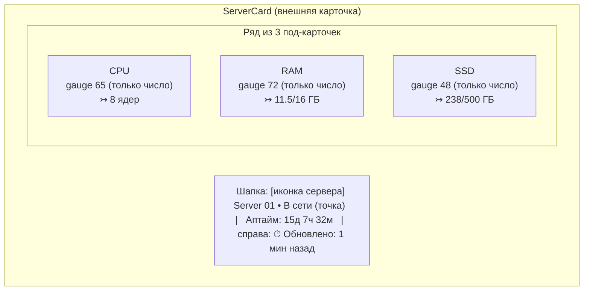

# 08 · Дизайн-система и UI-гайд

Приоритет — **солидный enterprise-вид** (вдохновение Linear / Vercel / Grafana / Datadog), НЕ «типовой ИИ-сайт». Тёмная тема по умолчанию, глубокий нейтральный фон, многослойные поверхности, аккуратная типографика и моноцифры для метрик.

## Эталон карточки (по референсу)

Референс-дизайн: [`docs/assets/reference.png`](assets/reference.png) (исходник также в корне репозитория `reference.png`).




Структура карточки:
1. **Шапка**: иконка сервера (в скруглённом «чипе»), имя крупным полужирным, статус-точка + «В сети / Не в сети», «Аптайм: …» вторичным цветом; справа — иконка часов + «Обновлено: N мин назад». Все подписи — по [словарю локализации](#локализация-ui-русский-словарь-строк).
2. **Три под-карточки** CPU / RAM / SSD — вложенные поверхности на уровень выше фона, тонкая граница, мягкая тень. В каждой:
   - заголовок: иконка метрики в цветном чипе + название (CPU/RAM/SSD) + «…» меню (декоративно на Этапе 1).
   - круговой **gauge** (дуга ~270°, разрыв снизу), градиент по зоне, мягкое внешнее свечение дуги.
   - крупное **моночисло** по центру — **только число, без `%` и без подписи «Usage», без меток `0%`/`100%`** (см. спецификацию Gauge).
   - низ: иконка + абсолютные значения моношрифтом: CPU — `8 ядер` (всегда ядра), RAM — `11.5/16 ГБ`, SSD — `238/500 ГБ`.

> **Ключевое отличие от картинки:** на референсе дуги CPU/RAM/SSD имеют разные «брендовые» цвета (синий/зелёный/фиолетовый). В нашем продукте **цвет дуги определяется ИСКЛЮЧИТЕЛЬНО зоной нагрузки** (зелёный <80 %, жёлтый 80–90 %, красный >90 %) — одинаково для CPU, RAM и SSD. Композиция, форма, свечение, типографика — как в референсе.

> **Карточка не содержит внешних ссылок.** Drill-down ссылки на Grafana в карточке **нет** (удалена на Этапе 1 — [ADR-005, поправка](adr/ADR-005-custom-gauge-vs-grafana-embed.md#поправка-2026-06-30--удаление-drill-down-ссылки-из-карточки)). Grafana доступна администратору напрямую через `/grafana`. Конфигурация `VITE_GRAFANA_URL` удалена.

### Под-карточки метрик

Раскладка метрик — фиксированная `grid-cols-3` (3 под-карточки CPU/RAM/SSD в ряд). Строка детали внизу под-карточки — абсолютные значения моношрифтом (RAM/SSD — `used/total ГБ` с десятичными). На **узких вьюпортах** (планшет-портрет, ширина ≤~823px, страница в 2 колонки) десятичное значение ГБ физически не помещается в под-карточку → значение **контейнерно усекается** (`overflow-hidden` на под-карточке метрики), без наезда на соседние метрики. На десктопе (xl/1280+, max-1400) значение видно целиком. Осознанное упрощение Этапа 1 — [TD-023](100-known-tech-debt.md) (адаптивная раскладка или целые ГБ на узких экранах отложены).

## Цветовые токены (CSS custom properties / Tailwind theme)

Тёмная тема (default). Палитра: нейтральная база (slate/zinc) + один акцент (indigo) + семантические статусы.

| Токен | HEX | Применение |
|-------|-----|-----------|
| `--bg-base` | `#0A0C10` | Фон страницы (глубокий, почти чёрный, синеватый) |
| `--surface-1` | `#11141A` | Внешняя карточка сервера |
| `--surface-2` | `#161A22` | Под-карточка метрики |
| `--surface-3` | `#1E232D` | Hover/elevated, чипы иконок |
| `--border-subtle` | `#232834` | Тонкие границы поверхностей |
| `--border-strong` | `#2E3542` | Границы при hover/focus |
| `--text-primary` | `#E6E9EF` | Основной текст, числа |
| `--text-secondary` | `#9AA4B2` | Подписи (Аптайм, Обновлено, заголовки метрик) |
| `--text-tertiary` | `#5C6573` | Третичный текст, «…»-меню |
| `--accent` | `#6366F1` | Акцент (фокус, primary-кнопка) — indigo-500 |
| `--accent-hover` | `#818CF8` | Hover акцента |
| `--status-green` | `#22C55E` | Зона <80 %, Online |
| `--status-yellow` | `#EAB308` | Зона 80–90 % |
| `--status-red` | `#EF4444` | Зона >90 %, Error/Offline |
| `--gauge-track` | `#262C38` | Незаполненная часть дуги |

Градиенты дуги (от тёмного к светлому тона зоны), для свечения — `filter: drop-shadow` цвета зоны с низкой прозрачностью:
- green: `#16A34A → #4ADE80`
- yellow: `#CA8A04 → #FACC15`
- red: `#DC2626 → #F87171`

> Все три gauge в одной карточке могут иметь разные цвета одновременно — каждый по своей нагрузке.

## Зоны нагрузки

Единый источник порогов (совпадает с backend, [04-api.md](04-api.md#пороги-зон)):

```ts
// единый конфиг, frontend
export const ZONE_THRESHOLDS = { yellow: 80, red: 90 } as const;
export function usageToZone(p: number): "green" | "yellow" | "red" {
  if (p > ZONE_THRESHOLDS.red) return "red";      // > 90
  if (p >= ZONE_THRESHOLDS.yellow) return "yellow"; // 80..90
  return "green";                                   // < 80
}
```

## Типографика

- Основной шрифт: **Inter** (variable). Заголовки — 600/700, текст — 400/500.
- Моноширинный: **JetBrains Mono** — для чисел gauge, процентов, IP, абсолютных значений, uptime.
- Масштаб (rem, базовый 16px):

| Роль | Размер | Вес | Шрифт |
|------|--------|-----|-------|
| Имя сервера | 20px / 1.25 | 700 | Inter |
| Число gauge (только число, без `%`) | 40–44px | 700 | JetBrains Mono |
| Заголовок метрики (CPU…) | 15px | 600 | Inter |
| Вторичный (Аптайм, Обновлено) | 13px | 400 | Inter |
| Абсолютные значения (под gauge) | 12–13px | 500 | JetBrains Mono |

> Подпись «Usage», знак `%` в центре и метки `0%`/`100%` — **удалены** из gauge (см. спецификацию ниже).

## Сетка, отступы, скругления

- Базовая сетка **4 / 8 px**. Внешние отступы карточки 20–24px, между под-карточками 16px.
- Скругления: внешняя карточка `16px`, под-карточка `12px`, чип иконки `8px`, кнопки/инпуты `8–10px`.
- Тени: многослойные мягкие (`0 1px 0 rgba(255,255,255,0.03) inset, 0 8px 24px rgba(0,0,0,0.4)`).
- Сетка карточек серверов (нормативно): **адаптивная по числу колонок**, до **3 карточек в ряд** на широких экранах. Карточка становится у́же (раньше была горизонтально-широкой), но внутренняя композиция сохраняется — шапка + ряд из 3 под-карточек CPU/RAM/SSD.
  - Раскладка: **1 колонка** на мобильном (<768px), **2 колонки** на `md`/`lg` (≥768px), **3 колонки** на `xl`/`2xl` (≥1280px). Tailwind: `grid-cols-1 md:grid-cols-2 xl:grid-cols-3`.
  - `gap: 24px` (сохранён).
  - Под-карточки CPU/RAM/SSD внутри карточки остаются в один горизонтальный ряд из 3 (`grid-cols-3`, gap 16px) — при сужении карточки gauge и подписи масштабируются, ряд не переносится.
  - Карточка «+ Добавить» — обычная ячейка той же сетки.

## Компонент Gauge (кастомный SVG)

Спецификация (нормативно для frontend):

- **Форма**: дуга 270°, начало внизу-слева (135°), конец внизу-справа (45°), разрыв 90° снизу. Радиус ~70, толщина обводки 12–14, `stroke-linecap: round`.
- **Слои**:
  1. трек (`--gauge-track`) — полная дуга 270°.
  2. прогресс — дуга на `usage%` от 270°, `stroke` = linear-gradient зоны.
  3. свечение — копия прогресс-дуги с `filter: drop-shadow(0 0 6px <zone>)`.
- **Центр**: **только моночисло** (значение, округление до целого), **без знака `%` и без подписи «Usage»**. Например, показывается `65`, а не `65%` и без слова «Usage» под ним. Это упрощает визуал и устраняет визуальный шум при узких карточках.
- **Метки 0%/100% — УБРАНЫ.** Подписи `0%` у левого конца и `100%` у правого конца дуги не отображаются (раньше наезжали на дугу). У gauge нет min/max-подписей.
- **Анимация**: при изменении значения — плавный transition `stroke-dashoffset` (300–500 мс, ease-out). При первом появлении — анимация от 0 до значения. Уважать `prefers-reduced-motion` (отключать анимацию).
- **Доступность**: семантика процента сохраняется в ARIA, хотя `%` визуально не выводится — `role="meter"`, `aria-valuenow=<value>`, `aria-valuemin=0`, `aria-valuemax=100`, `aria-label="Загрузка CPU 65 процентов"`.
- **Props (контракт)**: `value:number(0..100)`, `label:"CPU"|"RAM"|"SSD"`, `detail:{value,total,unit}`, `size?`, цвет — вычисляется из `usageToZone(value)` (НЕ передаётся снаружи как «брендовый»). `value` — то же `usage_percent` из API (контракт API не меняется; меняется только отображение: без `%` и без «Usage»/меток).

## Карточка «+ Добавить» (glass / blur)

- Тот же размер и форма, что карточка сервера, но:
  - фон полупрозрачный + `backdrop-filter: blur(...)` (glass), тонкая пунктирная/светлая граница.
  - по центру — крупный знак «+» и текст «Добавить».
  - hover: усиление границы/свечения акцентом, лёгкий подъём (`translateY(-2px)`), курсор pointer.
- Клик → открывает `AddServerModal` (Radix Dialog).

## Модалка добавления (`AddServerModal`)

- Radix Dialog, тёмная поверхность `--surface-1`, overlay с затемнением+blur.
- 4 поля: **Название**, **IP** (моношрифт, валидация формата), **Пользователь**, **Пароль** (type=password, toggle видимости).
- Кнопки: «Отмена» (ghost) / «Добавить» (primary, акцент). Состояние loading на «Добавить» (спиннер, disabled).
- Ошибки API: 409 → «Сервер с таким IP уже добавлен»; 422 → подсветка поля IP; общая → toast.
- Закрытие по Esc/overlay (если не идёт отправка), focus-trap, возврат фокуса.

## Режим редактирования модалок (add + edit)

Модалки `AddServerModal` и `AddAiKeyModal` работают в **двух режимах** — `add` (создание) и `edit` (редактирование существующей карточки). Форма переиспользуется, меняются: заголовок/подпись действия, префил полей, набор редактируемых полей, целевой запрос. Решение — [ADR-011](adr/ADR-011-poryadok-blokov-server-side-dnd-kit.md).

**Открытие edit — по клику на карточку** (короткий клик, см. [«Перестановка карточек»](#перестановка-карточек-drag-and-drop)). Кнопка **Удалить** внутри карточки — `stopPropagation`, edit не открывает.

### `AddServerModal` — режим edit
- Заголовок: **«Изменить сервер»**; кнопка действия — **«Сохранить»** (вместо «Добавить»).
- **Редактируется только «Название»** (префил текущим `name`, 1–64). Поля **IP / Пользователь / Пароль** в edit-режиме **не отображаются** (переустановка/смена доступа вне scope Этапа 1 — [modules/servers](modules/servers/README.md#out-of-scope)).
- Отправка → `PATCH /api/servers/{id} {name}`. Успех → toast **«Сервер обновлён»**, карточка обновляется из `GET /api/servers`. Ошибка `400` (пустое/длинное имя) → подсветка поля; общая → toast.

### `AddAiKeyModal` — режим edit
- Заголовок: **«Изменить ключ»**; кнопка действия — **«Сохранить»**.
- Префил: **Название** (текущее `name`), **Провайдер** (текущий `provider`, Select). **Поле «Ключ» — ПУСТОЕ** (секрет никогда не префилится: backend его не отдаёт).
- Под полем «Ключ» — подсказка вторичным цветом: **«Оставьте пустым, чтобы не менять ключ»**. Иконка-глаз (toggle) показывает **вводимое** значение (по умолчанию скрыто, `type=password`).
- Отправка → `PATCH /api/ai-keys/{id}` с изменёнными полями; пустое поле «Ключ» → `key` не отправляется (ключ не меняется). Успех → toast **«Ключ обновлён»**. При смене `provider` или `key` карточка возвращается в статус **Проверка…** и возобновляется polling `GET /api/ai-keys/{id}/status` до выхода из `pending` (см. [modules/ai-keys](modules/ai-keys/README.md#редактирование-ключа-patch-нормативно)).
- Ошибки: `422` (невалидный provider) / `400` (длина) → подсветка поля; общая → toast.

> Общее: закрытие Esc/overlay (если не идёт отправка), focus-trap, возврат фокуса на карточку-источник. Loading-состояние на кнопке «Сохранить».

## Перестановка карточек (drag-and-drop)

Перестановка карточек серверов и AI-ключей мышью/тачем (@dnd-kit), порядок хранится на сервере (`position`). Решение и обоснование — [ADR-011](adr/ADR-011-poryadok-blokov-server-side-dnd-kit.md).

**Разведение жестов (нормативно):**
- **вся карточка — область хвата** (отдельной drag-ручки/grip-иконки НЕТ);
- **короткий клик** (нажатие < 200 мс без сдвига) → открывает **edit-модалку** (см. [«Режим редактирования»](#режим-редактирования-модалок-add--edit));
- **зажать ~200 мс + движение** → старт перетаскивания. Технически — `PointerSensor` с `activationConstraint: { delay: 200, tolerance: 5 }`;
- кнопка **Удалить** на карточке — `stopPropagation`: не тащит и не открывает edit.

**Область перестановки:**
- **Серверы** — единый список, свободная перестановка любой карточки.
- **AI-ключи** — **только внутри своей провайдер-секции** (OpenAI ↔ OpenAI, Anthropic ↔ Anthropic). Между секциями карточки не перемещаются (провайдер меняется только через edit).

**Визуальный фидбэк:** во время drag — приподнятая тень/затемнение перетаскиваемой карточки (drag-overlay), плавное смещение соседних (@dnd-kit `sortable`-анимация), полупрозрачный «слот» на месте исходной позиции. Уважать `prefers-reduced-motion` (сократить/отключить анимацию смещения).

**Сохранение порядка:** на `onDragEnd` — оптимистичное обновление порядка в кэше TanStack Query, затем `PATCH /api/servers/order {ids}` или `PATCH /api/ai-keys/order {provider, ids}`. При ошибке запроса — откат к прежнему порядку + инвалидация списка + toast **«Не удалось сохранить порядок»**. Порядок отрисовки списка всегда берётся из `position` (`GET`-ответа).

**Доступность:** карточки остаются фокусируемыми; edit (Enter/клик) и удаление доступны с клавиатуры. Перетаскивание с клавиатуры (@dnd-kit `KeyboardSensor`) — опционально на Этапе 1 ([TD-022](100-known-tech-debt.md)); при реализации — экранному диктору отдаются русские анонсы (взятие/перемещение/отпускание).

## Состояния UI (обязательны)

| Состояние | Поведение |
|-----------|-----------|
| **loading (список)** | Skeleton-карточки (мягкое мерцание поверхностей). |
| **empty** | Только карточка «+ Добавить» по центру + подсказка. |
| **provisioning** | Карточка с `provision_status` pending/installing: подпись «Ожидание»/«Установка…» (см. [словарь](#локализация-ui-русский-словарь-строк)), спиннер, gauge скрыты или в состоянии «—». |
| **error (провижининг)** | Красная акцентная граница, подпись «Ошибка» + текст ошибки, кнопка «Удалить». |
| **offline** | Статус-точка красная, подпись «Не в сети», gauge приглушены/«—», «Обновлено» показывает давность. |
| **hover** | Подъём карточки, усиление границы. |
| **focus** | Видимый focus-ring (`--accent`, 2px, offset). |
| **disabled** | Снижение прозрачности, `cursor: not-allowed`. |
| **toast** | Успех добавления/удаления, ошибки (sonner), позиция top-right. |

## Доступность (a11y)

- Контраст текста ≥ WCAG AA (NFR-8). Не полагаться только на цвет статуса — дублировать текстом («В сети», «Не в сети», «Ошибка»).
- Все интерактивные элементы фокусируемы, видимый focus-ring.
- Gauge — `role="meter"` с aria-значениями (см. выше).
- Модалка — корректный focus-management (Radix обеспечивает).
- Поддержка `prefers-reduced-motion`.

## Экран входа (двухшаговый)

- Центрированная карточка на `--bg-base`, минимализм. **Только блок логина (форма) — без брендинга**: НЕ показывать заголовок продукта (например, «CRM»), подзаголовок/подпись (например, «Вход в панель администратора») и логотип над формой. На странице — единственная карточка с полями/кнопками/сообщением об ошибке, ничего сверх этого.
- **Шаг 1**: поле «Логин» + кнопка «Далее». Переход — клиентский (без запроса), см. [ADR-002](adr/ADR-002-dvuhshagovyy-auth.md).
- **Шаг 2**: показывается введённый логин (с кнопкой «назад»/сменить) + поле «Пароль» + кнопка «Войти». Запрос `POST /api/auth/login`.
- Ошибка → единое сообщение «Неверный логин или пароль» (без раскрытия, что именно), shake-анимация поля (с учётом reduced-motion).
- После успеха — редирект на `/dashboard` (дефолтная страница, [Навигация](#навигация-верхние-вкладки-applayout); ранее `/mail`, ещё ранее `/servers`).

## Локализация UI (русский словарь строк)

Весь пользовательский интерфейс — **на русском**. Технические идентификаторы (значения `provision_status`, коды ошибок, `unit:"cores"/"GB"` в API) остаются английскими в API; локализуется **только отображение**. Нормативный словарь UI-строк (frontend использует ровно эти формулировки):

### Статусы сервера и провижининга
| Источник (API/тех.) | UI (рус.) |
|---------------------|-----------|
| online / `up==1` | **В сети** |
| offline / `up==0` | **Не в сети** |
| `provision_status: pending` | **Ожидание** |
| `provision_status: installing` | **Установка…** |
| `provision_status: online` | **В сети** |
| `provision_status: error` | **Ошибка** |

### Подписи карточки
| Элемент | UI (рус.) |
|---------|-----------|
| Uptime | **Аптайм** (например, «Аптайм: 15д 7ч 32м») |
| Last updated | **Обновлено** (например, «Обновлено: 1 мин назад») |
| Заголовки метрик | `CPU` / `RAM` / `SSD` (оставляем латиницей — общепринятые тех. сокращения) |

Формат uptime (рус. сокращения): `15д 7ч 32м` (`д`/`ч`/`м`). Воспроизводимость числового примера — см. [06-testing-strategy.md](06-testing-strategy.md): `1323120s → 15д 7ч 32м`.

### Относительное время («N min ago»)
| Условие | UI (рус.) |
|---------|-----------|
| < 60 с | **только что** |
| 1–59 мин | **N мин назад** |
| 1–23 ч | **N ч назад** |
| ≥ 1 дн | **N дн назад** |

### Единицы измерения
| API `unit` | UI (рус.) | Примечание |
|------------|-----------|-----------|
| `"GB"` | **ГБ** | например, `11.5/16 ГБ` |
| `"cores"` | **ядра** (с формами мн.ч.) | CPU detail, `value:null` → показываем `total` + слово |

Русские формы множественного числа для «ядро» (по `total`, правило по последним цифрам):
- оканчивается на 1 (кроме 11) → **ядро** (`1 ядро`, `21 ядро`);
- на 2–4 (кроме 12–14) → **ядра** (`2 ядра`, `8 → ядер`… см. ниже);
- на 0, 5–9, 11–14 → **ядер** (`5 ядер`, `8 ядер`, `11 ядер`).

Примеры (проверяемо правилом): `1 → «1 ядро»`, `2 → «2 ядра»`, `4 → «4 ядра»`, `5 → «5 ядер»`, `8 → «8 ядер»`, `11 → «11 ядер»`, `22 → «22 ядра»`.

### Кнопки и общие действия
| Контекст | UI (рус.) |
|----------|-----------|
| Карточка «+ Добавить» | **+ Добавить** |
| Модалка (add) — поля | **Название**, **IP**, **Пользователь**, **Пароль** |
| Модалка (add) — кнопки | **Отмена** / **Добавить** |
| Модалка (edit) — заголовок | **Изменить сервер** |
| Модалка (edit) — поле | **Название** (только оно редактируется) |
| Модалка (edit) — кнопки | **Отмена** / **Сохранить** |
| Кнопка на карточке ошибки | **Удалить** |
| Экран входа шаг 1 | поле **Логин**, кнопка **Далее** |
| Экран входа шаг 2 | поле **Пароль**, кнопки **Войти** / **Назад** |

### Empty state, toast, ошибки
| Контекст | UI (рус.) |
|----------|-----------|
| Empty state (нет серверов) | заголовок **«Пока нет серверов»**, подсказка **«Добавьте первый сервер, чтобы начать мониторинг»** |
| Провижининг (installing) | **«Установка агента…»** |
| Toast успех (добавление) | **«Сервер добавлен»** |
| Toast успех (редактирование) | **«Сервер обновлён»** |
| Toast успех (удаление) | **«Сервер удалён»** |
| Toast ошибка (перестановка) | **«Не удалось сохранить порядок»** |
| Ошибка входа | **«Неверный логин или пароль»** |
| Ошибка 409 (дубликат IP) | **«Сервер с таким IP уже добавлен»** |
| Ошибка 422 (невалидный IP) | **«Некорректный IP-адрес»** |
| Ошибка метрик/Prometheus | **«Метрики временно недоступны»** |
| Общая сетевая ошибка | **«Не удалось выполнить запрос. Повторите попытку»** |

> Реализация локализации (захардкоженные русские строки vs i18n-библиотека) — на усмотрение frontend; на Этапе 1 один язык (русский), отдельная i18n-инфраструктура не требуется.

## Скрытие полосы прокрутки (нормативно)

По явному требованию продукта визуальная **полоса прокрутки (scrollbar) скрывается** на ключевых прокручиваемых поверхностях — **при полном сохранении прокрутки**. Скрывается только сама полоса (визуальный элемент); контент остаётся **полностью прокручиваемым и доступным** колёсиком мыши, тачпадом/тач-жестом, клавиатурой (PgUp/PgDn/стрелки/Home/End) и программно. Это **не** скрытие контента и **не** нарушение правила CLAUDE.md «переполнение решается размером, а не скрытием контента»: контент никуда не исчезает и не обрезается — прокрутка работает, просто без видимого бара.

> **Разграничение (важно, снимает прежний ложный запрет).** Ранее в docs/промтах фигурировал запрет «не прятать скроллбар через `overflow:hidden`/`scrollbar-width:none`». Он относился к попыткам спрятать **сам скролл/контент** (`overflow:hidden` убирает возможность прокрутки → часть контента становится недостижимой) — это и запрещено. Скрытие **только полосы** при **сохранённой** прокрутке (`scrollbar-width:none` + `::-webkit-scrollbar{display:none}`, **без** `overflow:hidden`) — **разрешено** и является целевым поведением по явному запросу пользователя. Запрет на скрытие/обрезку значимого контента (`overflow-hidden`/`truncate`/`clip` поверх значений/чисел) остаётся в силе — это другой случай.

### Утилита `scrollbar-none`

Единая кросс-браузерная утилита скрытия полосы. Реализуется как класс `scrollbar-none` через Tailwind-плагин или глобальный CSS-слой (`@layer utilities` в глобальном `index.css`; **без новой зависимости**):

```css
.scrollbar-none {
  scrollbar-width: none;        /* Firefox */
  -ms-overflow-style: none;     /* legacy Edge/IE */
}
.scrollbar-none::-webkit-scrollbar {
  display: none;                /* Chrome/Safari/WebKit */
}
```

**Инвариант:** класс НЕ содержит `overflow:hidden` и не отменяет прокрутку — прокрутка задаётся отдельно (`overflow-y:auto` на контейнере / нативный поток документа), `scrollbar-none` лишь прячет бар. Кроссбраузерность: Chrome/WebKit (`::-webkit-scrollbar`) + Firefox (`scrollbar-width`).

### Где применяется

| Поверхность | Контейнер | Как |
|-------------|-----------|-----|
| **MAIL — список писем** | левая панель списка (скролл-контейнер `overflow-y-auto` в `MailPage`) | класс `scrollbar-none` на скролл-контейнере списка |
| **MAIL — тело письма (текст)** | контейнер `body_text` (блок с `overflow-auto`) | класс `scrollbar-none` на контейнере тела |
| **SERVERS / AI-KEYS** | скролл **документа** (`body`) | глобальное скрытие полосы документа (см. ниже) |

- **MAIL.** Прокрутка списка (бесконечная лента) и тела письма — внутри своих контейнеров (`overflow-y-auto`/`overflow-auto`, см. [Full-bleed](#full-bleed-layout-нормативно) и [Layout master-detail](#layout-master-detail)). На эти контейнеры добавляется `scrollbar-none`. Прокрутка колёсиком/тач/клавиатурой сохраняется; `IntersectionObserver`-догрузка ленты не затрагивается. **sandbox-iframe тела письма НЕ трогаем** — у него собственный документ, его внутренний скролл вне нашего CSS ([изоляция HTML](#деталь-письма-правая-панель); sandbox не ослабляется).
- **SERVERS / AI-KEYS** скроллятся **нативным скроллом `body`** (обычный поток документа, shell `min-h-screen`, см. [Full-bleed](#full-bleed-layout-нормативно)). Их полоса скрывается на уровне **документа** глобально: `html, body { scrollbar-width: none; -ms-overflow-style: none }` + `html::-webkit-scrollbar, body::-webkit-scrollbar { display: none }` (в глобальном `index.css`). Прокрутка `body` сохраняется.

### Выбранный подход для SERVERS / AI-KEYS: глобальное скрытие полосы документа

Из двух вариантов — **(A)** глобально скрыть полосу документа (`html`/`body`), сохранив обычный поток документа; или **(B)** вернуть не-mail к container-scroll (`shell h-screen`, `main overflow-y-auto` + `scrollbar-none` на `main`) — выбран **вариант A (глобальное скрытие полосы документа)**.

**Обоснование:**
1. **Минимальность изменения.** Вариант A не трогает недавно стабилизированную архитектуру shell/main (два режима по маршруту; обычный поток документа для не-mail — фиксы 2026-07-06 контейнерного/фантомного скролла, [changelog mail](modules/mail/README.md#changelog)). Вариант B **откатил бы** не-mail обратно к container-scroll (`main overflow-y-auto`), который те фиксы намеренно устранили → риск возврата регресса «панели скролла» и scroll-dependent ширины. A добавляет лишь одно CSS-правило на `html/body`, не меняя ни shell-режимы, ни ширину `1400px` (scroll-independent сохраняется).
2. **Скролл-контейнер не переносится.** В варианте B полоса всё равно жила бы внутри `<main>` (пусть и скрытая) — это воскрешает конфигурацию, дававшую баги ширины. A оставляет скролл на `body`.
3. **Скоуп приемлем.** Правило `html/body` скроет полосу документа во **всём** SPA. Это ок: `/mail` — full-bleed, `body` не скроллит (страница `h-screen overflow-hidden`, скролл внутри панелей); экран входа не скроллит. Единственные body-скроллящие поверхности — `/servers` и `/ai-keys`, где скрытие как раз и требуется. Побочных «жертв» нет.

Компромисс варианта A (осознанный): полоса документа скрыта глобально — если в будущем появится ещё одна body-скроллящая страница, её полоса тоже будет скрыта. Для внутренней админ-панели приемлемо; при необходимости точечного скоупа позже можно перейти к классу `scrollbar-none` на конкретной обёртке (сейчас не делается ради минимальности).

**Инварианты (не регрессируют):** прокрутка работает везде (контент доступен целиком); `/mail` по-прежнему заполняет высоту без пустого места снизу; ширина `/servers` == `/ai-keys` (`1400px`, scroll-independent) сохраняется; sandbox-iframe тела письма не трогаем; кроссбраузерность Chrome/WebKit + Firefox.

## Навигация (верхние вкладки, `AppLayout`)

С появлением второй страницы вводится общий **`AppLayout`** с верхней навигацией-вкладками (ранее заголовок был зашит в `ServersPage`). Вкладки (`NavLink`, react-router):

Порядок вкладок (слева направо) — **«Дашборд» первая** ([ADR-017](adr/ADR-017-dashboard-client-aggregation-mail-server-filters.md)):

| # | Вкладка | Маршрут |
|---|---------|---------|
| 1 | **Дашборд** | `/dashboard` |
| 2 | **Почты** | `/mail` |
| 3 | **Серверы** | `/servers` |
| 4 | **ИИ - ключи** | `/ai-keys` |
| 5 | **Прокси** | `/proxies` |
| 6 | **Бэки** | `/backends` |

Вкладка **«Прокси»** (`/proxies`) добавлена пятой ([ADR-019](adr/ADR-019-proxies-availability-monitor.md)); идёт по **не-full-bleed** ветке `AppLayout` (обычный поток документа, как «Серверы»/«ИИ - ключи»). Вкладка **«Бэки»** (`/backends`) добавлена шестой ([ADR-020](adr/ADR-020-backends-healthcheck-monitor.md)); та же **не-full-bleed** ветка.

- **Дефолтный маршрут — `/dashboard`:** index-роут `/` → `Navigate to="/dashboard" replace`; **fallback `*`** (несуществующий путь) → `Navigate to="/dashboard" replace`; редирект после успешного входа — на **`/dashboard`** (ранее `/mail`). Обоснование — «Дашборд» стал обзорной стартовой страницей ([ADR-017](adr/ADR-017-dashboard-client-aggregation-mail-server-filters.md)). Прежний дефолт `/mail` ([ADR-013](adr/ADR-013-mail-newest-first-master-detail-inline-reply.md)) заменён.
- **Layout-ветка:** `/dashboard` идёт по **не-full-bleed** ветке `AppLayout` (обычный поток документа, `min-h-screen`, внутренний `mx-auto max-w-[1400px] px-6 py-8`) — как «Серверы»/«ИИ - ключи». Full-bleed-режим остаётся эксклюзивно у `/mail` (`isFullBleed = pathname.startsWith('/mail')`, см. [Full-bleed](#full-bleed-layout-нормативно)).
- Стиль вкладок: горизонтальный ряд в шапке, активная вкладка — акцентная подсветка (`--accent`, нижняя граница/подчёркивание), неактивная — `--text-secondary`, hover → `--text-primary`. Видимый focus-ring (`--accent`, 2px).
- Все страницы — защищённые (внутри `AppLayout` под auth-guard). Заголовок продукта/бренд в шапке — по текущему решению отсутствует (минимализм), в шапке только вкладки.
- Тёмная тема и токены — те же, что для страницы «Серверы».

## Страница «Дашборд»

Первая вкладка `AppLayout` (`/dashboard`, дефолтный маршрут после логина). Обзорная страница-сводка: сетка **кликабельных карточек** по разделам со счётчиками. Решение — [ADR-017](adr/ADR-017-dashboard-client-aggregation-mail-server-filters.md). Токены/шрифты — те же тёмные, что на остальных страницах. Layout — **не-full-bleed** (обычный поток документа, `mx-auto max-w-[1400px] px-6 py-8`, как «Серверы»/«ИИ - ключи»; см. [Full-bleed](#full-bleed-layout-нормативно)).

### Клиентская агрегация (нет backend-агрегатора)

Дашборд собирает счётчики **на фронте** из существующих list-эндпоинтов — отдельного backend-эндпоинта нет ([ADR-017](adr/ADR-017-dashboard-client-aggregation-mail-server-filters.md), NFR-1). Каждая карточка сама запрашивает свой источник (TanStack Query, по образцу `features/*`) и считает значения клиентски. Наружу фронт не ходит — только `/api/*` через `lib/api`.

### Сетка карточек

- **Сетка** — адаптивная (`grid-cols-1 md:grid-cols-2 xl:grid-cols-3`, `gap 24px`), те же токены/скругления/тени, что у карточек серверов и ключей. Структура **расширяема** — новые разделы добавляются той же карточкой-паттерном («и т.д.»).
- **Карточка раздела (`Card interactive`)** — кликабельная: клик по карточке = навигация (`useNavigate`) на страницу раздела. Внешний вид `--surface-1`, скругление 16px; hover — подъём (`translateY(-2px)`)/усиление границы акцентом, `cursor: pointer`; фокусируема (`role`/`tabIndex`, видимый focus-ring `--accent`, активация Enter/Space — a11y, NFR-8).
- **Содержимое карточки:** иконка раздела в чипе (`--surface-3`) + заголовок раздела (Inter 20/700) + **статус-строка** счётчиков (**`Badge`-тона**): «активная» группа — `--status-green`, «неактивная» — `--status-red` (или нейтральный тон для семантически-нейтральных). Счётчики моношрифтом (JetBrains Mono). Не полагаться только на цвет — счётчик всегда подписан текстом (a11y). Поведение статус-строки — по [Статус-строке карточки](#статус-строка-карточки-нормативно).

### Блоки (Этап 1)

| Карточка | Переход | Источник | Счётчики (клиентский подсчёт) |
|----------|---------|----------|-------------------------------|
| **Почты** | `/mail` | `GET /api/mail/mailboxes` | **Активные** = ящики с `is_active=true` (green, всегда виден) / **Неактивные** = `is_active=false` (red/neutral, скрыт при `0`) |
| **Серверы** | `/servers` | `GET /api/servers` | **В сети** = `items` с `online=true` (green, всегда виден) / **Не в сети** = `online=false` (red, скрыт при `0`) |
| **ИИ - ключи** | `/ai-keys` | `GET /api/ai-keys` | **Работает** = `check_status='working'` (green, всегда виден) / **Не работает** = `check_status='error'` (red, скрыт при `0`); опц. **Проверяется** = `check_status='pending'` (neutral, скрыт при `0`) |

> **Скрытие нулевых неактивных счётчиков (нормативно).** «Неактивный» счётчик (**Неактивные** / **Не в сети** / **Не работает**), а также любой вторичный статус (**Проверяется**) **не рендерится**, когда его значение `= 0`. Активный счётчик (**Активные** / **В сети** / **Работает**) виден **всегда** (значимый контент), даже если равен `0` (в этом случае показывается `0`, что согласуется с состоянием **empty** ниже). Т.е. при «всё зелёное» (нет неактивных/ошибок/проверяемых) на карточке остаётся только активный счётчик. Правило распространяется на все три карточки. Это не скрытие значимого контента — убирается лишь избыточный нулевой вторичный счётчик, активный остаётся полностью виден.

### Состояния карточки (независимы для каждой)

| Состояние | Поведение |
|-----------|-----------|
| **loading** | Skeleton карточки (мягкое мерцание поверхности вместо счётчиков). |
| **error** | Источник вернул ошибку (`502`/сеть) → в карточке подпись **«Не удалось загрузить»** + кнопка **«Повторить»**; переход по клику остаётся доступен. |
| **empty** | Источник вернул пустой список → активный счётчик показывает `0` (виден всегда), неактивный при `0` скрыт (см. [Скрытие нулевых неактивных счётчиков](#блоки-этап-1)); карточка остаётся кликабельной. |
| **почта не настроена** | Карточка «Почты» при `503 mail_not_configured` (`GET /api/mail/mailboxes`) → нейтральная подпись **«Сервис почт не настроен»** вместо счётчиков; переход на `/mail` остаётся. |

- Ошибки/пустота **одной** карточки не ломают остальные — состояния изолированы (каждая карточка = свой запрос).

### Статус-строка карточки (нормативно)

Ряд счётчиков карточки **центрируется по горизонтали** (`justify-center`), в обоих случаях:

- **Только активный счётчик** (всё зелёное — все вторичные счётчики `= 0` и скрыты): единственный активный `Badge` стоит **по центру** статус-строки.
- **Активный + неактивный** (есть неактивные/ошибки/проверяемые `> 0`): видимые счётчики центрируются **как группа** (активный + видимые вторичные) — группа `Badge`-ей по центру с обычным внутренним `gap`.

Скрытые нулевые вторичные счётчики (см. [Скрытие нулевых неактивных счётчиков](#блоки-этап-1)) не занимают место и не смещают центрирование. Badge-тона при этом сохраняются: green — активные, red — неактивные, neutral — семантически-нейтральные. Центрирование применяется единообразно ко всем трём карточкам.

> _Уточнено 2026-07-06: скрытие нулевых неактивных/вторичных счётчиков + центрирование статус-строки карточек дашборда._

### Локализация страницы «Дашборд»

| Контекст | UI (рус.) |
|----------|-----------|
| Вкладка / заголовок | **Дашборд** |
| Карточка «Почты» — счётчики | **Активные** (всегда) / **Неактивные** (скрыт при `0`) |
| Карточка «Серверы» — счётчики | **В сети** (всегда) / **Не в сети** (скрыт при `0`) |
| Карточка «ИИ - ключи» — счётчики | **Работает** (всегда) / **Не работает** (скрыт при `0`) (опц. **Проверяется**, скрыт при `0`) |
| Ошибка загрузки карточки | **«Не удалось загрузить»** |
| Кнопка повтора | **Повторить** |
| Почта не настроена (карточка «Почты») | **«Сервис почт не настроен»** |

### Иконки дашборда

`lucide-react`: `layout-dashboard`/`gauge` (вкладка «Дашборд»), `mail`/`inbox` (карточка «Почты»), `server` (карточка «Серверы»), `key`/`key-round` (карточка «ИИ - ключи»).

## Страница «Серверы»

Композиция страницы описана выше ([Эталон карточки](#эталон-карточки-по-референсу), [Сетка](#сетка-отступы-скругления), [Состояния UI](#состояния-ui-обязательны), [Перестановка карточек](#перестановка-карточек-drag-and-drop)). Дополнительно (нормативно):

- **Без кнопки «Обновить».** Ручной кнопки обновления списка серверов в шапке страницы **нет** (ранее была в шапке `ServersPage` и вызывала `refetch`). Данные обновляются **штатным polling'ом/`refetch`** TanStack Query (фоновая переинвалидация по интервалу/фокусу окна), без явной кнопки. Прочая композиция страницы «Серверы» не изменяется.

## Страница «ИИ - ключи»

Зеркалит страницу «Серверы» по композиции и токенам. Сетка — та же адаптивная (`grid-cols-1 md:grid-cols-2 xl:grid-cols-3`, gap 24px). Ячейки: `AiKeyCard` на каждый ключ + `AddAiKeyCard`.

### Группировка ИИ-ключей по провайдерам

Ключи сгруппированы в **две секции** по `provider`: **OpenAI** и **Anthropic** (решение — [ADR-011](adr/ADR-011-poryadok-blokov-server-side-dnd-kit.md), контракт — [modules/ai-keys](modules/ai-keys/README.md#группировка-по-провайдерам-и-перестановка-нормативно)).

- **Заголовок секции** — название провайдера (**OpenAI** / **Anthropic**) в стиле подзаголовка (Inter 15–16/600, `--text-secondary`), с тонким разделителем/отступом сверху. Опционально — счётчик ключей в секции вторичным цветом.
- Внутри секции — своя адаптивная сетка карточек (те же токены), в порядке `position`. Каждая секция содержит **свою** `AddAiKeyCard` (при добавлении из секции провайдер можно предвыбрать в модалке; поле остаётся редактируемым).
- **Порядок секций** фиксирован: сначала **OpenAI**, затем **Anthropic**.
- **Пустые секции скрываются:** если у провайдера нет ключей — секция (заголовок) не рендерится. Общий empty-state (нет ни одного ключа) — как раньше: только одна карточка **«+ Добавить»** + подсказка **«Пока нет ключей»** / **«Добавьте первый AI-ключ»**, без заголовков секций.
- Перестановка — **внутри секции** (см. [«Перестановка карточек»](#перестановка-карточек-drag-and-drop)); между секциями карточки не перемещаются.
- Frontend получает **плоский** `GET /api/ai-keys` и группирует по `provider`, сохраняя относительный порядок (`position`).

### `AiKeyCard`

Внешняя карточка `--surface-1`, скругление 16px, те же тени/границы, что у `ServerCard`. Содержимое:

1. **Шапка:** иконка ключа в чипе (`--surface-3`) + имя ключа (крупный полужирный, Inter 20/700) + статус-бейдж (`Badge`).
2. **Провайдер:** подпись вторичным цветом — **OpenAI** / **Anthropic** (по `provider`).
3. **Маска ключа:** `key_masked` моношрифтом (JetBrains Mono, `--text-secondary`), например `sk-p…bA3T`. **Полный ключ не показывается никогда.**
4. **Причина ошибки:** при `check_status = error` — строка с `error_message` (красный акцент).
5. **Действие:** кнопка **Удалить** (как на карточке сервера в ошибке).

Статус-бейдж по `check_status`:

| `check_status` | UI-текст | Цвет |
|----------------|----------|------|
| `working` | **Работает** | `--status-green` |
| `error` | **Не работает** | `--status-red` |
| `pending` | **Проверка…** (спиннер) | `--text-secondary` / нейтральный |

> Не полагаться только на цвет — статус всегда дублируется текстом (NFR-8, a11y).

### `AddAiKeyCard` и `AddAiKeyModal`

- `AddAiKeyCard` — glass/blur-ячейка, идентична `AddServerCard` (крупный «+» и текст «Добавить»). Клик → `AddAiKeyModal`.
- `AddAiKeyModal` (Radix Dialog, `--surface-1`, overlay blur). Поля:
  - **Название** (`Input`, 1–64).
  - **Провайдер** (`Select`, значения OpenAI/Anthropic).
  - **Ключ** (`Input type=password`, toggle видимости; моношрифт).
- Кнопки: **Отмена** (ghost) / **Добавить** (primary, loading-спиннер). Закрытие Esc/overlay (если не идёт отправка), focus-trap, возврат фокуса.
- После успеха — toast **«Ключ добавлен»**, карточка появляется со статусом **Проверка…**, лёгкий polling статуса до выхода из `pending`.

## Компонент `Select`

Новый UI-примитив. **Реализация — нативный `<select>`**, стилизованный Tailwind (без новой зависимости; `@radix-ui/react-select` НЕ добавляется — [02-tech-stack.md](02-tech-stack.md#frontend), [modules/ai-keys](modules/ai-keys/README.md#новый-ui-примитив-select)). Причина: два значения, доступность и клавиатурная навигация обеспечиваются нативным контролом (NFR-1, a11y).

- Внешний вид: тёмная поверхность `--surface-2`/`--surface-3`, граница `--border-subtle`, скругление 8–10px, кастомная стрелка (иконка `chevron-down`), видимый focus-ring (`--accent`). Высота/паддинги согласованы с `Input`.
- Props (контракт): `value`, `onChange`, `options: {value, label}[]`, `id`/`name`, `disabled`.
- Значения для формы ключа: `{value:"openai", label:"OpenAI"}`, `{value:"anthropic", label:"Anthropic"}`.
- Значения для формы прокси (тип): `{value:"http", label:"HTTP"}`, `{value:"https", label:"HTTPS"}`, `{value:"socks5", label:"SOCKS5"}` (тот же примитив, три опции — [Страница «Прокси»](#страница-прокси)).

### Состояния UI страницы «ИИ - ключи»

Те же паттерны, что у серверов ([Состояния UI](#состояния-ui-обязательны)): loading (skeleton-карточки), empty (только `AddAiKeyCard` + подсказка), pending («Проверка…», спиннер), error (акцентная граница + причина + «Удалить»), toast успех/ошибка, обработка сетевых ошибок.

## Локализация страницы «ИИ - ключи»

Русский словарь UI-строк для страницы ключей.

Нормативные строки (frontend использует ровно эти формулировки; технические `provider=openai/anthropic`, `check_status` — английские в API):

### Навигация и статусы ключа
| Источник (API/тех.) | UI (рус.) |
|---------------------|-----------|
| вкладка серверов | **Серверы** |
| вкладка ключей | **ИИ - ключи** |
| `check_status: working` | **Работает** |
| `check_status: error` | **Не работает** |
| `check_status: pending` | **Проверка…** |
| `provider: openai` | **OpenAI** |
| `provider: anthropic` | **Anthropic** |

### Подписи и поля
| Элемент | UI (рус.) |
|---------|-----------|
| Заголовок поля/значения ключа | **Ключ** |
| Поле выбора провайдера | **Провайдер** |
| Заголовки секций провайдеров | **OpenAI** / **Anthropic** |
| Модалка (add) — поля | **Название**, **Провайдер**, **Ключ** |
| Модалка (add) — кнопки | **Отмена** / **Добавить** |
| Модалка (edit) — заголовок | **Изменить ключ** |
| Модалка (edit) — подсказка под полем «Ключ» | **Оставьте пустым, чтобы не менять ключ** |
| Модалка (edit) — кнопки | **Отмена** / **Сохранить** |
| Кнопка на карточке | **Удалить** |
| Карточка «+ Добавить» | **+ Добавить** |

### Empty state, toast
| Контекст | UI (рус.) |
|----------|-----------|
| Empty state (нет ключей) | заголовок **«Пока нет ключей»**, подсказка **«Добавьте первый AI-ключ»** |
| Toast успех (добавление) | **«Ключ добавлен»** |
| Toast успех (редактирование) | **«Ключ обновлён»** |
| Toast успех (удаление) | **«Ключ удалён»** |
| Toast ошибка (перестановка) | **«Не удалось сохранить порядок»** |

> Причины ошибок ключа (`error_message`: «Ключ недействителен» / «Доступ запрещён» / «Недостаточно средств» / «Ошибка провайдера») приходят готовыми из API — frontend показывает их как есть, без дополнительной локализации.

## Страница «Прокси»

Пятая вкладка `AppLayout` (`/proxies`). Зеркалит страницу «Серверы» по композиции и токенам: **единый список** карточек (без секций/группировки), адаптивная сетка (`grid-cols-1 md:grid-cols-2 xl:grid-cols-3`, gap 24px), drag-and-drop, клик=edit. Решение — [ADR-019](adr/ADR-019-proxies-availability-monitor.md), контракт — [modules/proxies](modules/proxies/README.md#frontend--тз). Ячейки: `ProxyCard` на каждый прокси + `AddProxyCard`. Layout — **не-full-bleed** (обычный поток документа, как «Серверы»/«ИИ - ключи»).

### `ProxyCard`

Внешняя карточка `--surface-1`, скругление 16px, те же тени/границы, что у `ServerCard`. Содержимое:

1. **Шапка:** иконка прокси в чипе (`--surface-3`) + имя прокси (крупный полужирный, Inter 20/700) + статус-бейдж (`Badge`).
2. **Тип:** подпись вторичным цветом — **HTTP** / **HTTPS** / **SOCKS5** (по `proxy_type`).
3. **Адрес:** `host:port` моношрифтом (JetBrains Mono, `--text-secondary`), например `proxy.example.com:1080`.
4. **Авторизация:** при `username` — подпись/иконка логина (**Логин: `<username>`**); при `has_password=true` — индикатор наличия пароля (**иконка замка / «пароль задан»**). Пароль **не показывается никогда** (его нет в ответе API).
5. **Причина ошибки:** при `check_status = error` — строка с `error_message` (красный акцент).
6. **Действие:** кнопка **Удалить**.

Статус-бейдж по `check_status` (тот же маппинг, что у ключей):

| `check_status` | UI-текст | Цвет |
|----------------|----------|------|
| `working` | **Работает** | `--status-green` |
| `error` | **Не работает** | `--status-red` |
| `pending` | **Проверка…** (спиннер) | `--text-secondary` / нейтральный |

> Не полагаться только на цвет — статус всегда дублируется текстом (NFR-8, a11y).

### `AddProxyCard` и `AddProxyModal`

- `AddProxyCard` — glass/blur-ячейка, идентична `AddServerCard` (крупный «+» и текст «Добавить»). Клик → `AddProxyModal`.
- `AddProxyModal` (Radix Dialog, `--surface-1`, overlay blur). Поля:
  - **Название** (`Input`, 1–64).
  - **Тип** (`Select`, значения HTTP/HTTPS/SOCKS5 — [Компонент `Select`](#компонент-select)).
  - **Хост** (`Input`, 1–255).
  - **Порт** (`Input`, числовой, 1–65535).
  - **Логин** (`Input`, опц.).
  - **Пароль** (`Input type=password`, toggle видимости, опц.).
- Кнопки: **Отмена** (ghost) / **Добавить** (primary, loading-спиннер). Закрытие Esc/overlay (если не идёт отправка), focus-trap, возврат фокуса.
- **Режим edit:** префил `name`/`proxy_type`/`host`/`port`/`username`; поле **Пароль пустое** с подсказкой **«Оставьте пустым, чтобы не менять пароль»**; иконка-глаз показывает вводимое значение. Кнопка действия — **Сохранить**. `PATCH /api/proxies/{id}` отправляет только изменённые поля; пустой (неотправленный) `password` не меняет секрет. После смены связанного с подключением поля карточка возвращается в **Проверка…** и polling статуса возобновляется.

### Перестановка и состояния UI

- **Перестановка** — единый `SortableContext` по всему списку (клик=edit / зажатие ~200 мс=drag, @dnd-kit — [Перестановка карточек](#перестановка-карточек-drag-and-drop)); на `onDragEnd` — оптимистично + `PATCH /api/proxies/order {ids}`; при ошибке — откат и инвалидация `GET /api/proxies`.
- **Состояния UI** — те же паттерны, что у серверов/ключей ([Состояния UI](#состояния-ui-обязательны)): loading (skeleton), empty (только `AddProxyCard` + подсказка), pending («Проверка…», спиннер), error (акцентная граница + причина + «Удалить»), toast успех/ошибка, обработка `422`/сетевых ошибок.

## Локализация страницы «Прокси»

Русский словарь UI-строк (frontend использует ровно эти формулировки; технические `proxy_type=http/https/socks5`, `check_status` — английские в API):

### Навигация и статусы прокси
| Источник (API/тех.) | UI (рус.) |
|---------------------|-----------|
| вкладка прокси | **Прокси** |
| `check_status: working` | **Работает** |
| `check_status: error` | **Не работает** |
| `check_status: pending` | **Проверка…** |
| `proxy_type: http` | **HTTP** |
| `proxy_type: https` | **HTTPS** |
| `proxy_type: socks5` | **SOCKS5** |

### Подписи и поля
| Элемент | UI (рус.) |
|---------|-----------|
| Модалка (add) — поля | **Название**, **Тип**, **Хост**, **Порт**, **Логин**, **Пароль** |
| Поле выбора типа | **Тип** |
| Подпись логина на карточке | **Логин** |
| Индикатор пароля на карточке | **Пароль задан** |
| Модалка (add) — кнопки | **Отмена** / **Добавить** |
| Модалка (edit) — заголовок | **Изменить прокси** |
| Модалка (edit) — подсказка под полем «Пароль» | **Оставьте пустым, чтобы не менять пароль** |
| Модалка (edit) — кнопки | **Отмена** / **Сохранить** |
| Кнопка на карточке | **Удалить** |
| Карточка «+ Добавить» | **+ Добавить** |

### Empty state, toast
| Контекст | UI (рус.) |
|----------|-----------|
| Empty state (нет прокси) | заголовок **«Пока нет прокси»**, подсказка **«Добавьте первый прокси»** |
| Toast успех (добавление) | **«Прокси добавлен»** |
| Toast успех (редактирование) | **«Прокси обновлён»** |
| Toast успех (удаление) | **«Прокси удалён»** |
| Toast ошибка (перестановка) | **«Не удалось сохранить порядок»** |

> Причины ошибок прокси (`error_message`: «Таймаут подключения» / «Прокси недоступен» / «Ошибка прокси») приходят готовыми из API — frontend показывает их как есть, без дополнительной локализации.

## Страница «Бэки»

Шестая вкладка `AppLayout` (`/backends`). Зеркалит страницу «Прокси»/«Серверы» по композиции и токенам: **единый список** карточек (без секций/группировки), адаптивная сетка (`grid-cols-1 md:grid-cols-2 xl:grid-cols-3`, gap 24px), drag-and-drop, клик=edit. Решение — [ADR-020](adr/ADR-020-backends-healthcheck-monitor.md), контракт — [modules/backends](modules/backends/README.md#frontend--тз). Ячейки: `BackendCard` на каждый бэк + `AddBackendCard`. Layout — **не-full-bleed** (обычный поток документа, как «Серверы»/«Прокси»).

### `BackendCard`

Внешняя карточка `--surface-1`, скругление 16px, те же тени/границы, что у `ServerCard`/`ProxyCard`. Содержимое:

1. **Шапка:** иконка бэка в чипе (`--surface-3`) + имя бэка (`name`, крупный полужирный, Inter 20/700) + статус-бейдж (`Badge`).
2. **Код:** подпись/чип с `code` (моношрифт, JetBrains Mono, `--text-secondary`), например `api-eu`.
3. **Домен:** `domain` моношрифтом (JetBrains Mono, `--text-secondary`), например `api.example.com`. Проверка идёт по `https://{domain}/health` (путь в UI не показывается).
4. **Причина ошибки:** при `check_status = error` — строка с `error_message` (красный акцент).
5. **Действие:** кнопка **Удалить**.

Статус-бейдж по `check_status` (тот же маппинг, что у прокси/ключей):

| `check_status` | UI-текст | Цвет |
|----------------|----------|------|
| `working` | **Работает** | `--status-green` |
| `error` | **Не работает** | `--status-red` |
| `pending` | **Проверка…** (спиннер) | `--text-secondary` / нейтральный |

> Не полагаться только на цвет — статус всегда дублируется текстом (NFR-8, a11y).

### `AddBackendCard` и `AddBackendModal`

- `AddBackendCard` — glass/blur-ячейка, идентична `AddServerCard`/`AddProxyCard` (крупный «+» и текст «Добавить»). Клик → `AddBackendModal`.
- `AddBackendModal` (Radix Dialog, `--surface-1`, overlay blur). Поля:
  - **Код** (`Input`, 1–64). Уникален; при `409` — ошибка **пофилдово под полем «Код»**: **«Код занят»**.
  - **Название** (`Input`, 1–64).
  - **Домен** (`Input`, 1–255). Принимается с/без схемы (`https://…`) — нормализуется на backend; на карточке и в проверке используется «голый» домен.
- Кнопки: **Отмена** (ghost) / **Добавить** (primary, loading-спиннер). Закрытие Esc/overlay (если не идёт отправка), focus-trap, возврат фокуса.
- **Режим edit:** префил `code`/`name`/`domain`. Кнопка действия — **Сохранить**. `PATCH /api/backends/{id}` отправляет только изменённые поля. После смены `domain` карточка возвращается в **Проверка…** и polling статуса возобновляется; смена только `code`/`name` статус не меняет. При смене `code` на занятый другим бэком — `409` пофилдово под «Код».

### Перестановка и состояния UI

- **Перестановка** — единый `SortableContext` по всему списку (клик=edit / зажатие ~200 мс=drag, @dnd-kit — [Перестановка карточек](#перестановка-карточек-drag-and-drop)); на `onDragEnd` — оптимистично + `PATCH /api/backends/order {ids}`; при ошибке — откат и инвалидация `GET /api/backends`.
- **Состояния UI** — те же паттерны, что у прокси/серверов ([Состояния UI](#состояния-ui-обязательны)): loading (skeleton), empty (только `AddBackendCard` + подсказка), pending («Проверка…», спиннер), error (акцентная граница + причина + «Удалить»), toast успех/ошибка, `409` «Код занят» пофилдово, обработка `422`/сетевых ошибок.

## Локализация страницы «Бэки»

Русский словарь UI-строк (frontend использует ровно эти формулировки; технические `check_status` — английские в API):

### Навигация и статусы бэка
| Источник (API/тех.) | UI (рус.) |
|---------------------|-----------|
| вкладка бэков | **Бэки** |
| `check_status: working` | **Работает** |
| `check_status: error` | **Не работает** |
| `check_status: pending` | **Проверка…** |

### Подписи и поля
| Элемент | UI (рус.) |
|---------|-----------|
| Модалка (add) — поля | **Код**, **Название**, **Домен** |
| Подпись кода на карточке | **Код** |
| Подпись домена на карточке | **Домен** |
| Модалка (add) — кнопки | **Отмена** / **Добавить** |
| Модалка (edit) — заголовок | **Изменить бэк** |
| Модалка (edit) — кнопки | **Отмена** / **Сохранить** |
| Ошибка поля «Код» (`409 backend_code_taken`) | **Код занят** |
| Кнопка на карточке | **Удалить** |
| Карточка «+ Добавить» | **+ Добавить** |

### Empty state, toast
| Контекст | UI (рус.) |
|----------|-----------|
| Empty state (нет бэков) | заголовок **«Пока нет бэков»**, подсказка **«Добавьте первый бэк»** |
| Toast успех (добавление) | **«Бэк добавлен»** |
| Toast успех (редактирование) | **«Бэк обновлён»** |
| Toast успех (удаление) | **«Бэк удалён»** |
| Toast ошибка (перестановка) | **«Не удалось сохранить порядок»** |

> Причины ошибок бэка (`error_message`: «Таймаут подключения» / «Бэк недоступен» / «Ошибка бэка (HTTP N)») приходят готовыми из API — frontend показывает их как есть, без дополнительной локализации.

## Страница «Почты»

Первая вкладка `AppLayout` (`/mail`, дефолтный маршрут). Модуль — [modules/mail](modules/mail/README.md), решения — [ADR-012](adr/ADR-012-mail-read-through-proxy.md) (read-through-прокси) + [ADR-013](adr/ADR-013-mail-newest-first-master-detail-inline-reply.md) (newest-first, master-detail, inline-reply), контракт — [04-api.md#mail](04-api.md#get-apimailmessages). Фронт получает ленту из `GET /api/mail/messages` (`order=desc`) и отправляет ответ через `POST /api/mail/messages/{id}/reply`. Токены/шрифты — те же тёмные, что на остальных страницах.

### Full-bleed layout (нормативно)

Страница `/mail` — **full-bleed**: занимает **всю ширину** и **всю высоту** вьюпорта под хэдером, примыкая к нему вплотную (без внешнего `max-w-[1400px]`-контейнера и без отступа `py-8`). Список писем начинается **сразу под хэдером**, двухпанельный блок заполняет остаток экрана **точно до нижней границы вьюпорта — без пустого места снизу и без второго (внешнего) скролла**. Страницы «Серверы»/«ИИ - ключи» — **обычный поток документа** (нативный скролл `body`): когда их контент длиннее вьюпорта — страница скроллится штатным браузерным скроллом `body`; когда влезает — контейнерного/фантомного скролла нет. **Полоса прокрутки документа при этом визуально скрыта** (`scrollbar-none` глобально на `html/body`) — прокрутка `body` полностью сохранена, контент доступен целиком (см. [Скрытие полосы прокрутки](#скрытие-полосы-прокрутки-нормативно)).

- **Два режима shell по маршруту (нормативно).** `AppLayout` применяет структуру **условно по активному маршруту** (`isFullBleed = useLocation().pathname.startsWith('/mail')`). Разница режимов — не только у `<main>`, а у **всей тройки shell/header/main**: full-bleed режим `/mail` — модель фиксированной высоты (`h-screen` flex-column, страница сама не скроллится), не-mail режим — **обычный поток документа** (`min-h-screen`, скроллится `body`). Смешивать режимы запрещено: не-mail страницы **НЕ** оборачиваются в `h-screen`/`overflow-hidden`-shell и **НЕ** используют `<main>` как внутренний скролл-контейнер (`overflow-y-auto`) — именно это давало **контейнерный/фантомный скролл** («панель скролла» внутри `<main>` на реальных высотах окна, напр. 1536×730: `main.scrollHeight=764 > clientHeight=668`), которого при обычном потоке документа не возникает.

**Режим `/mail` (full-bleed) — БЕЗ изменений, не регрессирует:**
- **Shell** — `flex h-screen flex-col overflow-hidden` (фиксированная высота вьюпорта, страница по вертикали сама не скроллится).
- **Хэдер** — `shrink-0` (не сжимается, не скроллится; лежит вне скролл-области flex-column-shell, поэтому визуально закреплён сверху).
- **`<main>`** — `flex-1 min-h-0 w-full overflow-hidden` (заполняет остаток высоты под хэдером; `min-h-0` обязателен, чтобы flex-ребёнок мог сжиматься и отдавать внутренний скролл панелям, а не растягивать shell; без `mx-auto`/`max-w-[1400px]`/`px-6`/`py-8`; внешнего скролла нет). `<Outlet/>` — **напрямую** в `<main>` (нет внутренней max-w-обёртки).
- **`MailPage`** растит двухпанельный блок на всю высоту через `h-full` (панель наследует высоту от `flex-1`-`<main>`; **запрещён** магический `h-[calc(100vh-Nрем)]` — константа `N` ломается при изменении хэдера/паддингов и ранее давала пустое место ~87px снизу). Вертикальный скролл — **внутри** панелей master-detail (`overflow-y-auto`), не на странице. На очень низких вьюпортах блок остаётся во всю высоту `<main>`, панели скроллятся внутри себя. На скролл-контейнерах списка и тела письма применяется `scrollbar-none` — полоса скрыта, прокрутка сохранена (см. [Скрытие полосы прокрутки](#скрытие-полосы-прокрутки-нормативно)).
- **Результат:** `/mail` заполняет высоту точно до нижней границы вьюпорта — пустого места снизу НЕТ, внешнего скролла НЕТ (`main.scrollHeight == clientHeight`).

**Режим не-mail (`/dashboard`, `/servers`, `/ai-keys`) — ОБЫЧНЫЙ поток документа (нативный body-скролл):**
- **Shell** — `flex min-h-screen flex-col` (**НЕ** `h-screen`, **НЕ** `overflow-hidden`): shell растёт под контент, вертикальный скролл отдаётся `body` — это нативный браузерный скролл, скроллбар **у края окна**.
- **Хэдер** — снова `sticky top-0 z-30` (закреплён при скролле `body`; в потоке документа `sticky` эквивалентен прежнему закреплённому хэдеру). Внутренняя разметка хэдера (лого, вкладки, кнопка «Выйти», внутренний `mx-auto max-w-[1400px] px-6`) — без изменений.
- **`<main>`** — **простой контейнер БЕЗ** `flex-1`/`min-h-0`/`overflow-y-auto`/`h-*`/`w-full`-как-скролл-области и **БЕЗ** `mx-auto`/`max-w-[1400px]`/`px-6`/`py-8`. `<main>` **не является скролл-контейнером** — он не порождает собственный скроллбар. Внутри `<main>` — **внутренний `<div className="mx-auto max-w-[1400px] px-6 py-8">`** как обёртка вокруг `<Outlet/>`: именно он центрирует и ограничивает ширину контента до `1400px` и задаёт внешние паддинги.
- **Ширина scroll-independent (оба прежних бага не возвращаются).** Ширину `1400px` держит **внутренний `<div>`**, а скроллит **`body`** (не `<main>`, не max-w-контейнер). Поэтому: (1) скроллбар — **у края окна** (нет «панели скролла» ни посреди max-w-контейнера, ни внутри `<main>`); (2) появление/отсутствие body-скроллбара не «съедает» ширину именно у max-w-контейнера непропорционально → `/servers` (влезает, скроллбара нет) и `/ai-keys` (скроллится) рендерятся **одинаковой ширины 1400px**.
- **Результат:** когда контент длиннее вьюпорта — нативный скролл `body`; когда влезает — **скроллбара нет** (контейнерный/фантомный скролл `<main>` устранён).

- **Правка теста (для qa) — assert'ы `AppLayout.test.tsx` снова меняются.** Ожидаемое по режимам:
  - **`/mail`**: `<main>` содержит `w-full` и `overflow-hidden`, НЕ содержит `overflow-y-auto`/`max-w-[1400px]`/`mx-auto`/`px-6`/`py-8`; `<Outlet/>`-контент рендерится **напрямую** в `<main>` (`content.parentElement.tagName === 'MAIN'`). Shell содержит `h-screen`; хэдер содержит `shrink-0`. (Как сейчас — не регрессирует.)
  - **не-mail (`/dashboard`, `/servers`, `/ai-keys`)**: `<main>` **НЕ** содержит `overflow-y-auto`, **НЕ** содержит `flex-1`/`min-h-0`, **НЕ** содержит `max-w-[1400px]`/`mx-auto`/`px-6`/`py-8`/`w-full`; ширину держит **внутренний `<div>`**-обёртка вокруг `<Outlet/>` с `mx-auto max-w-[1400px] px-6 py-8` (`content.parentElement.tagName === 'DIV'`, класс обёртки идентичен на `/dashboard`, `/servers`, `/ai-keys`). Shell содержит `min-h-screen` и **НЕ** содержит `h-screen`/`overflow-hidden`; хэдер содержит `sticky` и `top-0`.
  - Прежние assert'ы, ожидавшие у не-mail `<main>` классы `overflow-y-auto`/`flex-1`/`min-h-0`/`w-full`, **устаревают** и удаляются/переписываются под обычный поток документа (это правка тест-файла — зона qa).
- **Эквивалентная реализация.** Допустим per-route layout (отдельный layout-роут для `/mail`) вместо условных классов — критерии те же: **только** `/mail` full-bleed и во всю высоту (без пустого места снизу); не-mail страницы — обычный поток документа с нативным body-скроллом (или без скролла, если влезает), ширина `1400px` scroll-independent, никаких магических `calc`-высот и никакого контейнерного `overflow-y-auto` у `<main>`. Выбор — за frontend; целевое поведение — как описано.
- **Скролл (нормативно).** `/mail` целиком не скроллится (нет двойного скролла): широкий контент (HTML/iframe тела, длинные строки) скроллится **внутри своих контейнеров** (см. [Layout](#layout-master-detail)), вертикальный скролл — внутри панелей master-detail. `/servers`/`/ai-keys` скроллятся **нативным скроллом `body`** (обычный поток документа), когда контент длиннее вьюпорта. **Полоса прокрутки визуально скрыта при сохранённой прокрутке:** `scrollbar-none` на скролл-контейнерах mail (список, тело `body_text`); глобальное скрытие полосы документа для body-скролла не-mail. Прокрутка колёсиком/тач/клавиатурой работает, контент доступен **целиком** — скрыта только полоса, НЕ контент и НЕ скролл (это **не** `overflow:hidden`), правило CLAUDE.md «значимый контент не скрывать/не обрезать» соблюдается. Детали и обоснование выбора — [Скрытие полосы прокрутки](#скрытие-полосы-прокрутки-нормативно). Хэдер закреплён сверху на всех страницах (`shrink-0` в full-bleed-shell / `sticky top-0` в потоке документа).

### Layout (master-detail)

Двухпанельный: **список писем слева (~30% ширины блока)**, **тело выбранного письма справа (~70%)**. Разделитель — тонкая граница `--border-subtle`. По умолчанию при открытии выбрано и показано **самое свежее** письмо (первое в desc-ленте).

- **Адаптив.** На узких вьюпортах (`< md`, ~768px) — **одна колонка**: показывается список на всю ширину; выбор письма → **full-width деталь** с кнопкой **«Назад»** (стрелка) к списку. Значимый контент (тело письма, текст, значения) **не скрывается и не обрезается** (см. правило CLAUDE.md) — деталь занимает всю ширину, тело скроллится внутри своего контейнера (`overflow-y:auto`; для широкого HTML/iframe — горизонтальный скролл внутри контейнера, страница по горизонтали не скроллится).
- **Пустое состояние (нет писем):** левая панель — подсказка **«Писем пока нет»**; правая панель — нейтральная заглушка (без тела и формы reply).

### Список писем (левая панель)

- **Порядок `id` DESC глобально** (backward-лента, `order=desc` — строгий newest-first, [пагинация модуля](modules/mail/README.md#пагинация-нормативно)). Активный (выбранный) элемент — акцентная подсветка фона/границы.
- Элемент `MailListItem`:
  - **Отправитель:** `from_name` (если есть) + `from_addr` (моношрифт, вторичный цвет).
  - **Тема:** `subject`; при `null` — **«(без темы)»** вторичным цветом. Длинная тема — `truncate` с многоточием (усечение задизайнено; в детали видна целиком).
  - **Дата:** `internal_date` — относительное время по [словарю относительного времени](#относительное-время-n-min-ago); полная дата — в детали/подсказке.
  - **Теги:** цветные пилюли (`Badge`) по каждому `tags[]`, фон/акцент — из `tag.color` (HEX), текст — `tag.name`. Компактно под темой; при переполнении — перенос или ограничение числа с «+N».
  - **Аккаунт-получатель:** подпись **«Получено на:»** + `mail_account` — вторичным цветом ([словарь](#локализация-страницы-почты)). В списке допустимо компактно (`display_name` или `email`); в детали — полный формат имя + адрес (см. [Деталь письма](#деталь-письма-правая-панель)). Лейбл «Кому» в UI **больше не используется** (поле `to` формы ответа удалено — см. [Inline-ответ](#inline-ответ-reply-chat-like)).

### Фильтры ленты («С тегами» · «Почта» · «Команда»)

Над списком писем (левая панель) — компактный **тулбар** с тремя контролами: тумблер **«С тегами»** (клиентский) + два дропдауна (`Select`) **«Почта»** и **«Команда»** (серверные). Решение — [ADR-017](adr/ADR-017-dashboard-client-aggregation-mail-server-filters.md), внешний контракт — mail-агрегатор ADR-0037.

- **Расположение:** горизонтальный тулбар вверху левой панели, над списком (под хэдером). При нехватке ширины — контролы переносятся/сжимаются, значимый текст не обрезается.

#### Тумблер «С тегами» (клиентский, переименован)

- **Переименование (нормативно).** Прежний лейбл **«Только с тегами»** заменён на **«С тегами»** (словарь — [Локализация страницы «Почты»](#локализация-страницы-почты)). Поведение не меняется.
- **Клиентский фильтр.** Теги внешний API не фильтрует — тумблер фильтрует **уже загруженный** (в т.ч. серверно-отфильтрованный по ящику/команде) набор: при активном состоянии показываются **только** письма с непустым `tags[]`; при выключенном — все загруженные. Кнопка — toggle-стиль (`Button`, ghost/secondary); **активное состояние визуально выражено** (акцентная заливка/граница `--accent`, `aria-pressed=true`).
- **Взаимодействие с бесконечной лентой.** Фильтр — представление поверх загруженного набора; механизм догрузки не меняется. `IntersectionObserver` на sentinel продолжает догружать более старые батчи (`order=desc&before_id=…`, с текущим серверным фильтром) по скроллу как обычно (дедуп по `id`, порядок `id` DESC). Если писем с тегами среди загруженных мало (отфильтрованный список короче вьюпорта и sentinel виден), догрузка старых батчей **продолжается автоматически**, пока `has_more=true`.
- **Пустое состояние:** если среди загруженных писем нет ни одного с тегами (и `has_more=false`) — в списке подсказка **«Нет писем с тегами среди загруженных»**; тумблер остаётся активным.

#### Дропдауны «Почта» и «Команда» (серверные, `Select`)

- **Серверный фильтр (нормативно).** В отличие от тумблера тегов, дропдауны фильтруют на стороне внешнего сервиса **весь** набор ленты (не только загруженное) — через `GET /api/mail/messages` (`mail_account_id`/`group_id`, external ADR-0037, [04-api.md#mail](04-api.md#get-apimailmessages)). Это снимает клиентское ограничение «фильтр только по загруженному».
- **«Почта»** — примитив `Select`: опции из `GET /api/mail/mailboxes`, лейбл опции — **`display_name` + `email`** (при пустом `display_name` — только `email`), `value = mailbox.id`. Первая опция — **«Все почты»** (сброс фильтра). Выбор → `mail_account_id=<id>` в запросе ленты.
- **«Команда»** — примитив `Select`: опции из `GET /api/mail/teams`, лейбл опции — **`name`**, `value = team.id`. Первая опция — **«Все команды»** (сброс фильтра). Выбор → `group_id=<id>` в запросе ленты. **Команда ≠ тег** (это `groups` внешнего сервиса, отдельная от тегов сущность).
- **Взаимоисключение почта↔команда (нормативно).** Одновременно активен **только один** серверный фильтр (backend вернёт `400 validation_error` `field=filter`, если переданы оба). В UI выбор значения в одном дропдауне **сбрасывает** другой в «Все …» (и наоборот). «Все почты»+«Все команды» = без серверного фильтра (вся лента).
- **Ре-запрос ленты.** Смена серверного фильтра **сбрасывает пагинацию** и заново запускает бесконечную ленту: первый запрос `order=desc&limit=20` + активный `mail_account_id`/`group_id`, авто-выбор самого свежего письма из нового набора. Клиентский тумблер «С тегами» продолжает применяться **поверх** нового серверного набора. Пустой результат серверного фильтра (внешний сервис вернул `messages:[]`, в т.ч. для несуществующего/чужого `id`) → подсказка **«Писем пока нет»** в списке.
- **Загрузка опций.** Списки ящиков/команд грузятся отдельными запросами (`GET /api/mail/mailboxes`, `GET /api/mail/teams`); при `503 mail_not_configured` тулбар фильтров не показывается (страница — в состоянии «Сервис почт не настроен»); при `502` дропдауны показывают опции-заглушки «Все почты»/«Все команды» и не блокируют ленту.

### Деталь письма (правая панель)

- **Шапка:** отправитель (`from_name`/`from_addr`), тема, полная дата, **теги-пилюли** (`tags[]` по `tag.color` — то же, что в списке), аккаунт-получатель («Получено на:»).
  - **Формат аккаунта-получателя (нормативно).** `mail_account = {id, email, display_name}`. Подпись показывает **и имя, и сам адрес**: **«Получено на: {display_name} <{email}>»** (`email` — моношрифтом, вторичным цветом). Если `display_name` пуст/`null` — показывать **только** `{email}` (без пустых скобок и дублирования). Оба значения видны **полностью** (правило CLAUDE.md — значимый контент не обрезать): при длинном адресе — **перенос** (`break-all`/`break-words`), **не** `truncate`.
- **Единый серый фон тела (нормативно).** Область отображения тела письма имеет **единый серый фон** — токен **`--surface-2`** (`#161A22`) — для **всех** писем (и `body_text`, и `body_html`). Контейнер тела письма заливается `--surface-2`; текстовые письма рендерятся на нём напрямую. Цель — устранить рассогласованность, когда часть писем показывалась на белом (HTML-письма в iframe), а часть — на сером (текстовые).
- **Тело:**
  - `body_html` (не пустой) → **sandbox-iframe**: `<iframe srcDoc={…} sandbox>` **без** `allow-scripts` и **без** `allow-same-origin` (изоляция недоверенного HTML — [ADR-012](adr/ADR-012-mail-read-through-proxy.md), [modules/mail](modules/mail/README.md#изоляция-html-тела-нормативно); **инвариант sandbox не ослабляется**). Чтобы iframe тоже был серым (по умолчанию HTML/iframe рендерится на белом), `srcDoc` собирается как **обёртка** с инъекцией базового стиля **перед** телом письма: `<style>html,body{background:#161A22;color:#E6E9EF;margin:0;padding:12px}</style>` + `body_html`. **Best-effort:** произвольный HTML письма может нести собственный `background`/цвет — тогда серый под ним не гарантирован; цель — «серый по умолчанию» для контейнера и текстовых/бесфоновых писем. Контейнер-обёртка iframe тоже `--surface-2`, чтобы поля/прозрачные зоны показывали серый. Высота iframe — адаптивная/со скроллом. Удалённые (remote https) **изображения** письма отрисовываются (`img-src ... https:` — [ADR-015](adr/ADR-015-csp-img-src-remote-mail-images.md)); на iframe тела — `referrerPolicy="no-referrer"`. Скрипты письма по-прежнему не исполняются (sandbox без `allow-scripts`/`allow-same-origin`); внешние **шрифты** не подгружаются (`font-src` не расширен); `cid:`-инлайн-картинки не резолвятся ([TD-026](100-known-tech-debt.md)).
  - иначе → `body_text` в блоке с моношрифтом и сохранением переносов (`white-space: pre-wrap`) на том же фоне `--surface-2`. Скролл-контейнер тела (`overflow-auto`) несёт `scrollbar-none` — полоса скрыта, прокрутка сохранена ([Скрытие полосы прокрутки](#скрытие-полосы-прокрутки-нормативно)). Внутренний скролл sandbox-iframe (для `body_html`) — вне нашего CSS, не трогаем.
  - `body_truncated=true` → пометка **«Письмо показано не полностью»** вторичным цветом. `body_present=false` → **«Тело письма недоступно»**.

### Inline-ответ (reply, chat-like)

Форма ответа — **инлайн под телом письма** в правой панели (без модалки; прежняя `ReplyModal` **удалена/заменена** — [ADR-013](adr/ADR-013-mail-newest-first-master-detail-inline-reply.md)). Форма состоит **только** из многострочного `Textarea` и кнопки «Ответить» — **без каких-либо дополнительных полей**.

- **Строка ответа (chat-like):** многострочный примитив **`Textarea`** (`body`, обязательное, непустое; `rows` ~3, растёт вертикально) + кнопка **«Ответить»** (primary, loading-спиннер) **рядом** — «написал и сразу отправил».
- **Выравнивание кнопки (нормативно).** Строка — flex-контейнер `flex items-center gap-2`: `Textarea` занимает всю доступную ширину (`flex-1`, `resize-y`), кнопка **«Ответить»** — **фиксированной высоты дизайн-системы** (согласована с `Input`/`Button`, **НЕ** растягивается на всю высоту Textarea) и **выровнена по центру высоты** текстового поля (`self-center`). При многострочном/растущем Textarea кнопка остаётся аккуратно центрированной по вертикали и сохраняет штатную высоту (без «тяжёлого» вытянутого блока, ломающего высоту кнопок ДС).
- **Без «Расширенно».** Поля `to`/`cc`/`subject` в UI формы ответа **отсутствуют** (тумблер/блок «Расширенно» **удалён**). Ответ отправляется телом `body`; `to`/`cc`/`subject` **не передаются** — они опциональны в контракте `MailReplyRequest`, и внешний сервис подставляет дефолты: `to` = `from_addr` исходного письма, `subject` = `Re: <subject>` ([modules/mail](modules/mail/README.md), [04-api.md#mail](04-api.md#mail)).
- Отправка → `POST /api/mail/messages/{id}/reply` с телом `{body}`. Успех → toast **«Ответ отправлен»** + **очистка поля** (`body` очищается, форма остаётся на месте для следующего ответа). Ошибки: `404` → **«Письмо не найдено»**; `422`/`400` (пустое сообщение) → подсветка поля/сообщение; `502` → toast **«Почтовый сервис временно недоступен»**; общая → toast.

### Бесконечная лента (infinite scroll)

- Первый запрос — `order=desc&limit=20` (новейшие 20). **Кнопки «Загрузить ещё» нет.**
- **Догрузка старых** при скролле вниз — `order=desc&before_id=<next_before_id>&limit=20`; триггер — **`IntersectionObserver`** на sentinel-элементе в конце списка. Новые батчи мержатся вниз, **дедуп по `id`**, порядок `id` DESC сохраняется. Остановка при `has_more=false` ([modules/mail](modules/mail/README.md#пагинация-нормативно)).
- **Индикатор догрузки** — спиннер/skeleton внизу списка во время подгрузки.
- **Опционально (v1) — фоновый poll новых:** периодически `order=desc&limit=20` без `before_id`; письма с `id > текущего max` — **prepend** вверх с дедупом по `id` (newest-first не нарушается). Интервал — `env.pollIntervalMs` (неагрессивно, внешний rate-limit). Выбор письма при prepend не сбрасывается.

### Состояния UI страницы «Почты»

| Состояние | Поведение |
|-----------|-----------|
| **loading** | Skeleton-строки списка (левая панель). |
| **empty** | Нет писем — подсказка **«Писем пока нет»** в списке; правая панель — заглушка. |
| **не настроено** (`503 mail_not_configured`) | Заглушка **«Сервис почт не настроен»** по центру; список, деталь и форма reply не показываются, toast-спама нет. |
| **error** (`502 mail_unavailable`) | Сообщение **«Почтовый сервис временно недоступен»** + кнопка **«Повторить»**. |
| **догрузка** | Спиннер/skeleton внизу списка при подгрузке старых батчей. |
| **reply отправляется** | Спиннер и `disabled` на кнопке **«Ответить»**. |
| **toast** | Успех/ошибка (sonner), top-right. |

## Компонент `Textarea`

Новый UI-примитив (`components/ui/Textarea`) для поля ответа на письмо. **Реализация — нативный `<textarea>`**, стилизованный Tailwind (**без новой зависимости** — [02-tech-stack.md](02-tech-stack.md#frontend), [modules/mail](modules/mail/README.md#новый-ui-примитив-textarea)).

- Внешний вид: тёмная поверхность `--surface-2`/`--surface-3`, граница `--border-subtle`, скругление 8–10px, видимый focus-ring (`--accent`), паддинги согласованы с `Input`. Вертикальный ресайз разрешён (`resize-y`), `rows` по умолчанию ~6.
- Props (контракт): `value`, `onChange`, `rows?`, `placeholder?`, `disabled?`, `id`/`name`.

## Локализация страницы «Почты»

Русский словарь UI-строк (frontend использует ровно эти формулировки; технические поля DTO — `from_addr`, `internal_date`, `body_html` и т.п. — приходят из API как есть).

| Контекст | UI (рус.) |
|----------|-----------|
| Вкладка почты | **Почты** |
| Тема отсутствует (`subject: null`) | **(без темы)** |
| Аккаунт-получатель (подпись перед `mail_account` в ленте) | **Получено на:** |
| Аккаунт-получатель в детали (формат имя + адрес) | **Получено на: {display_name} <{email}>** (при пустом `display_name` — только `{email}`) |
| Фильтр списка по тегам (кнопка-тумблер) | **С тегами** |
| Пустое состояние фильтра тегов | **Нет писем с тегами среди загруженных** |
| Дропдаун серверного фильтра по ящику | **Почта** (первая опция **«Все почты»**) |
| Дропдаун серверного фильтра по команде | **Команда** (первая опция **«Все команды»**) |
| Тело обрезано (`body_truncated`) | **Письмо показано не полностью** |
| Тело недоступно (`body_present: false`) | **Тело письма недоступно** |
| Кнопка отправки ответа (inline, chat-like) | **Ответить** |
| Placeholder поля ответа (`body`) | **Напишите ответ…** |
| Toast успех (reply) | **«Ответ отправлен»** |
| Кнопка «Назад» к списку (узкие вьюпорты) | **Назад** |
| Empty state | **«Писем пока нет»** |
| Почта не настроена (`503`) | **«Сервис почт не настроен»** |
| Ошибка сервиса (`502`) | **«Почтовый сервис временно недоступен»** |
| Письмо не найдено (`404`) | **«Письмо не найдено»** |
| Кнопка повтора | **Повторить** |

> **Дизамбигуация лейбла (нормативно).** Подпись аккаунта-получателя — **«Получено на:»** (перед `mail_account`): в ленте — компактно (`display_name`/`email`), в детали — полный формат **«Получено на: {display_name} <{email}>»** (при пустом `display_name` — только `{email}`). Лейбл **«Кому»** в UI **больше не используется**: поля `to`/`cc`/`subject` (и блок «Расширенно») удалены из формы ответа — форма reply = только `Textarea` + «Ответить».

## Брендинг и favicon (нормативно)

Иконка сервиса (favicon вкладки браузера) — **брендовый логотип CRM** в растровом формате **PNG**.

- **Файл:** `frontend/public/favicon.png` (растровый PNG; папку `frontend/public/` создать при отсутствии — Vite копирует её содержимое в корень билда как есть).
- **Подключение** в `frontend/index.html` — в `<head>`:

  ```html
  <link rel="icon" type="image/png" href="/favicon.png" />
  ```

- **Логотип (мотив):** скруглённый квадрат тёмно-бирюзового цвета (`#0C3B3B`), в центре — **белая строчная буква «b»**, сверху — **розовый полумесяц**. Форма читаемая на 16×16.
- **Самодостаточность / CSP:** PNG отдаётся с того же origin, что и приложение; совместимо с CSP `img-src 'self'` (same-origin, без внешних ссылок/шрифтов/CDN).
- **Заголовок страницы (`<title>`)** — **«CRM»**.
- **OpenAPI-title (backend, нормативно):** в `backend/app/main.py` — `FastAPI(title=...)` → **«CRM»** (текущее значение **«CRM — Мониторинг серверов»** заменяется на **«CRM»**), чтобы `/api/openapi.json` и Swagger не остались со старым именем сервиса.
- **Прежний favicon.** Ранее favicon был самодостаточным SVG (`frontend/public/favicon.svg`, мотив «сервер/стойка + пульс-линия»). Он **заменяется** новым PNG-логотипом и **удаляется** вместе с сопутствующим `aria-label` «Мониторинг серверов».

## Иконки

`lucide-react`: `server` (шапка сервера), `cpu` (CPU), `memory-stick` (RAM), `hard-drive` (SSD), `clock` (Обновлено), `plus` (добавить), `activity`/`line-chart` (низ под-карточки), `loader` (провижининг/проверка ключа), `key`/`key-round` (карточка AI-ключа), `chevron-down` (`Select`), `mail`/`inbox` (вкладка/лента «Почты»), `reply`/`send` (ответ на письмо).

> Favicon сервиса (`frontend/public/favicon.png`) — брендовый PNG-логотип, не из `lucide-react` (см. [Брендинг и favicon](#брендинг-и-favicon-нормативно)).
