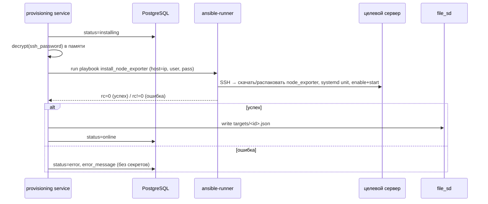

# 09 · Провижининг (Ansible)

## Цель

При добавлении сервера backend **автоматически**: по SSH ставит node_exporter на целевой Linux-сервер, поднимает его как systemd-сервис на порту 9100, регистрирует scrape-таргет Prometheus через file_sd. Процесс асинхронный, статус отражается в `provision_status` ([ADR-006](adr/ADR-006-async-provisioning-bez-brokera.md)).

## Жизненный цикл



## Запуск

- Библиотека **ansible-runner** (вызов из backend-процесса), движок **ansible-core** в backend-образе.
- На Этапе 1 — асинхронная фоновая задача (FastAPI background task / `asyncio` task, запускающая ansible-runner в thread/executor, т.к. он блокирующий). Без внешнего брокера ([ADR-006](adr/ADR-006-async-provisioning-bez-brokera.md)).
- Таймаут — `ANSIBLE_TIMEOUT_SEC` (по умолчанию 300 с); по таймауту → `status=error`.

## Передача кредов (безопасно)

- SSH-пароль расшифровывается из БД (`FERNET_KEY`) только в памяти, непосредственно перед запуском.
- Передаётся в ansible-runner через `extravars`/env в памяти (`ansible_user`, `ansible_password`). Не писать в постоянные файлы; если runner требует inventory-файл — временный с правами `0600`, удаляемый в `finally`.
- На тасках с паролем — `no_log: true`. Расшифрованный пароль не логируется ни на каком уровне ([05-security.md](05-security.md)).
- `ANSIBLE_HOST_KEY_CHECKING=false` на Этапе 1 ([TD-007](100-known-tech-debt.md)).

## Привилегии (`become`)

Плейбук создаёт системного пользователя, кладёт бинарь в `/usr/local/bin`, ставит systemd unit и перезапускает службу — это требует root-привилегий, поэтому таски выполняются с `become: true`.

**Допущение Этапа 1 (нормативно):** целевой SSH-пользователь (поле «Пользователь» в модалке) — **либо `root`, либо пользователь с passwordless `sudo`** (`NOPASSWD`). В обоих случаях `ansible_become_password` НЕ требуется и НЕ передаётся.

- Если указан `root` — `become` фактически no-op (уже root), плейбук работает.
- Если указан sudoer с `NOPASSWD` — `become: true` поднимает привилегии без пароля.
- **Sudoer, требующий пароль для sudo, на Этапе 1 НЕ поддерживается** — провижининг такого хоста завершится `status=error` с понятным сообщением. Поддержка `ansible_become_password` (отдельный sudo-пароль) — [Q-SEC-3](99-open-questions.md).

Это допущение зафиксировано также в [05-security.md](05-security.md#ansible-и-секреты). UI/модалка добавления может кратко информировать админа о требовании (root или passwordless sudo) — рекомендация для frontend.

## Плейбук `install_node_exporter` (требования, нормативно для devops)

Идемпотентный плейбук (NFR-6). Шаги:
1. Определить архитектуру/ОС (Linux, x86_64/arm64).
2. Создать системного пользователя `node_exporter` (nologin) — идемпотентно.
3. Скачать node_exporter точной версии и **проверить SHA256** (URL и контрольная сумма — [02-tech-stack.md](02-tech-stack.md#node_exporter-бинарь-для-ansible); Ansible `get_url` с `checksum: "sha256:<...>"`), распаковать в `/usr/local/bin/node_exporter` (только если версия/хэш не совпадают).
4. Установить systemd unit `/etc/systemd/system/node_exporter.service` (слушает `:{{ exporter_port }}`, default 9100).
5. `systemd daemon-reload`, `enable` + `start`/`restart при изменении`.
6. Проверка: порт слушается, сервис `active`.

Параметры передаются как extravars: `target_ip`, `ansible_user`, `ansible_password`, `exporter_port`.

Идемпотентность: повторный прогон не даёт `changed` (кроме реальных изменений версии/конфига).

## Регистрация таргета (file_sd)

После успешной установки backend пишет файл `${FILE_SD_DIR}/<id>.json`:

```json
[
  {
    "targets": ["10.0.0.13:9100"],
    "labels": {
      "server_id": "a1b2c3d4-...",
      "name": "Server 02"
    }
  }
]
```

- Каталог `FILE_SD_DIR` — общий volume с Prometheus (`/etc/prometheus/targets`).
- Prometheus перечитывает каталог (`refresh_interval: 30s`), рестарт не нужен ([ADR-004](adr/ADR-004-file-sd-registraciya-targetov.md)).
- Запись атомарна: писать во временный файл и `os.replace()` на финальный, чтобы Prometheus не прочитал半-записанный JSON.
- Метки `server_id`/`name` позволяют сопоставлять метрики с реестром и подписывать в Grafana.

## Удаление

- `DELETE /api/servers/{id}` → удалить `${FILE_SD_DIR}/<id>.json` → Prometheus перестаёт скрейпить.
- node_exporter на целевом сервере НЕ удаляется на Этапе 1 ([TD-002](100-known-tech-debt.md)). Плейбук `uninstall_node_exporter` — будущий этап.

## Восстановление file_sd из БД

- file_sd — производное состояние. При старте backend (или по команде) может перегенерировать `targets/*.json` из реестра серверов со `status=online` (устойчивость к потере volume). Рекомендация для backend ([modules/provisioning](modules/provisioning/README.md)).

## Обработка ошибок

| Ситуация | Результат |
|----------|-----------|
| SSH-недоступность / неверные креды | `status=error`, `error_message="SSH connection failed"` (без пароля) |
| Таймаут плейбука | `status=error`, `error_message="provisioning timeout"` |
| Ошибка установки (rc≠0) | `status=error`, краткая причина из stderr (отфильтрованная от секретов) |
| Успех, но порт не слушается | `status=error`, `error_message="exporter not reachable"` |

Сообщения об ошибках — человекочитаемые, без секретов; полные логи ansible-runner — в structlog (с маскированием), не в API-ответе.

## Smoke-тест провижининга (для qa/devops)

- Поднять эфемерный Linux-контейнер с sshd + systemd; прогнать плейбук; проверить `:9100/metrics` отвечает; повторный прогон — идемпотентен. Объём — [06-testing-strategy.md](06-testing-strategy.md).
