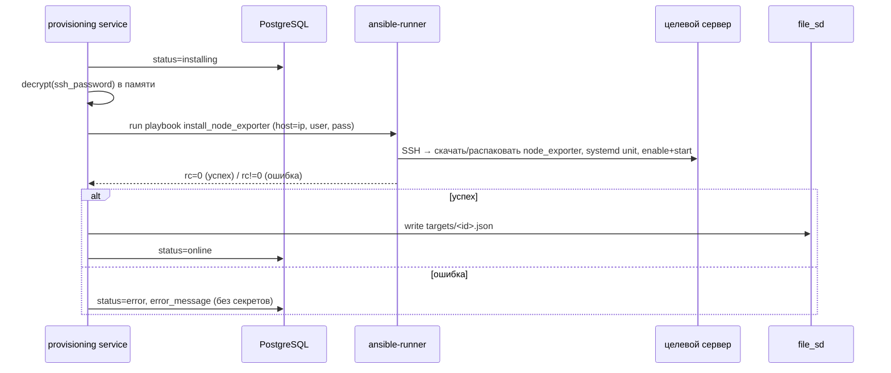

# 09 · Провижининг (Ansible)

## Цель

При добавлении сервера backend **автоматически**: по SSH ставит node_exporter на целевой Linux-сервер, поднимает его как systemd-сервис на порту 9100, регистрирует scrape-таргет Prometheus через file_sd. Процесс асинхронный, статус отражается в `provision_status` ([ADR-006](adr/ADR-006-async-provisioning-bez-brokera.md)).

## Жизненный цикл



## Запуск

- Библиотека **ansible-runner** (вызов из backend-процесса), движок **ansible-core** в backend-образе.
- **Предусловие controller (backend-образ):** установлены `ansible-core`, `openssh-client` и **`sshpass`**. `sshpass` ОБЯЗАТЕЛЕН для password-аутентификации по SSH (`ansible_password`) — без него Ansible завершает таск ошибкой `"you must install the sshpass program"`, а добавление сервера падает (в UI — `«node_exporter installation failed»`). Зафиксировано в [07-deployment.md](07-deployment.md#backend-образ) и [02-tech-stack.md](02-tech-stack.md#backend).
- На Этапе 1 — асинхронная фоновая задача (FastAPI background task / `asyncio` task, запускающая ansible-runner в thread/executor, т.к. он блокирующий). Без внешнего брокера ([ADR-006](adr/ADR-006-async-provisioning-bez-brokera.md)).
- Таймаут — `ANSIBLE_TIMEOUT_SEC` (по умолчанию 300 с); по таймауту → `status=error`.

## Передача кредов (безопасно)

- SSH-пароль расшифровывается из БД (`FERNET_KEY`) только в памяти, непосредственно перед запуском.
- Передаётся в ansible-runner через `extravars`/env в памяти (`ansible_user`, `ansible_password`). Не писать в постоянные файлы; если runner требует inventory-файл — временный с правами `0600`, удаляемый в `finally`.
- На тасках с паролем — `no_log: true`. Расшифрованный пароль не логируется ни на каком уровне ([05-security.md](05-security.md)).
- `ANSIBLE_HOST_KEY_CHECKING=false` на Этапе 1 ([TD-007](100-known-tech-debt.md)).

## Привилегии (`become`)

Плейбук создаёт системного пользователя, кладёт бинарь в `/usr/local/bin`, ставит systemd unit и перезапускает службу — это требует root-привилегий, поэтому таски выполняются с `become: true`.

**Допущение Этапа 1 (нормативно):** целевой SSH-пользователь (поле «Пользователь» в модалке) — **либо `root`, либо пользователь с passwordless `sudo`** (`NOPASSWD`). В обоих случаях `ansible_become_password` НЕ требуется и НЕ передаётся.

- Если указан `root` — `become` фактически no-op (уже root), плейбук работает.
- Если указан sudoer с `NOPASSWD` — `become: true` поднимает привилегии без пароля.
- **Sudoer, требующий пароль для sudo, на Этапе 1 НЕ поддерживается** — провижининг такого хоста завершится `status=error` с понятным сообщением. Поддержка `ansible_become_password` (отдельный sudo-пароль) — [Q-SEC-3](99-open-questions.md).

Это допущение зафиксировано также в [05-security.md](05-security.md#ansible-и-секреты). UI/модалка добавления может кратко информировать админа о требовании (root или passwordless sudo) — рекомендация для frontend.

## Плейбук `install_node_exporter` (требования, нормативно для devops)

Идемпотентный плейбук (NFR-6). Шаги:
1. Определить архитектуру/ОС (Linux, x86_64/arm64).
2. Создать системного пользователя `node_exporter` (nologin) — идемпотентно.
3. Скачать node_exporter точной версии и **проверить SHA256** (URL и контрольная сумма — [02-tech-stack.md](02-tech-stack.md#node_exporter-бинарь-для-ansible); Ansible `get_url` с `checksum: "sha256:<...>"`), распаковать в `/usr/local/bin/node_exporter` (только если версия/хэш не совпадают).
4. Установить systemd unit `/etc/systemd/system/node_exporter.service` (слушает `:{{ exporter_port }}`, default 9100).
5. `systemd daemon-reload`, `enable` + `start`/`restart при изменении`.
6. **Открыть `exporter_port` на firewall цели ТОЛЬКО для IP CRM-сервера** (если задан `scrape_source_ip` — см. ниже). Идемпотентно.
7. Проверка: порт слушается, сервис `active`.

Параметры передаются как extravars: `target_ip`, `ansible_user`, `ansible_password`, `exporter_port`, **`scrape_source_ip`**.

Идемпотентность: повторный прогон не даёт `changed` (кроме реальных изменений версии/конфига).

### Шаг 6 — открытие firewall на цели (нормативно, реализует devops)

Реализует [TD-017](100-known-tech-debt.md). Prometheus-контейнер достукивается до `<target_ip>:9100`; исходящий трафик приходит с публичного IP CRM-сервера (SNAT) = `scrape_source_ip`. На цели нужно разрешить `9100` именно с этого IP.

- **Источник `scrape_source_ip`** — extravar из переменной окружения backend `SCRAPE_SOURCE_IP` (на этом деплое `37.27.192.211`).
- **Если `scrape_source_ip` пуст/не задан → задача firewall ПОЛНОСТЬЮ пропускается** (предполагается, что на цели firewall открыт/отсутствует; хосты без firewall не ломаем).
- **Если задан** — идемпотентно открыть `exporter_port` **только для этого IP**, с поддержкой распространённых firewall:
  - **ufw**: если установлен и активен → `ufw allow from {{ scrape_source_ip }} to any port {{ exporter_port }} proto tcp` (идемпотентно).
  - **firewalld**: если активен → rich rule `rule family=ipv4 source address={{ scrape_source_ip }} port port={{ exporter_port }} protocol=tcp accept`, `permanent=yes` + reload (идемпотентно).
  - Firewall не установлен/не активен → задача **пропускается без ошибки** (graceful skip, `failed_when: false`/условия по факту наличия).
- **Никогда не открывать `9100` миру** (`0.0.0.0/0`). Только конкретный `scrape_source_ip`.
- Нестандартные firewall (nftables напрямую, iptables-only, облачные security groups) на Этапе 1 не покрываются плейбуком — остаточный [TD-017](100-known-tech-debt.md).

## Регистрация таргета (file_sd)

После успешной установки backend пишет файл `${FILE_SD_DIR}/<id>.json`:

```json
[
  {
    "targets": ["10.0.0.13:9100"],
    "labels": {
      "server_id": "a1b2c3d4-...",
      "name": "Server 02"
    }
  }
]
```

- Каталог `FILE_SD_DIR` — общий volume с Prometheus (`/etc/prometheus/targets`).
- Prometheus перечитывает каталог (`refresh_interval: 30s`), рестарт не нужен ([ADR-004](adr/ADR-004-file-sd-registraciya-targetov.md)).
- Запись атомарна: писать во временный файл и `os.replace()` на финальный, чтобы Prometheus не прочитал полу-записанный JSON.
- Метки `server_id`/`name` позволяют сопоставлять метрики с реестром и подписывать в Grafana.
- **Права доступа (нормативно, усвоенный урок).** Backend пишет файлы под своим uid (`app`), Prometheus читает под другим uid (read-only mount) → target-файлы ОБЯЗАНЫ быть **world-readable**: файлы `0644`, каталог `${FILE_SD_DIR}` — `0755`. Иначе Prometheus не может прочитать таргеты, скрейп не стартует, `up` отсутствует, сервер показывается «Не в сети» при успешной установке агента. Требование к backend: при атомарной записи явно `chmod 0644` финальный файл (umask может дать `0600`); каталог создавать с `0755`.

## Definition of done провижининга (нормативно)

Провижининг считается **успешным только когда метрики реально текут — `up=1` в Prometheus**, а не только когда node_exporter установлен. Цепочка «установка → file_sd → скрейп» имеет несколько точек отказа (права file_sd, firewall :9100), невидимых на этапе установки агента.

- Рекомендация к backend: перед/при переводе в `provision_status=online` проверять достижимость — например, опрос `up{instance="<ip>:<port>"}==1` через Prometheus API (или прямой запрос `http://<ip>:<port>/metrics`) с коротким ретраем. Если агент установлен, но `up≠1` в отведённое окно — `provision_status=error` с понятной причиной (`exporter not reachable`), а не «online».
- Это согласуется с [03-data-model.md](03-data-model.md): `online` = «провижининг завершён», а фактический online/offline в UI определяется `up` ([04-api.md](04-api.md)). DoD требует, чтобы на момент `online` `up` уже был `1`.
- Автоматизированная e2e-проверка `up=1` — [TD-016](100-known-tech-debt.md) (расширить happy-path провижининга проверкой реального скрейпа).

## Сетевая доступность node_exporter (`:9100`)

Prometheus скрейпит `<target_ip>:${EXPORTER_PORT}` (9100). Порт ОБЯЗАН быть доступен с источника (Prometheus-контейнер); иначе `up=0`, сервер «Не в сети» при успешной установке агента (усвоенный урок).

Два разных случая (важно не путать источник трафика):

- **Remote-цели (другой сервер):** firewall `9100` открывается **автоматически плейбуком** (шаг 6) для IP CRM-сервера `scrape_source_ip` (`SCRAPE_SOURCE_IP`, по умолчанию `37.27.192.211`) — трафик Prometheus-контейнера приходит на цель с публичного IP CRM-сервера (SNAT). Поддержка ufw/firewalld, graceful skip. Если `SCRAPE_SOURCE_IP` пуст — плейбук firewall не трогает (предусловие: порт уже открыт). Детали — [шаг 6](#шаг-6--открытие-firewall-на-цели-нормативно-реализует-devops).
- **Self-host (мониторинг самого CRM-сервера):** источник скрейпа — **docker-подсеть CRM**, НЕ публичный IP, поэтому `SCRAPE_SOURCE_IP`/плейбук здесь **не применимы**. Хостовый ufw разрешает `9100` из docker-сети CRM отдельно — [07-deployment.md](07-deployment.md#сетевая-настройка-сервера-self-monitoring). node_exporter слушает на хосте, Prometheus идёт из docker-сети.
- Рекомендация безопасности: всегда ограничивать `9100` конкретным источником (IP CRM для remote / docker-подсеть для self), не открывать миру — node_exporter наружу не публикуется (NFR-9, [05-security.md](05-security.md)).

## Удаление

- `DELETE /api/servers/{id}` → удалить `${FILE_SD_DIR}/<id>.json` → Prometheus перестаёт скрейпить.
- node_exporter на целевом сервере НЕ удаляется на Этапе 1 ([TD-002](100-known-tech-debt.md)). Плейбук `uninstall_node_exporter` — будущий этап.

## Восстановление file_sd из БД

- file_sd — производное состояние. При старте backend (или по команде) может перегенерировать `targets/*.json` из реестра серверов со `status=online` (устойчивость к потере volume). Рекомендация для backend ([modules/provisioning](modules/provisioning/README.md)).

## Обработка ошибок

| Ситуация | Результат |
|----------|-----------|
| SSH-недоступность / неверные креды | `status=error`, `error_message="SSH connection failed"` (без пароля) |
| Таймаут плейбука | `status=error`, `error_message="provisioning timeout"` |
| Ошибка установки (rc≠0) | `status=error`, краткая причина из stderr (отфильтрованная от секретов) |
| Успех, но порт не слушается | `status=error`, `error_message="exporter not reachable"` |

Сообщения об ошибках — человекочитаемые, без секретов; полные логи ansible-runner — в structlog (с маскированием), не в API-ответе.

## Smoke-тест провижининга (для qa/devops)

- Поднять эфемерный Linux-контейнер с sshd + systemd; прогнать плейбук; проверить `:9100/metrics` отвечает; повторный прогон — идемпотентен. Объём — [06-testing-strategy.md](06-testing-strategy.md).
