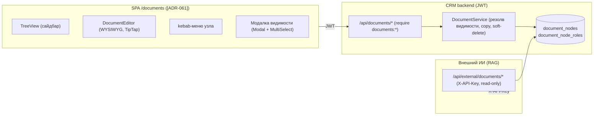

# Модуль `documents` — Документы (Notion/Kaiten-подобный менеджер знаний в БД CRM)

Статус: `implemented` (Спринт 1–2) · Исполнитель: backend, frontend

> Действующая архитектура — [ADR-059](../../adr/ADR-059-documents-module.md) (гринфилд-модуль: единая таблица `document_nodes`, permission-based enforcement, вычисляемое наследование видимости по ролям, soft-delete для RAG), [ADR-060](../../adr/ADR-060-documents-external-readonly-api-key.md) (внешний read-only API-ключ), [ADR-061](../../adr/ADR-061-documents-sidebar-two-panel-nav.md) (двухпанельный сайдбар `/documents` — частичный разворот плоской навигации [ADR-033](../../adr/ADR-033-flat-nav-theme-toggle-numbers-table.md)), [ADR-062](../../adr/ADR-062-documents-wysiwyg-tiptap.md) (WYSIWYG-редактор TipTap).
>
> **Ключевые инварианты:** видимость — по **РОЛЯМ** (`role_id`), НЕ по командам; редактор — WYSIWYG (хранение — markdown в `content_md`); внешний API — **полный read-only** (RAG); загрузка — только `.md`.

## Scope

Страница **«Документы»** (`/documents`) — двухпанельный менеджер документов (левый сайдбар с деревом папок + правая панель контента). Возможности:

- Дерево папок и Markdown-документов (единая self-referencing таблица `document_nodes`).
- Создание папки / документа; открытие документа; **WYSIWYG-редактирование** (хранение — markdown); **загрузка `.md`-файла** как документа.
- **Контекстное меню (kebab, 3 точки) на строке узла:** «Удалить» / «Создать копию» / «Переименовать» / «Сменить видимость».
- **Видимость по ролям** (`visibility_mode='restricted'` + набор `role_id`); вычисляемое наследование вниз по дереву.
- **Внешний read-only API по статическому API-ключу** (`X-API-Key`) для будущей RAG-базы ИИ: синхронизация документов, фиксация изменений/удалений (tombstones), проверка эффективного уровня доступа.

**CRM — единственная система-запись:** дерево, контент, видимость, авторство, версия контента и tombstones хранятся в БД CRM. Внешних зависимостей у модуля нет.

## Out of scope

- Вложения/изображения в документах (только `.md`-текст) — [TD-065](../../100-known-tech-debt.md).
- Полнотекстовый поиск по документам — [TD-066](../../100-known-tech-debt.md).
- Обязательный optimistic-lock (сейчас `expected_version` **опционален**) — [TD-064](../../100-known-tech-debt.md).
- Ретенция/GC tombstones — [TD-067](../../100-known-tech-debt.md).
- Внешний **read-write** API, привязка API-ключа к роли/scope (машина видит всё, фильтрует RAG на своей стороне — [ADR-060](../../adr/ADR-060-documents-external-readonly-api-key.md)).
- Видимость по командам (владелец решил: строго по ролям).
- Совместное real-time редактирование (CRDT/OT).

## Архитектура



**Слои backend (по образцу mail/sms):**

| Слой | Назначение |
|------|-----------|
| `api/documents.py` | Внутренние JWT-эндпоинты `/api/documents/*`, гейты `require("documents", <action>)` + per-node фильтр видимости. |
| `api/external_documents.py` | Внешние read-only эндпоинты `/api/external/documents/*`, проверка `X-API-Key` (без JWT, CSRF-exempt). |
| `services/document_service.py` | Резолюция эффективной видимости (рекурсивный CTE), copy поддерева, soft-delete каскад, инкремент `content_version`. |
| `repositories/document_repository.py` | Доступ к `document_nodes`/`document_node_roles`, keyset-пагинация для внешнего sync. |
| `schemas/document.py` | Pydantic-схемы request/response (внутренние и внешние). |
| `models/document_node.py`, `models/document_node_role.py` | ORM-модели. |

**Данные:** таблицы `document_nodes` + `document_node_roles` — [03-data-model.md §Модуль «Документы»](../../03-data-model.md#таблицы-модуля-документы-document_nodes-document_node_roles). Миграции (концепт): **`0029_document_nodes`** (19 симв. ≤32), **`0030_document_node_roles`** (24 симв. ≤32); `down_revision` первой = фактическая голова цепочки на момент реализации (backend сверяет по `alembic_version`). Backfill не нужен (таблицы стартуют пустыми).

## Модель данных и инварианты

- **`document_nodes`** — единая таблица папок и документов (`node_type ∈ {folder, document}`), self-referencing дерево через `parent_id` (`NULL` = корень, `ON DELETE CASCADE`).
- **Папка не хранит контент:** CHECK `ck_document_nodes_folder_no_content` — `content_md` у папки всегда `NULL`.
- **`owner_id`** — автор узла (FK `users(id) ON DELETE RESTRICT`), **только для отображения**, НЕ гейт (enforcement — permission-based, см. [RBAC](#rbac)). Действия консольного супер-админа записывают `owner_id = SUPERADMIN_USER_ID` (системная строка-якорь, [ADR-051](../../adr/ADR-051-superadmin-db-anchor-personal-state.md)) — у него нет иного `user_id`.
- **`content_version bigint DEFAULT 1`** — инкрементируется **только** при изменении `content_md` ИЛИ `name` (переименование/правка контента). Смена видимости/перемещение/soft-delete `content_version` **не** меняют. Точка фиксации для RAG (нужно ли переэмбеддить).
- **`updated_at`** — обновляется при **ЛЮБОЙ** мутации строки (rename, content, visibility, move/position, delete). Именно `updated_at` — водяной знак внешнего sync (любое изменение возвращает узел в дельту; `content_version` уточняет, менялся ли контент).
- **`visibility_mode ∈ {inherit, restricted}`** (`DEFAULT 'inherit'`). Строки `document_node_roles` существуют **только** для узлов `restricted`.
- **`deleted_at timestamptz NULL`** — **soft-delete** (обязателен для RAG-tombstone). Это **осознанный отход** от репо-конвенции hard-delete (везде hard-delete + [TD-001](../../100-known-tech-debt.md)); обоснование — RAG обязан узнавать об удалениях ([ADR-059](../../adr/ADR-059-documents-module.md)). Удалённый узел исключён из всех внутренних выборок (`WHERE deleted_at IS NULL`).
- **Дубликаты имён в папке РАЗРЕШЕНЫ** (как в Notion; уникален только `id`) — UNIQUE по `(parent_id, name)` НЕ вводится. Зафиксировано как решение ([ADR-059](../../adr/ADR-059-documents-module.md)).
- **Лимит размера markdown** — `DOCUMENTS_MAX_MD_BYTES` (env, default `1_048_576` = 1 МБ) проверяется и при upload, и при inline-правке контента; превышение → `422` (upload → `document_upload_invalid`, inline → `validation_error`, поле `content_md`).

## Видимость по ролям и её резолюция (нормативно)

Два **независимых** уровня доступа (оба обязаны выполниться):

1. **`documents:view`** — право на страницу/API вообще. Механизм — `require("documents","view")` (см. [05-security.md](../../05-security.md#каталог-прав-канон-на-сервере), `deps.py`). Нет права → `403 forbidden` (страница-заглушка на фронте — [08-design-system.md](../../08-design-system.md#гейтинг-навигации-и-действий-по-правам-rbac-нормативно)).
2. **Видимость по ролям (per-node)** — фильтр **внутри** модуля. У пользователя ровно одна роль (`users.role_id`, [ADR-021](../../adr/ADR-021-rbac-users-roles.md)). Узел виден ⇔ он **публичен внутри модуля** ИЛИ его **эффективный набор ролей** содержит `role_id` пользователя.

**Эффективная видимость узла (вычисляемая, НЕ материализованная):**

- Рекурсивный CTE вверх по `parent_id` до **ближайшего `restricted`-предка** (включая сам узел).
- Найден ближайший `restricted`-узел `R` → **эффективный набор ролей** = `document_node_roles` узла `R`. Узел виден пользователю ⇔ `role_id ∈` этот набор.
- Ветка полностью `inherit` до корня (ни одного `restricted`-предка) → узел **публичен внутри модуля** (виден всем, у кого есть `documents:view`).

```sql
WITH RECURSIVE chain AS (
    SELECT id, parent_id, visibility_mode, 0 AS depth
    FROM document_nodes WHERE id = :node_id AND deleted_at IS NULL
  UNION ALL
    SELECT n.id, n.parent_id, n.visibility_mode, c.depth + 1
    FROM document_nodes n JOIN chain c ON n.id = c.parent_id
    WHERE n.deleted_at IS NULL
)
SELECT id FROM chain WHERE visibility_mode = 'restricted'
ORDER BY depth ASC LIMIT 1;   -- ближайший restricted-предок; нет строки ⇒ узел публичен
```

**Admin-уровень видит всё.** Предикат «видит все узлы» — тот же admin-level, что в mail/sms ([ADR-032](../../adr/ADR-032-sms-visibility-admin-full-catalog.md)):

```
sees_all_documents = principal.is_superadmin OR permissions_subset(full_catalog_permissions(), principal.permissions)
```

Такой актор (консольный супер-админ; роль с полным каталогом) видит и правит **любой** узел, per-role фильтр к нему не применяется.

**Анти-энумерация.** Невидимую пользователю ноду **нельзя** и читать по `id`, и править/удалять → **`404 document_node_not_found`** (не `403`) — неотличимо от несуществующей. Список/дерево (`GET /tree`, `GET /nodes`) — **фильтруются** (невидимый узел просто отсутствует). Это симметрично «пустому scope» в mail/sms.

**Enforcement — permission-based, НЕ owner-based** (нормативно, [ADR-059](../../adr/ADR-059-documents-module.md)): `owner_id` — только автор для отображения; право читать/править/удалять узел определяется `documents:<action>` + видимостью по роли, а НЕ совпадением `owner_id == user_id`. Согласованность с RBAC-каноном репо (везде enforcement на правах, не на владении).

## RBAC

Страница **`documents`** в каталоге прав ([05-security.md](../../05-security.md#каталог-прав-канон-на-сервере), `app/domain/permissions.py::CATALOG`): действия **`view, create, edit, delete, share`**.

- `share` — **отдельное чувствительное действие смены видимости** узла (по образцу того, как `mail` имеет `sync`/`tags` сверх CRUD): управлять тем, кто видит узел, — привилегия сильнее обычного `edit`.
- Маппинг метод→действие ([04-api.md](../../04-api.md#rbac-и-enforcement-прав)): `GET → documents:view` (+ per-node фильтр); `POST /folders`/`/documents`/`/upload`/`/nodes/{id}/copy → documents:create`; `PATCH /nodes/{id}` (rename/content) → `documents:edit`; `PATCH /nodes/{id}/visibility → documents:share`; `PATCH /order → documents:edit`; `DELETE /nodes/{id} → documents:delete`. **Исключение из `GET → documents:view`:** `GET /nodes/{id}/visibility` и `GET /role-refs` гейтятся **`documents:share`** (read-сторона модалки видимости — чувствительна как и write, `share`-контур).
- **Список ролей для модалки видимости** не-админу с `documents:share` — лёгкий `GET /api/documents/role-refs` (`{id, name}[]`) под гейтом `documents:share`. **НЕ** переиспользуется admin-gated `GET /api/roles` (он под `require("roles","view")` — не-админ его не получит, ровно тот дефект, что был у mail в [TD-050](../../100-known-tech-debt.md)).

## Внутренний API (JWT, префикс `/api/documents`)

Полные контракты — [04-api.md §Documents](../../04-api.md#documents). Кратко:

| Метод / путь | Действие | Назначение |
|--------------|----------|-----------|
| `GET /tree` | `view` (+фильтр) | Всё видимое дерево (папки+документы). |
| `GET /nodes?parent_id=` | `view` (+фильтр) | Дети узла (`parent_id` пуст/`null` = корень). |
| `GET /nodes/{id}` | `view` (+фильтр) | Узел (+`content_md` для документа). Невидим → `404`. |
| `POST /folders` | `create` | Создать папку (`{parent_id, name}`). |
| `POST /documents` | `create` | Создать документ (`{parent_id, name, content_md?}`). |
| `POST /upload` | `create` | multipart, **только `.md`**; не-`.md`/размер/битый UTF-8 → `422 document_upload_invalid`. |
| `PATCH /nodes/{id}` | `edit` | Rename и/или content; `content_version += 1`; опц. `expected_version` (mismatch → `409 document_node_conflict`). |
| `POST /nodes/{id}/copy` | `create` | Рекурсивная копия поддерева (новые `id`); цикл → `422 document_copy_cycle`. |
| `GET /nodes/{id}/visibility` | `share` | Собственные настройки видимости узла для **предзаполнения** модалки: `{visibility_mode, role_ids[]}` (собственные роли узла; `inherit` → `[]`). Read↔write симметрия с `PATCH …/visibility`. |
| `PATCH /nodes/{id}/visibility` | `share` | `{visibility_mode, role_ids[]}`. |
| `PATCH /order` | `edit` | Полная перестановка уровня (`{parent_id, ids[]}`), проверка полноты как у reorder серверов. |
| `DELETE /nodes/{id}` | `delete` | Soft-delete; папка — каскад поддерева (tombstone на каждый узел). |
| `GET /role-refs` | `share` | `{id,name}[]` ролей для модалки видимости. |

**Сортировка уровня** — по канону `position` ([03-data-model.md](../../03-data-model.md#колонка-position-порядок-карточек)): `ORDER BY position ASC, created_at DESC, id`.

## Внешний read-only API (RAG, `X-API-Key`, префикс `/api/external/documents`)

Полные контракты — [04-api.md §External Documents](../../04-api.md#external-documents-read-only-rag). Кратко:

- **Аутентификация** — статический ключ `X-API-Key`, хранение — **только env** `DOCUMENTS_API_KEY` (класс секретов mail: ротация через деплой; не в БД/логах/ответах/URL). Сравнение — constant-time `hmac.compare_digest`. **Порядок проверок** (образец mail_ingest): пустой `DOCUMENTS_API_KEY` → **`503 documents_external_not_configured`** → неверный/отсутствующий `X-API-Key` → **`401 not_authenticated`**.
- **Read-only GET без тела** ⇒ подпись тела (HMAC, как у mail push) **не нужна** — статического ключа достаточно ([ADR-060](../../adr/ADR-060-documents-external-readonly-api-key.md)).
- **Машина видит ВСЕ узлы** (обходит per-role фильтр), но каждый ответ несёт **`visibility_role_ids[]`** + **`content_version`**. RAG сам фильтрует по роли конечного пользователя; публичный узел → `visibility_role_ids = []`.

| Метод / путь | Назначение |
|--------------|-----------|
| `GET /?updated_after=&include_deleted=&cursor=&limit=` | Список для синка; keyset-пагинация по `(updated_at, id)` ASC (образец mail-курсора). Каждый элемент — метаданные + `visibility_role_ids[]` + `content_version` (+ `deleted_at` при tombstone). |
| `GET /{id}` | Полный узел (+`content_md`); удалённый → **`410 document_node_gone`** (tombstone). |
| `GET /{id}/access` | Эффективный доступ: `{id, is_public, visibility_role_ids[], content_version}`. |
| `GET /changes?since=&cursor=&limit=` | Дельта с водяного знака: изменённые узлы + tombstones (`include_deleted` подразумевается), keyset по `(updated_at, id)` ASC. |

## Edge-cases (нормативно)

- **Удаление непустой папки** — каскадный **soft-delete** всего поддерева в одной транзакции: `deleted_at` проставляется папке и каждому потомку (`ON DELETE CASCADE` служит только для физического каскада при hard-delete `owner`/`role`; здесь удаление логическое, поддерево обходится рекурсивным CTE вниз). RAG получит tombstone на **каждый** узел поддерева.
- **Копия папки с вложенными** — рекурсия по поддереву: новые `id`, **сохранение** структуры/`position`/`visibility_mode` и строк `document_node_roles`; одна транзакция. `owner_id` копий = актор копирования. `content_version` копий = 1.
- **Циклы при copy** — цель копирования (`parent_id`) не должна быть самим узлом или его потомком (проверка рекурсивным CTE вниз от копируемого узла); нарушение → **`422 document_copy_cycle`**.
- **Наследование/override видимости** — потомок с `visibility_mode='inherit'` наследует ближайшего `restricted`-предка; собственный `restricted` на потомке **переопределяет** (его набор ролей действует ниже). Публичность = отсутствие `restricted`-предков до корня.
- **Конфликт имён в папке** — **разрешён** (дубликаты допустимы, `id` уникален) — решение зафиксировано.
- **Лимит размера markdown** — превышение `DOCUMENTS_MAX_MD_BYTES` → `422` (upload → `document_upload_invalid`; inline → `validation_error`, поле `content_md`).
- **Одновременное редактирование** — `content_version` инкрементируется при каждой правке контента/имени; optimistic-lock через `expected_version` — **опционален** (рекомендуемое усиление, [TD-064](../../100-known-tech-debt.md)); при передаче `expected_version` ≠ текущему → `409 document_node_conflict`.
- **`documents:view` без доступа к узлу** — `404 document_node_not_found` (анти-энумерация), НЕ `403`.
- **Внешний API + удалённые** — tombstone `{id, deleted_at, content_version}` без `content_md` (в списке/`/changes` — как элемент при `include_deleted`; в `GET /{id}` — `410`).

## Frontend — ТЗ

- Маршрут **`/documents`** — **двухпанельный сайдбар-shell** ([ADR-061](../../adr/ADR-061-documents-sidebar-two-panel-nav.md), [08-design-system.md §Страница «Документы»](../../08-design-system.md#страница-документы-нормативно-adr-061)): левый сайдбар — `TreeView` дерева; правая панель — просмотр/`DocumentEditor`. Это **частичный разворот** плоской навигации ([ADR-033](../../adr/ADR-033-flat-nav-theme-toggle-numbers-table.md)): `/documents` идёт по **full-bleed** ветке (второй маршрут после `/mail`).
- **kebab-меню** (3 точки) на строке узла — обёртка над `@radix-ui/react-dropdown-menu` (**уже** в `package.json`, новой зависимости нет): «Удалить» (`delete`) / «Создать копию» (`create`) / «Переименовать» (`edit`) / «Сменить видимость» (`share`). Пункт рендерится ⇔ есть соответствующее право (UX-гейт; безопасность — сервер).
- **`DocumentEditor`** — WYSIWYG на **TipTap** ([ADR-062](../../adr/ADR-062-documents-wysiwyg-tiptap.md), [02-tech-stack.md](../../02-tech-stack.md#frontend)); сериализует ProseMirror ↔ markdown (`tiptap-markdown`), хранение остаётся markdown в `content_md`. Тулбар включает пункт **«ссылка»** ([поправка ADR-062 §2](../../adr/ADR-062-documents-wysiwyg-tiptap.md#поправка-2026-07-18--граница-расширена-tiptapextension-link)): реализуется через `@tiptap/extension-link`, markdown-ссылки сохраняются при round-trip (URL не теряется).
- **Модалка видимости** — существующие Radix-Dialog-модалка + `MultiSelect` ([08-design-system.md](../../08-design-system.md#компонент-multiselect)); опции ролей — из `GET /api/documents/role-refs`. **Предзаполнение текущего выбора** — из `GET /api/documents/nodes/{id}/visibility` (`{visibility_mode, role_ids[]}`, собственные роли узла; `inherit` → `[]`), симметричного write-контракту. `visibility_mode='restricted'` + выбранные роли; переключение на `inherit` очищает набор.
- Гейтинг пунктов/кнопок — по правам из `GET /api/auth/me`; невидимые по роли узлы не приходят с сервера (фильтр backend).

## DoD

- [x] Таблицы `document_nodes`/`document_node_roles` + миграции `0029`/`0030`, CHECK/FK/индексы по [03-data-model.md](../../03-data-model.md#таблицы-модуля-документы-document_nodes-document_node_roles).
- [x] Каталог прав += `documents:view/create/edit/delete/share`; `require(...)`-гейты на всех эндпоинтах.
- [x] Резолюция видимости (рекурсивный CTE) + admin-уровень + анти-энумерация `404`.
- [x] Внутренний API `/api/documents/*` (tree/nodes/CRUD/upload/copy/visibility/order/role-refs).
- [x] Внешний read-only `/api/external/documents/*` (`X-API-Key`, keyset, tombstones, `/access`, `/changes`).
- [x] Soft-delete каскад поддерева; copy рекурсией; цикл → `422`.
- [x] Frontend `/documents`: двухпанельный shell, `TreeView`, kebab-меню, `DocumentEditor` (TipTap), модалка видимости.
- [x] Тесты (qa): резолюция видимости, анти-энумерация, copy/soft-delete, keyset внешнего sync, порядок проверки `X-API-Key`.

## Changelog

- 2026-07-18 (`spec-ready` → `implemented`): модуль реализован по замороженной спеке — backend (спринты 1–2 + фикс контракта `422`), frontend (двухпанельный shell, `TreeView`, kebab, `DocumentEditor` на TipTap + `@tiptap/extension-link`), тесты qa (backend 1377 зелёных, coverage 86.91%; frontend 862 зелёных; рендер `/documents` подтверждён Playwright). Все пункты DoD закрыты и сверены с кодом; контракт/модель/инварианты — без изменений.
- 2026-07-17 (гринфилд-спека, [ADR-059](../../adr/ADR-059-documents-module.md)/[ADR-060](../../adr/ADR-060-documents-external-readonly-api-key.md)/[ADR-061](../../adr/ADR-061-documents-sidebar-two-panel-nav.md)/[ADR-062](../../adr/ADR-062-documents-wysiwyg-tiptap.md), `spec-ready`): модуль «Документы» спроектирован — модель, видимость по ролям, RBAC, внутренний и внешний API, edge-cases.
