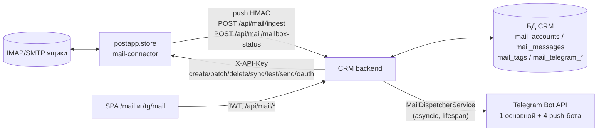

# Модуль `mail` — Почты (CRM — система-запись; агрегатор — IMAP/SMTP-connector)

Статус: `in-prod` (cut-over выполнен 2026-07-10) · Исполнитель: backend, frontend, devops

> **Действующая архитектура — [ADR-044](../../adr/ADR-044-mail-full-merge-into-crm.md)** (полный перенос почты в CRM) + [ADR-045](../../adr/ADR-045-mail-outlook-oauth-headless-reonboarding.md) (Outlook OAuth headless) + [ADR-047](../../adr/ADR-047-mail-fix-pack.md) (mail-пакет фиксов 2026-07-11).
>
> **ОТМЕНЕНО, не реализовывать:** read-through-прокси «без хранения» ([ADR-012](../../adr/ADR-012-mail-read-through-proxy.md)/[ADR-013](../../adr/ADR-013-mail-newest-first-master-detail-inline-reply.md)/[ADR-017](../../adr/ADR-017-dashboard-client-aggregation-mail-server-filters.md)) и headless-прокси с групп-индирекцией ([ADR-038](../../adr/ADR-038-mail-headless-integration.md) `superseded`, [ADR-043](../../adr/ADR-043-lazy-mail-group-provisioning.md) `superseded`). Понятий **`group_id`**, **`MailTeam`**, **`GET /api/mail/teams`**, **`teams.mail_group_id`** (как связи ящик↔команда), проксирования ленты/тегов в external API — в действующей модели **нет**.
>
> **Инварианты ADR-012, которые ПЕРЕЖИЛИ супессию и действуют:** `MAIL_API_KEY` только на backend (в заголовке `X-API-Key` исходящего запроса); HTML-тело письма — только в sandbox-iframe без `allow-scripts`/`allow-same-origin`; JWT на всех пользовательских эндпоинтах.

## Scope

Страница **«Почты»** (`/mail`, три вкладки: «Сообщения» / «Почты» / «Теги») + Telegram-доставка + Telegram Mini App `/tg/mail`.

**CRM — единственный UI и система-запись (system of record):** письма, теги, каталог ящиков, привязка ящика к команде, история Telegram-уведомлений, отправленные reply — **хранятся в БД CRM**.

**Агрегатор `postapp.store` — чистый mail-connector:** подключение ящиков (IMAP/SMTP-креды, шифрование AES-256-GCM **там**), IMAP-синк, **push нового письма в CRM**, push статуса синка ящика, SMTP-отправка. Групп, тегов, пользователей, Telegram и UI у него больше нет.

**Владение ящиком — команда, напрямую:** `mail_accounts.team_id → teams.id` (per-mailbox; `NULL` = ящик без команды). Групп-индирекции нет.

## Out of scope

- **Вложения** — не переносятся и не отображаются by design ([ADR-044](../../adr/ADR-044-mail-full-merge-into-crm.md), [TD-034](../../100-known-tech-debt.md)). `cid:`-инлайн-картинки не резолвятся ([TD-026](../../100-known-tech-debt.md)).
- **Пересылка (forwarding) лидеру** — отложена решением владельца; **не работает** с момента cut-over ([TD-040](../../100-known-tech-debt.md)). Таблиц `mail_forwarding`/`mail_message_forwards` **нет**.
- **Compose «с нуля»** — только reply на существующее письмо.
- **Полнотекстовый поиск ПО ПИСЬМАМ** — не реализован (данные в БД CRM есть, индекса/эндпоинта нет) — остаток [TD-024](../../100-known-tech-debt.md). **⚠️ Не путать с поиском на вкладке «Почты»** ([ADR-050](../../adr/ADR-050-mail-search-team-filter-personal-read-state.md) §1): тот ищет **по ЯЩИКАМ** (`number`/`app_name`/`email`, клиентский фильтр над загруженным каталогом), **а не по содержимому писем**.
- **Папки** и **архив**. (**«Пометка прочитано/непрочитано» ИЗ non-goals ВЫВЕДЕНА** — реализована как **личная** прочитанность, [ADR-050](../../adr/ADR-050-mail-search-team-filter-personal-read-state.md); см. [Прочитанность писем](#прочитанность-писем-личная-нормативно-adr-050).)
- **Счётчик-badge непрочитанных** (число «N» в навигации/на вкладке) — **не вводится** ([ADR-050](../../adr/ADR-050-mail-search-team-filter-personal-read-state.md) §2.4): потребовал бы `COUNT` по всей видимой ленте на каждый рендер. Индикатор + фильтр закрывают задачу без агрегата.
- Внешние **шрифты** HTML-письма (`font-src` не расширен).

## Архитектура

**Слои backend:**

| Слой | Файлы |
|------|-------|
| Роутеры | `api/mail.py` (пользовательский, JWT+RBAC), `api/mail_ingest.py` (машинный, HMAC), `api/mail_telegram.py` (вебхуки/SSO), `api/mail_me.py` (self-настройки) |
| Сервисы | `services/mail_service.py` (чтение из БД + транзит в агрегатор), `services/mail_ingest_service.py` (приём push), `services/mail_dispatcher_service.py` (фоновая Telegram-доставка), `services/mail_telegram_service.py` (линковка/SSO/настройки) |
| Инфра | `infra/mail_client.py` (httpx → агрегатор, `X-API-Key`), `infra/mail_push_security.py` (HMAC), `infra/mail_oauth_state.py` (`crm_state`) |
| Модели | `models/mail_account.py`, `mail_message.py`, `mail_tag.py` (+`MailTagRule`/`MailMessageTag`), `mail_telegram.py`, `mail_user_settings.py`, `mail_sent_message.py` |
| Схемы | `schemas/mail.py`, `schemas/mail_ingest.py`, `schemas/mail_telegram.py` — контракт по [04-api.md#mail](../../04-api.md#mail) |

**Данные** (миграции `0021`, `0022`, `0023`, `0024`) — [03-data-model.md §Таблицы модуля «Почты»](../../03-data-model.md#таблицы-модуля-почты-mail_accounts-mail_messages-mail_tags-).

## Приём почты (push агрегатор → CRM)

- **`POST /api/mail/ingest`** — машинный, **без JWT**, аутентификация **HMAC-SHA256** над **сырыми байтами** тела (`X-Mail-Signature: sha256=<hex>`, `X-Mail-Timestamp`), секрет `MAIL_PUSH_SECRET`, окно `MAIL_PUSH_MAX_SKEW_SEC` (300 с). Батч до `MAIL_INGEST_MAX_BATCH` (100) писем.
- **Идемпотентность:** `INSERT ... ON CONFLICT (mail_account_id, uidvalidity, uid) DO NOTHING` (`uq_mail_messages_account_uidv_uid`). Повтор доставки дубля не создаёт.
- **На приёме:** вставка письма → при фактической вставке применить теги (§Теги). **Telegram-рассылку хендлер НЕ делает** — оставляет `notified_at IS NULL`, доставку берёт фоновый диспетчер.
- Неизвестный `mail_account_id` → письмо **пропускается** (счётчик `unknown_mailbox`), батч не отклоняется ([TD-041](../../100-known-tech-debt.md)).
- **`POST /api/mail/mailbox-status`** — тот же HMAC; зеркалит статус синка ящика (`is_active`/`last_synced_at`/`last_sync_error`/`consecutive_failures`) в `mail_accounts`; переход `true→false` триггерит mailbox-down-алерт (идемпотентность — `down_alert_sent_at`). **Когда именно агрегатор шлёт статус** — исчерпывающий перечень точек hook H1–H7 (+ не-hook N1–N6) в агрегаторском `ADR-0046` §3/§4 (парная норма — [ADR-044](../../adr/ADR-044-mail-full-merge-into-crm.md) §3). **`last_synced_at` = последний УСПЕШНЫЙ синк** (ошибочные ветки его не обновляют): у сбоящего ящика значение стареет — это норма, не потерянный push. Повторы push безопасны (дедупа нет by design).
- **Очередь/ретраи push — на стороне агрегатора** (у него Redis); CRM однопроцессная, брокера не заводит.
- **nginx:** `client_max_body_size` на `location /api` ОБЯЗАН вмещать батч (сейчас `50m`) — [07-deployment.md](../../07-deployment.md#reverse-proxy-nginx--требования); нарушение даёт `413` и молчаливую потерю приёма ([TD-045](../../100-known-tech-debt.md)).

## Лента писем (чтение из БД CRM)

- **Порядок — `internal_date DESC, id DESC`** (истинная дата письма, **НЕ** `id`: `id BIGSERIAL` отражает порядок прихода push'а, и recovery-ре-пуш старого письма иначе «всплыл» бы в топ).
- **Компаундный keyset-курсор `(internal_date, id)`** — `internal_date` не уникален (массовая рассылка приходит одной секундой), пагинация по одному полю дала бы пропуски/дубли на границах страниц. Предикат: `WHERE (internal_date, id) < (:cursor_date, :cursor_id)`.
- Клиент получает **непрозрачный** `next_cursor` и возвращает его в параметре **`before`**. Интерпретировать курсор клиенту запрещено. Битый курсор → `400 invalid_cursor`.
- **Фильтры** `mail_account_id` (**повторяемый**), `team_id` и **`unread`** — **AND-комбинируемы**, пересекаются со scope пользователя.
- **Бесконечная лента:** первая страница без `before`, догрузка старых — `before=<next_cursor>`, пока `next_cursor ≠ null`.

## Прочитанность писем (ЛИЧНАЯ, нормативно, [ADR-050](../../adr/ADR-050-mail-search-team-filter-personal-read-state.md))

**Прочитанность — ЛИЧНАЯ у каждого пользователя, не общая на команду.** Хранится в таблице связи **`mail_message_reads (user_id, message_id, read_at)`**, PK `(user_id, message_id)` + обязательный `ix_mail_message_reads_message_id` (миграция **`0025_mail_message_reads`**). **Существование строки = «прочитано»**; отсутствие = «не прочитано». Схема — [03-data-model.md](../../03-data-model.md#таблица-mail_message_reads-миграция-0025-adr-050).

- **Контракт:** `MailMessage += is_unread: boolean` (персональное производное — приходит **и в ленте, и в детали**: схема одна); `GET /api/mail/messages += unread: boolean?` (серверный фильтр); **`POST` / `DELETE /api/mail/messages/{id}/read` → `204`** (оба **идемпотентны**). Контракт — [04-api.md](../../04-api.md#post-apimailmessagesmessage_idread).
- **Гейт — `mail:view`** (нового права нет): отметка — личный артефакт **чтения**, а не мутация домена. Прецедент: `reply` — тоже под `view`.
- **Scope — тот же `MailScope`:** письмо вне scope → **`404 mail_message_not_found`** (анти-энумерация, как у reply). Отметить чужое письмо нельзя.
- **Пометка ПРИ ОТКРЫТИИ — в обеих поверхностях:** веб `/mail` (смена выбранного письма, **включая авто-выбор самого свежего**) **и Mini App `/tg/mail`**. Mini App использует **тот же эндпоинт** — он несёт **обычный CRM access-JWT с `uid`** (SSO `POST /api/mail/telegram/auth`), поэтому `principal.user_id` там всегда непуст; спец-эндпоинта не требуется.
- **Возврат в «непрочитано» — есть** (`DELETE …/read`; кнопка «Отметить непрочитанным» в шапке детали веб-UI; в Mini App её нет). Нужен потому, что пометка частично непроизвольна (авто-выбор свежего письма).
- **Супер-админ из `.env`** — **прочитанность работает и под ним** ([ADR-051](../../adr/ADR-051-superadmin-db-anchor-personal-state.md); норма [ADR-050](../../adr/ADR-050-mail-search-team-filter-personal-read-state.md) §2.5 **отменена**): его `Principal.user_id` = константный `SUPERADMIN_USER_ID` **системной строки-якоря** в `users` ⇒ `POST`/`DELETE …/read` → `204`, `is_unread` — реальное личное значение, `unread=true` — обычный фильтр, UI-контролы **рендерятся**. `GET`/`PATCH /api/mail/me/settings` при этом **по-прежнему `403`** — по security-основанию (Telegram-привязка bootstrap-учётке запрещена, [ADR-051 §1.6](../../adr/ADR-051-superadmin-db-anchor-personal-state.md)).
- **Производительность (нормативно):** `is_unread` — **батч-лукап по PK** на уже отобранную страницу (`WHERE user_id = :uid AND message_id = ANY(:page_ids)`), **НЕ** JOIN в keyset-запрос и **не** N+1. Фильтр `unread=true` — **наоборот**, анти-джойн **`NOT EXISTS` ВНУТРИ** keyset-запроса (клиентская фильтрация **запрещена** — сломала бы курсорную догрузку).

## Ролевая видимость (`MailScope`, нормативно)

**`MailScope(sees_all_teams: bool, team_ids: frozenset[UUID], includes_unassigned: bool)`** — поля `group_ids` **НЕТ**; поле `includes_unassigned` добавлено [ADR-055](../../adr/ADR-055-per-channel-teams-mail-sms.md). `sees_all_teams` = тот же admin-предикат, что `sees_all_sms_teams` (`is_superadmin OR permissions_subset(full_catalog, permissions)`) — **не изменён**; **`team_ids` = `user_teams` ∪ доп-команды канала `mail`** (`user_channel_teams`, [05-security.md §Per-channel scope](../../05-security.md#per-channel-scope-команд-нормативно-adr-055)); `includes_unassigned` = `users.mail_includes_unassigned` («Без команды»). Граница безопасности — **backend**.

> **Предикат scope — единый для чтения и мутации:** `account.team_id IN team_ids` **OR** (`includes_unassigned` **AND** `account.team_id IS NULL`). Прямое `account.team_id in scope.team_ids` без второй ветки в новом коде = **дефект**.

| Операция | Правило |
|----------|---------|
| Чтение ленты / ящиков | не-admin: только ящики, прошедшие **предикат scope**; вне scope → **пусто** (анти-энумерация), не `403`/`404` |
| Reply на письмо | письмо вне scope → `404 mail_message_not_found` (чужое неотличимо от несуществующего) |
| Создание ящика | не-admin: `team_id ∈ team_ids` (включая **доп-команды**), иначе `403`. **`team_id = null` (без команды) — только admin-уровень** (не разворачивается [ADR-055](../../adr/ADR-055-per-channel-teams-mail-sms.md): `includes_unassigned` даёт работу с **существующими** бесхозными ящиками, не право создавать новые) |
| Перенос ящика (смена `team_id`) | **только admin-уровень** (`sees_all_teams`), даже если пользователь состоит в обеих командах / имеет их как доп-команды — требование владельца (не разворачивается) |
| Мутация/удаление/синк ящика по `id` | не-admin: ящик проходит **предикат scope**, иначе `403`. Ящик **без команды** доступен **только** при `includes_unassigned=true` (прежде — `403` всегда) |
| Теги | глобальны, scope команд **не применяется**: чтение под `mail:view`, управление под `mail:tags` |

> **Каталог ящиков (`GET /api/mail/mailboxes`) — контракт не меняется, РЕЗУЛЬТАТ меняется ([ADR-055](../../adr/ADR-055-per-channel-teams-mail-sms.md) §5.3).** Query-параметры (единственный — `is_active`) и схема ответа те же; параметров `q`/`team_id`/`no_team` **нет и не вводится** (фильтры вкладки «Почты» — клиентские). Но выборка обязана применять **предикат scope выше** ⇒ при `includes_unassigned = true` каталог **включает бесхозные ящики** (`team_id IS NULL`) — иначе клиентский фильтр «Без команды» покажет пустоту у пользователя, которому эти ящики доступны на **мутацию**.

RBAC: `CATALOG["mail"] = ("view","create","edit","delete","sync","tags")`; `reply` — под `view`. `GET /api/auth/me` отдаёт `sees_all_mail_teams`. Детали — [05-security.md](../../05-security.md#каталог-прав-канон-на-сервере).

## Ящики: CRUD в CRM, креды транзитом в агрегатор

- **Каталог живёт в CRM** (`mail_accounts`), чтение (`GET /api/mail/mailboxes`, `GET /api/teams/{id}/mailboxes`) — из БД CRM, **без** обращения к агрегатору.
- **Каталог обслуживает и страницу «Команды»** ([ADR-048](../../adr/ADR-048-teams-mailbox-count-mail-row.md)): `TeamListItem.mailbox_count` = `COUNT(mail_accounts WHERE team_id = teams.id)` (батч `MailAccountRepository.count_by_teams` для списка + одиночный `count_by_team` для тел `201`/`200`, индекс `ix_mail_accounts_team_id`), а `TeamMailboxItem` отдаёт `number`/`app_name`. Эти пути гейтятся **`teams:view`** и **`MailScope` НЕ применяют** — это осознанное решение [ADR-048](../../adr/ADR-048-teams-mailbox-count-mail-row.md) §4 (симметрия с [ADR-034](../../adr/ADR-034-teams-number-login-app.md)); креды/хосты/статус синка через них по-прежнему **не** раскрываются. Мутации ящика и лента писем — по-прежнему только под `mail:*` + `MailScope`.
- **IMAP/SMTP-креды в CRM НЕ хранятся** — идут **транзитом** в агрегатор (шифрование AES-256-GCM там; Fernet CRM к почте не применяется). Эндпоинты записи отвечают `Cache-Control: no-store`. Пароли не логируются и не возвращаются в ответах.
- **Создание:** CRM → агрегатор `POST /api/external/mailboxes` (владелец там — служебный `crm-service`) → присвоенный `id` → вставка строки `mail_accounts` с тем же `id`. Провал вставки каталога → best-effort компенсация (удалить ящик в агрегаторе), чтобы не оставить сироту.
- **Правка/удаление/синк/тест** — проброс в агрегатор; **смена `team_id` — локальный `UPDATE`** (агрегатор о командах не знает, сетевой вызов не делается).

### Таймауты вызовов к агрегатору и проброс причины отказа ([ADR-053](../../adr/ADR-053-mail-timeouts-error-passthrough.md), нормативно)

**Единый `MAIL_API_TIMEOUT_SEC` = 10 с на все пути — ОТМЕНЁН** (прод-баг: `POST /api/mail/mailboxes/test` отдавал `502 mail_unavailable`, хотя агрегатор ответил `422` через ~31 с — CRM обрывала его по 10-секундному read-timeout). Две категории путей × два параметра (read-бюджет одной попытки + overall-deadline всего вызова):

| Категория | Read-бюджет (env) | Overall-deadline (env) | Пути (клиент `infra/mail_client.py`) |
|---|---|---|---|
| **Быстрые** — агрегатор отвечает из своей БД/Redis | `MAIL_API_TIMEOUT_SEC` = `10` с | `MAIL_API_DEADLINE_SEC` = `30` с | `delete_mailbox`, `sync_mailbox` (ставит в очередь), `oauth authorize` |
| **Mail-server** — агрегатор идёт на **удалённый** IMAP/SMTP | `MAIL_API_MAILSERVER_TIMEOUT_SEC` = `75` с | `MAIL_API_MAILSERVER_DEADLINE_SEC` = `85` с | `test_mailbox`, `create_mailbox`, `update_mailbox` (любой сетевой вызов), `reply/send` |

- Read-бюджет применяется **явным `httpx.Timeout` по фазам** (`connect` 5 с / `write` 10 с / `pool` 5 с — константы кода; `read` = бюджет категории), не одиночным float. **Плюс overall-deadline** — `asyncio.wait_for` вокруг всего вызова (все попытки ретрая + backoff + все фазы): per-phase лимиты сами по себе верхней границы запроса **не дают**. Обе половины паттерна [ADR-024](../../adr/ADR-024-monitor-hard-deadline-backend-alert-grace.md).
- Цепочка **одного вызова** обязана строго возрастать наружу: `45` (hard-deadline проверки у агрегатора — их `ADR-0047`/`TD-055`) `< 60` (nginx агрегатора) `< 75` (read CRM) `< 85` (overall-deadline CRM).
- **Бюджет НА ЗАПРОС** ([ADR-053](../../adr/ADR-053-mail-timeouts-error-passthrough.md) §1.2.1): один HTTP-запрос может делать **несколько** вызовов — `create_mailbox` при провале вставки в каталог зовёт компенсирующее `delete_mailbox` (уборка сироты, короткий deadline **15 с** — константа кода, не env; `MailTimeout` **обязан** быть в её catch-листе, иначе подменит исходную ошибку). Нормировано: `Σ overall всех вызовов + внепробная работа CRM (≤5 с) < proxy_read_timeout nginx CRM (120)`; худший путь `85 + 15 + 5 = 105 < 120`.
- **Машинная защита — `ge/le` + кросс-полевой `model_validator`** (`config.py`): `ge/le` границы отдельных полей кросс-полевой порядок **не выражают** (`read=80` + `overall=76` проходят обе границы и ломают цепочку). Валидатор проверяет `read < overall` в каждой категории и бюджет запроса `< 120`.
- **Транспорт обязан сохранять причину до сервиса** ([ADR-053](../../adr/ADR-053-mail-timeouts-error-passthrough.md) §1.3): отдельное исключение `MailTimeout` **с полем `status_code: int | None`** (`504` = таймаут ОТ агрегатора; `None` = собственный таймаут/deadline CRM — без этого поля §2.1 нереализуема) + перенос `status_code`/`error_code` во **все** не-2xx ветки, включая `5xx` (иначе `502 smtp_failed` неотличим от «агрегатор упал»). Клиентов два — быстрый и mail-server; категорию выбирает сервис.
- **Ретраи не изменились:** write ретраится **только** на `ConnectError`/`ConnectTimeout`. Read-timeout и исчерпание deadline **не** ретраятся.
- Почему `create`/`PATCH` — тоже медленные: агрегатор прогоняет connection-test **внутри** создания и правки кредов, а не только в `test`.

**Причина отказа доходит до UI** (агрегатор её различает, CRM обязана её сохранить):

| Агрегатор | CRM | UI |
|---|---|---|
| `422 imap_login_failed` | `422 mail_imap_failed` | «Не удалось подключиться к IMAP…» |
| `422 smtp_login_failed` | `422 mail_smtp_failed` | «Не удалось подключиться к SMTP…» |
| `422 invalid_host` | `422 mail_invalid_host` | «Недопустимый адрес сервера…» |
| `502 smtp_failed` (reply) | `502 mail_send_failed` | «Почтовый сервер не принял письмо…» |
| `504` от агрегатора — `MailTimeout.status_code == 504` (**любой** путь, вкл. быстрые) / собственный таймаут CRM (`status_code is None`) на **mail-server**-пути (read или overall-deadline) | **`504 mail_timeout`** | Тексты по действию — **НЕ** «сервис недоступен» |
| Собственный таймаут CRM (`MailTimeout.status_code is None`) на **быстром** пути (`delete`/`sync`/`oauth-authorize`) | `502 mail_unavailable` | 10/30 с на чтение из БД агрегатора не хватило = он реально не в порядке |
| `429` / прочие `5xx` / `Connect*` | `502 mail_unavailable` | «Почтовый сервис временно недоступен» |
| Прочие `4xx` (401/403/неперечисленные) — **catch-all** | `502 mail_unavailable` + лог `mail_write_unexpected_aggregator_status` | Дефект интеграции (напр. протухший `MAIL_API_KEY`), не пользовательская ошибка |

Тело ошибки агрегатора наружу **не пробрасывается** — берётся только `error.code` (`MailClient._extract_error_code`), ответ собирается из нормативного кода CRM + русского сообщения. Точные коды/схемы — [04-api.md#mail](../../04-api.md#mail); тексты — [08-design-system.md](../../08-design-system.md#локализация-ui-русский-словарь-строк).

### Имя ящика: «Номер» и «Приложение» ([ADR-047](../../adr/ADR-047-mail-fix-pack.md) §3, нормативно)

- Поля БД: **`number TEXT NULL`**, **`app_name TEXT NULL`** (миграция `0024`). В форме — два поля: **«Номер»** и **«Приложение»**; поля «Отображаемое имя» в UI **нет**.
- **`display_name` — ПРОИЗВОДНОЕ поле**, вычисляется **сервером** при каждом create/update: `" ".join(part for part in (number, app_name) if part and part.strip())`; обе части пусты → `NULL`. **Клиент `display_name` не передаёт** (его нет в схемах запросов).
- **В агрегатор `number`/`app_name` НЕ уходят никогда** — туда уходит только вычисленный `display_name` (единственная форма имени во внешнем контракте агрегатора).
- **Исходящий payload в агрегатор строится БЕЛЫМ СПИСКОМ** (креды + `email` + `display_name` + `is_active`), а **не** «`model_dump()` минус пара полей» — иначе любое новое поле схемы CRM молча утечёт наружу. Долг производного поля — [TD-052](../../100-known-tech-debt.md).
- **OAuth-ingest ([ADR-047](../../adr/ADR-047-mail-fix-pack.md) §3.7, нормативно).** Путь `POST /api/mail/oauth/ingest` заводит Outlook-ящик в обход `POST /api/mail/mailboxes` — агрегатор присылает готовый `display_name`. **На INSERT** он **разбирается** в `number`/`app_name` **тем же правилом**, что и backfill-миграция `0024` (единая чистая функция `parse_display_name` в `app/domain/mail.py`), а `display_name` сохраняется канонически производным (`build_display_name`). Иначе у OAuth-ящиков `number`/`app_name` остались бы `NULL` при непустом `display_name` — инвариант «`display_name` производный» нарушен, а в строке ящика пропали бы «Номер» и «Приложение».
- **На `ON CONFLICT DO UPDATE` (re-consent) поля имени НЕ перезаписываются** (`number`/`app_name`/`display_name`): после создания **CRM — источник истины имени ящика** (админ мог их отредактировать), агрегатор лишь эхо-возвращает то, что CRM ему отдала. Обновляются `email`, `is_active`, `team_id` (из `crm_state`); поля синка ведёт status-канал.

### Outlook OAuth (headless, [ADR-045](../../adr/ADR-045-mail-outlook-oauth-headless-reonboarding.md))

`POST /api/mail/mailboxes/oauth/authorize {team_id}` (гейт `mail:create`, правила команды — как при обычном создании) → CRM минтит HMAC-подписанный stateless `crm_state` → агрегатор отдаёт Microsoft authorize-URL → пользователь открывает ссылку **в нужном профиле OctoBrowser** (не auto-redirect) → после consent агрегатор уведомляет CRM `POST /api/mail/oauth/ingest` (тот же HMAC) → **upsert** `mail_accounts` с `team_id` из `crm_state`.

## Теги (глобальный админский каталог, движок матчинга — в CRM)

- **У тега нет владельца.** Каталог глобальный, применяется ко **всем** письмам всех команд. Чтение — `mail:view`, управление — `mail:tags`.
- **Признака «встроенный» БОЛЬШЕ НЕТ** ([ADR-047](../../adr/ADR-047-mail-fix-pack.md) §1): колонка `mail_tags.is_builtin` дропнута (миграция `0023`), поле `is_builtin` убрано из `MailTagFull`, слово «встроенный» из UI убрано. **Удалить можно ЛЮБОЙ тег** — ветки `409` при удалении нет.
- **Сева тегов при старте приложения НЕТ.** Канонические 10 тегов + правила создаются **один раз data-миграцией** `0023` (`ON CONFLICT (name) DO NOTHING`); удалённый пользователем тег **не воскресает** при рестарте. Восстановление — вручную.
- **Типы правил** (CHECK `ck_mail_tag_rules_type`, 4 значения — не меняются): `subject_contains`, `body_contains`, `sender_contains`, `sender_exact`. **UI-лейблы (нормативно, [ADR-047](../../adr/ADR-047-mail-fix-pack.md) §2):**

  | `type` | Лейбл | В списке создания правила |
  |--------|-------|--------------------------|
  | `subject_contains` | **Тема письма** | да |
  | `body_contains` | **Текст письма** | да |
  | `sender_contains` | **Отправитель** | да |
  | `sender_exact` | **Отправитель равен** | **нет** (создание из UI недоступно — [TD-055](../../100-known-tech-debt.md); существующие правила работают и отображаются) |

- **Семантика матчинга (портирована из агрегатора побуквенно):** whole-word, case-**sensitive**, whitespace-нормализация (U+00A0 → пробел, затем `\s+`→` `), явные граничные классы `(^|[^[:alnum:]_])`…`([^[:alnum:]_]|$)` (НЕ `\y`), экранирование метасимволов паттерна, оператор `~` (не `~*`); `sender_contains` матчит `from_addr` **и** `from_name`; `body_contains` — `body_text` **и** strip-tags(`body_html`); `sender_exact` — `LOWER = LOWER`; `match_mode` `any`/`all`; `ON CONFLICT (message_id, tag_id) DO NOTHING`. Известное ограничение (`strip_tags` не декодирует HTML-entities) унаследовано как есть.
- **Применение:** на приёме push'а (к только что вставленному письму) + `POST /api/mail/tags/{id}/apply-to-existing` (bulk по всем письмам, идемпотентно).

## Telegram: доставка, боты, Mini App

**`MailDispatcherService`** — фоновая asyncio-задача в lifespan (без Redis/брокера), интервал `MAIL_DISPATCH_INTERVAL_SEC` (5 с), гейт `MAIL_DISPATCH_ENABLED`. Три прохода:

- **A — новые письма** (`WHERE notified_at IS NULL`, partial-индекс `ix_mail_messages_notify`). Резолв получателей: письмо → `mail_account.team_id` → участники команды (`user_teams`) → их `mail_telegram_links` (`dead_at IS NULL`) минус opt-out (`mail_user_settings.tg_notifications_enabled=false`). Резерв строки `mail_telegram_notifications` (`ON CONFLICT (message_id, telegram_user_id) DO NOTHING`) → отправка основным ботом → `sent`/`failed`/`dead`. Затем `notified_at = now()`.
- **B — recovery** транзиентных сбоев: `mail_telegram_notifications WHERE status IN ('pending','failed') AND attempts < MAIL_TG_MAX_ATTEMPTS` → повторная отправка. Без этого прохода транзиентный сбой Telegram терял бы уведомление навсегда (`notified_at` уже проставлен).
- **C — mailbox-down алерты:** `mail_accounts WHERE is_active=false AND down_alert_sent_at IS NULL` → алерт получателям команды ящика → guarded `UPDATE ... WHERE down_alert_sent_at IS NULL` («ровно один алерт на переход»). Re-enable сбрасывает `down_alert_sent_at = NULL`.

Плюс **reconcile-проход** орфан-линков (`mail_telegram_links.user_id IS NULL` → связать по `username` = `lower(users.telegram)`), раз в `MAIL_DISPATCH_RECONCILE_EVERY` итераций.

**Резолв Telegram ↔ CRM-пользователь (нормативно):** приоритет — иммутабельный `telegram_user_id` (существующий линк); иначе bootstrap по username: `lower(users.telegram) == normalize_telegram(tg_username)`, где `normalize_telegram` снимает ведущий `@` и приводит к нижнему регистру. **Сравнение обязано быть регистронезависимым** (`@Katetown` ↔ `katetown`). `chat_id` (`= telegram_user_id`) первичен для **доставки**; `username` — только для первичного **связывания**.

**Боты (5, токены не менялись):** основной `@ba_mail_bot` (`POST /api/mail/telegram/webhook/{secret}` — `/start`-линковка + callback «Посмотреть сообщение») и **4 push-бота** команд (`POST /api/mail/telegram/push-webhook/{bot_name}`, `bot_name ∈ {ivan, alexandra, andrei, business2}`), маппинг бот→команда — по env `MAIL_BOT_<NAME>_TEAM_ID` (UUID CRM-команды). Дубликат `_TEAM_ID` → fail-fast на старте. Env — [07-deployment.md](../../07-deployment.md#переменные-окружения).

**Mini App `/tg/mail`** — публичный SPA-маршрут вне `AppLayout`/RBAC-guard, **без экрана логина**: `POST /api/mail/telegram/auth` валидирует Telegram `initData` (HMAC-подпись бота — **граница безопасности**, TTL `MAIL_TG_INITDATA_TTL_SEC`) → выдаёт CRM access-JWT. Не сопоставлен с CRM-пользователем → `403 mail_operator_not_provisioned` (понятное сообщение, **не** пустая лента и **не** экран логина). UI-структура и строки — [08-design-system.md](../../08-design-system.md#telegram-mini-app-почты-tgmail-нормативно).

**Opt-out:** `GET`/`PATCH /api/mail/me/settings { tg_notifications_enabled }` (гейт `mail:view`, upsert по `principal.user_id`). Супер-админ из `.env` → **`403 forbidden`**: bootstrap-учётке запрещена Telegram-привязка ⇒ уведомлений она не получает и настраивать нечего ([ADR-051 §1.6](../../adr/ADR-051-superadmin-db-anchor-personal-state.md)). Прежнее основание «нет БД-строки» устарело — системная строка-якорь у него есть. Дефолт (нет строки) — уведомления включены.

## Reply (отправка через агрегатор)

`POST /api/mail/messages/{id}/reply` (гейт `mail:view`): письмо берётся из `mail_messages`, threading формирует CRM (`In-Reply-To` = `message_id_header`, `References` = `refs_header` + `message_id_header`), SMTP-отправка делегируется агрегатору (`POST /api/external/mailboxes/{id}/send`), факт отправки пишется в `mail_sent_messages`.

**Нормы (нарушение → `422 unprocessable`):** `body` обязателен, непустой, ≤ 1 MiB; `to` по умолчанию = `[from_addr]` исходного, `subject` по умолчанию = `"Re: " + subject` исходного; каждый адрес — валидный e-mail; суммарно `to`+`cc` ≤ 100 адресов; `subject` ≤ 998 символов; явный пустой `to` **и** пустой `cc` → `422` (письмо без получателей отклоняется **до** вызова агрегатора).

## Изоляция HTML-тела (нормативно — инвариант [ADR-012](../../adr/ADR-012-mail-read-through-proxy.md), НЕ ослаблен)

- `body_html` — **недоверенный** контент. Рендерится **только** в `<iframe srcDoc={…} sandbox="">` — **без** `allow-scripts` и **без** `allow-same-origin` + `referrerPolicy="no-referrer"`. DOMPurify не добавляется.
- Пусто/`null` → `body_text` (моношрифт, `white-space: pre-wrap`), iframe не создаётся. `body_truncated=true` → пометка «Письмо показано не полностью»; `body_present=false` → «Тело письма недоступно».
- **Фон/цвет текста тела следуют теме CRM** ([ADR-047](../../adr/ADR-047-mail-fix-pack.md) §6): `dark` → `#161A22`/`#E6E9EF`, `light` → `#F7F8FA`/`#111827` (литералы — iframe не наследует CSS-переменные родителя). **Билдер srcDoc — единый источник** для `MailDetail` и Mail Mini App (дублировать запрещено).
- Удалённые (https) **изображения** отрисовываются (CSP `img-src 'self' data: https:` — [ADR-015](../../adr/ADR-015-csp-img-src-remote-mail-images.md)); скрипты письма по-прежнему не исполняются. Компромисс — трекинг-пиксели. `cid:`-картинки не резолвятся ([TD-026](../../100-known-tech-debt.md)).

## Гейт `mail_enabled`

`settings.mail_enabled = bool(MAIL_API_KEY)`. Гейт применяется к операциям, **требующим агрегатора** (create/test/patch/delete/sync ящика, reply, OAuth-authorize) → `503 mail_not_configured`. **Чтение ленты/ящиков/тегов из БД CRM гейтом НЕ покрывается** — работает независимо от доступности агрегатора. Push-приёмник гейтится отдельно: пустой `MAIL_PUSH_SECRET` → `503 mail_ingest_not_configured`.

## Frontend — ТЗ

Точная композиция, вкладки, словарь строк — [08-design-system.md §Страница «Почты»](../../08-design-system.md#страница-почты). Наружу фронт **не ходит** — только `/api/mail/*` через `lib/api.apiRequest`.

- **`/mail`** — три вкладки (локальный `useState`, ARIA tablist; не роутинг): **Сообщения** (master-detail лента, ~30/70, авто-выбор самого свежего, inline-reply, бесконечная лента по `next_cursor`), **Почты** (таблица ящиков — CRUD/статус/перенос/фильтр активности), **Теги** (CRUD глобальных тегов и правил). Full-bleed layout.
- **Строка ящика** (вкладка «Почты») — референс `screen/1.jpg`, [ADR-047](../../adr/ADR-047-mail-fix-pack.md) §5: строка 1 — индикатор статуса + «Номер» + значение крупно/жирно + «Приложение» + значение пилюлей `ui/Pill tone="accent"`; строка 2 — email. Новый примитив не вводится.
- **Колонка «Команда»** — значение видно **полностью**; `truncate`/`overflow-hidden` на значении команды **запрещены** (переполнение решается размером). **Источник имён команд не-админу — `me.mail_teams`** (`GET /api/auth/me`), а не `GET /api/teams` ([ADR-055](../../adr/ADR-055-per-channel-teams-mail-sms.md) §6.3): у mail-оператора нет `teams:view`, и `useTeams()` вернул бы пусто; `team_id === null` → текст «Без команды».
- **Селектор «Команда» в форме ящика (`MailboxFormModal`, `add`+`edit`, вкл. OAuth) — нормативно ([ADR-055](../../adr/ADR-055-per-channel-teams-mail-sms.md) §6.3; закрывает [TD-050](../../100-known-tech-debt.md) и прод-баг 2026-07-14):** опции — из **`me.mail_teams`** (`GET /api/auth/me`) у **любого** актора (у admin-уровня там все команды системы; `GET /api/teams` не запрашивается); опция **«Без команды» ПРЕДЛАГАЕТСЯ К ВЫБОРУ только admin-уровню** (гейт `me.sees_all_mail_teams`) (создание ящика без команды admin-only ⇒ не-админу это гарантированный `403` по клику). Прод-баг: роль с полным `mail:*`, но без `teams:view`, получала **пустой** список команд, оставалась одна admin-only опция «Без команды» ⇒ **ящик не создавался вовсе**. **Вариант, который пользователь не вправе выбрать, не предлагается к выбору.** **Исключение «зеркало текущего состояния»** ([ADR-055](../../adr/ADR-055-per-channel-teams-mail-sms.md) §6.3.1): в режиме **`edit`** у не-админа селектор **`disabled` целиком** (перенос — admin-only), и если ящик **бесхозный** (`team_id = null`; виден при `mail_includes_unassigned`), опция «Без команды» **отображается** — иначе `<select>` с `value ∉ options` показал бы **чужую** команду; выбрать её нельзя ⇒ `403` недостижим. В режиме **`add`** опция не-админу **не рендерится никогда**. При **нуле** доступных команд у не-админа — селектор `disabled`, подпись «Нет доступных команд — обратитесь к администратору.», submit заблокирован (словарь строк — [08-design-system.md](../../08-design-system.md)).
- **Тулбар вкладки «Почты»** ([ADR-050](../../adr/ADR-050-mail-search-team-filter-personal-read-state.md) §1 в редакции [ADR-052](../../adr/ADR-052-mail-mailbox-combobox.md) §3) — **рядом** с сегментом «Все/Активные/Неактивные»: **поле поиска/выбора почты** — **`ui/Combobox`** (`mode='search'`, плейсхолдер **«Поиск по почтам…»**, иконка `ChevronDown`; норма `ui/Input`+`Search` из [ADR-050](../../adr/ADR-050-mail-search-team-filter-personal-read-state.md) §1.1 **отменена**): клик → список **всех** почт набора, **ввод → фильтрует ТАБЛИЦУ по всем совпадениям** (таблица не схлопывается) **и** список, **выбор опции → таблица сужается до одной строки** (быстрый переход); сброс — `X`/`Escape` (поле пустеет — `pinned`-опции сброса здесь нет). **Смена сегмента активности НЕ сбрасывает выбор/текст** ([ADR-052](../../adr/ADR-052-mail-mailbox-combobox.md) §3.1а): выбранный ящик, выпавший из набора, → пустая таблица «Ничего не найдено», лейбл остаётся в поле, выход только явный. **Селектор «Команда»** (`ui/Select`, «Все команды» + команды + «Без команды») — **клиентский**; рендерится при **(команд канала + «Без команды») ≥ 2** ([ADR-055](../../adr/ADR-055-per-channel-teams-mail-sms.md) §6 — **гейт «только admin» из [ADR-036](../../adr/ADR-036-sms-team-filter-admin-only.md)/[ADR-050](../../adr/ADR-050-mail-search-team-filter-personal-read-state.md) §1.2 ОТМЕНЁН; [TD-058](../../100-known-tech-debt.md) закрыт**); опции — из `GET /api/auth/me` (`mail_teams`/`mail_includes_unassigned`) у **любого** актора, **не** из `GET /api/teams`. Оба фильтра **клиентские** — каталог ящиков грузится целиком; **backend не меняется**, параметров `q`/`team_id` у `GET /api/mail/mailboxes` нет. Пустой результат — «Ничего не найдено». Порядок: серверный `is_active` → combobox (выбор ИЛИ текст) → команда.
- **Фильтр «Почта» на вкладке «Сообщения»** ([ADR-052](../../adr/ADR-052-mail-mailbox-combobox.md) §2) — **`ui/Combobox`** (`mode='select'`, `aria-label` «Почта»; было `ui/Select`): ввод фильтрует **только выпадающий список**, ленту меняет **только выбор** — семантика прежняя (**серверный** `mail_account_id`, сброс пагинации, AND с «Команда»). Первая опция **«Все почты»** — `pinned`, фильтром не отсекается **и служит опцией сброса**: «нет фильтра» = **ровно одно** состояние (`value=''`, текст «Все почты»), `X` при нём не рендерится, `Escape` при закрытом списке ≡ выбор «Все почты» (поле **не** пустеет) — [ADR-052](../../adr/ADR-052-mail-mailbox-combobox.md) §1.1а.
- **Правило поиска по почтам — ЕДИНОЕ во всех трёх местах** (списки обеих вкладок + таблица «Почт»), [ADR-052](../../adr/ADR-052-mail-mailbox-combobox.md) §3.3: **ровно три поля** — `number`, `app_name`, `email` (подстрока, ci, `trim()`); **`display_name` НЕ входит** (производная склейка). **Единый источник — один модуль** `frontend/src/features/mail/mailboxSearch.ts`; дублировать предикат **запрещено**.
- **Непрочитанные письма** ([ADR-050](../../adr/ADR-050-mail-search-team-filter-personal-read-state.md) §2.8) — в ленте: **полужирная тема + точка `--accent`** + sr-only «Непрочитано» (новый примитив не вводится; `Badge dot` не переиспользуется). Тумблер **«Непрочитанные»** в тулбаре ленты — **СЕРВЕРНЫЙ** (`unread=true`, сбрасывает пагинацию), в отличие от клиентского «С тегами». Открытие письма при активном фильтре **не удаляет** его из текущего списка (иначе выбранное письмо исчезало бы из-под курсора).
- **`/tg/mail`** — Mini App: без заголовка, без таб-лейбла, лента напрямую; клик по письму → read-only full-text detail внутри того же webview; reply нет. **Индикатор непрочитанного — есть**; **пометка прочитанным при открытии — есть** (тот же `POST …/read`); фильтра «Непрочитанные» и кнопки «Отметить непрочитанным» — **нет**. **Контекст ящика в каждом письме** ([ADR-056](../../adr/ADR-056-mail-mini-app-mailbox-context.md)): пилюля команды (`ui/Pill tone="green"` / `tone="neutral"` «Команды нет») + пилюли **«Номер: …»** (`tone="accent"`) и **«Приложение: …»** (`tone="yellow"`), пустое значение → `'-'` (образец `SmsMessageCard`); строка **«Получено на: {email}»** (без `display_name`). **Фильтр «Команда»** ([ADR-055](../../adr/ADR-055-per-channel-teams-mail-sms.md) §6) — рендерится при **≥ 2 командах канала** (опции из `GET /api/auth/me`, без `teams:view`); фильтра по почте в Mini App нет.

## DoD

- [x] Push-приём (`/api/mail/ingest` + HMAC + идемпотентность) и status-канал работают на проде (cut-over 2026-07-10, 2874 письма).
- [x] `MailDispatcherService` (проходы A/B/C) — единственный нотификатор; доставка подтверждена end-to-end.
- [x] 5 ботов переключены на CRM-вебхуки; Mini App `/tg/mail` открывается без экрана логина.
- [ ] `mail_tags.is_builtin` дропнут (`0023`), seed из lifespan убран, любой тег удаляется, «встроенный» из UI убран ([ADR-047](../../adr/ADR-047-mail-fix-pack.md) §1).
- [ ] Лейблы типов правил по словарю; `sender_exact` убран из списка создания, но отображается ([ADR-047](../../adr/ADR-047-mail-fix-pack.md) §2).
- [ ] `mail_accounts.number`/`app_name` (миграция — файл `0024_mail_accounts_number_app_name.py`, **revision id `0024_mail_accounts_num_app_name`** — ограничение `alembic_version.version_num VARCHAR(32)`, [ADR-047](../../adr/ADR-047-mail-fix-pack.md) §3.5; + backfill); форма — два поля; `display_name` производный; **в агрегатор уходит только `display_name`** (белый список payload) ([ADR-047](../../adr/ADR-047-mail-fix-pack.md) §3).
- [x] Одноразовый ETL-скрипт `backend/scripts/migrate_mail_data.py` **удалён** (выполнено 2026-07-11) ([ADR-047](../../adr/ADR-047-mail-fix-pack.md) §1): отработал на cut-over, обращался к дропнутой колонке `is_builtin` и удалённому модулю builtin-тегов; повторный прогон невозможен (агрегатор демонтирован).
- [ ] Колонка «Команда» расширена, значение не обрезается ([ADR-047](../../adr/ADR-047-mail-fix-pack.md) §4).
- [ ] Новый рендер строки ящика по `screen/1.jpg` ([ADR-047](../../adr/ADR-047-mail-fix-pack.md) §5).
- [ ] Тело письма следует теме; билдер srcDoc — единый источник; `sandbox=""` без `allow-scripts`/`allow-same-origin` ([ADR-047](../../adr/ADR-047-mail-fix-pack.md) §6).
- [ ] **Вкладка «Почты»: поиск (`number`/`app_name`/`email`, «Поиск по почтам…») + клиентский селектор «Команда»** — гейт `sees_all_mail_teams` **ОТМЕНЁН** ([ADR-055](../../adr/ADR-055-per-channel-teams-mail-sms.md) §6: рендер при **≥ 2 вариантах канала**, опции — из `me.mail_teams` у любого актора); прочее — [ADR-050](../../adr/ADR-050-mail-search-team-filter-personal-read-state.md) §1. Backend не менялся; параметры `q`/`team_id` у `GET /api/mail/mailboxes` **не заводились**.
- [ ] **Примитив `ui/Combobox`** ([ADR-052](../../adr/ADR-052-mail-mailbox-combobox.md) §1, спецификация — [08-design-system.md](../../08-design-system.md#компонент-uicombobox-нормативно-adr-052)): свой, без новой зависимости; два режима (`select`/`search`); при открытии список показывается **целиком**; **ARIA и КАЖДАЯ клавиша** (↓/↑/Home/End/Enter/Escape-открыт/Escape-закрыт/Tab/печать/клик вне) реализованы и покрыты тестами.
- [ ] **Обе вкладки `/mail` — combobox по почтам** ([ADR-052](../../adr/ADR-052-mail-mailbox-combobox.md) §2/§3): «Сообщения» — `mode='select'` (ввод фильтрует только список; лента — **серверно**, только по выбору; «Все почты» `pinned` = опция сброса, **одно** состояние «нет фильтра», `X` при нём не рендерится — §1.1а); «Почты» — `mode='search'` (ввод фильтрует **таблицу по всем совпадениям**, выбор → **одна** строка; `X`/`Escape` сбрасывают в пустое поле). AND-комбинируемость с сегментом активности и фильтром команды сохранена **в обе стороны**: смена сегмента **не сбрасывает** выбор/текст, выпавший из набора ящик → «Ничего не найдено» (§3.1а).
- [ ] **Единый предикат поиска** — один модуль `features/mail/mailboxSearch.ts` на все три места ([ADR-052](../../adr/ADR-052-mail-mailbox-combobox.md) §3.3); дублей нет. Backend/БД/RBAC **не менялись**.
- [ ] **Личная прочитанность** ([ADR-050](../../adr/ADR-050-mail-search-team-filter-personal-read-state.md) §2): таблица `mail_message_reads` (миграция **`0025_mail_message_reads`**, PK `(user_id, message_id)` + `ix_mail_message_reads_message_id`); `MailMessage += is_unread`; `GET /api/mail/messages += unread`; `POST`/`DELETE /api/mail/messages/{id}/read` → `204` (идемпотентны, гейт `mail:view`, вне scope → `404`); **супер-админ из `.env` — отметка РАБОТАЕТ** (`204`, персональный `is_unread`; строка-якорь `is_system` + миграция **`0026_users_is_system`** — [ADR-051](../../adr/ADR-051-superadmin-db-anchor-personal-state.md), норма [ADR-050](../../adr/ADR-050-mail-search-team-filter-personal-read-state.md) §2.5 отменена).
- [ ] **Пометка при открытии** работает **и в вебе, и в Mini App `/tg/mail`** (тот же эндпоинт); авто-выбор самого свежего письма тоже помечает; повторные рендеры `POST` не шлют; кнопка «Отметить непрочитанным» возвращает в «непрочитано».
- [ ] **Производительность ленты:** `is_unread` — батч-лукап по PK (не JOIN в keyset, не N+1); `unread=true` — `NOT EXISTS` **внутри** keyset-запроса; инвалидэйта ленты после отметки нет; badge-счётчика нет.
- [ ] **Поле пароля ящика — «Код приложения»** ([ADR-054](../../adr/ADR-054-mail-app-password-field.md)): лейбл переименован (`«Пароль (IMAP)»` **не использовать**), поле **вторым** в форме — сразу под «Адрес почты»; подсказки/ошибка по словарю; **«SMTP-пароль (опц.)» НЕ переименован**; поле запроса осталось `password` (контракт не менялся).
- [ ] **Per-channel scope почты** ([ADR-055](../../adr/ADR-055-per-channel-teams-mail-sms.md)): `MailScope += includes_unassigned`, `team_ids = user_teams ∪ user_channel_teams['mail']`; предикат `team_id ∈ team_ids OR (includes_unassigned AND team_id IS NULL)` применён **и на чтении, и на мутации** (в т.ч. в каталоге `GET /api/mail/mailboxes` — бесхозные ящики видны носителю флага); `GET /api/mail/messages += no_team`; создание с `team_id=null` и перенос ящика — **по-прежнему admin-only**; фильтр «Команда» на обеих вкладках — по порогу «≥ 2 команды канала» (опции из `/api/auth/me`).
- [ ] **Фильтр «Команда» в Mini App `/tg/mail` у актора admin-уровня** (`sees_all_mail_teams=true`) **рендерится и СОДЕРЖИТ команды** (`me.mail_teams` = все команды системы, [ADR-055](../../adr/ADR-055-per-channel-teams-mail-sms.md) §5.1); `GET /api/teams` из Mini App **не вызывается**. Пустой контрол = дефект.
- [ ] **Селектор «Команда» в форме ящика** ([ADR-055](../../adr/ADR-055-per-channel-teams-mail-sms.md) §6.3, [TD-050](../../100-known-tech-debt.md) закрыт): опции — из `me.mail_teams` у **любого** актора (**не** `GET /api/teams`); опция «Без команды» **предлагается к выбору только** при `me.sees_all_mail_teams === true`; в `edit` под не-админом (селектор `disabled`) у **бесхозного** ящика она **отображается** как зеркало состояния (§6.3.1) — выбрать нельзя. Проверка: роль с полным `mail:*` **без** `teams:view` **создаёт ящик** в своей команде (прод-баг 2026-07-14 не воспроизводится) и **видит «Без команды»** (а не чужую команду) при открытии бесхозного ящика на редактирование.
- [ ] **Mini App: контекст ящика в письме** ([ADR-056](../../adr/ADR-056-mail-mini-app-mailbox-context.md)): `MailAccountRef += number/app_name/team` (**LEFT JOIN `teams`**, N+1 запрещён); карточка и деталь `/tg/mail` рендерят пилюли команды/«Номер»/«Приложение» (`ui/Pill`, новый примитив не вводится); «Получено на: {email}» без `display_name`. **Десктоп `/mail` не менялся.**
- [ ] Lint / type-check / тесты зелёные (backend и frontend).

## Changelog

- 2026-07-14 (амендмент [ADR-055](../../adr/ADR-055-per-channel-teams-mail-sms.md), редакция 3): **принцип «опция, которую нельзя выбрать, не показывается» уточнён до проверяемого** — §6.3.1 «зеркало текущего состояния». Запрещено **предлагать к выбору** недоступный вариант; **отображать фактическое состояние** объекта в контроле, где выбор невозможен (`disabled`) или является no-op, — **разрешено** при всех трёх условиях. Причина: безусловная формулировка требовала от UI **врать** — контролируемый `<select>` без опции «Без команды» показал бы **чужую** команду при редактировании **бесхозного** ящика не-админом (`frontend/src/components/MailboxFormModal.tsx:94`, `:311`, `:366`, `:840` — контрол `disabled`, `403` недостижим). Режим `add` и любой **enabled**-контрол под исключение не подпадают ⇒ исходный прод-баг ловится по-прежнему. Код не менялся — приведены **docs**.
- 2026-07-14: **Mini App почты — «Номер · Приложение · Команда» в каждом письме** ([ADR-056](../../adr/ADR-056-mail-mini-app-mailbox-context.md), spec-ready). Требование владельца «Код + Название + Команда, как у СМС» сопоставлено с фактической схемой: **Код → `number`**, **Название → `app_name`**, команда → `team_id` (полей `code`/`name` у ящика нет; лейблы «Код»/«Название» в почте **не вводятся**). Контракт расширен аддитивно: **`MailAccountRef += number`/`app_name`/`team: MailTeamRef | null`** — прежде API этих полей не отдавал (`backend/app/schemas/mail.py:30-35`), а имя команды на клиенте недостижимо (`GET /api/teams` под `teams:view`). Миграций нет. UI — только Mini App (десктоп не тронут); строка «Получено на: {display_name} <{email}>» **отменена** → «Получено на: {email}».
- 2026-07-14 (амендмент того же ADR): **источник команд канала на клиенте — не только фильтр** ([ADR-055](../../adr/ADR-055-per-channel-teams-mail-sms.md) §6.3). Селектор «Команда» в форме ящика, резолв имени команды в таблице «Почты» и дропдаун переноса ящика наполняются из **`me.mail_teams`** (`GET /api/auth/me`) у **любого** актора, а не из `GET /api/teams` (гейт `teams:view`); опция **«Без команды» в форме — только admin-уровню**. Закрывает [TD-050](../../100-known-tech-debt.md) и прод-баг «роль с полным `mail:*` без `teams:view` не может создать ящик» (единственной опцией оставалась admin-only «Без команды» → `403`). Уточнено: контракт `GET /api/mail/mailboxes` не меняется, но **результат** обязан включать бесхозные ящики при `includes_unassigned`.
- 2026-07-14: **Отдельные команды для Почты и СМС у пользователя** ([ADR-055](../../adr/ADR-055-per-channel-teams-mail-sms.md), spec-ready). `MailScope` получает **`includes_unassigned`**, а `team_ids` собирается как **`user_teams` ∪ доп-команды канала** (`user_channel_teams`, миграция `0027`); бесхозный ящик становится доступен не-админу **только** при флаге «Без команды» (прежде — `403` всегда). Доп-команда даёт **и видимость, и действия**. **НЕ развёрнуты:** создание ящика с `team_id=null` и **перенос** ящика — по-прежнему admin-only. Фильтр «Команда» рендерится при **≥ 2 доступных вариантах канала** (обе вкладки `/mail` + Mini App; опции — из `GET /api/auth/me` у любого актора) ⇒ **[TD-058](../../100-known-tech-debt.md) закрыт**; гейт «только admin» ([ADR-036](../../adr/ADR-036-sms-team-filter-admin-only.md), [ADR-050](../../adr/ADR-050-mail-search-team-filter-personal-read-state.md) §1.2) отменён. `GET /api/mail/messages += no_team`.
- 2026-07-14: **Поле пароля ящика — «Код приложения», второе поле формы** ([ADR-054](../../adr/ADR-054-mail-app-password-field.md), spec-ready). Лейбл `«Пароль (IMAP)»` отменён (провайдеры требуют **app password**), поле поднято с последней позиции **под «Адрес почты»**; порядок полей формы стал нормативным. «SMTP-пароль (опц.)» **не переименован** (отдельные креды SMTP). **Контракт API не менялся** (поле `password`); правка чисто frontend. Три qa-теста обращаются к полю по старому лейблу → хендофф на `qa`.
- 2026-07-14: **Раздельные таймауты CRM → агрегатор, overall-deadline + проброс истинной причины отказа проверки ящика** ([ADR-053](../../adr/ADR-053-mail-timeouts-error-passthrough.md), прод-баг). Единый `MAIL_API_TIMEOUT_SEC=10` **отменён** как норма для всех путей: mail-server-пути (`test`/create/`PATCH`/reply) получают read `MAIL_API_MAILSERVER_TIMEOUT_SEC=75` при overall-deadline `MAIL_API_MAILSERVER_DEADLINE_SEC=85`; быстрые — `10`/`30`. **Overall-deadline (`asyncio.wait_for`) обязателен:** per-phase `httpx.Timeout` + до 3 попыток ретрая суммарной границы не дают → без него запрос уходил бы за `proxy_read_timeout` nginx и пользователь получал бы HTML-`504` вместо JSON CRM (возврат бага). Причина отказа больше не теряется: `422 imap_login_failed`/`smtp_login_failed`/`invalid_host` агрегатора → `422 mail_imap_failed`/`mail_smtp_failed`/`mail_invalid_host`; `502 smtp_failed` (reply) → `502 mail_send_failed`; для этого **транспорт** обязан нести `status_code`/`error_code` во всех не-2xx ветках (включая `5xx`) и отдельный `MailTimeout`. Реальный таймаут ≠ «сервис недоступен» → новый код **`504 mail_timeout`** (не ретраится). **Реализовано частично — [TD-059](../../100-known-tech-debt.md):** backend (`config.py` + `mail_client.py` + `errors.py` + `mail_service.py`) и devops (nginx `120s`, env-примеры) — **сделаны**; **SPA (§4 — прогресс-состояние и обработка `504`/новых `422`) и тесты — нет**. Парная норма агрегатора (hard-deadline теста 45 с) **уже принята там** — их `ADR-0047`, код у них ещё не приведён (их `TD-055`).
- 2026-07-13: **Единый combobox выбора/поиска почты на обеих вкладках `/mail`** ([ADR-052](../../adr/ADR-052-mail-mailbox-combobox.md), spec-ready). Введён примитив **`ui/Combobox`** (свой, без новой зависимости; первый **не-нативный** интерактивный примитив ДС ⇒ ARIA и клавиатура нормированы поэлементно). **«Сообщения»:** `ui/Select` «Почта» → `ui/Combobox` `mode='select'` — ввод фильтрует **только список**, лента меняется **только по выбору** (серверный `mail_account_id` — семантика прежняя). **«Почты»:** `ui/Input`+`Search` → `ui/Combobox` `mode='search'` — **ввод фильтрует таблицу по всем совпадениям** (таблица не схлопывается), **выбор из списка → одна строка** (быстрый переход). **Правило поиска (три поля `number`/`app_name`/`email`, без `display_name`) — не изменилось и стало ЕДИНЫМ** для списков обеих вкладок и таблицы (один модуль `features/mail/mailboxSearch.ts`). **Разворачивает** контрол [ADR-050](../../adr/ADR-050-mail-search-team-filter-personal-read-state.md) §1.1 («`ui/Input` + `Search`, новый примитив не вводится») и норму «дропдаун «Почта» — `Select`». **Backend/БД/RBAC/контракт не меняются**; `ui/Select` остаётся (фильтр «Команда» на обеих вкладках). [TD-056](../../100-known-tech-debt.md) уточнён (примитив теперь есть), но **не закрыт**.
- 2026-07-13: **Поиск/фильтр на вкладке «Почты» + ЛИЧНАЯ прочитанность писем** ([ADR-050](../../adr/ADR-050-mail-search-team-filter-personal-read-state.md), spec-ready). (1) Вкладка «Почты»: **клиентский** поиск по `number`/`app_name`/`email` («Поиск по почтам…») и **клиентский** селектор «Команда» (~~гейт `sees_all_mail_teams`, как на вкладке «Сообщения» — [ADR-036](../../adr/ADR-036-sms-team-filter-admin-only.md)~~ → **гейт ОТМЕНЁН [ADR-055](../../adr/ADR-055-per-channel-teams-mail-sms.md) §6** (2026-07-14): рендер при **≥ 2 вариантах команд канала**, опции — из `GET /api/auth/me`; [TD-058](../../100-known-tech-debt.md) **закрыт**) — **backend не меняется** (каталог ящиков грузится целиком). (2) **Прочитанность — личная у каждого пользователя**: таблица `mail_message_reads` (миграция `0025`), `MailMessage += is_unread`, `GET /api/mail/messages += unread`, `POST`/`DELETE /api/mail/messages/{id}/read` (`204`, идемпотентны, гейт `mail:view`, вне scope → `404`). **Пометка при открытии — и в вебе, и в Mini App** (Mini App несёт обычный CRM-JWT с `uid` → спец-эндпоинт не нужен); **возврат в «непрочитано» есть**. ~~супер-админ из `.env` — `403`/`is_unread=false`~~ → **отменено [ADR-051](../../adr/ADR-051-superadmin-db-anchor-personal-state.md) (2026-07-13)**: у супер-админа есть системная строка-якорь в `users`, прочитанность работает и под ним. Non-goal «пометка прочитано/непрочитано» **выведен** из Out of scope (папки/архив остаются). Badge-счётчик непрочитанных **не вводится**.
- 2026-07-13: **Каталог ящиков обслуживает `/teams`** ([ADR-048](../../adr/ADR-048-teams-mailbox-count-mail-row.md), spec-ready): `MailAccountRepository += count_by_teams`/`count_by_team` (агрегат `TeamListItem.mailbox_count`, чип «N почт»); `TeamMailboxItem += number`/`app_name` (строка почты в detail-панели `/teams` рендерится тем же визуальным языком, что строка ящика на `/mail`: крупный жирный «Номер» + «Приложение» пилюлей `ui/Pill tone="accent"`). Гейт этих путей — `teams:view` **без** `MailScope` (§4 ADR-048); креды/статус синка не раскрываются. Новых эндпоинтов и миграций нет — `GET /api/teams/{id}/mailboxes` переиспользован.
- 2026-07-11: **Mail-пакет фиксов + синхронизация docs с ADR-044** (architect, [ADR-047](../../adr/ADR-047-mail-fix-pack.md)). (0) **Закрыт обязательный follow-up [ADR-044](../../adr/ADR-044-mail-full-merge-into-crm.md) §12:** этот README, mail-раздел [04-api.md](../../04-api.md#mail) и [03-data-model.md](../../03-data-model.md) переписаны под фактический код — прежние тексты описывали отменённую read-through-прокси-модель (`group_id`, `MailTeam`, `GET /api/mail/teams`, «без БД, без миграций»); `teams.mail_group_id` объявлен мёртвым легаси-остатком ([TD-051](../../100-known-tech-debt.md)); мёртвая фабрика `mail_group_not_found` снята. (1) **`is_builtin` упразднён** (миграция `0023`: DROP COLUMN + data-seed 10 канонических тегов), **seed в lifespan убран** (иначе удалённый тег воскресал при рестарте — корень фикса), удалять можно любой тег, `409`-ветка снята. (2) Лейблы правил: «Тема письма»/«Текст письма»/«Отправитель»; `sender_exact` убран из UI-списка, но отображается ([TD-055](../../100-known-tech-debt.md)). (3) `number`/`app_name` (миграция `0024` + backfill-разбор `display_name`), `display_name` — производное; **белый список исходящего payload** закрывает ловушку `model_dump(exclude={"team_id"})` ([TD-052](../../100-known-tech-debt.md)). (4) Колонка «Команда» расширена, обрезка запрещена. (5) Новый рендер строки ящика (`screen/1.jpg`, `ui/Pill tone="accent"`). (6) Тело письма по теме CRM, единый билдер srcDoc, изоляция не ослаблена.
- 2026-07-10: **Outlook OAuth headless + инструкция «Как добавить почту?»** ([ADR-045](../../adr/ADR-045-mail-outlook-oauth-headless-reonboarding.md)).
- 2026-07-10: **UX Telegram Mini App почты** (`/tg/mail`): без заголовка, без лейбла «Сообщения», full-text по клику ([ADR-044 поправка](../../adr/ADR-044-mail-full-merge-into-crm.md#поправка-2026-07-10--ux-telegram-mini-app-почты-tgmail-без-заголовка-без-лейбла-сообщения-full-text-по-клику)).
- 2026-07-10: **Полный перенос модуля «Почты» в CRM** ([ADR-044](../../adr/ADR-044-mail-full-merge-into-crm.md)) — cut-over выполнен на проде: письма/теги/уведомления в БД CRM, агрегатор = connector с push, ящик закреплён за командой (`mail_accounts.team_id`), 5 ботов на CRM-вебхуках, Mini App `/tg/mail`. **Отменяет** [ADR-038](../../adr/ADR-038-mail-headless-integration.md)/[ADR-043](../../adr/ADR-043-lazy-mail-group-provisioning.md). Боевой блокер (`413` на батч-приёме) закрыт `client_max_body_size 50m`.
- 2026-07-03 … 2026-07-09: история read-through-прокси и headless-прокси ([ADR-012](../../adr/ADR-012-mail-read-through-proxy.md)/[ADR-013](../../adr/ADR-013-mail-newest-first-master-detail-inline-reply.md)/[ADR-017](../../adr/ADR-017-dashboard-client-aggregation-mail-server-filters.md)/[ADR-038](../../adr/ADR-038-mail-headless-integration.md)/[ADR-043](../../adr/ADR-043-lazy-mail-group-provisioning.md)) — **модель отменена [ADR-044](../../adr/ADR-044-mail-full-merge-into-crm.md)**; записи сохранены в самих ADR как история решений.
- 2026-07-13: **Личная прочитанность работает под консольным супер-админом** ([ADR-051](../../adr/ADR-051-superadmin-db-anchor-personal-state.md), spec-ready): супер-админу заведена **системная строка-якорь** в `users` (`is_system`, константный `SUPERADMIN_USER_ID`; миграция **`0026_users_is_system`** — только схема, строку создаёт идемпотентный bootstrap приложения), `Principal.user_id` стал **не-опциональным**. **ADR-050 §2.5 отменён целиком** (`403`/`is_unread=false`/пустая страница/скрытые UI-контролы). `403` сохранён на `/api/mail/me/settings` (и `POST /api/sms/telegram/link`) — по security-основанию: bootstrap-учётке запрещена Telegram-привязка.
